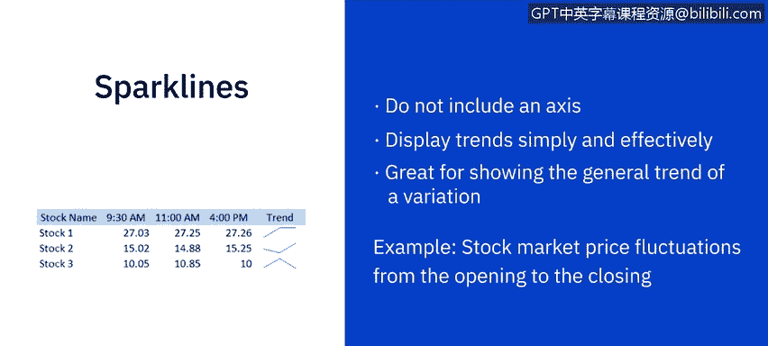
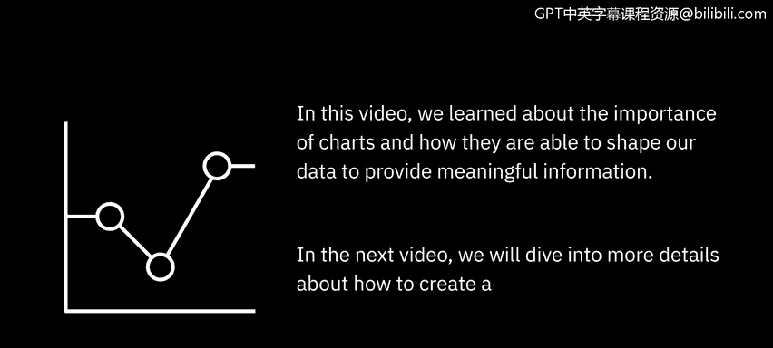

# 015：图表类型介绍

在本节课中，我们将概述几种不同类型的图表和可视化方法，并讨论如何利用它们来讲述数据故事。

## 📈 折线图：展示趋势与变化


上一节我们介绍了图表的基本作用，本节中我们来看看第一种常用图表：折线图。在比较不同但相关的数据集时，折线图是展示信息的绝佳方式。

折线图能够显示趋势，并展示数据值如何随连续变量变化。例如，如果时间是连续变量，可以展示一个或多个产品的销售情况如何随时间变化。

**公式示例**：`销售额 = f(时间)`

## 🥧 饼图：展示部分与整体关系

接下来我们介绍饼图。这种图表可以展示一个实体如何分解为若干子部分，以及这些子部分之间的比例关系。

饼图的每一部分代表一个静态值或类别，所有类别的总和等于100%。例如，在一个营销活动中，我们可以将潜在客户来源分为社交媒体、原生广告、付费影响者和线下活动四个类别。通过饼图，我们可以直观地看到每个类别生成的潜在客户数量。

以下是饼图的核心特点：

*   每个扇区代表一个类别
*   所有扇区角度之和为360度
*   扇区面积大小与类别占比成正比

## 📊 条形图与柱形图：比较数据的利器

现在，我们来看最常用的图表之一：条形图。这种图表非常普遍，因为它易于创建，并且非常适合比较相关数据集或整体的各个部分。

例如，在一个条形图中，我们可以看到10个不同国家的人口数量，并进行相互比较。我们还可以使用堆叠条形图，其中每个条形被分割成首尾相接的子条形。在堆叠条形图中，我们可以看到每个国家的人口按四个年龄范围进行划分。

如果您希望图形垂直显示而非水平显示，那么柱形图将是一个很好的选择。这种图表可以非常有效地显示随时间的变化，并并排比较数值。例如，展示网站月度页面浏览量与会话时长的变化。

虽然柱形图看起来与条形图相似，但它们并不总是可以互换使用。例如，柱形图可能更适合显示负值和正值。

**代码示例（伪代码）**：
```excel
# 创建柱形图
选择数据范围 -> 插入 -> 图表 -> 柱形图
```

## 🗺️ 树状图：可视化复杂层次结构

接下来是树状图，它对于使用嵌套矩形显示复杂的层次结构非常有用。

例如，树状图可以描绘一个国家在过去一年中各州的就业率。矩形的大小代表人口数量，颜色代表就业率。我们可以点击任何区域，查看所选区域内子区域的就业数据。

## 🎯 漏斗图：展示流程转化

如果您试图展示一个流程管道或连续过程的不同阶段，那么漏斗图是理想的选择。

例如，漏斗图可以展示销售流程从潜在客户生成到最终成交每个阶段的转化率。

## ✨ 散点图与气泡图：揭示关联与模式

另一种出色的图表是散点图。在这类图表中，圆圈颜色代表数据的类别，圆圈大小表示数据量。

例如，在散点图中，我们可以看到每个产品线依据销售数量和带来的收入所呈现的分布。散点图非常有助于揭示数据点之间的趋势、集群、模式和相关性。

接下来是气泡图。它是散点图的一种变体，适用于根据相对重要性比较少数几个类别。例如，理解组织销售预算中重要的支出领域。

**公式示例**：`气泡大小 = k * 数据量`

## 📉 迷你图：简洁的趋势指示器

最后，我们介绍迷你图。迷你图不包含坐标轴或坐标系，却能简单有效地显示趋势。它们非常适合展示变化的一般趋势。

例如，展示股票市场从交易日开盘到收盘的价格波动。



## ✅ 课程总结

本节课中，我们一起学习了图表的重要性，以及它们如何塑造我们的数据以提供有意义的信息。我们介绍了折线图、饼图、条形图、柱形图、树状图、漏斗图、散点图、气泡图和迷你图等多种图表类型及其适用场景。



在下一个视频中，我们将深入探讨如何在Excel中创建和配置不同类型的图表。