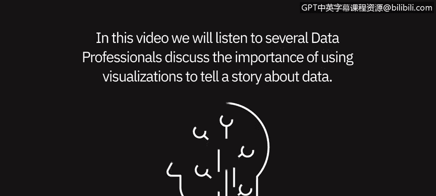
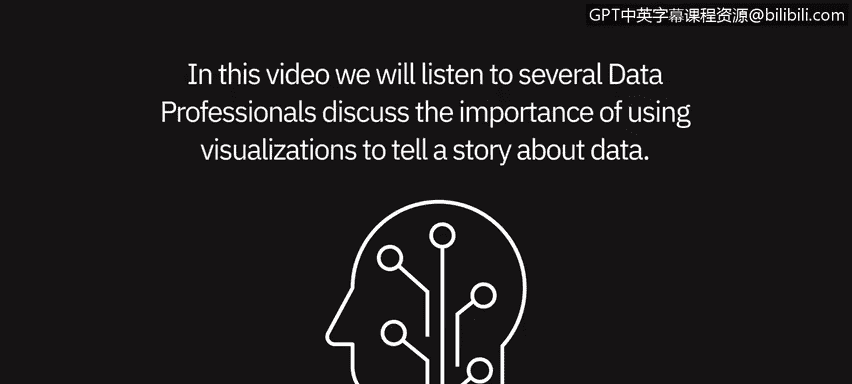
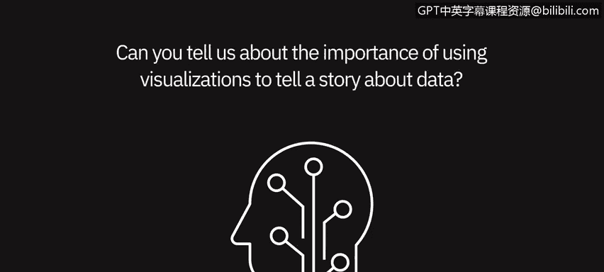

# 016：使用可视化讲述数据故事 📊

## 概述

在本节课中，我们将聆听几位数据专业人士的分享，探讨使用可视化来讲述数据故事的重要性。我们将了解为什么图表比单纯的数字更有效，以及如何通过选择合适的图表来清晰地传达信息、引导讨论并驱动决策。

---

## 可视化在数据叙事中的核心作用

上一节我们介绍了课程主题，本节中我们来看看专业人士如何阐述可视化的价值。

可视化对于用数据讲故事至关重要。人们常说“一图胜千言”，这在数据领域尤为贴切。清晰、整洁的数据可视化能让你更清楚地了解数据的状况。

此外，数据可视化对创建它的分析师也极有帮助，因为它迫使分析师做出选择，决定哪些信息真正重要、需要展示，哪些不重要。例如，如果你在思考是否应该按时间维度观察数据，你可以自问：总体趋势是最重要的吗？如果是，那么我应该制作一个时间序列数据可视化图表。如果我认为比较不同组别更重要，那么就更可能选择条形图或柱状图。因此，可视化在厘清数据分析师的思路方面扮演着关键角色。

---

## 可视化如何提升沟通效果

了解了可视化的基本价值后，我们进一步探讨它如何改善与利益相关者的沟通。

可视化在向利益相关者讲述清晰、简洁的故事时非常重要。人类是视觉动物，你更有可能通过视觉元素讲述一个引人入胜的故事并获得认可。我曾经凭借一份用Tableau制作的可视化简历获得了一份工作机会。

呈现数据的最佳方式之一就是可视化。数字本身在大多数情况下往往会让人不知所措。试想，如果我在公司会议上只是说：“去年，也就是2019年，我们创造了10万美元的收入。” 或者，我可以给你一张图表，上面显示：2018年，我们创造了7.5万美元；2019年，我们创造了10万美元；2020年，我们预计将创造12.5万美元。如果我把这些数据做成图表，让它突出、美观，那么非会计或非数据专业的人也会被吸引，这会促使他们提出不同的问题、产生不同的想法。

---

## 利用工具驱动有效对话

那么，具体如何利用工具来实现这种效果呢？

通过使用PowerPoint，甚至在Excel中（你可以用数据创建图表），让它变得美观——不仅仅是美观，还要确保它突出显示了你试图传达的重要信息——这将创造并推动围绕“需要做什么”以及“如何更好地运营业务或做出不同决策”的对话。数据可视化是帮助人们理解你试图呈现的数字的一个非常重要的部分。

我们倾向于使用可视化的原因在于，这就是大脑真正的工作方式。与查看电子表格中的100行或100条数据相比，大脑更能处理一个高条形与低条形的对比。使用可视化，特别是为给定任务使用合适的可视化，确实有助于确保用户以最简单的方式理解信息。

---

## 可视化是叙事的基础

正如我们所讨论的，讲故事是我们实现这一目标的重要方式，而可视化正是我们讲述故事的方式。我们可以用文本来增强它（无论是用户生成的还是系统生成的），引导人们进一步深入理解。但从可视化开始，是帮助人们快速、有效地理解当前情况的最简单方法，之后你们可以围绕具体行动进行更深入的讨论。

---

## 关键要点总结

以下是本课的核心要点总结：

*   **一图胜千言**：清晰的可视化能比纯数字更直观地揭示数据洞察。
*   **聚焦重点**：创建可视化迫使分析师思考并突出最关键的信息。
*   **提升沟通**：人类是视觉动物，美观且重点突出的图表能更好地吸引受众，引导提问和讨论。
*   **契合认知**：大脑处理图形信息比处理大量原始数字更高效。选择合适的图表类型（如时间序列图用于看趋势，条形图用于做比较）至关重要。
*   **叙事基石**：可视化是数据故事的起点和核心，可以用文本来补充和深化，但首先通过视觉形式建立理解是最有效的途径。

---

## 总结

本节课中，我们一起学习了数据专业人士如何看待数据可视化。我们明确了可视化不仅是呈现数据的工具，更是厘清思路、有效沟通、讲述动人数据故事以及驱动商业决策的核心技能。记住，从选择合适的图表开始，让你的数据自己“说话”。