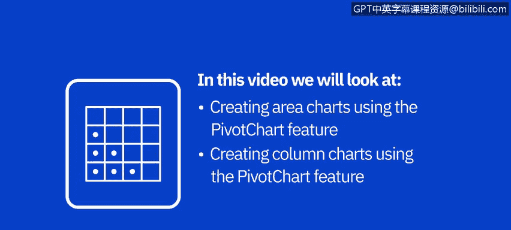
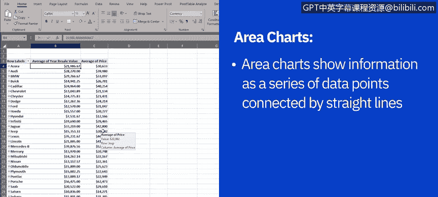
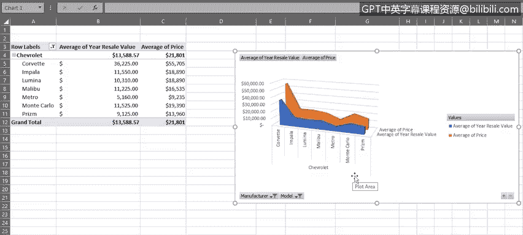
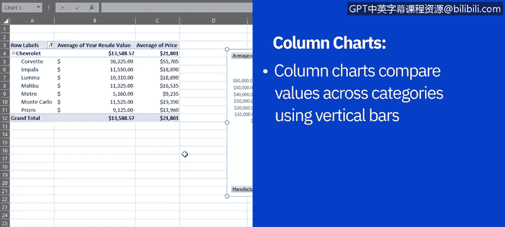
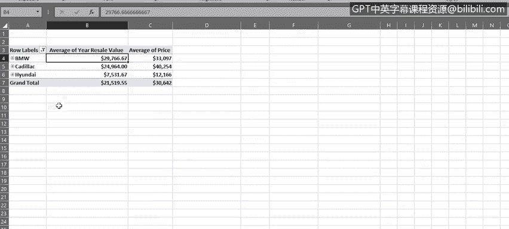
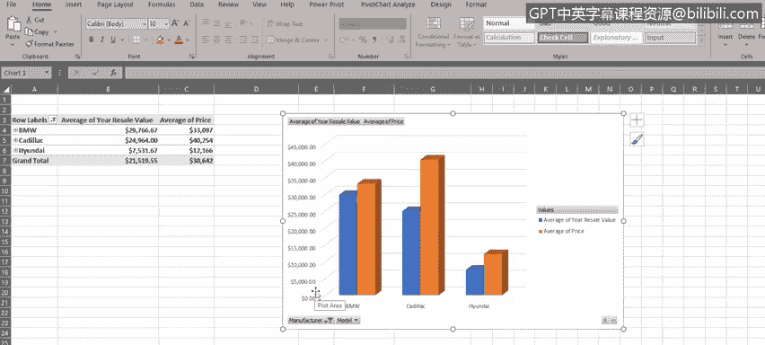

# 018：使用Excel数据透视图功能

在本节课中，我们将学习如何使用Excel中的数据透视图功能，从数据透视表创建面积图和柱形图。我们将了解数据透视图的基本概念、创建方法以及与数据透视表的交互操作。

我们已经学习了如何在Excel中创建几种基本类型的图表。在本视频中，我们将学习如何使用Excel数据透视表的数据透视图功能来创建其他一些基本图表。

我们将首先从数据透视表创建面积图，然后创建柱形图。

请注意，此示例数据集中的价格和转售价值并非真实数据，仅用于解释和演示目的。

## 📊 什么是数据透视图？

数据透视图用于以与基本图表相同的方式显示数据系列、类别和图表轴，但将其与数据透视表连接起来。

简单来说，**数据透视图就是Excel中数据透视表的图形化表示**。当我们拥有包含复杂数据的数据透视表时，数据透视图可以帮助我们理解这些数据。

## 📈 创建面积图

面积图是一种图表类型，用于显示一系列数据点，这些点用直线连接，并在其下方有填充区域。

面积图像折线图一样，可以处理正值和负值。

以下是创建面积图的步骤：

1.  首先，创建“汽车销售”工作簿中“Pivot1”工作表的副本。
2.  在此副本工作表中，首先筛选数据透视表的数据，仅显示丰田汽车型号。
3.  展开“丰田”字段，我们可以看到丰田不同型号的详细信息，例如每个型号的平均价格和平均一年转售价值。
4.  现在，使用数据透视图功能基于此数据创建面积图。选择面积图类型，并选择“三维面积图”。

我们将看到一个包含面积图的浮动图表，它显示了丰田各型号汽车的平均价格以及平均一年转售价值的趋势。

### 在数据透视图中筛选数据

请注意，我们也可以直接在数据透视图中筛选数据，而不仅仅是在数据透视表中。这是标准图表与数据透视图之间的关键区别之一。

因此，在我们的数据透视图中，让我们筛选数据以仅显示雪佛兰汽车型号。展开字段后，数据透视图在此处显示我们的数据。我们可以看到，与低价位型号相比，高价位型号在一年后似乎不能很好地保持其价值。

我们也可以使用数据透视图中的型号筛选下拉菜单来筛选型号。现在，我们的数据透视图及其关联的数据透视表中仅显示了九个雪佛兰型号中的七个。

我们可以看到，当我们在数据透视图中直接进行更改（例如添加筛选器）时，这些更改会立即反映在我们的数据透视表数据中。反之亦然。如果我们在数据透视表中进行更改，该更改也会立即在数据透视图中可见。

## 📊 创建柱形图

柱形图是一种图表类型，用于使用垂直条形图比较不同类别的值。在柱形图中，类别通常排列在水平轴上，值显示在垂直轴上。

以下是创建柱形图的步骤：

1.  首先，创建“汽车销售”工作簿中“Pivot1”工作表的另一个副本。
2.  在此副本工作表中，再次筛选数据透视表的数据，但这次仅显示宝马、凯迪拉克和现代汽车型号。
3.  现在，使用数据透视图功能基于此数据创建柱形图。选择柱形图类型，并选择“三维簇状柱形图”。

新的浮动区域包含我们的柱形图，该图使用垂直条形图显示宝马、凯迪拉克和现代汽车的平均价格以及平均一年转售价值的比较值。

从该图表数据中，我们可以看到，现代和宝马系列似乎比凯迪拉克型号更能保持其一年转售价值。

### 展开和折叠数据视图

现在，让我们通过展开数据透视表中的单元格来查看表格和图表中的所有宝马型号。但请注意，我们也可以使用图表中的加号和减号按钮来展开和折叠数据视图。

如果您在数据透视图字段窗格的轴或类别部分有多个字段，这些按钮可以向下钻取和向上钻取多个类别级别。例如，如果我们将型号进一步分类为型号变体，然后分为发动机排量，再分为颜色等等。

现在，我们可以在柱形图中看到所有三个制造商的所有型号。但是请注意，这些按钮只能用于展开或折叠所有字段。如果您只想展开或折叠一个字段，则需要在数据透视表中而不是图表中进行操作，就像我们在上一步中所做的那样。

### 自定义图表样式

让我们更改图表样式以自定义柱形图的外观。图库中有许多样式可供选择。例如，这里我们选择了样式9，它为我们提供了漂亮的深色对比背景。

## 📝 课程总结

在本视频中，我们学习了如何使用Excel中数据透视表的数据透视图功能创建面积图和柱形图。我们还学习了如何使用数据透视表或数据透视图筛选数据。并且我们学习了如何使用数据透视表和数据透视图展开和折叠数据级别。

在下一个视频中，我们将了解Excel中提供的一些高级图表。