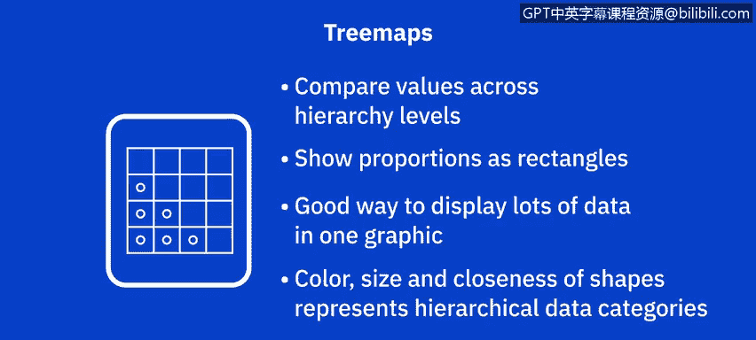
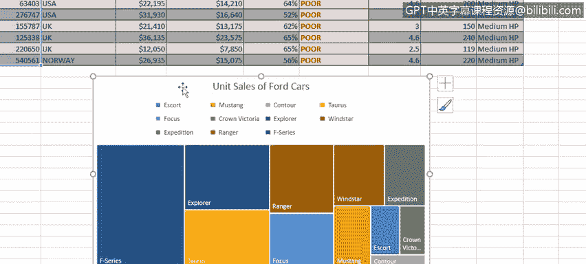
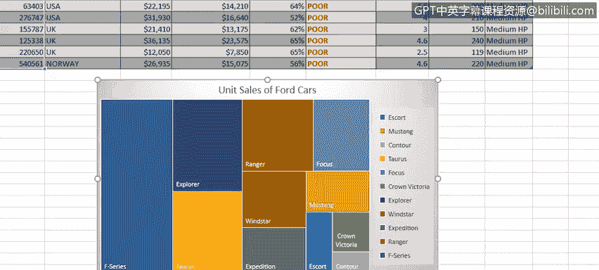
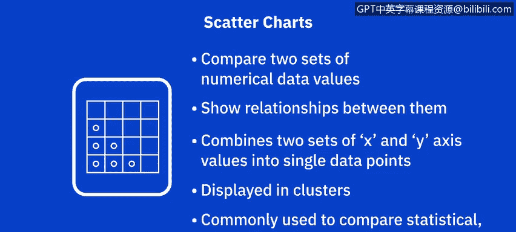
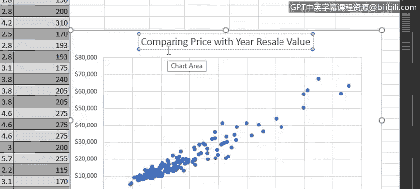
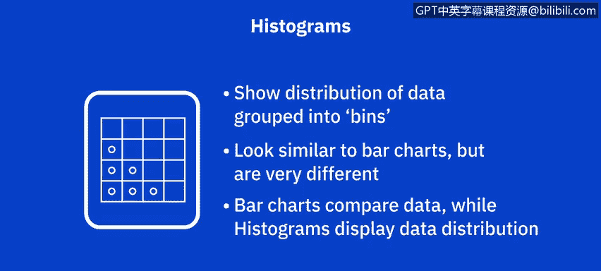
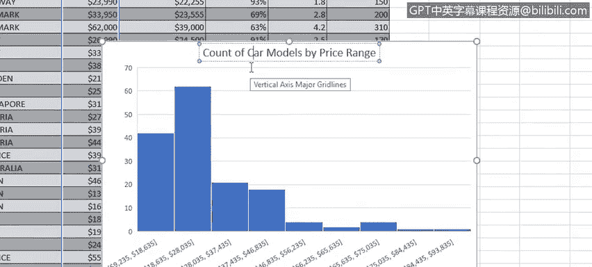
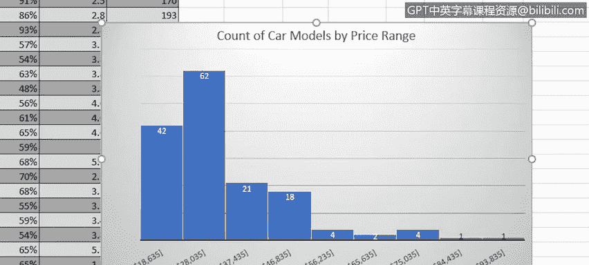
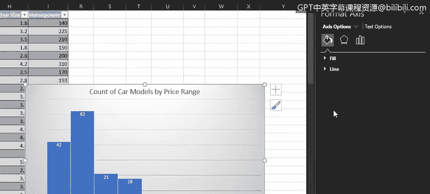

# 019：创建树状图、散点图与直方图

在本节课中，我们将学习如何在Excel中创建三种高级图表：树状图、散点图与直方图。我们将通过一个汽车销售数据集来演示每种图表的创建步骤、用途及解读方法。

---

## 🌳 创建树状图

上一节我们介绍了基础图表的创建，本节中我们来看看如何创建树状图。树状图用于比较层级结构中的数值，并通过矩形的大小展示各层级内的比例关系。它能在一个图形中有效展示大量数据，利用颜色和矩形面积来表示层级数据。

以下是创建树状图的步骤：

1.  在“Car sales”工作簿的“TMap”工作表中，首先选择两个不相邻列的数据：`model`（车型）和 `unit sales`（销量）。
2.  在“插入”选项卡的“图表”组中，选择“层次结构”类别下的“树状图”图表。
3.  此时会出现一个包含树状图的浮动图表区域，它显示了福特各车型销量在层级内的比例矩形。
4.  双击图表标题文本框，将标题修改为“**Unit Sales of Ford Car**”。
5.  在“图表设计”选项卡中，可以更改图表样式以自定义外观。例如，我们选择“样式2”。

从生成的树状图中，我们可以清晰地看到，F系列车型的销量占比最大，其次是Explorer和Touristus车型，它们占比相近，而Contour车型的销量占比最小。

---

## 📈 创建散点图

接下来，我们来看看散点图。散点图用于比较两组数值数据，并展示它们之间的关系。它将X轴和Y轴上的两组值组合成单个数据点，并在图表中以簇的形式显示，因此有时也被称为XY图。它常用于比较统计、科学或工程数据值。

以下是创建散点图的步骤：

1.  在“Car sales”工作簿的“Scatter”工作表中，首先选择两个相邻列的数据：`price`（零售价）和 `year resale value`（一年后残值）。
2.  在“插入”选项卡的“图表”组中，选择“XY（散点图）”类别下的“散点图”。
3.  生成的图表会比较所有制造商汽车的零售价与其一年后残值。
4.  双击图表标题文本框，将标题修改为“**Comparing Price with Year Resale Value**”。
5.  在“图表设计”选项卡中，更改图表样式，例如选择“样式8”。
6.  为水平（X）轴和垂直（Y）轴添加标题。将水平轴标题设为“**Retail Price**”，垂直轴标题设为“**Year Resale Value**”。

从散点图中我们可以观察到，随着零售价的增加，零售价与一年后残值之间的差异也趋于增大。总体而言，低价位汽车在一年后比高价位汽车更能保持其残值。

---

## 📊 创建直方图

最后，我们来学习直方图。直方图是一种显示数据分布情况的图表，数据被分组到各个“箱”中。虽然直方图看起来像柱形图或条形图，但两者完全不同：条形图用于比较数据，而直方图用于展示数据的分布。

以下是创建直方图的步骤：

1.  在“Car sales”工作簿的“Histogram”工作表中，首先选择两个不相邻列的数据：`model`（车型）和 `price`（价格）。
2.  在“插入”选项卡的“图表”组中，选择“统计图表”类别下的“直方图”。
3.  新的浮动图表区域将包含我们的直方图，它显示了所有制造商汽车价格的频率分布。请注意，Excel会自动将不同的价格范围划分为9个等宽的独立箱。
4.  双击图表标题文本框，将标题修改为“**Count of Car Models by Price Range**”。
5.  在“图表设计”选项卡中，更改图表样式，例如选择“样式3”。此样式会在每个价格区间的矩形上直接显示计数值，而不是在Y轴上使用垂直刻度。

从直方图中，我们可以轻松看出，最大比例的车型处于 **$18,635 至 $28,035** 的价格区间，该区间有62个车型；其次是 **$9,235 至 $18,635** 的最便宜区间，有42个车型；而车型数量最少的区间是两个最贵的价格区间，每个箱中只有1个车型。

---

### ⚙️ 自定义直方图箱宽

虽然创建直方图时Excel会自动选择箱的范围，但你可以根据需要更改箱的大小。这通过打开相关图表元素（此处为水平轴）的“设置坐标轴格式”窗格来完成。

在“坐标轴选项”部分，你可以选择按多个因素显示箱，包括“箱宽度”和“箱数”。

*   **更改箱宽度**：例如，当我们减小箱宽度值时，图表中会显示15个箱，因为价格范围划分得更细。此时，箱2和箱3分别拥有最高的计数值34和33，而箱14在此价格区间内没有车型。
*   **更改箱数**：如果我们将坐标轴选项改为显示指定数量的箱（例如10个），直方图会相应更新，再次显示箱2在其价格区间内拥有最大比例的车型。
*   **恢复自动**：如果选择“自动”，直方图将恢复为我们开始时的格式。

---

## 🎯 总结

本节课中，我们一起学习了如何在Excel中创建三种高级图表：**树状图**、**散点图**和**直方图**。我们掌握了每种图表的创建步骤、核心用途以及如何解读图表所揭示的数据洞察。在下一节视频中，我们将继续探索Excel中的其他高级图表，例如填充地图图表和迷你图。