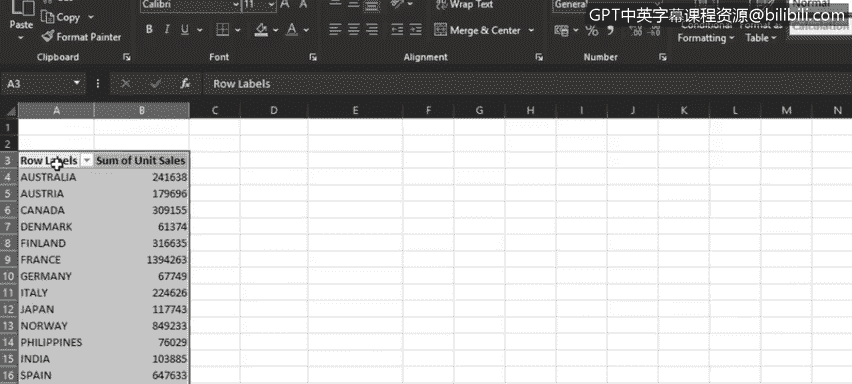
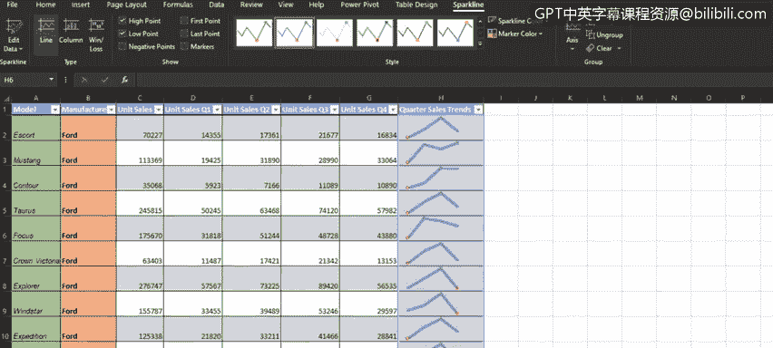

# 020：创建填充地图与迷你图 📊

在本节课中，我们将学习如何在Excel中创建两种高级图表：填充地图和迷你图。我们还将简要了解Excel中其他几种可用的图表类型。

---

## 创建填充地图图表 🌍

上一节我们介绍了基础图表，本节中我们来看看如何利用地理数据创建填充地图图表。填充地图是一种用于比较数值、并在地理区域上展示类别的图表。它非常适合包含国家、州或邮政编码等地理信息的数据。

在“Car sales”工作簿的“map chart”工作表中，我们首先需要准备数据。

以下是创建填充地图的步骤：

1.  从数据透视表中复制包含“销售国家”和“单位销售总和”的数据。
2.  将复制的数据粘贴到表格旁边。
3.  选中数据，在“插入”选项卡的“图表”组中，选择“地图”类别下的“填充地图”。
4.  生成的浮动图表区域即为我们创建的填充地图，它展示了不同销售国家的汽车单位销售总和。

我们可以通过双击图表标题文本框，将标题修改为“各国汽车销售总和”。此外，还可以在“图表设计”选项卡的“图表样式”库中选择多种样式，以自定义填充地图的外观。

从这张填充地图中，我们可以看到：代表最高销量的深蓝色区域覆盖了美国；代表中等销量的浅蓝色区域覆盖了加拿大、西欧和斯堪的纳维亚等地；而代表最低销量的近乎白色的区域则主要覆盖了东欧、印度、日本和澳大利亚。

---

## 添加迷你图 📈

了解了如何展示地理分布后，我们来看看如何在单元格内直观展示数据趋势。迷你图是放置在单个单元格中的微型图表，用于表示选定范围的数据。它们通常用于显示数据趋势，例如季节性增减、经济周期或股价波动，也可以用来突出显示最大值和最小值。

当迷你图紧邻其代表的数据放置时，效果最佳。

在“Car sales”工作簿的“Sp lines”工作表中，我们为“单位销售 Q1”至“单位销售 Q4”这四列相邻的数据创建迷你图。

以下是创建迷你图的步骤：

1.  选中“单位销售 Q1”至“单位销售 Q4”的数据区域。
2.  在“插入”选项卡的“迷你图”组中，选择“折线图”类型。
3.  在弹出的对话框中，指定迷你图在工作表中的放置位置。可以直接在“位置范围”框中输入单元格引用，或者更简便地，直接点击工作表中希望放置迷你图的单元格，Excel会自动填充引用（注意，它会使用带美元符号的绝对引用）。
4.  创建第一个迷你图后，可以将其向下拖动填充柄，复制到整列。

现在，我们得到了一列显示福特各车型在一年四个季度中销售趋势的迷你图。将包含迷你图的列标题命名为“季度销售趋势”，并调整列宽和行高，使迷你图显示更清晰。

为了增强迷你图的表现力，我们可以进行以下自定义：

*   在“迷你图设计”选项卡中，勾选“高点”和“低点”，以在迷你图上显示最大值和最小值。
*   在“样式”库中选择喜欢的样式，以改变迷你图的外观。
*   调整“迷你图颜色”中的“粗细”，使线条更突出。

通过这些迷你图，我们可以观察到：福特Escort的销量在第一季度较低，在第二、三季度上升，然后在第四季度再次下降。我们还可以看出，对于大多数福特车型来说，第三季度是一年中销量最好的季度，但也有少数例外，例如Mustang在第四季度表现最佳，而Focus车型在第二季度销量最高。

---

## Excel中的其他图表类型简介 🔍

除了填充地图和迷你图，Excel还提供了多种其他专业图表，适用于不同的数据分析场景。

以下是几种其他可用图表的简要介绍：

*   **瀑布图**：用于显示一系列正值和负值的累积效应。公式可表示为：`最终值 = 初始值 + Σ(各阶段变化值)`。它适用于表示流入和流出（如财务数据）的数据。
*   **漏斗图**：用于显示流程中逐渐变小的阶段。它适用于展示比例逐渐递减的数据。
*   **股价图**：用于显示股票随时间变化的走势。它最适合包含一系列股票价格值（如成交量、开盘价、最高价、最低价和收盘价）的数据。
*   **曲面图**：用于在三维曲面或二维等高线中展示跨两个维度的趋势和数值。当类别和数据系列都是数值时，此图表最适用。
*   **雷达图**：用于显示相对于中心点的数值。当类别不直接可比时，此图表最合适。

---

## 总结 📝

本节课中，我们一起学习了如何在Excel中创建两种实用的高级可视化工具：**填充地图**和**迷你图**。填充地图能帮助我们直观地分析数据在地理维度上的分布与对比；而迷你图则能以紧凑的形式在数据旁边清晰展示趋势和关键点（如最大值、最小值）。最后，我们还简要了解了瀑布图、漏斗图等几种其他专业图表及其适用场景。掌握这些图表将极大地丰富你的数据呈现方式，使分析报告更加生动和有力。