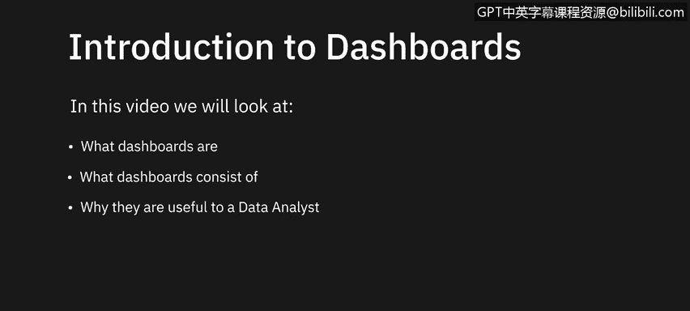
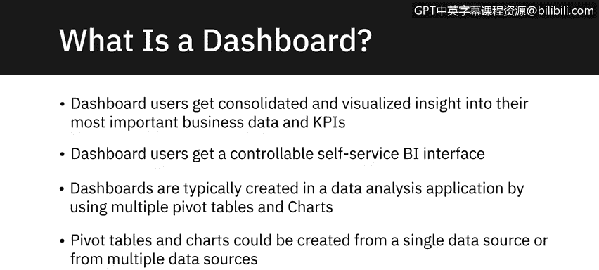
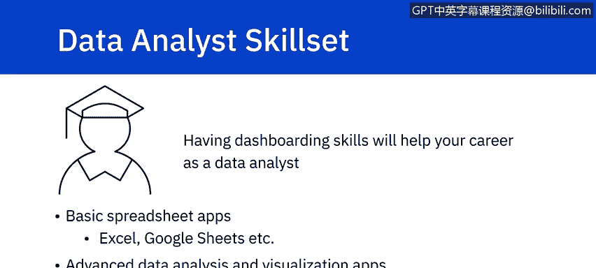
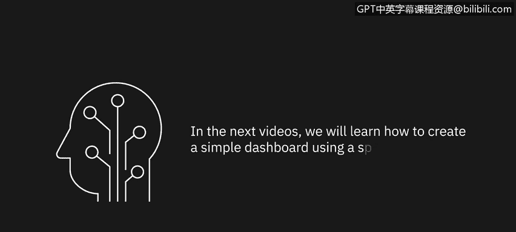

# 021：仪表盘简介 📊

在本节课中，我们将对仪表盘进行简要介绍，包括其定义、构成要素，以及为何它能够成为数据分析师工具包中的一个有用组件和一项必备技能。

仪表盘这一术语源自汽车工业。汽车设计师将最重要的仪表和其他显示信息，例如发动机油温、当前速度、当前转速、剩余油量等，整合在一个便于驾驶员查看和理解的图形化显示面板中。最初，这些显示是模拟的，但现在大多数已数字化，并采用各种形式的可视化，包括数字仪表和迷你图表。你可以将同样的理念应用于数据分析应用中的仪表盘。

这类仪表盘的设计者希望以图形化显示的形式，将关键的商业信息集中放置在一处，以便于查看者理解。仪表盘还可以更进一步，允许用户通过使用仪表盘上提供的工具与之交互，并精确地修改他们看到的信息。因此，仪表盘的用户不仅能获得其业务数据和关键绩效指标（KPI）的整合可视化视图，还能通过使用筛选器等工具，获得一个可控的、自助式的商业智能（BI）界面，从而精确控制所看到的信息。

仪表盘通常在数据分析应用中通过以下方式创建：使用多个数据透视表和图表、地图图表和迷你图等可视化元素，以及切片器和时间线等筛选工具。这些数据透视表和图表可以基于单一数据源或多个数据源创建。

---

在数据分析应用中使用仪表盘，可以获得以下好处：

*   **提供关键数据洞察。**
*   **警示数据中的模式和趋势。**
*   **为用户提供交互式体验，允许他们筛选查看的数据。**
*   **随着源数据的变化而动态更新。**
*   **提供业务数据的集中整合视图。**

仪表盘在以下业务领域可以成为非常有用的工具：

*   财务预测与报告
*   项目管理
*   高管报告
*   人力资源
*   客户服务
*   服务台问题追踪
*   医疗健康监测
*   呼叫中心分析
*   社交媒体营销
*   以及更多其他领域

---

对于一名成长中的数据分析师而言，仪表盘是添加到其技能库中的一项至关重要的技能，因为大多数雇主将其视为必备技能，而非锦上添花。如果你能展示出创建出色、引人注目、交互性强且易于查看和使用的仪表盘的技能，无论是在 Microsoft Excel 或 Google Sheets 等电子表格应用中，还是在使用更高级的数据分析和可视化应用（如 Boquet、Python 的 Dash 或 Streamlit、Tableau 或 IBM Cognos Analytics）时，这都将极大地助力你未来的数据分析师职业生涯。

---

本节课中，我们一起学习了仪表盘的简要介绍，包括其定义、构成要素，以及为何它能够成为数据分析师工具包中的一个有用组件和一项必备技能。在接下来的视频中，我们将学习如何使用电子表格应用创建一个简单的仪表盘。