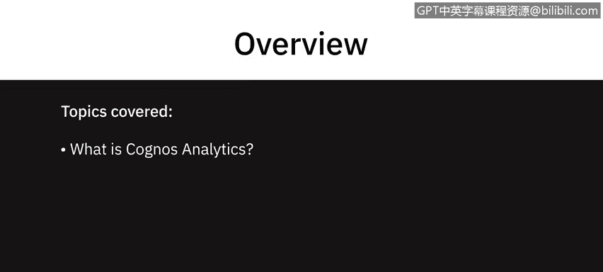
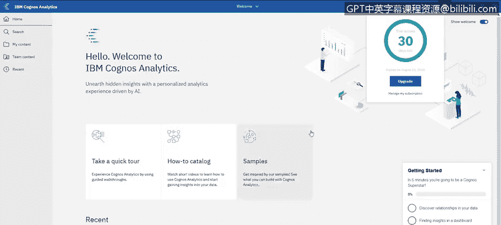
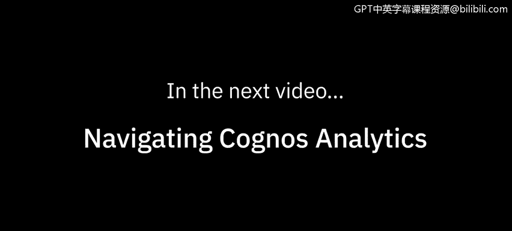

# 023：Cognos Analytics 简介与注册指南 📊

在本节课中，我们将学习 IBM Cognos Analytics 的基本概念，并详细介绍如何注册其试用版本。Cognos Analytics 是一个功能强大的商业智能工具，能够帮助用户进行数据建模、探索、可视化以及创建报告和仪表板。

---

## 什么是 Cognos Analytics？🔍

上一节我们介绍了课程目标，本节中我们来看看 Cognos Analytics 的核心定义。Cognos Analytics 是一个多功能工具，允许用户在同一产品中执行模式一和模式二类型的分析。它包含多种不同的功能，例如数据建模、数据探索、创建高级分析可视化（如关键驱动因素分析）、基于数据的自然语言生成，以及创建针对特定用户的定制报告。

以下是 Cognos Analytics 包含的主要工具和能力：

*   数据建模能力
*   数据探索功能
*   创建引人注目的高级分析可视化（例如关键驱动因素分析）
*   基于数据生成自然语言描述
*   通过过滤器或创建分发报告的能力，为特定用户创建定制报告

此外，Cognos Analytics 还具备创建出色仪表板的能力，这将是本课程的重点内容。

---

## 如何注册试用版？📝

了解了 Cognos Analytics 的功能后，接下来我们看看如何获取并使用它。要注册试用版，请访问 IBM 官方提供的注册链接。

以下是注册试用版的具体步骤：

1.  访问注册网址：`IBM.biz/try_cognos`。
2.  如果您已有账户，可以在此处直接登录，只需填写部分表单信息。
3.  如果您没有账户，请快速填写此表单。关键注意事项是选择一个在您所在地区地理位置接近的数据中心。

系统正在为您启动，您现在可以直接从这个工作流程启动它。进入系统后，您可以通过“管理订阅”按钮管理订阅，或者始终可以通过此 URL 重新访问系统。

---

## 总结与下节预告 🎯

本节课中我们一起学习了 IBM Cognos Analytics 的核心功能及其作为一体化分析工具的价值，并逐步完成了试用版的注册流程。

在下一个视频中，我们将带您了解如何导航和使用 Cognos Analytics 及其仪表板功能。

