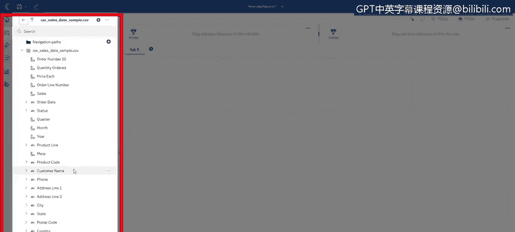
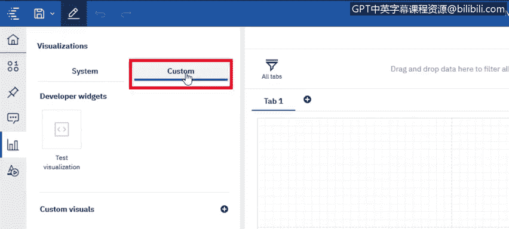

# 024：Cognos Analytics 导航指南 🧭

在本节课中，我们将学习如何在 Cognos Analytics 中上传数据文件、进行基础导航、创建新的仪表板，以及使用仪表板模板。课程将帮助你熟悉 Cognos Analytics 的界面环境，为后续构建可视化内容打下基础。

---

## 上传数据文件 📤

Cognos Analytics 支持连接多种数据库，但本课我们将从上传一个 Excel 文件开始。上传文件有两种主要方式。

以下是两种上传方法：
1.  点击界面上的 **“新建”** 按钮，选择 **“上传文件”**，然后浏览并选择目标文件。
2.  将文件直接拖拽到主登录页面区域。系统会自动引导你进入后续操作界面。

无论采用哪种方式，上传的内容默认都会保存在左侧导航栏的 **“我的内容”** 区域。之后，你可以将其移动到团队共享的 **“团队内容”** 区域。

文件上传过程中，你会看到 **“正在分析…”** 的提示。这个过程是系统在集成和理解你的数据，以便在后续构建内容时为你提供更好的建议和决策支持。

---

## 界面导航概览 🗺️

上一节我们介绍了如何上传数据，现在我们来熟悉 Cognos Analytics 的界面布局。Cognos Analytics 主要有两个导航区域，它们会根据你当前所处的产品模块动态更新。

以下是两个主要的导航区域：
*   **左侧导航栏**：提供对“我的内容”、“团队内容”等核心资源库的访问。
*   **顶部导航栏**：包含当前模块的特定功能和操作选项。

---

## 创建与定制仪表板 🛠️

了解基础导航后，我们开始创建第一个仪表板。第一步是选择一个合适的模板。

Cognos 提供了多种预设的仪表板模板。你可以根据想要展示的可视化图表数量和类型来选择。例如，我选择了一个包含四个较小图表和一个较大图表的模板。

进入仪表板编辑界面后，你会看到左侧面板显示了已上传文件的列标题。此外，还有一些重要的导航功能需要了解，它们能帮助你更好地使用 Cognos Analytics。

以下是仪表板编辑环境中的关键导航功能：
1.  **可视化面板**：这里列出了所有支持的图表类型，你也可以上传自定义的可视化组件。
2.  **部件库**：提供额外的控件，如**文本**、**图像**、**视频**、**超链接**和各种**形状**。
3.  **固定功能**：允许你将常用的可视化组件固定，以便在其他仪表板中重复使用。
4.  **助手功能**：你可以使用自然语言提问，系统会基于你的数据提供解答并生成相应的可视化建议。

---

## 总结 📝

本节课我们一起学习了 Cognos Analytics 的基础操作：包括上传 Excel 文件的两种方法、认识主界面的导航布局、以及如何通过选择模板来创建新的仪表板。我们还预览了仪表板编辑环境中的核心功能面板。在下一节课中，我们将深入探讨如何具体地创建和设计仪表板。