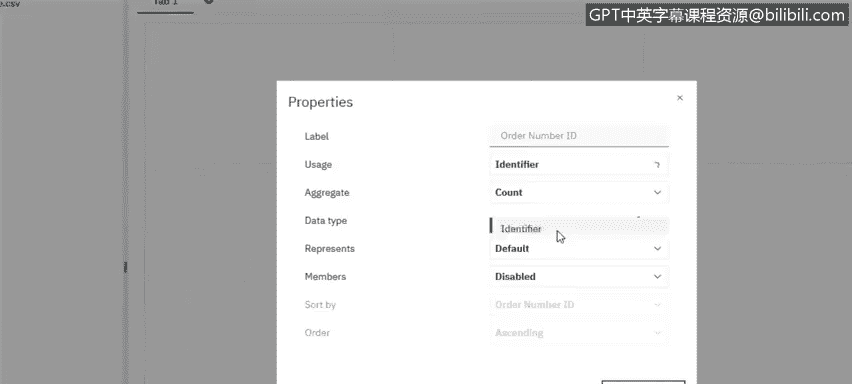

# 025：在Cognos中创建简单看板 📊

在本节课中，我们将学习如何在Cognos Analytics中创建简单的数据看板。我们将介绍多种创建可视化的方法，包括自动生成、手动配置以及使用智能助手。同时，我们也会了解如何在看板内应用筛选器，以实现数据的交互式探索。

---

## 创建可视化：多种方法介绍

上一节我们了解了数据准备的基础。本节中，我们来看看在Cognos Analytics中创建可视化的几种核心方法。

### 方法一：通过拖拽自动生成

将数据字段从左侧树状图中直接拖拽到画布上，是最快捷的创建方式。系统会根据字段的数据类型（如标识符或度量值）自动推荐合适的可视化图表。

例如，当我们上传数据后，首先需要检查并理解数据的类型，这由每个字段前的图标表示。以“订单ID”字段为例，我们可能需要将其属性从“度量值”更改为“标识符”。

**操作代码示例：**
在字段属性面板中，将 `Order ID` 的“角色”从 **Measure** 切换为 **Identifier**。

完成此设置后，即可开始创建可视化。将字段拖到画布上时，如果放置在模板框内，可视化将自动填充该框的可用空间。

### 方法二：手动选择与配置

如果对自动生成的图表不满意，我们可以手动选择图表类型并进行配置。

以下是创建关键绩效指标（KPI）的步骤：

1.  **查看订单数量**：通过统计“订单ID”的数量来实现。系统为标识符推荐的最佳可视化通常是列表，但我们也可以手动将其改为摘要卡片。
2.  **查看订购数量**：直接拖拽“数量”字段到画布，并选择合适的汇总方式（如求和）。
3.  **查看平均销售额**：拖拽“销售额”字段到画布，然后在属性面板中将汇总方式从 **Sum** 改为 **Average**。

通过以上步骤，我们就得到了几个用于监控和跟踪的KPI指标。

### 方法三：使用智能助手

如果我们对要分析的内容没有明确想法，可以使用智能助手功能。

**操作流程如下：**
1.  点击“助手”按钮。
2.  可以输入具体问题（例如：“哪个产品线的销售额最高？”），或直接点击“建议问题”来获取分析灵感。
3.  助手会生成相应的可视化图表，并提供同类型的其他图表备选。
4.  如果对某个视图满意，只需将其拖拽到画布上，它就会成为看板的一部分。

---

## 实现看板交互：应用筛选器

创建好可视化组件后，看板的核心价值在于其交互性。我们可以通过多种方式对看板数据进行筛选。

### 点击筛选

在任一可视化图表上，直接点击某个数据元素（例如，在“产品线”条形图中点击“经典汽车”），看板上的所有其他图表都会联动更新，仅显示与“经典汽车”相关的数据。

### 拖拽字段筛选

我们也可以将特定的筛选字段拖拽到画布顶部的筛选器区域。

**操作代码示例：**
将 `Status` 字段拖入筛选器区域。

在筛选器中，我们可以选择一个或多个值。例如，选择查看状态为“搁置”的所有订单。应用后，整个看板的所有可视化图表都会更新，仅反映“搁置”状态的数据，从而帮助我们快速聚焦于特定问题。

---

## 课程总结

本节课中，我们一起学习了在Cognos Analytics中创建简单数据看板的完整流程。我们掌握了三种创建可视化的方法：**拖拽自动生成**、**手动选择配置**以及利用**智能助手**。更重要的是，我们学会了如何通过**点击图表元素**或**拖拽字段到筛选器**来实现看板的交互式数据探索，让静态图表变为动态分析工具。

在下一个视频中，我们将深入探讨看板更多的高级功能。