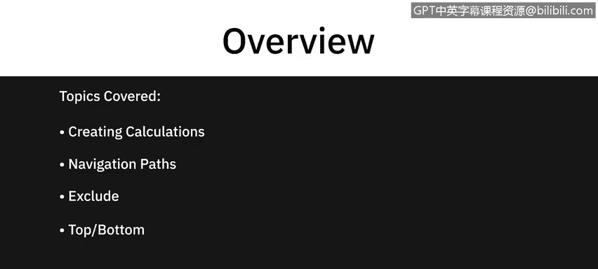
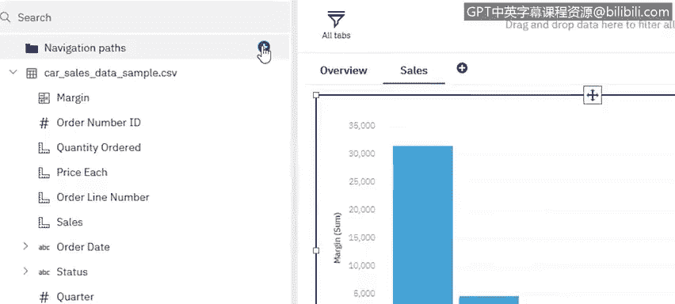
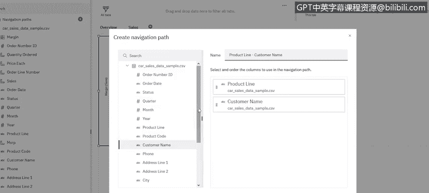
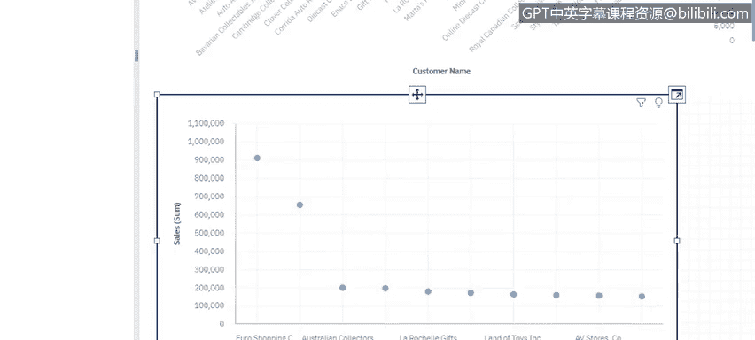

# 026：Cognos Analytics 仪表板高级功能 🚀

在本节课中，我们将学习 Cognos Analytics 仪表板的几项高级功能。我们将涵盖如何创建计算字段、利用导航路径、在可视化中进行数据排除，以及如何设置可视化中的“前N项”筛选。掌握这些技巧将帮助你更深入地探索数据，并创建更具洞察力的仪表板。

---



## 创建计算字段 🧮

与 Excel 类似，Cognos Analytics 仪表板也支持创建计算字段。这允许你基于现有数据生成新的指标。

以下是创建计算字段的步骤：
1.  在数据面板中，点击“创建计算”选项。系统会列出多种函数供你选择。
2.  你也可以直接开始输入公式，系统会提供智能建议。

例如，我们想计算产品的利润率。我们可以创建一个名为 **`利润率`** 的计算字段，公式为：
```
利润率 = MSRP - 销售单价
```
创建后，这个计算字段会像其他数据字段一样出现在列表中。我们可以将其用于可视化。例如，选择“利润率”和“产品线”字段创建一个图表，就能直观地看到各产品线的盈利情况。通过这个视图，我们可能发现“火车”产品线的利润率为负。

## 利用导航路径深入分析 🔍

上一节我们通过计算字段发现了问题，本节我们来看看如何深入分析。导航路径功能允许你从汇总数据逐层下钻到明细数据。

要创建导航路径，你可以选择数据中的任何字段作为下钻的层级。例如，我们可以设置一个从 **`产品线`** 到 **`客户`**，再到 **`具体订单`** 的路径。

设置好后，在图表上右键点击感兴趣的数据点（例如“火车”产品线），选择“下钻”。这样，你就能看到导致该产品线亏损的具体客户。继续下钻，可以进一步查看这些客户的详细订单信息，从而定位问题根源。



## 在可视化中排除特定数据 🚫



有时，为了更清晰地观察核心趋势，我们需要从可视化中排除某些干扰项。

例如，当我们查看按“状态”和“产品线”划分的销售数据时，可能会发现“已发货”状态的数据量过大，掩盖了其他状态（如“处理中”、“已取消”）的细节。

此时，我们可以在对应数据点上右键点击，选择“排除‘已发货’项”。排除后，图表将只显示其他状态的数据，使我们能更清晰地分析这些环节的表现。

## 设置“前N项”筛选 📊

当面对大量数据点（例如众多客户的销售额）时，我们通常需要聚焦于最重要的部分。

“前N项”筛选功能可以帮助我们快速做到这一点。例如，在一个显示“客户名称”和“销售额”的图表中，我们可以在“销售额”字段上右键点击，选择“显示前N项”。默认情况下，系统会显示排名前10的客户。

应用此筛选后，图表将立即更新，只展示销售额最高的前10位客户，这有助于我们快速识别核心客户群体。

## 快速创建信息图 🎨

除了传统图表，Cognos 还支持快速创建生动的信息图。

操作非常简单：如果你有一个表示“销售额”的指标，可以直接从左侧的图形库中拖拽一个形状（例如一个存钱罐图标）到该指标上。系统会自动将数值与图形结合，生成一个直观的信息图，让数据展示更具吸引力。

---



**本节课总结**

本节课我们一起学习了 Cognos Analytics 仪表板的四项高级功能：
1.  **创建计算字段**：通过自定义公式衍生新的分析指标。
2.  **利用导航路径**：实现从汇总到明细的交互式数据下钻分析。
3.  **数据排除**：从可视化中移除特定数据，以聚焦于关键信息。
4.  **“前N项”筛选**：快速聚焦于排名靠前的数据点。

这些功能能显著增强你探索数据、发现洞察和构建专业仪表板的能力。