# 001：《数据工程毕业项目》🎓

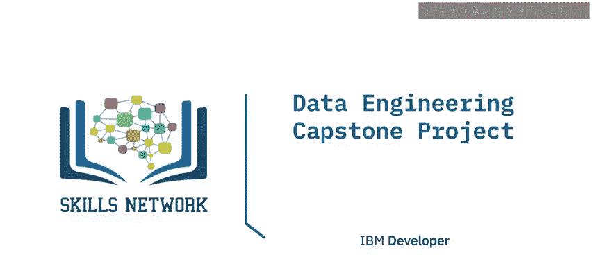

## 概述

在本节课中，我们将要学习《数据工程毕业项目》的课程介绍。恭喜你坚持到现在。此时，你已经完成了数据工程专业证书项目中的全部12门课程，现在有机会展示你在学习过程中所掌握的技能。这个毕业项目为你提供了一个平台，用以展示你在跟随项目学习期间获得的所有实践性、动手操作的数据工程技能。

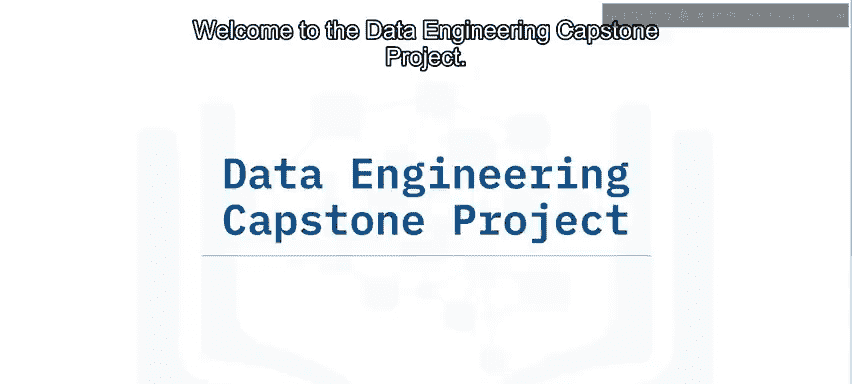

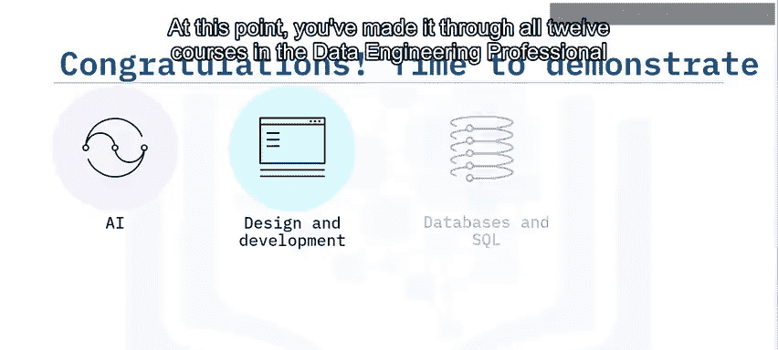

## 项目角色与挑战

作为毕业项目的一部分，你将扮演一名新加入某电子商务组织的助理数据工程师角色。

你将面临一个业务挑战，需要为零售数据分析构建一个数据平台。

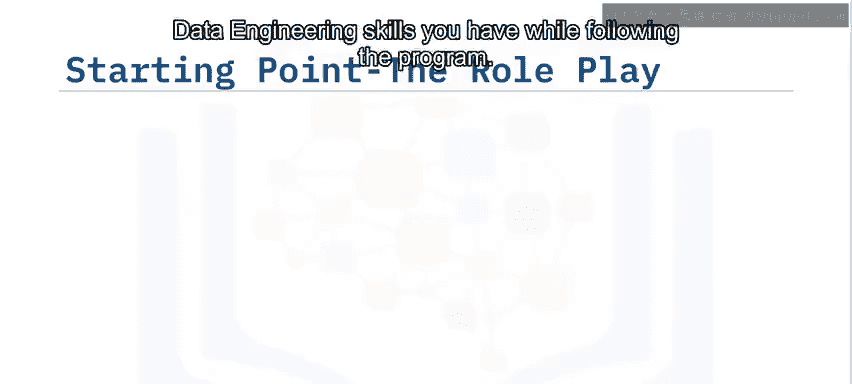

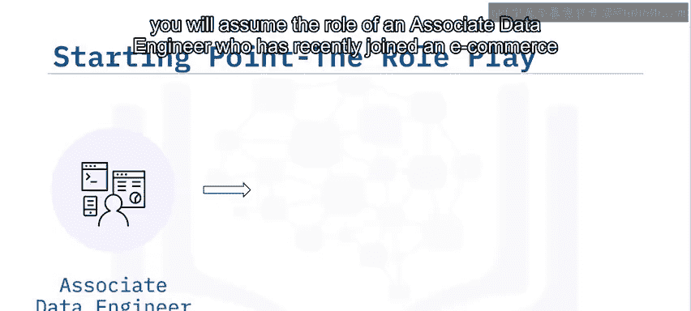

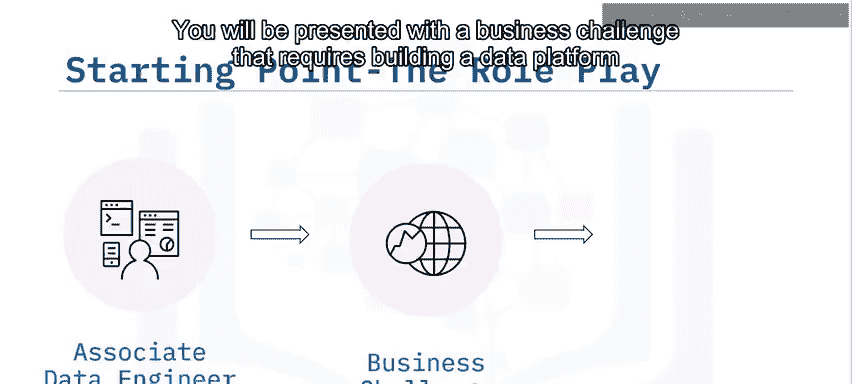

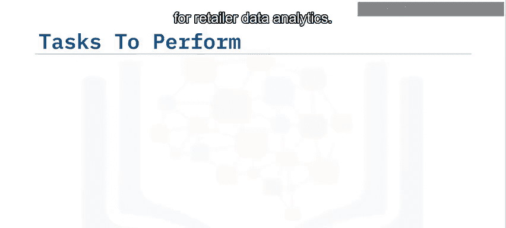

## 项目核心任务

在这个毕业项目中，你将完成以下核心任务：

*   设计一个使用 **MySQL** 作为OLTP数据库、**MongoDB** 作为NoSQL数据库的数据平台。
*   设计并实现一个数据仓库，并从数据中生成报告。
*   设计一个反映业务关键指标的报表仪表板。
*   从OLTP和NoSQL数据库中提取数据，进行转换，然后加载到数据仓库中。
*   创建一个ETL管道。
*   最后，创建到数据仓库的Spark连接，并部署一个机器学习模型。

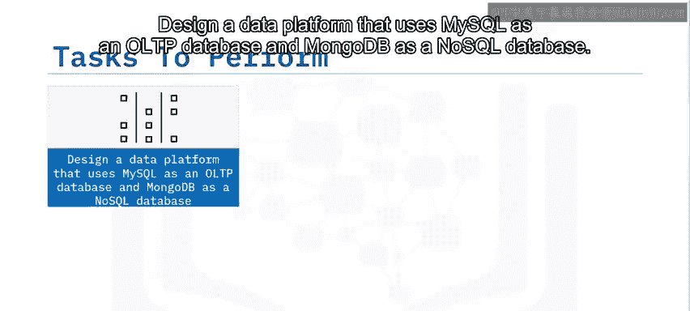

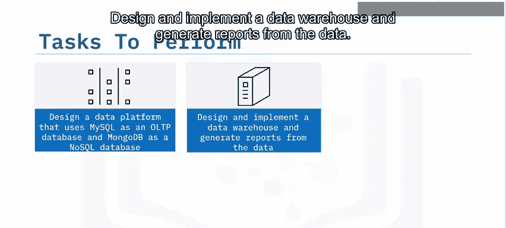

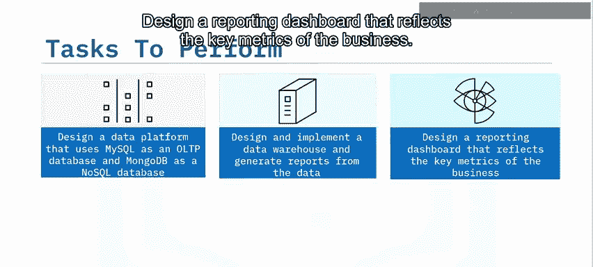

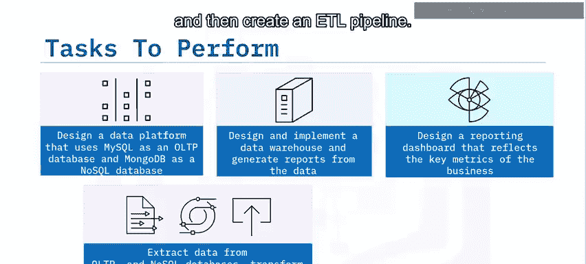

## 模块分解

上一节我们介绍了项目的整体目标，本节中我们来看看项目具体包含哪些模块。以下是六个模块的详细内容：

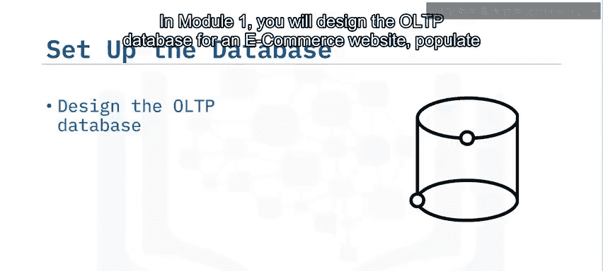

### 模块1：OLTP数据库设计

在模块1中，你将：
*   为电子商务网站设计OLTP数据库。
*   使用提供的数据填充OLTP数据库。
*   将每日增量数据自动导出到数据仓库。

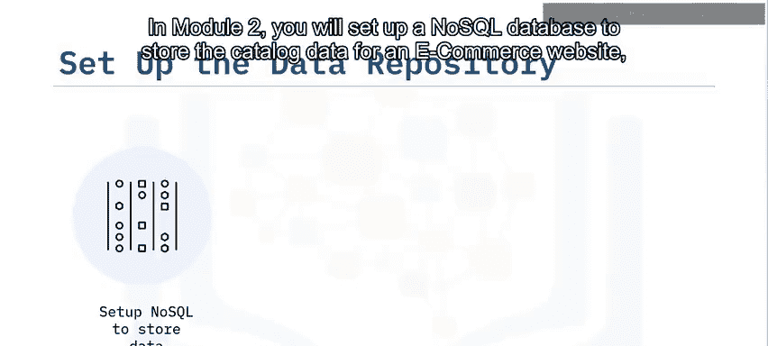

### 模块2：NoSQL数据库设置

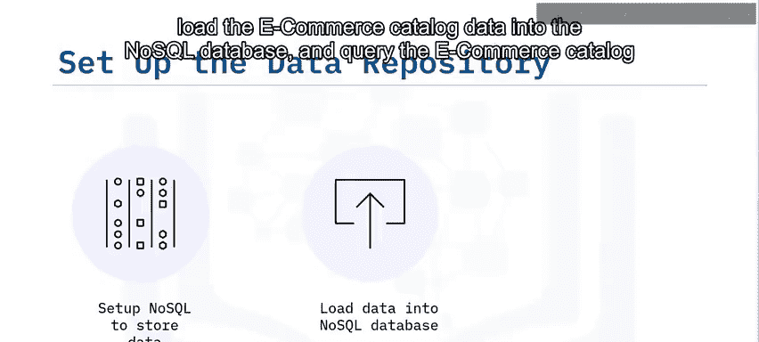

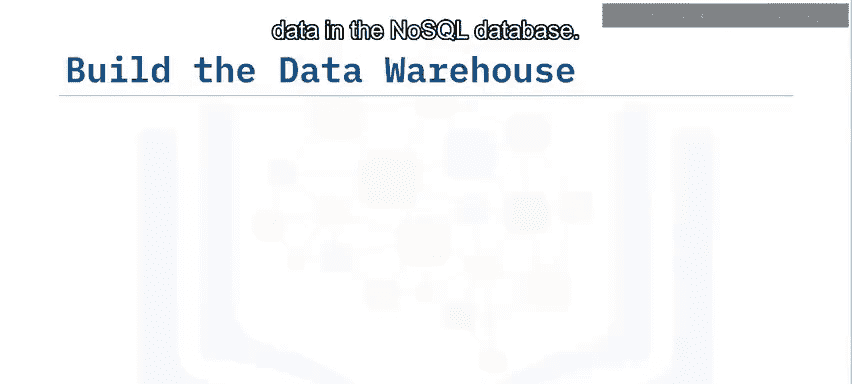

在模块2中，你将：
*   设置一个NoSQL数据库来存储电子商务网站的商品目录数据。
*   将电子商务目录数据加载到NoSQL数据库中。
*   查询NoSQL数据库中的电子商务目录数据。

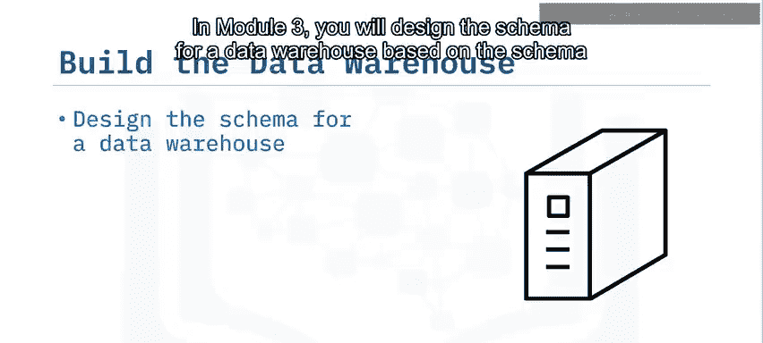

### 模块3：数据仓库设计与实现

在模块3中，你将：
*   基于OLTP和NoSQL数据库的模式，设计数据仓库的模式。
*   创建该模式并将数据加载到事实表和维度表中。
*   实现每日增量数据到数据仓库的自动插入。
*   创建多维数据集（Cubes）和汇总表（Rollups）以简化报表生成。

### 模块4：数据可视化与仪表板

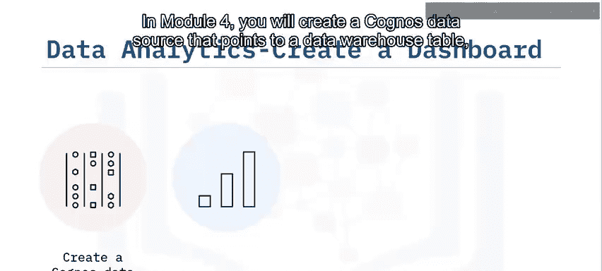

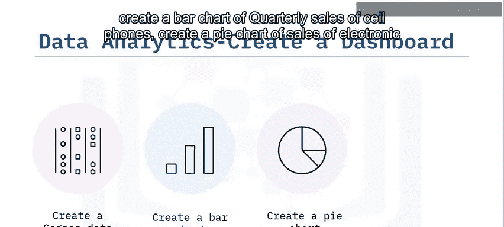

在模块4中，你将：
*   创建一个指向数据仓库表的Cognos数据源。
*   创建手机季度销售额的条形图。
*   创建电子产品按类别划分的销售额饼图。
*   创建2020年每月总销售额的折线图。

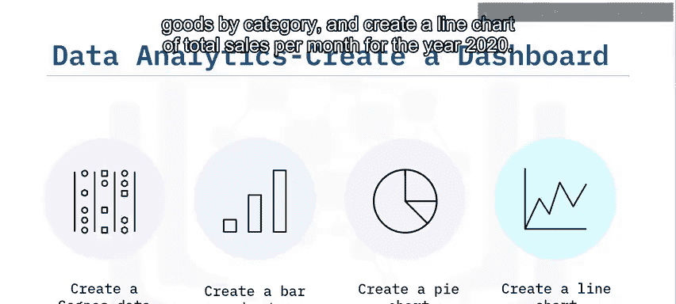

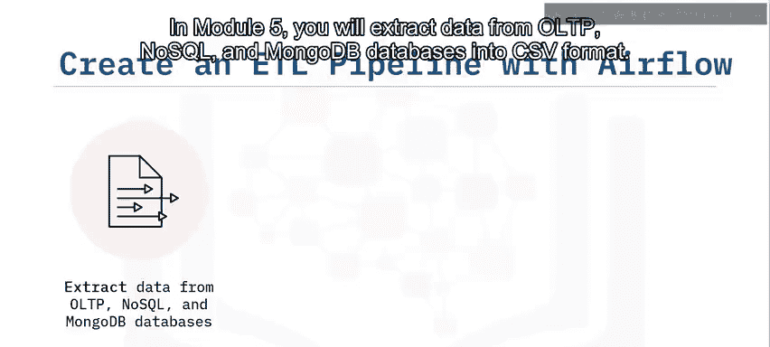

### 模块5：ETL管道构建

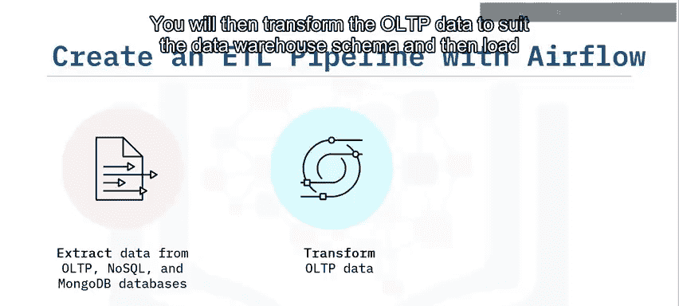

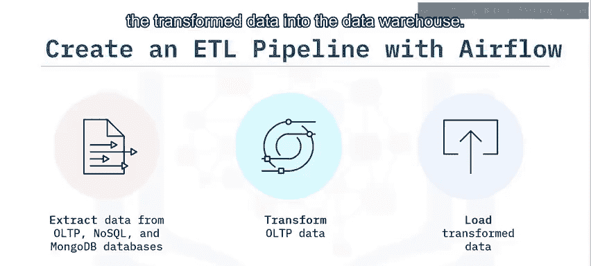

在模块5中，你将：
*   将数据从OLTP和NoSQL（MongoDB）数据库提取为CSV格式。
*   转换OLTP数据以匹配数据仓库模式。
*   将转换后的数据加载到数据仓库中。
*   验证数据是否正确加载。

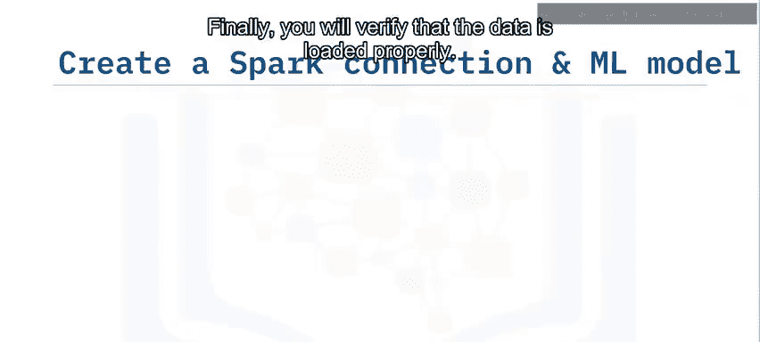

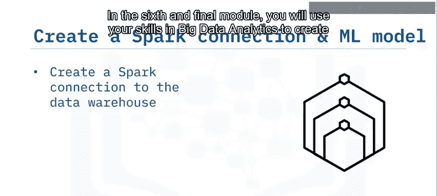

### 模块6：大数据分析与机器学习

在第六个也是最后一个模块中，你将：
*   运用大数据分析技能，创建到数据仓库的Spark连接。
*   在Spark ML上部署一个用于销售预测的机器学习模型。

## 评估方式

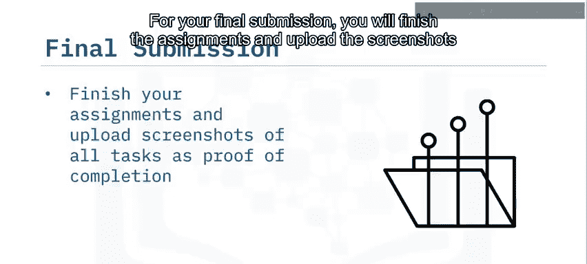

每个模块都包含一个作为提交自检的评分检查清单，以及一个测试知识的小测验。你的评估将基于每个模块中的检查清单和测验。

对于最终提交，你需要完成所有作业，并上传所有任务的截图作为完成证明。你的同学将随后评审并为你的最终项目提交评分。你也需要为一位同学的项目进行同行评审。

## 开始学习

现在，请花几分钟时间探索课程网站。
*   查看每周将涵盖的材料，并预览需要通过本课程所需完成的作业。
*   探索论坛，在那里你可以与其他学习者以及课程团队讨论课程材料。
*   如果你对课程内容有任何疑问，请在这些论坛中发帖，从课程社区中的其他人那里获得帮助。
*   对于平台的技术问题，请访问帮助或支持中心。

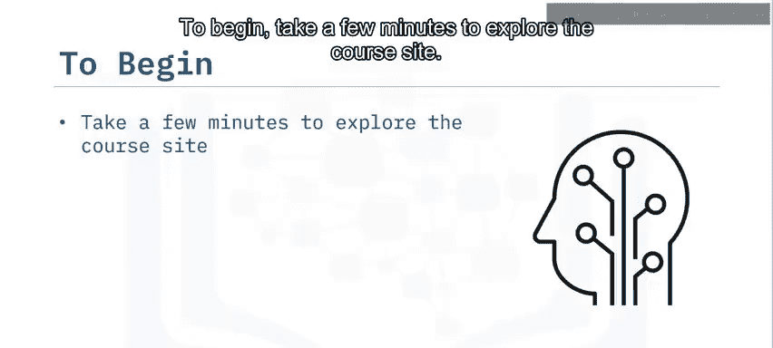

## 总结与鼓励

当你成功完成本项目的所有课程后，你将获得数据工程专业证书。

我们很高兴你的加入，并希望你喜欢这门课程。祝你好运，让我们开始吧！

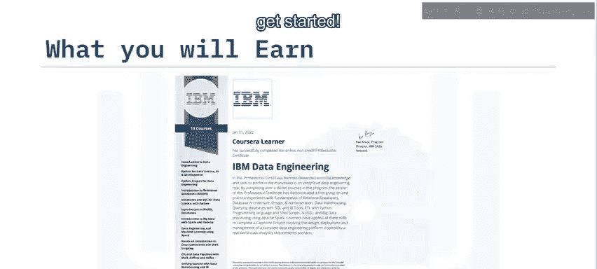

