# 002：作业概述 🎯

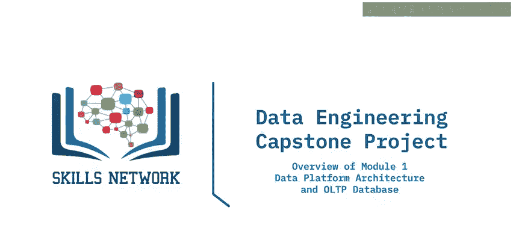

在本节课中，我们将学习《数据工程毕业项目》第一个模块“数据平台架构与OLTP数据库”的作业概览。我们将了解需要完成的三个主要练习及其具体任务。

## 概述

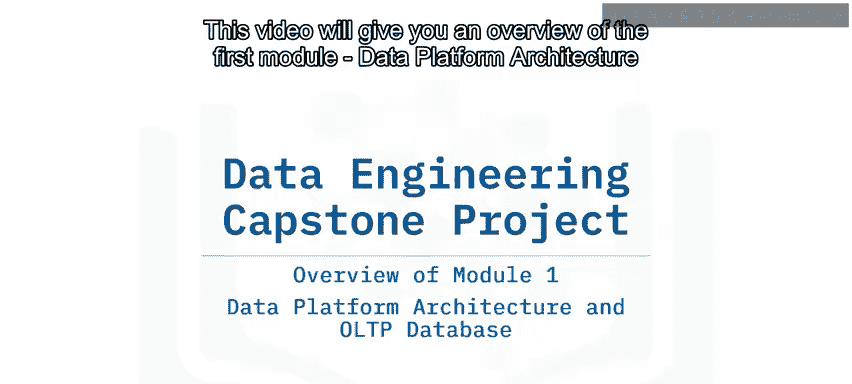

本模块包含三个练习，每个练习由多个任务组成。在开始作业前，你需要首先启动MySQL服务器以检查实验环境是否就绪。

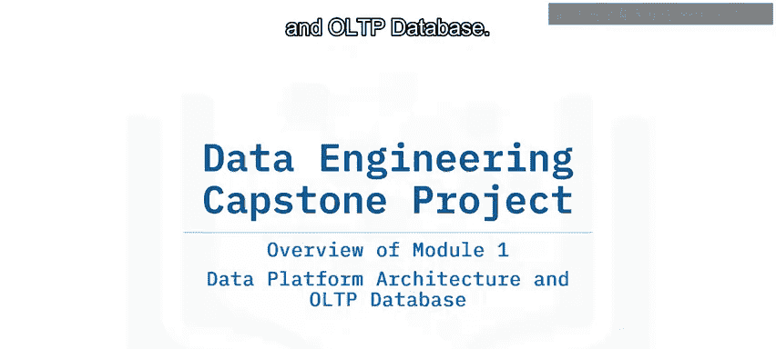

## 练习一：设计OLTP数据库模式

上一节我们介绍了模块的整体目标，本节中我们来看看第一个练习的具体内容。

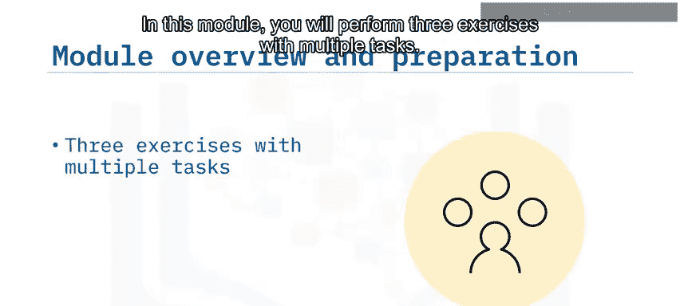

第一个练习要求你为OLTP数据库设计模式。该数据库将存储销售数据，例如产品ID、客户ID、价格、数量和销售时间戳。

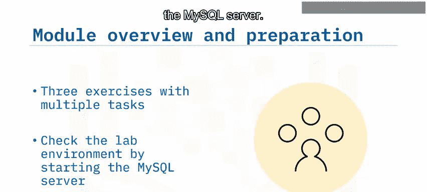

以下是该练习的核心概念：
*   **OLTP数据库**：用于处理日常事务的数据库，例如销售记录。
*   **数据库模式**：定义了数据表的结构、字段类型和表之间的关系。

## 练习二：加载数据与查询

完成模式设计后，下一步是将数据加载到数据库中并进行初步查询。

在第二个练习中，你将把数据加载到OLTP数据库。具体任务包括：使用PHP MyAdmin将下载的CSV文件中的数据导入到数据表中。此外，你还需要列出数据库中的所有表，并编写一个查询语句来统计表中记录的数量。

以下是该练习的关键步骤：
1.  使用PHP MyAdmin导入CSV数据。
2.  执行SQL命令列出所有表：`SHOW TABLES;`
3.  编写查询以获取记录数：`SELECT COUNT(*) FROM table_name;`

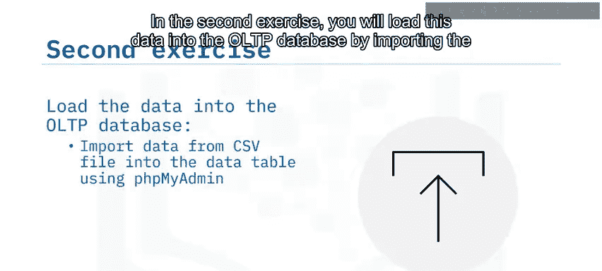

## 练习三：管理任务与数据导出

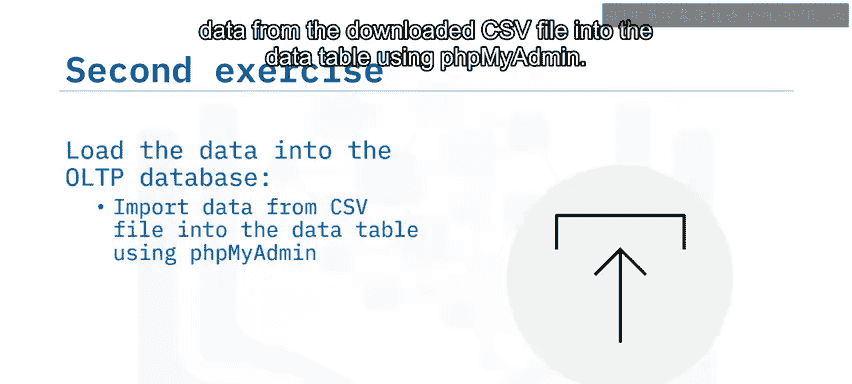

接下来，我们将进入最后一个练习，它侧重于数据库的管理和维护任务。

在第三个也是最后一个练习中，你将设置管理任务。首先，在时间戳字段上创建索引，然后列出该表上的所有索引。最后，你将编写一个bash脚本，将数据表中的所有行导出到SQL文件。

以下是该练习涉及的操作：
*   **创建索引**：`CREATE INDEX idx_timestamp ON sales_data (timestamp);`
*   **列出索引**：`SHOW INDEX FROM sales_data;`
*   **编写导出脚本**：一个包含 `mysqldump` 命令的bash脚本。

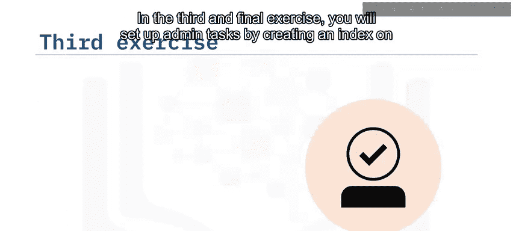

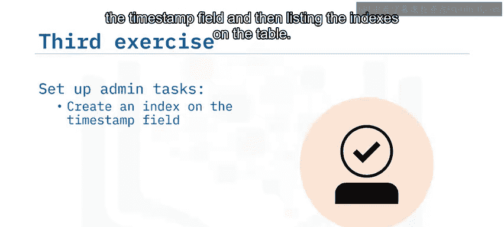

## 作业提交要求

在执行每个任务后，你需要对所使用的命令和获得的输出进行截图，并为截图命名。

## 总结

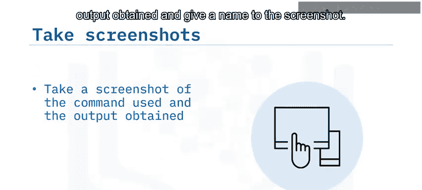

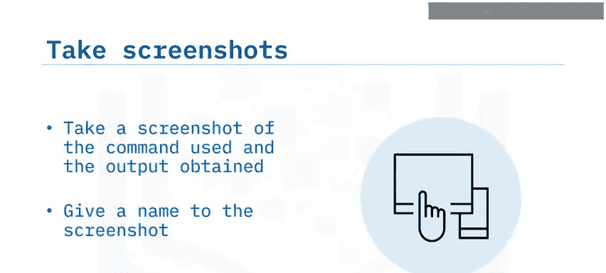

本节课中我们一起学习了毕业项目第一个模块的作业概览。我们明确了三个核心练习：设计OLTP数据库模式、加载并查询数据，以及执行索引创建和数据导出等管理任务。现在，你可以开始着手完成这些练习了。祝你好运！