# 003：NoSQL数据库数据查询作业概述 📋

在本节课中，我们将学习如何在NoSQL数据库中进行数据查询。具体来说，我们将完成一个包含一系列任务的练习。这个练习将引导你使用MongoDB工具进行数据导入、查询和导出操作。


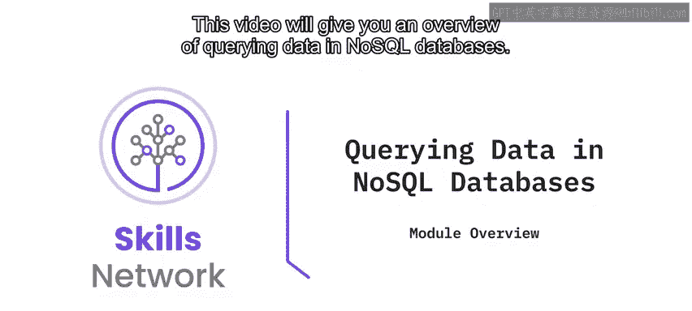

## 作业概述与准备 🛠️

在开始作业之前，你需要在实验环境中安装MongoDB的导入和导出工具，即 `mongoimport` 和 `mongoexport`。安装完成后，你需要下载一个JavaScript对象表示法文件，即JSON文件。

以下是安装和准备步骤的简要说明：
1.  在实验环境中安装 `mongoimport` 和 `mongoexport` 工具。
2.  下载指定的JSON数据文件。

## 核心任务分解 📝

上一节我们介绍了作业的准备工作，本节中我们来看看具体的任务要求。整个练习包含以下几个核心步骤。

### 任务一：数据导入与数据库查看

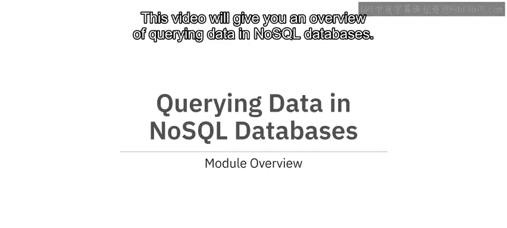


首先，你需要将下载的JSON文件导入到MongoDB服务器中。具体目标是将其导入到名为 `catalog` 的数据库下的 `electronics` 集合中。

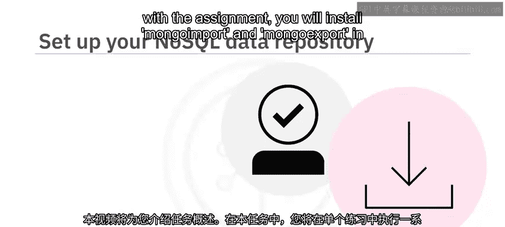

导入完成后，你需要执行命令来列出服务器上的所有数据库，并进一步列出 `catalog` 数据库中的所有集合。

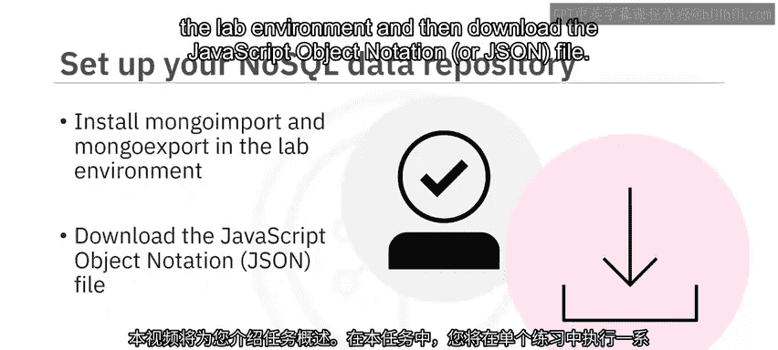

以下是此任务涉及的关键命令示例：
```bash
# 导入JSON文件到指定数据库和集合
mongoimport --db catalog --collection electronics --file your_data.json

# 连接到MongoDB并列出所有数据库
show dbs

# 切换到catalog数据库并列出其所有集合
use catalog
show collections
```

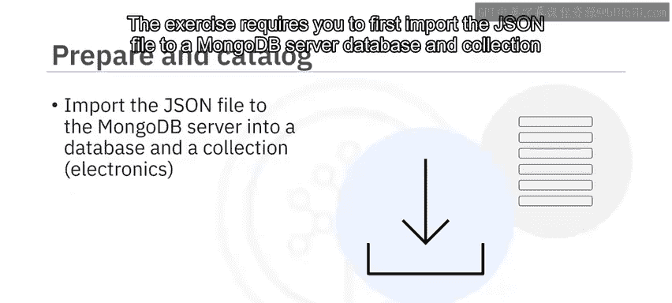

### 任务二：文档查询与数据统计

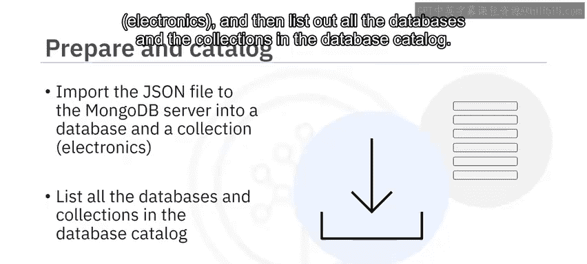

接下来，你需要对导入的数据进行查询。首先，列出 `electronics` 集合中的前五个文档。

然后，你需要编写查询语句来完成以下三项统计：
1.  查找所有笔记本电脑（laptops）的数量。
2.  查找屏幕尺寸为6英寸的智能手机（smartphones）的数量。
3.  计算所有智能手机的平均屏幕尺寸。

以下是此任务涉及的关键查询示例：
```javascript
// 查找前5个文档
db.electronics.find().limit(5)

// 统计笔记本电脑的数量
db.electronics.countDocuments({ type: "laptop" })

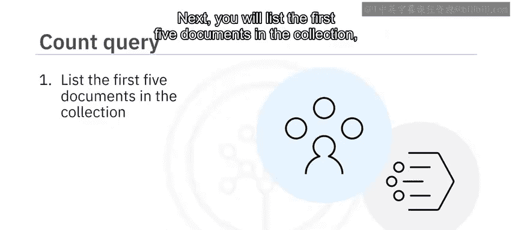

// 统计屏幕尺寸为6英寸的智能手机数量
db.electronics.countDocuments({ type: "smartphone", screen_size: 6 })

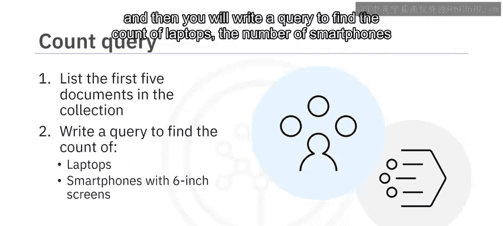

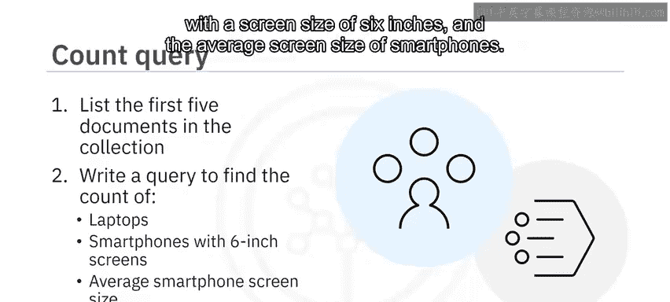

// 计算智能手机的平均屏幕尺寸
db.electronics.aggregate([
  { $match: { type: "smartphone" } },
  { $group: { _id: null, avgScreenSize: { $avg: "$screen_size" } } }
])
```

### 任务三：数据导出

最后，你需要从 `electronics` 集合中导出特定字段的数据。你需要导出的字段包括 `_id`、`type` 和 `model`，并将它们保存为一个逗号分隔值文件，即CSV文件。

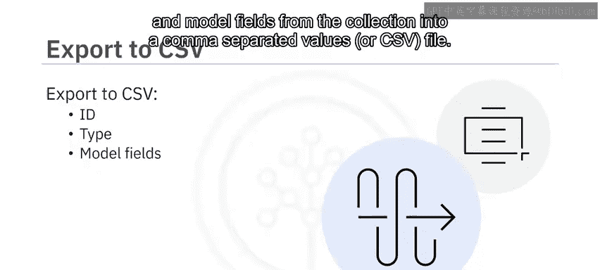

以下是此任务涉及的关键命令示例：
```bash
# 导出指定字段到CSV文件
mongoexport --db catalog --collection electronics --type=csv --fields _id,type,model --out exported_data.csv
```

## 作业提交要求 📤


在完成上述每一个任务后，你都需要对所使用的命令及其输出结果进行截图。请为每张截图起一个清晰、描述性的文件名，以便于区分和评审。

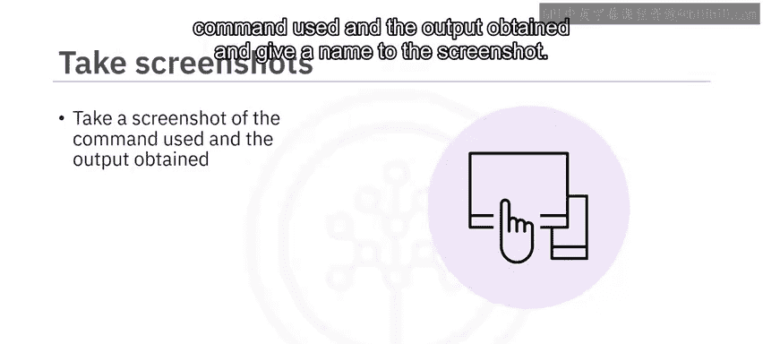

## 课程总结 🎯


本节课中我们一起学习了NoSQL数据库数据查询作业的完整流程。我们首先进行了环境准备，安装了必要的MongoDB工具。然后，我们逐步完成了数据导入、数据库与集合查看、文档查询、数据统计以及最终的数据导出任务。通过这个练习，你实践了使用MongoDB进行基本数据操作的核心技能，包括使用 `mongoimport`、`mongoexport` 以及在Mongo Shell中执行查询和聚合操作。