# 004：数据仓库设计与设置作业概述 🗂️

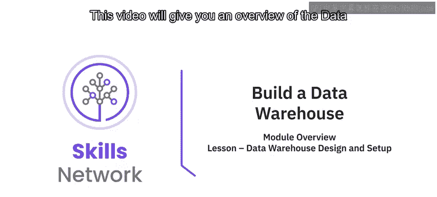

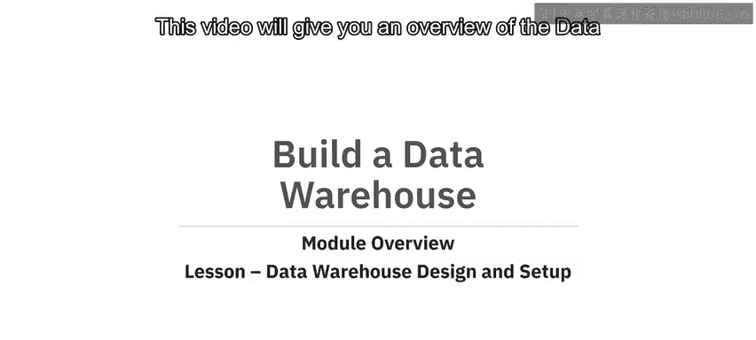

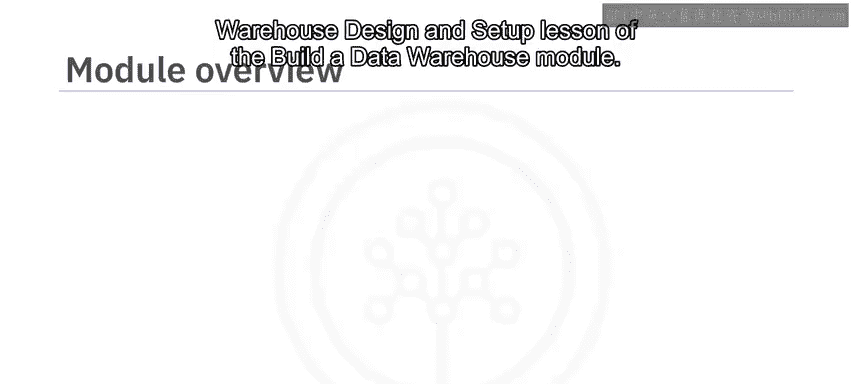

在本节课中，我们将要学习“构建数据仓库”模块中的“数据仓库设计与设置”课程。我们将概述该模块包含的两个主要作业，并了解每个作业的具体任务和目标。

## 模块作业概述

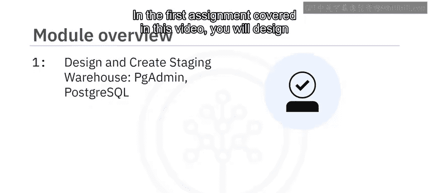

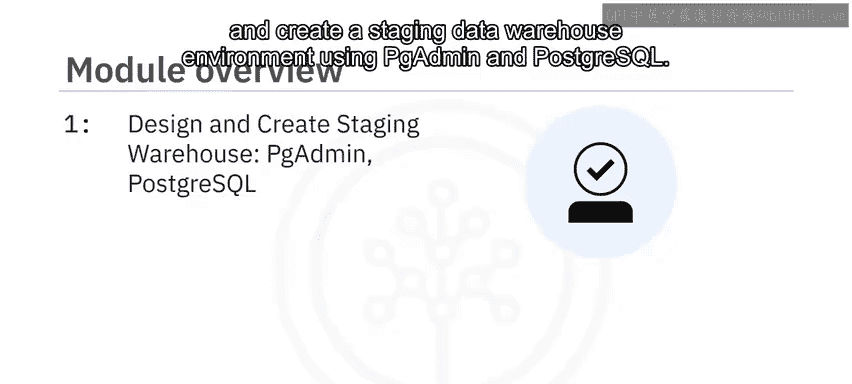

上一节我们介绍了课程背景，本节中我们来看看具体的作业安排。在本模块中，你将完成两项作业。

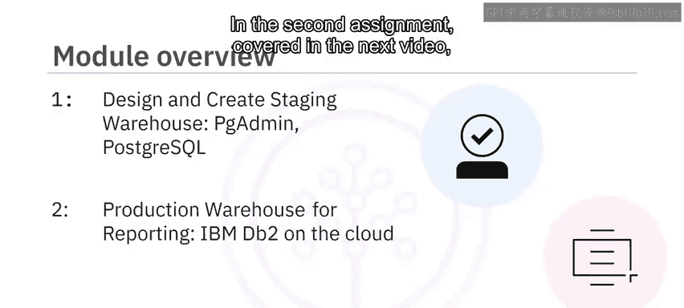

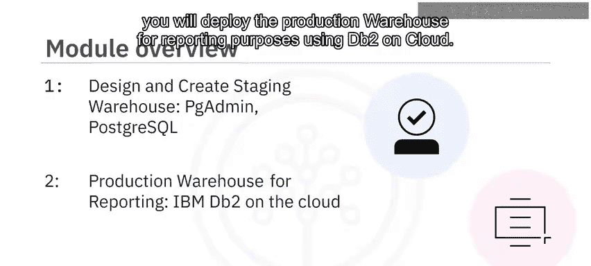

以下是两项作业的简要说明：
*   第一项作业（在本视频中介绍）：你将使用 PG Admin 和 PostgreSQL 来设计和创建一个**暂存数据仓库**环境。
*   第二项作业（在下一个视频中介绍）：你将使用 IBM DB2 on Cloud 来部署用于报告目的的**生产数据仓库**。

## 作业一：设计与创建暂存数据仓库

现在，让我们深入了解第一项作业的细节。这项作业要求你设计一个数据仓库。一家电子商务公司为你提供了样本数据，你将通过为仓库设计一个星型模式来启动项目。

以下是作业一的具体任务步骤：
1.  **设计星型模式**：识别模式中各个维度表和事实表的列。你需要将数据库命名为 `softcart`。
2.  **使用ERD工具设计表**：使用 PG Admin 中的 ERD 设计工具来设计以下表结构：
    *   `softcart_dim_date`：使用诸如 `dateid`、`month`、`monthname` 等字段。公司希望具备按年、月、周、日生成报告的能力。
    *   `softcart_dim_category`
    *   `softcart_dim_country`
    *   `softcart_fact_sales`
3.  **设计表关系**：使用 ERD 设计工具设计所需的表关系，例如一对一、一对多等。
4.  **截图存档**：完成每项任务后，对整个 ERD 进行截图，需清晰显示所有字段名、数据类型以及表之间的关系。

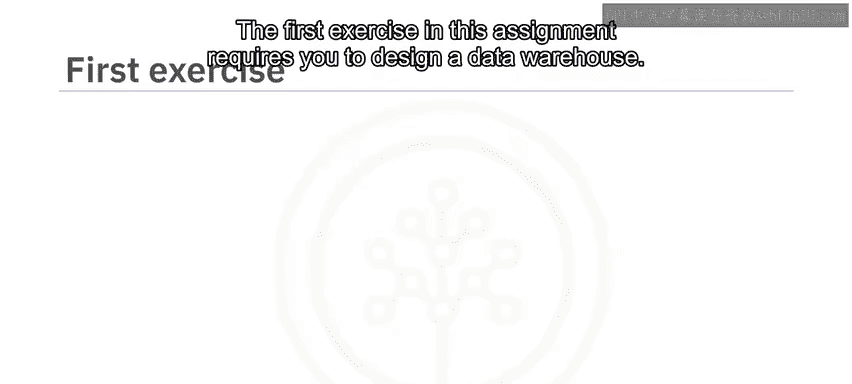

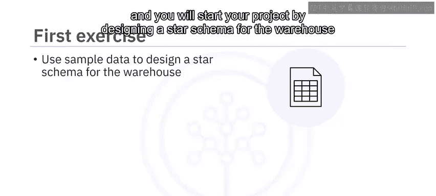

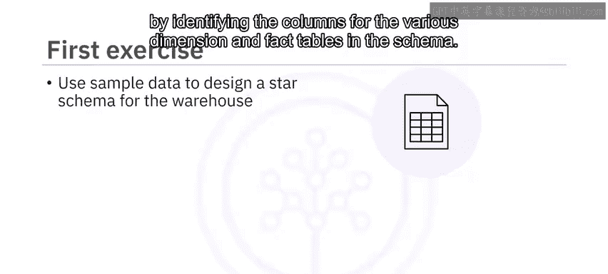

## 作业二：将数据加载到数据仓库

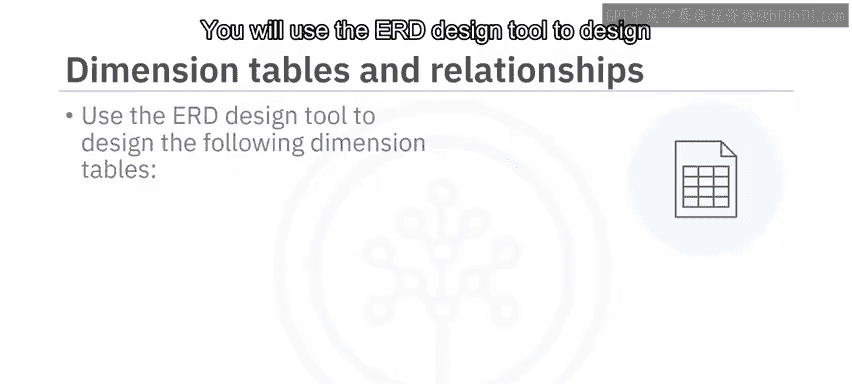

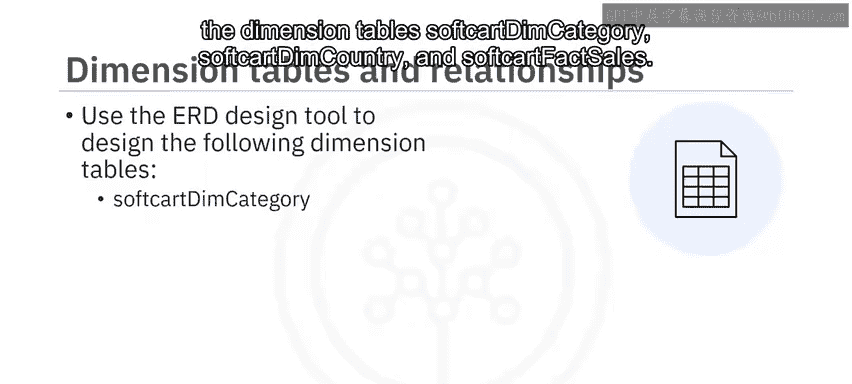

完成了数据仓库的设计后，下一步是将数据加载进去。你的高级数据工程师会审查你的设计，并对你的模式设计提出一些改进建议。

以下是作业二的具体任务步骤：
1.  **获取改进后的数据**：根据改进后的模式，数据可通过一个链接获取。你需要下载该数据。
2.  **恢复数据到数据库**：使用 PG Admin 工具，将下载的数据恢复到名为 `staging` 的数据库中。
3.  **截图确认**：执行此任务后，截图显示数据恢复成功的状态。

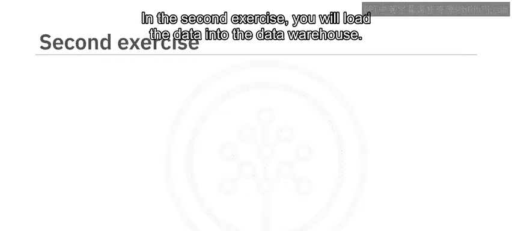

祝你好运，让我们开始吧！

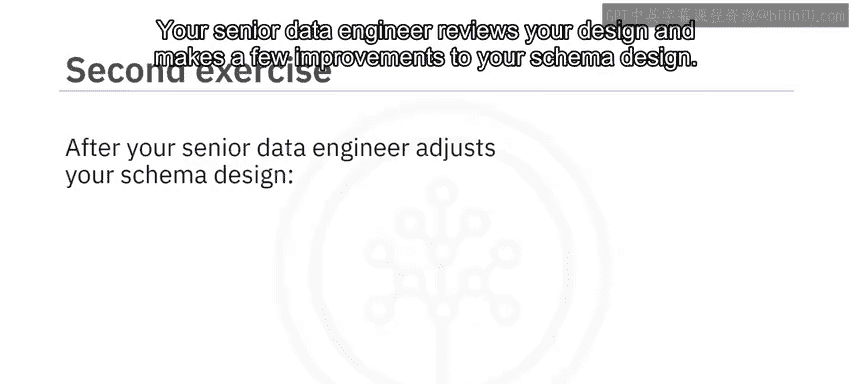

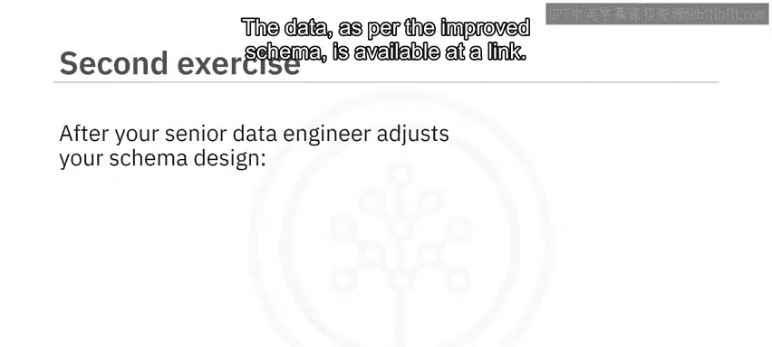

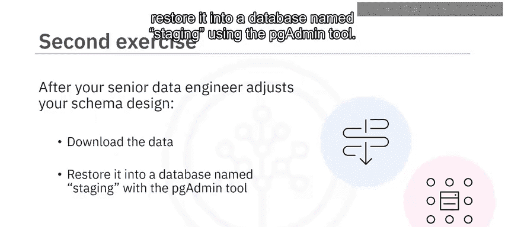

## 课程总结

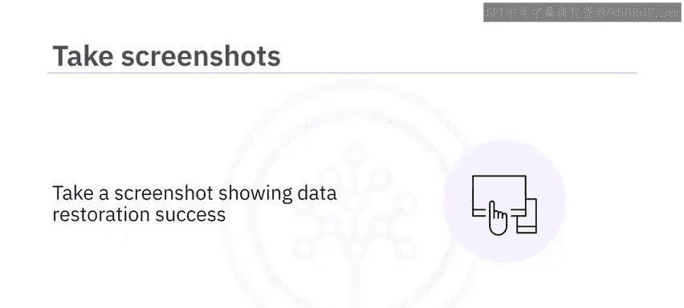

本节课中我们一起学习了“数据仓库设计与设置”作业的概览。我们明确了本模块包含两项核心作业：第一项是使用 PostgreSQL 设计和搭建暂存环境；第二项是使用 DB2 on Cloud 部署生产环境。我们详细了解了第一项作业中设计星型模式、创建表结构以及第二项作业中加载数据的具体步骤和交付要求。