# 005：数据仓库报告作业概述

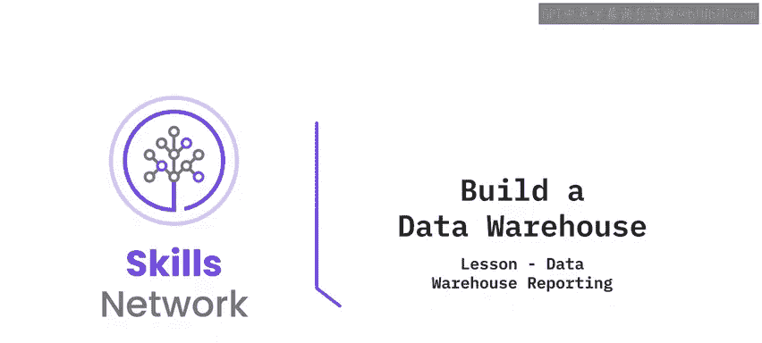

在本节课中，我们将学习“构建数据仓库”模块中关于数据仓库报告的作业。你将通过一系列实践练习，掌握如何将数据加载到数据仓库表中，并使用高级查询技术进行分析。

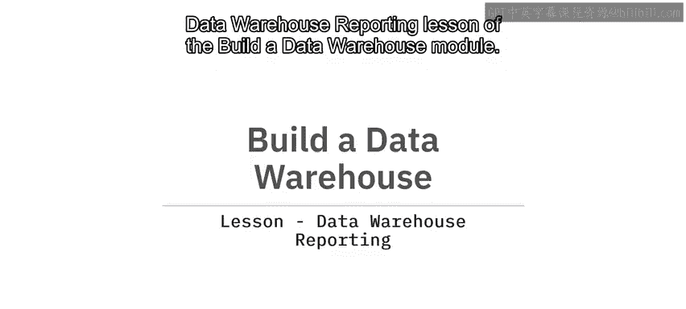

## 作业概述

本作业包含两个主要练习。在开始之前，你需要按照提供的链接说明，在云端创建一个IBM DB2实例。如果你在之前的课程中已经创建过DB2实例，可以继续使用它来完成练习。但请注意，如果数据库实例空间不足，你可能需要清理旧表。

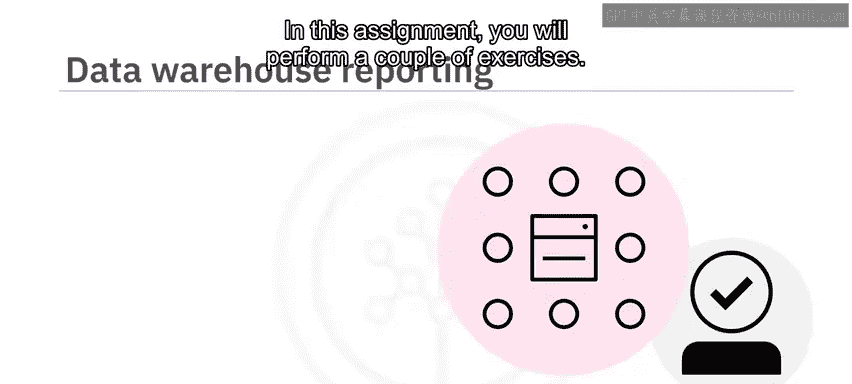

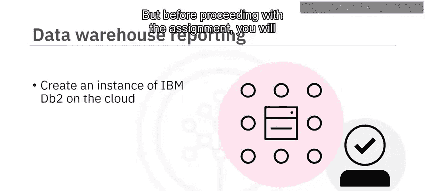

## 练习一：加载数据

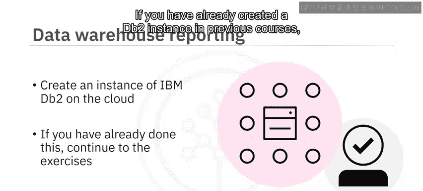

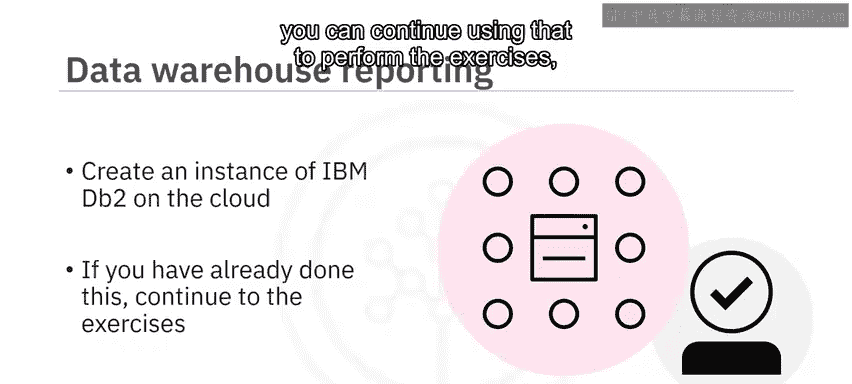

在第一个练习中，你需要将公司提供的CSV格式数据加载到数据库表中。以下是需要完成的任务步骤：

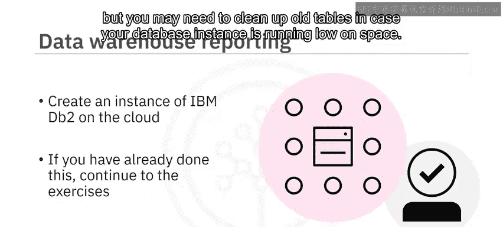

1.  **下载数据**：从提供的链接下载数据文件。
2.  **加载数据**：将下载的数据分别加载到以下表中：
    *   `D_date` 表
    *   `D_category` 表
    *   `D_country` 表
    *   `factact_sales` 表
3.  **记录结果**：加载完成后，为每个表截取前五行的屏幕截图，并妥善命名截图文件。

## 练习二：查询与分析数据

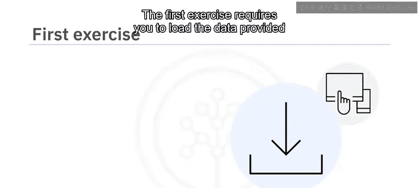

上一节我们完成了数据的加载，本节中我们来看看如何查询和分析这些数据。在第二个练习中，你将使用已加载的数据执行查询。

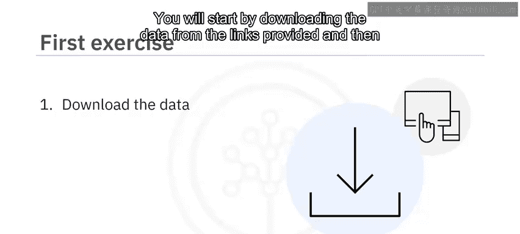

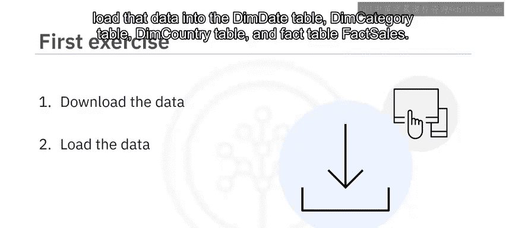

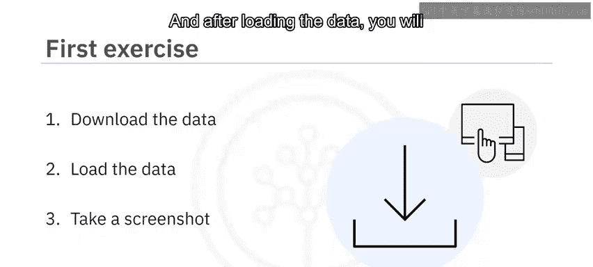

首先，你需要使用 `order_id`、`category` 和 `price_collected` 这几列，创建以下三种类型的查询：

*   **分组集查询**：`GROUPING SETS`
*   **上卷查询**：`ROLLUP`
*   **立方体查询**：`CUBE`

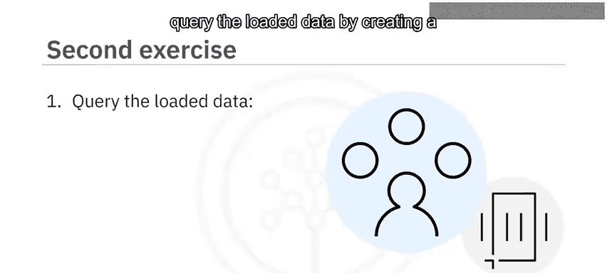

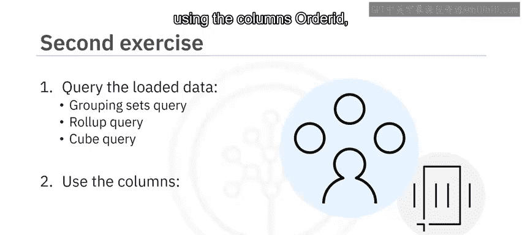

最后，你需要创建一个名为 `total_sales_per_country` 的物化查询表，该表使用 `country` 和 `total_sales` 列。

完成每个任务后，请截取SQL语句及其输出结果的屏幕截图，并命名截图文件。

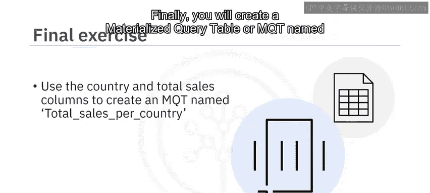

## 总结

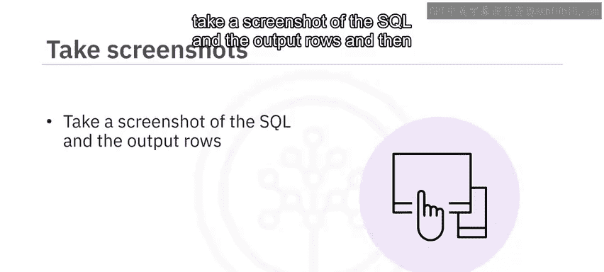

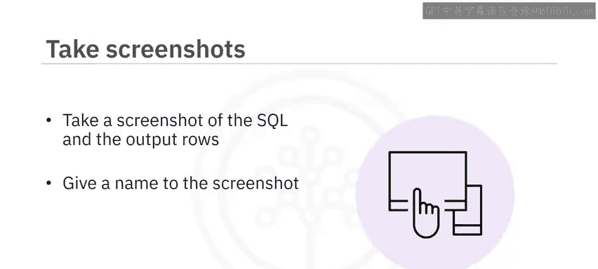

本节课中我们一起学习了数据仓库报告作业的核心内容。你首先需要设置DB2环境并加载CSV数据到指定表中，然后运用`GROUPING SETS`、`ROLLUP`和`CUBE`等高级分组查询技术对数据进行分析，最后创建了一个物化查询表来汇总销售数据。祝你顺利完成练习！