# 006：作业概述 📋


在本节课中，我们将学习毕业项目数据分析模块的作业概览。你将了解需要完成的几个核心练习及其具体任务。

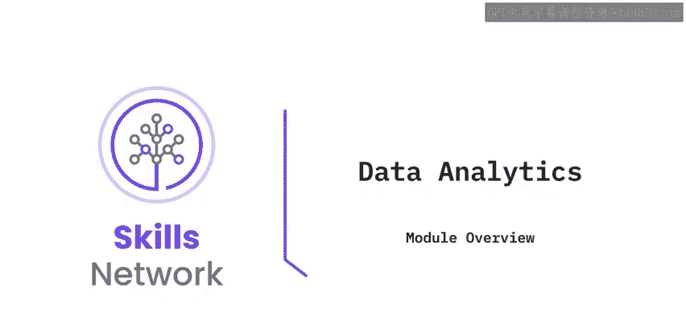

---

## 概述

本次作业包含一系列练习，旨在让你实践数据加载、数据源配置以及数据可视化仪表板的创建。在开始作业前，你需要确保实验环境就绪。

## 环境准备 🛠️

在着手进行作业之前，你需要检查并确保能够访问IBM DB2数据库和IBM Cognos Analytics的云实例。

以下是环境准备的具体步骤：

1.  确认你拥有IBM DB2数据库的云实例访问权限。
2.  确认你拥有IBM Cognos Analytics的云实例访问权限。
3.  从提供的链接下载本次作业所需的数据集。

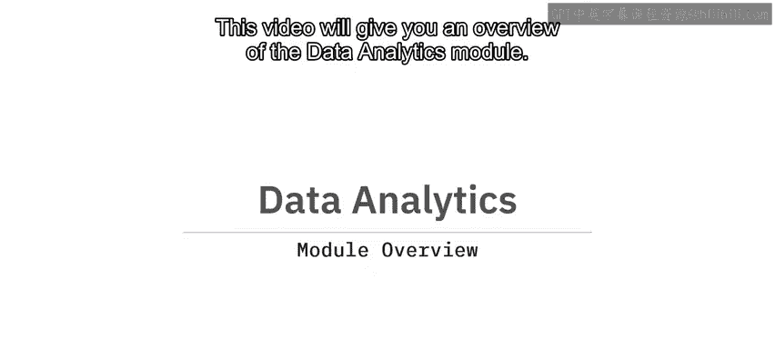

完成上述步骤后，你的实验环境就已准备就绪。

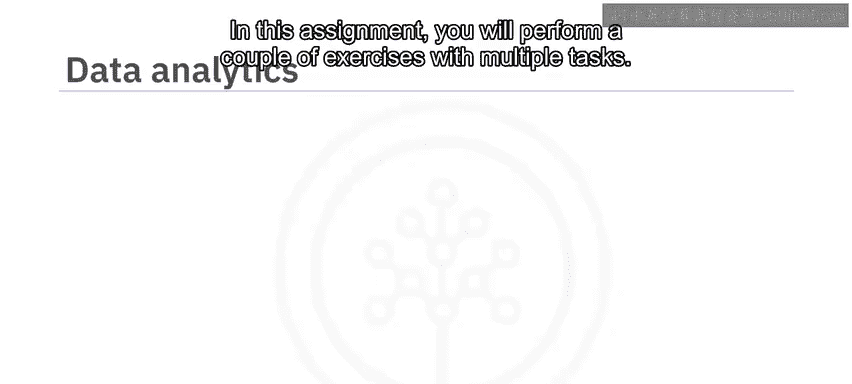

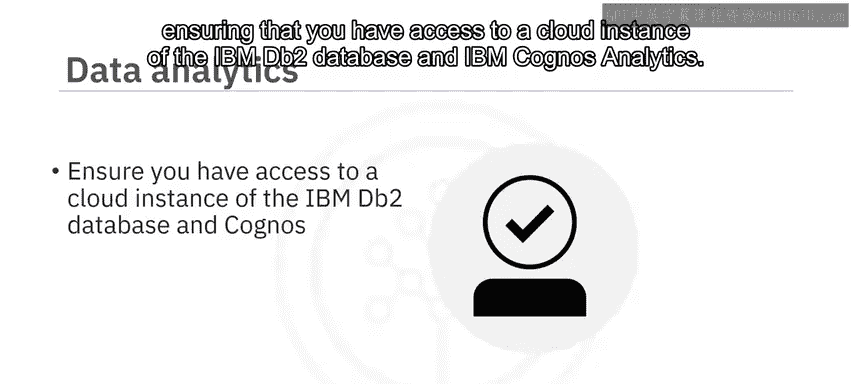

---

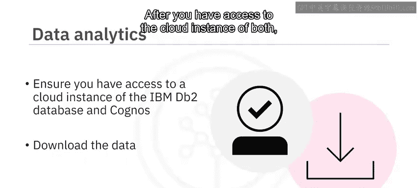

## 练习一：加载数据至数据仓库 📥

上一节我们介绍了环境准备工作，本节中我们来看看第一个核心任务：将数据加载到数据仓库。

此练习要求你将下载的CSV文件数据导入到数据库表中，并验证数据加载成功。

以下是本练习的两个主要任务：

*   **任务1：** 将CSV文件数据导入到IBM DB2数据库的一个表中。这通常涉及使用类似 `LOAD` 或 `IMPORT` 的SQL命令。
    ```sql
    -- 示例：将CSV文件加载到表中
    IMPORT FROM ‘your_data_file.csv’ OF DEL INSERT INTO your_table_name;
    ```
*   **任务2：** 查询并列出该表中的前10行数据，以确认数据已正确加载。
    ```sql
    -- 示例：查询前10行数据
    SELECT * FROM your_table_name FETCH FIRST 10 ROWS ONLY;
    ```

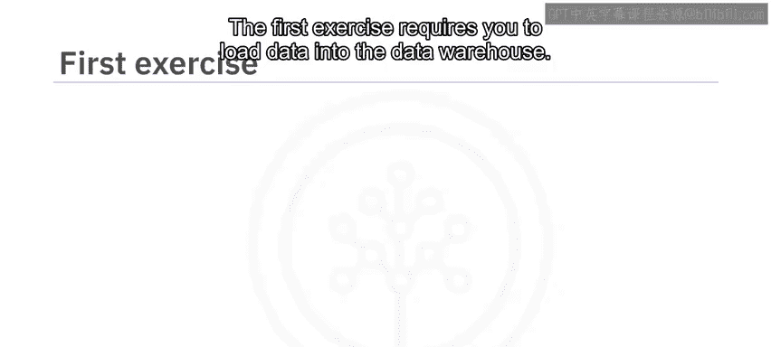

---

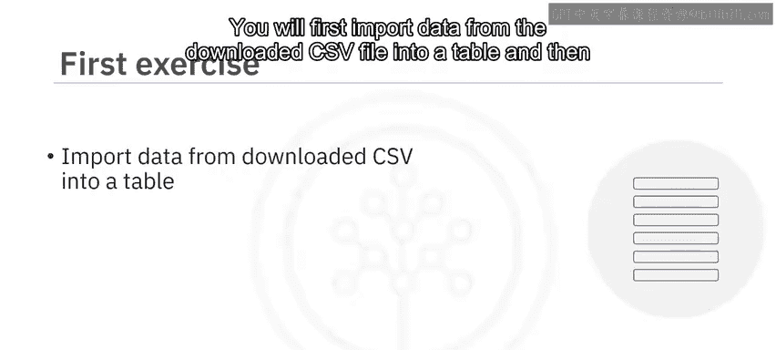

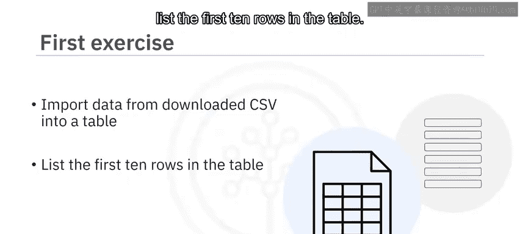

## 练习二：在Cognos中创建数据源 🔗

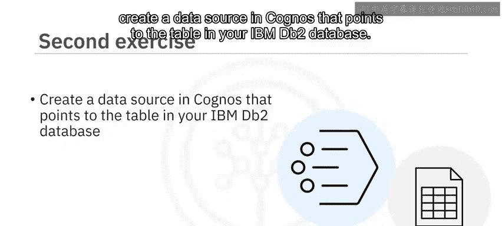

完成了数据加载后，下一步是让分析工具能够访问这些数据。本节我们将学习如何在IBM Cognos Analytics中创建指向你数据库表的数据源。


此练习的目标是在Cognos Analytics中建立一个数据源连接，使其能够读取你在IBM DB2中创建的表。

你需要执行的操作是：在Cognos Analytics界面中，配置一个新的数据源，其连接指向你存放数据的IBM DB2数据库和特定表。

---

## 练习三：创建数据可视化仪表板 📊

在建立了数据源之后，我们就可以利用这些数据进行可视化分析了。本节我们将完成最终练习：创建一个包含多种图表的数据仪表板。

在最后的练习中，你将综合运用前面所学，在Cognos Analytics中创建一个仪表板。

以下是需要在该仪表板中完成的具体可视化任务：

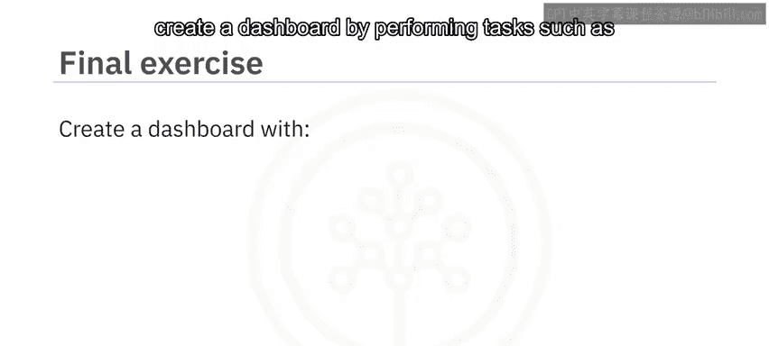

*   **任务1：** 创建一个展示手机季度销售额的**条形图**。
*   **任务2：** 创建一个展示电子产品按类别划分销售额的**饼图**。
*   **任务3：** 创建一个展示给定年份月度总销售额趋势的**折线图**。

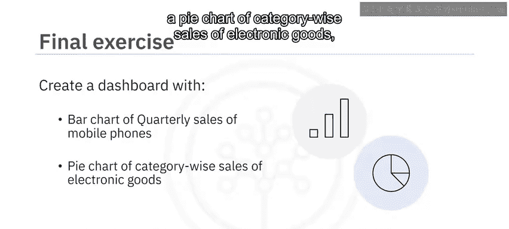

**重要提示：** 在完成每个任务后，请对你使用的操作命令（或配置步骤）以及生成的图表结果进行截图，并为每张截图命名，以便提交。

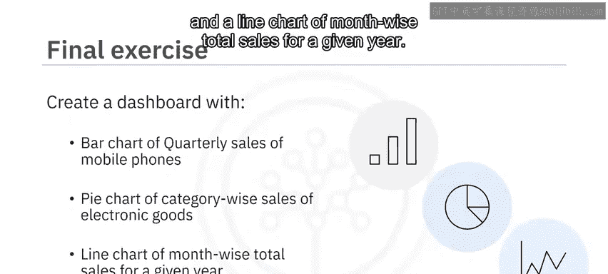

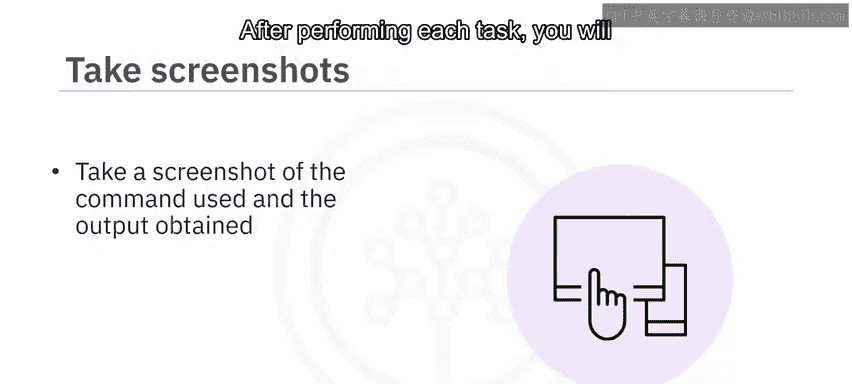

---


## 总结

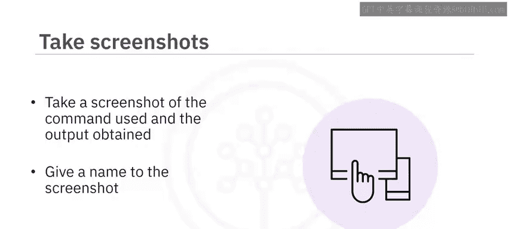

本节课我们一起学习了毕业项目数据分析模块的完整作业流程。我们从环境准备开始，逐步完成了将数据加载到仓库、在分析工具中配置数据源，最终创建了一个包含条形图、饼图和折线图的数据可视化仪表板。现在，你可以开始动手实践了。祝你好运！