# 007：《数据工程毕业项目》｜ETL作业概述 🧑‍💻

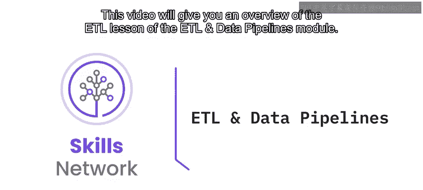

在本节课中，我们将学习ETL与数据管道模块中ETL部分的作业概述。你将了解需要完成的两个主要作业及其包含的练习，并明确开始前的准备工作。

## 概述

本模块包含两个作业。第一个作业（在本视频中介绍）要求你使用Python创建一个ETL管道，从WellTP数据库获取当日新数据并加载到数据仓库中。第二个作业（在后续视频中介绍）要求你使用Apache Airflow创建一个数据管道，以供给大数据集群。

在第一个作业中，你将完成四个练习。但在开始作业之前，你需要完成一些前置任务。

## 前置准备

在着手进行作业之前，你需要完成以下环境准备和数据导入任务：

*   **启动MySQL服务器**并**从指定链接下载文件数据库**。
*   将JSON文件中的数据导入到一个数据库的集合中。
*   将SQL文件中的数据导入到MySQL服务器。
*   验证你对IBM DB2服务器云实例的访问权限。

完成这些步骤后，你就可以开始进行作业中的练习了。

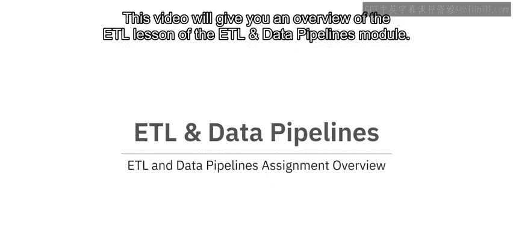

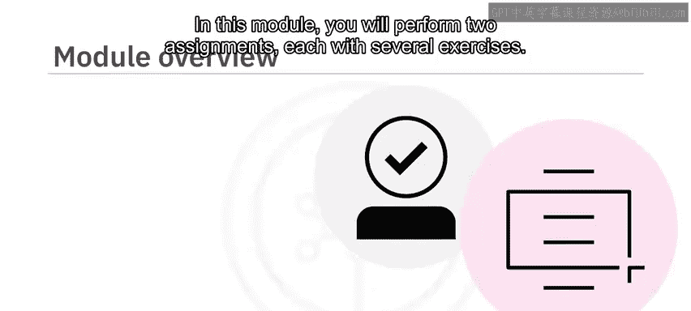

## 作业练习详解

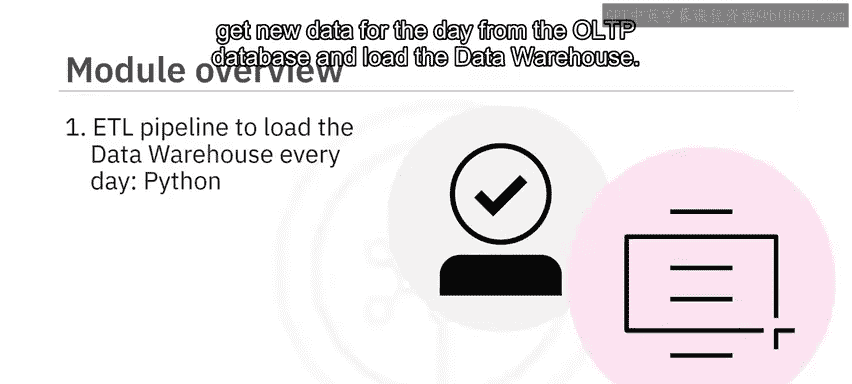

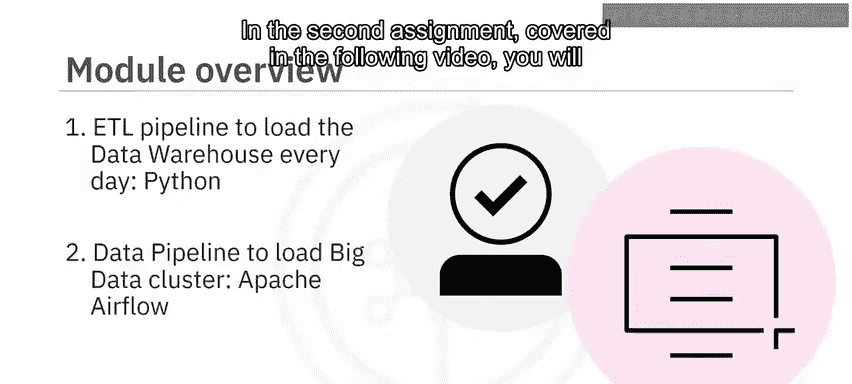

以下是第一个作业中四个练习的具体内容。

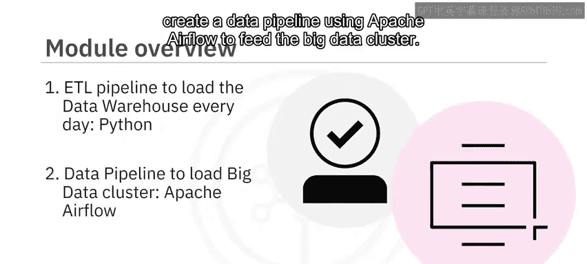

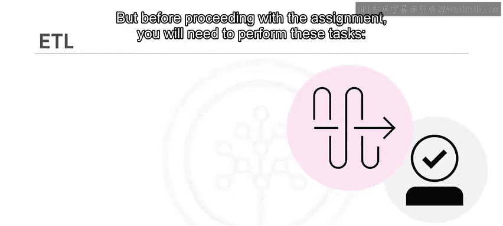

### 练习一：数据提取

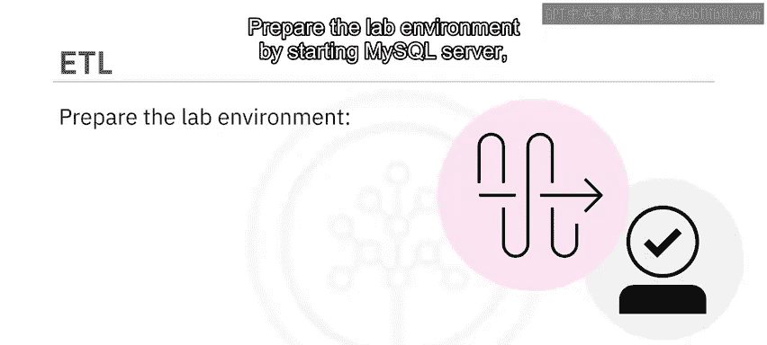

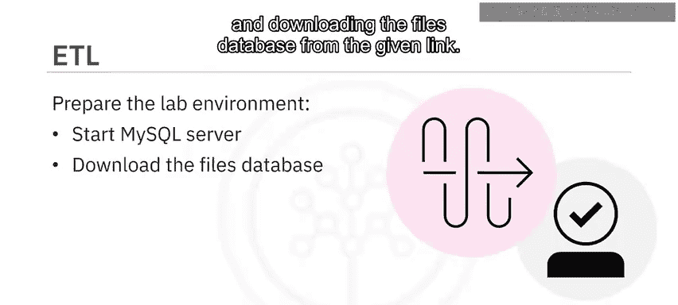

第一个练习要求你从MySQL的销售表中提取数据，并将其转换为CSV格式。

### 练习二：数据转换

在第二个练习中，你需要完成以下任务，将OLTP数据转换为适合数据仓库模式的结构：

*   读取CSV格式的OLTP数据。
*   根据数据仓库的模式，**添加、编辑和删除列**。
*   将转换后的数据保存到一个新的CSV文件中。

### 练习三：数据加载

第三个练习涉及将转换后的数据加载到数据仓库中，你需要执行以下任务：

*   读取CSV格式的转换后数据。
*   将数据加载到数据仓库。
*   验证数据是否已正确加载。

### 练习四：流程自动化

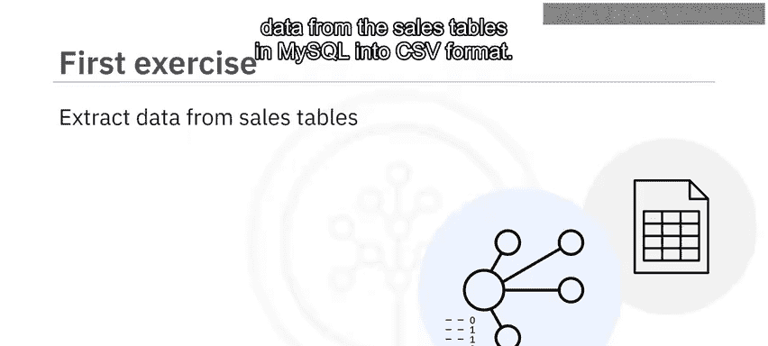

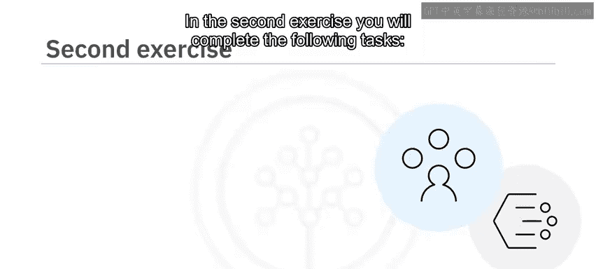

最后一个练习要求你完成以下任务，实现每日增量数据的自动提取和加载：

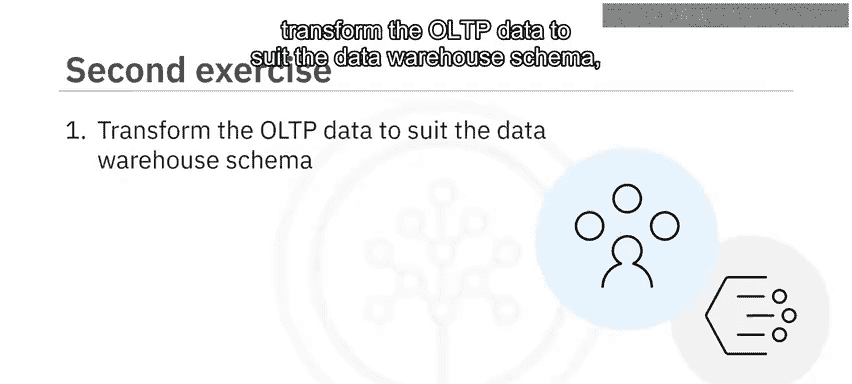

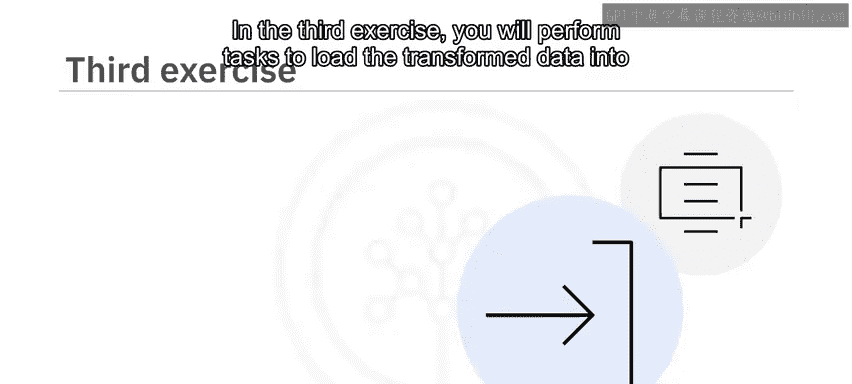

*   自动化提取每日增量数据，并将前一天的数据加载到数据仓库。
*   从提供的链接下载Python脚本作为模板。
*   编写一个能自动加载前一天数据的Python脚本。

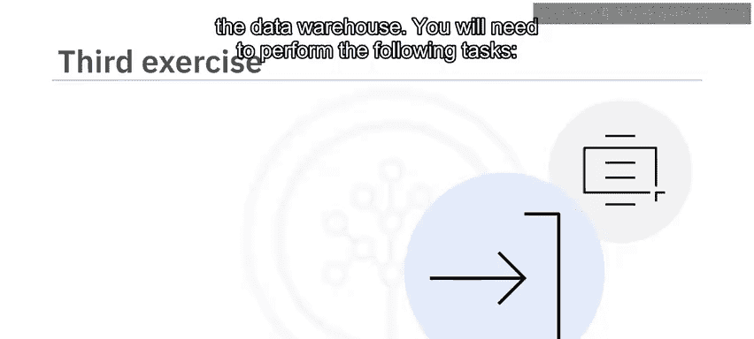

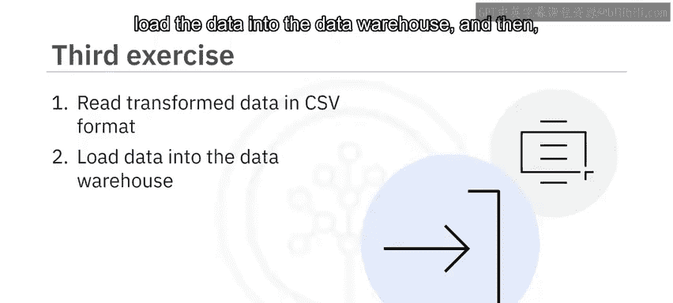

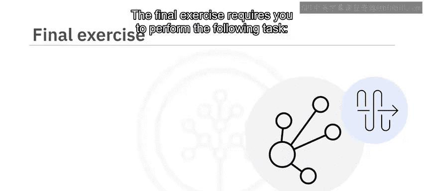

## 任务提交要求

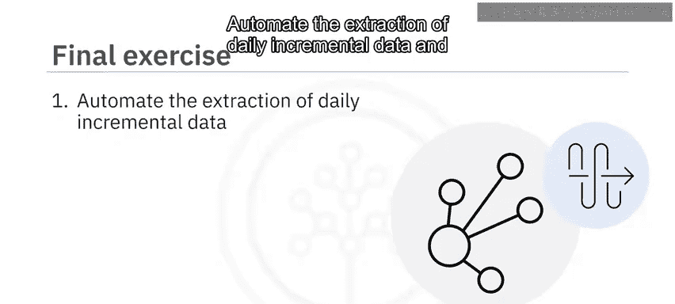

完成每个任务后，请对你使用的命令及其输出进行截图，并为截图文件命名。

## 总结

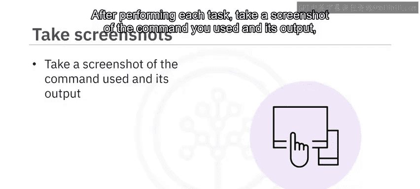

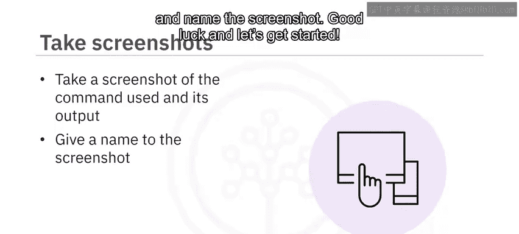

本节课我们一起学习了《数据工程毕业项目》中第一个ETL作业的完整概述。我们明确了作业包含的四个核心练习：**数据提取、转换、加载和流程自动化**，并了解了开始前必须完成的环境准备步骤。现在，你可以根据这些指引开始你的实践了。祝你好运！