# 008：《数据工程毕业项目》｜使用Apache Airflow的数据管道作业概述 🚀

在本节课中，我们将学习如何使用Apache Airflow创建、运行和监控一个数据管道。这个管道将处理Web服务器日志数据，并将其加载到大数据集群中。课程内容分为两个主要练习：第一个练习专注于构建一个包含提取、转换和加载（ETL）任务的有向无环图（DAG）；第二个练习则涉及让这个DAG投入运行并进行监控。

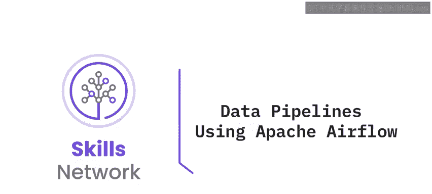

---

## 概述 📋

本作业属于“ETL与数据管道”模块。在开始实际操作之前，你需要先准备实验环境，包括启动Apache Airflow，并使用提供的链接将数据集从源位置下载到目标位置。

完成环境准备后，你将进行两个练习。第一个练习要求你创建一个每日运行的DAG，其中包含提取、转换和加载数据的任务。第二个练习则要求你保存这个DAG，并通过Airflow控制台使其运行、停止和监控。

---

## 练习一：创建数据管道DAG 🔄

在第一个练习中，你将执行一系列任务来创建一个每日运行的**有向无环图（DAG）**。DAG是Airflow中用于定义任务及其依赖关系的工作流。

以下是本练习需要完成的三个具体任务：

1.  **提取任务**：从Web服务器日志文件中提取IP地址和日期字段，并将结果保存到一个CSV文件中。
    *   **核心操作**：`提取(日志文件) -> CSV文件`

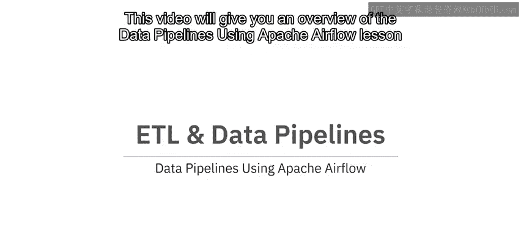

2.  **转换任务**：将上一步得到的日期字段转换为“年-月-日”格式，并将输出保存到另一个CSV文件中。
    *   **核心操作**：`转换(日期格式) -> 新CSV文件`

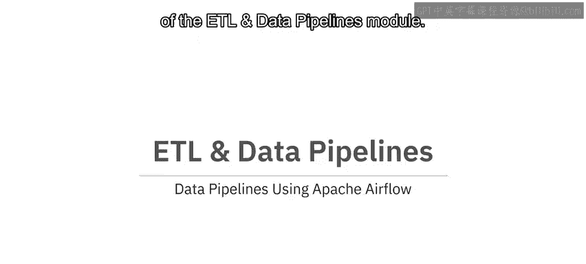

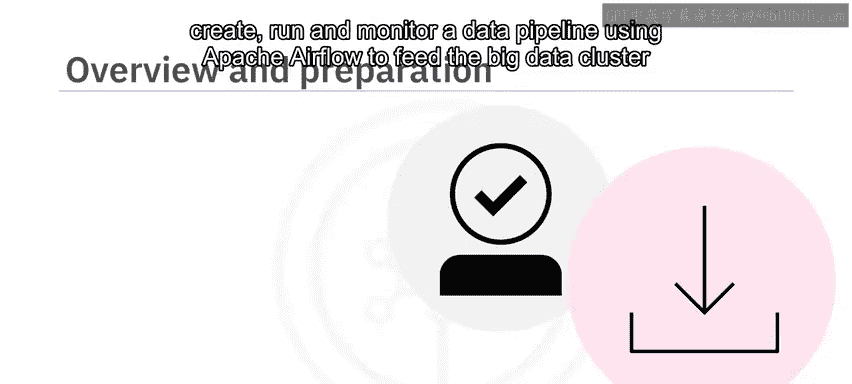

3.  **加载任务**：将转换后的CSV文件进行归档，然后将其移动到下一个处理阶段。
    *   **核心操作**：`归档(CSV文件) -> 移动至目标位置`

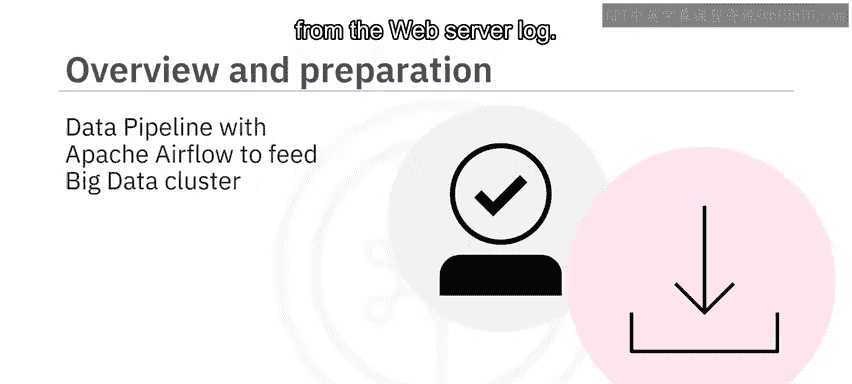

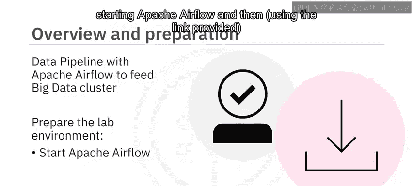

在进入下一个练习之前，你需要根据给定的详细说明，明确定义这三个任务之间的依赖关系，即**任务管道**。

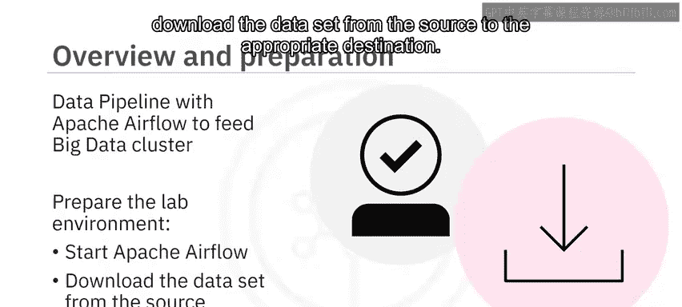

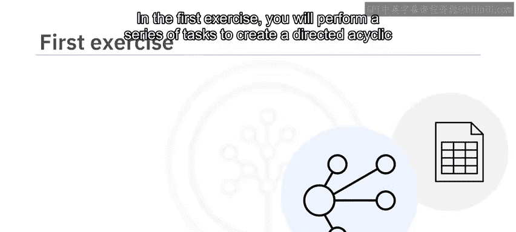

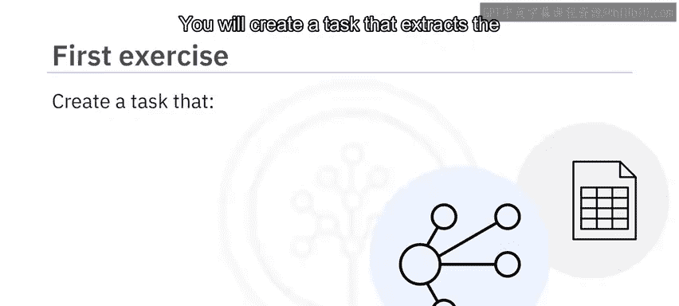

---

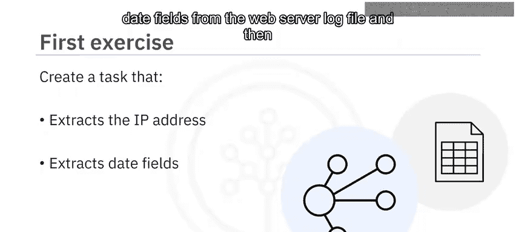

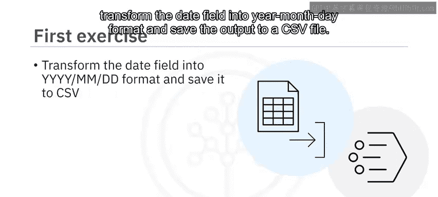

## 练习二：运行与监控DAG 📊

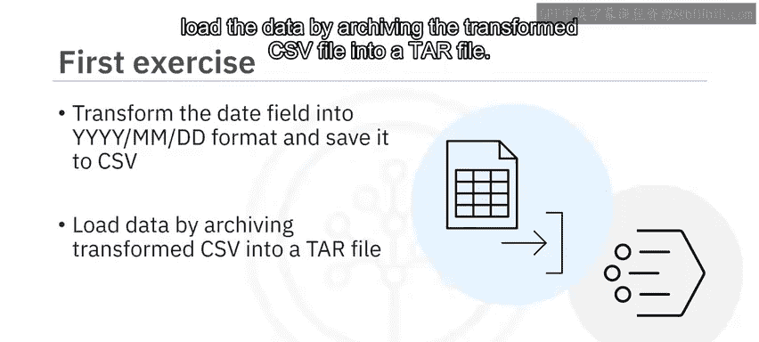

上一节我们介绍了如何构建一个ETL管道DAG。本节中，我们来看看如何让这个DAG真正运行起来。

在第二个练习中，你需要执行以下步骤来使DAG投入运行：

1.  **保存DAG**：将定义好的DAG保存为一个`.py`（Python）文件。
2.  **提交与运行**：通过Airflow控制台提交并启动这个DAG。
3.  **停止与监控**：在Airflow控制台中停止DAG运行，并监控其执行状态和日志。

**重要提示**：在完成每个任务步骤后，请对你使用的命令及其输出进行截图，并妥善命名截图文件，以备查验。

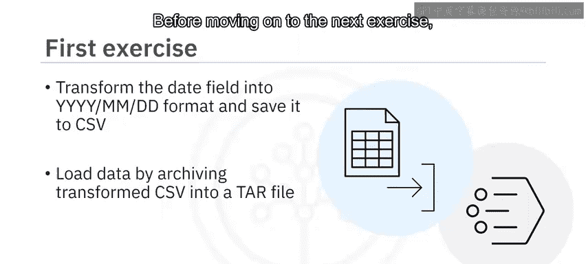

---

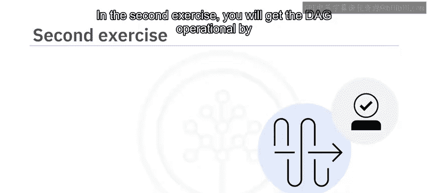

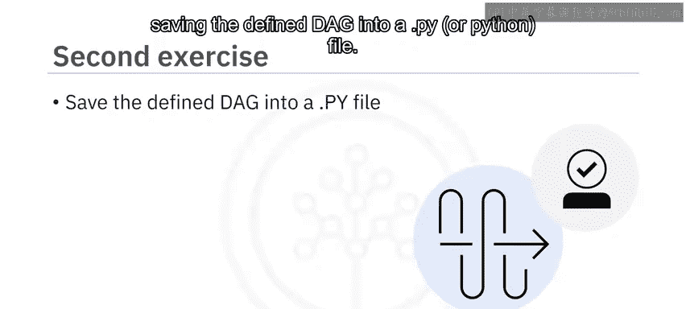

## 总结 🎯

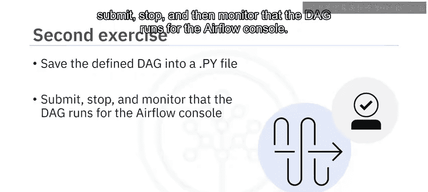

本节课中，我们一起学习了使用Apache Airflow构建数据管道的完整流程。我们从概述开始，明确了作业的两个主要部分：首先是创建包含提取、转换和加载任务的DAG；然后是实际操作，保存DAG文件并通过Airflow界面对其进行运行和监控。

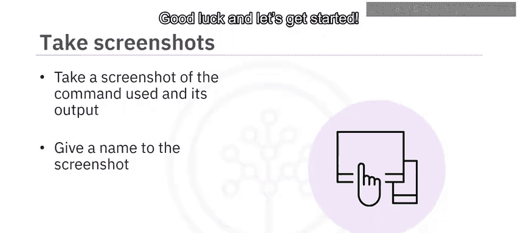

通过本课的学习，你应该掌握了使用Apache Airflow设计和执行一个基本ETL管道的关键步骤。祝你顺利完成作业！