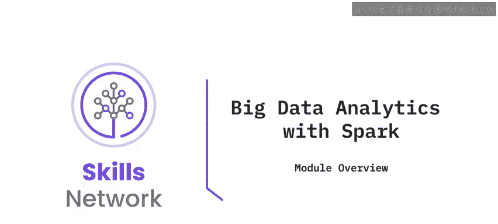
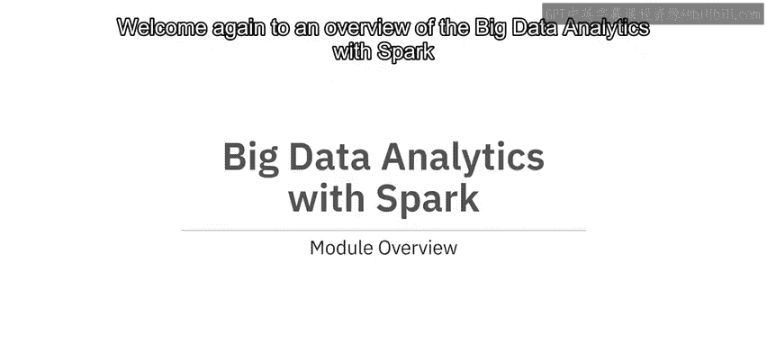
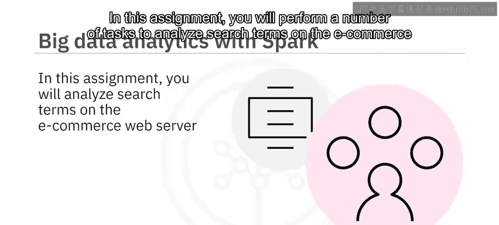
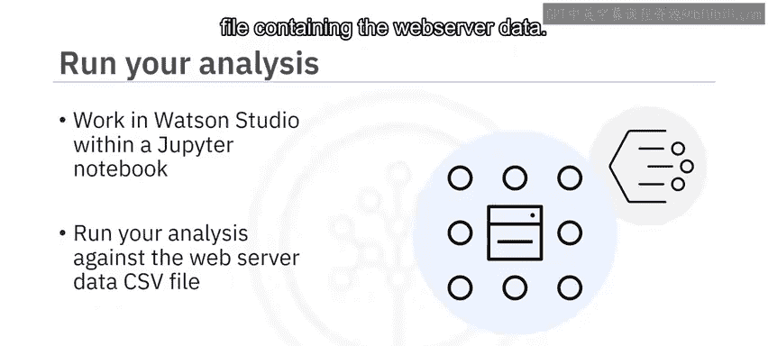
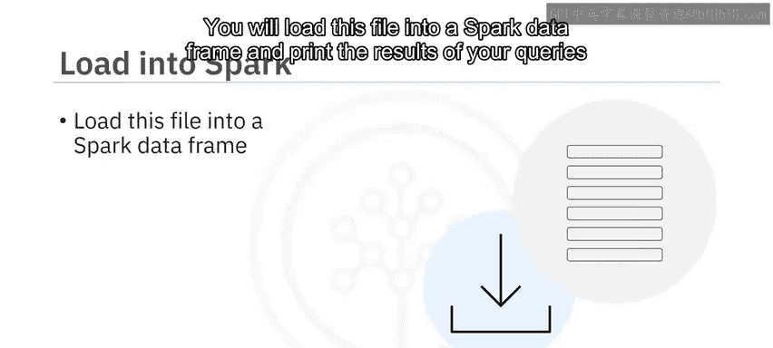
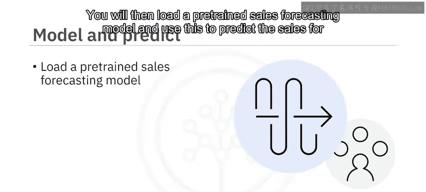
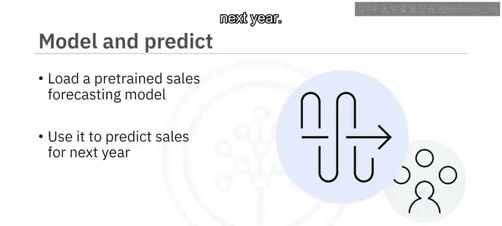
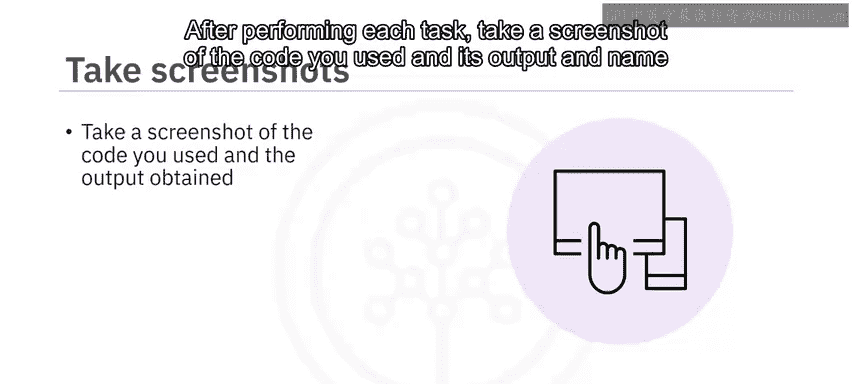
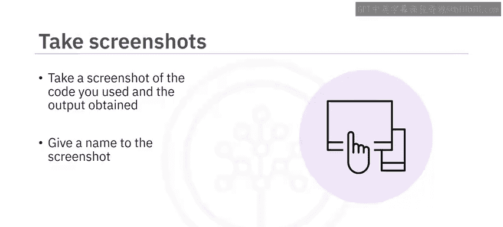

# 009：使用Spark进行大数据分析作业概述 🚀

在本节课中，我们将学习《数据工程毕业项目》课程中一个关键作业的概述。这个作业的核心是使用Apache Spark框架来分析电子商务网站的搜索数据，并利用预训练模型进行销售预测。

## 作业概述

欢迎再次来到“使用Spark进行大数据分析”的作业概述。

在这个作业中，你将执行一系列任务来分析电子商务Web服务器上的搜索词。你将在Watson Studio环境中的Jupyter Notebook里工作，对一个包含Web服务器数据的CSV文件进行分析。

## 核心任务步骤

以下是完成本作业需要执行的核心步骤：

1.  **数据加载与处理**：你将把这个CSV文件加载到一个Spark数据框中。
2.  **数据查询与分析**：你将运行查询语句来分析这个数据集，并打印查询结果。
3.  **模型应用与预测**：接着，你将加载一个预训练的销售预测模型，并使用它来预测下一年的销售额。

## 作业提交要求

在执行完每个任务后，你需要对所使用的代码及其输出结果进行截图，并为截图文件命名。

祝你好运，让我们开始吧。😊