# 011：Hadoop生态系统 🏗️

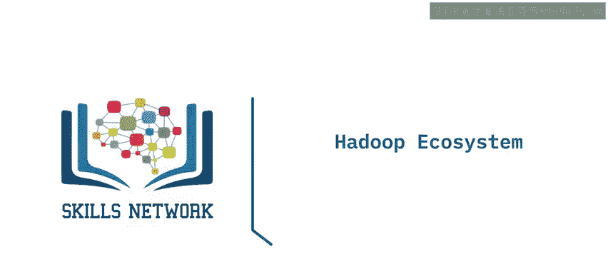

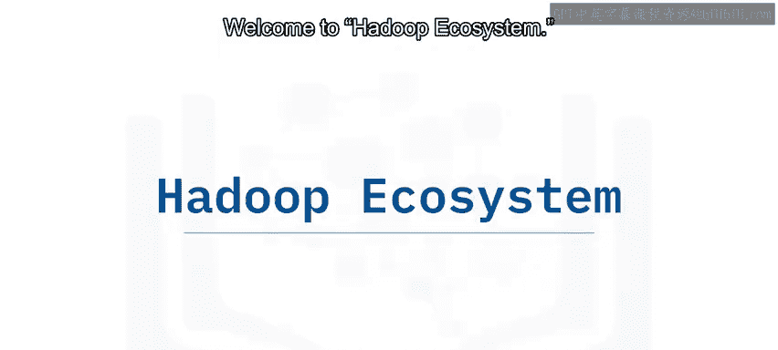

在本节课中，我们将要学习Hadoop生态系统的构成。我们将了解其核心组件与扩展组件，并按照数据处理的不同阶段，认识每个阶段中常用的工具及其作用。

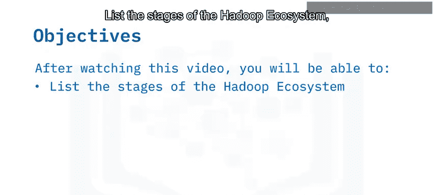

## 概述 📋

Hadoop生态系统由一系列相互支持的组件构成，用于处理大数据。除了核心组件，还包括许多扩展的库和软件包。我们可以根据数据处理的四个主要阶段来审视这个生态系统：**数据摄取**、**数据存储**、**处理与分析**以及**数据访问**。

## Hadoop核心组件 ⚙️

上一节我们介绍了Hadoop生态系统的整体框架，本节中我们来看看它的核心基础。

Hadoop的核心组件为整个生态系统提供了基础支持，主要包括：

*   **Hadoop Common**：指支持其他Hadoop模块的通用工具和库。
*   **Hadoop分布式文件系统 (HDFS)**：存储从摄取阶段收集的数据，并将数据分布在多个节点上。
*   **MapReduce**：通过在集群中处理数据，使大数据变得易于管理。
*   **YARN (Yet Another Resource Negotiator)**：跨集群的资源管理器。

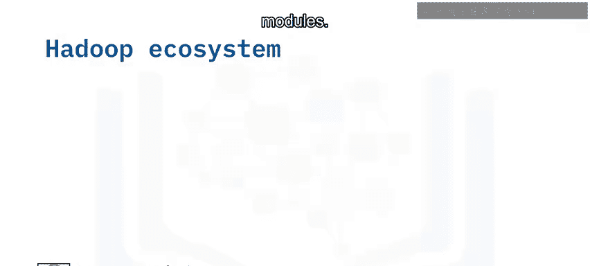

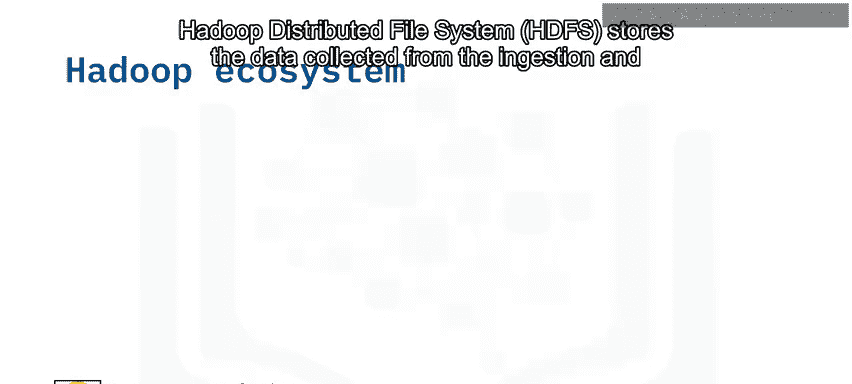

## Hadoop扩展生态系统 🧩

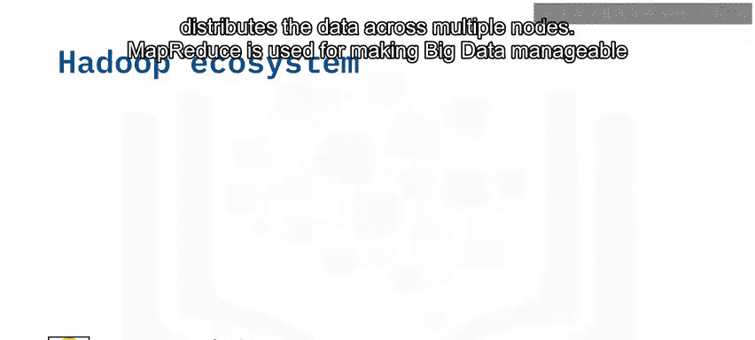

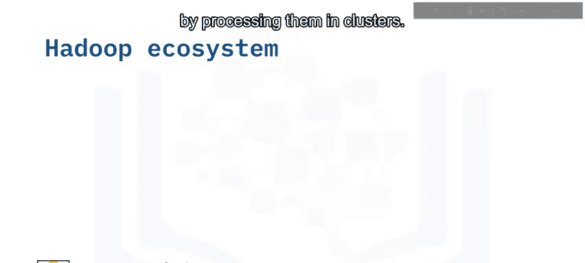

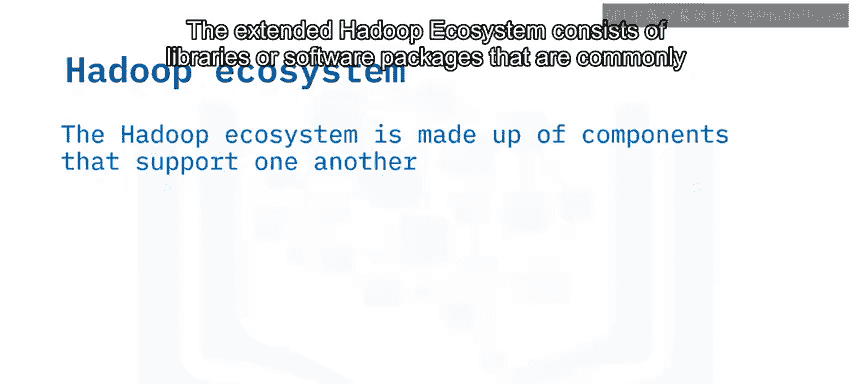

扩展的Hadoop生态系统由通常与Hadoop核心一起使用或安装在其之上的库或软件包组成。

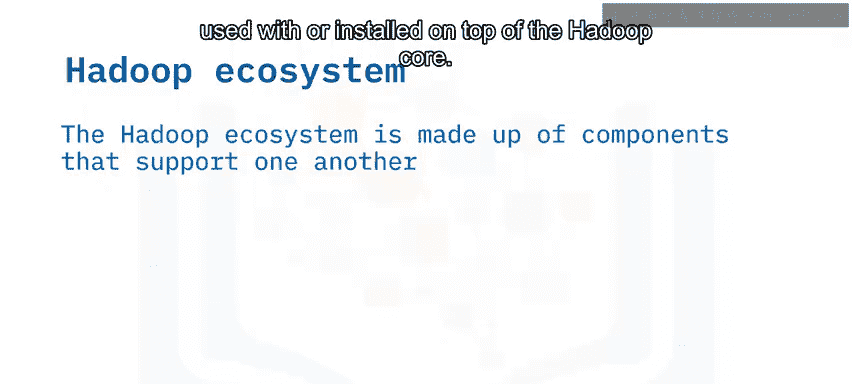

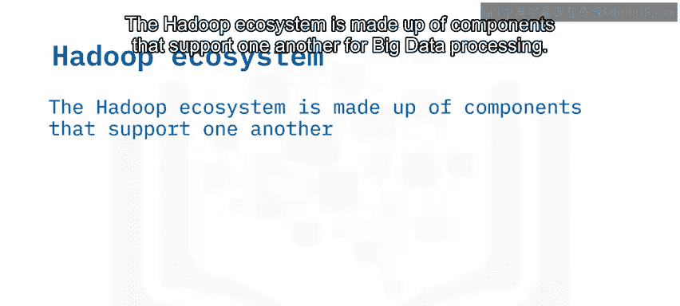

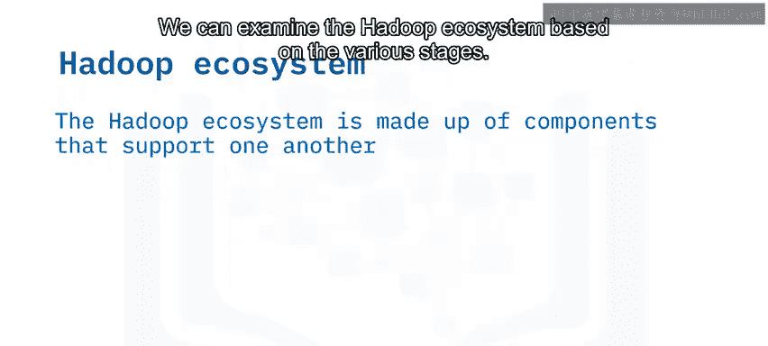

## 数据处理阶段与工具 🛠️

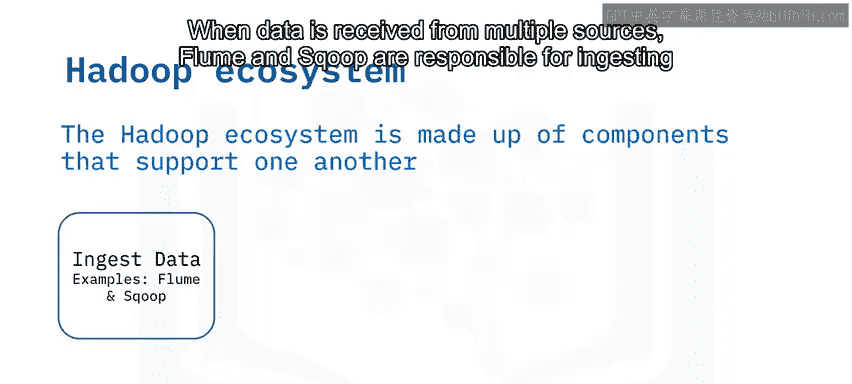

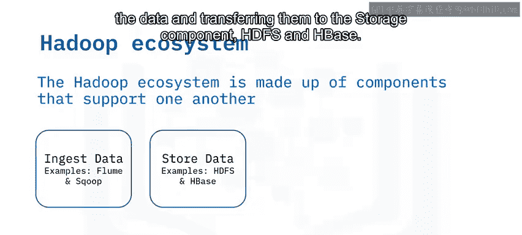

Hadoop生态系统可以基于数据处理的不同阶段进行划分。每个阶段都有特定的工具负责相应的工作。

### 1. 数据摄取阶段

数据摄取是大数据处理的第一阶段。当你处理大数据时，会从不同来源获取数据。

以下是此阶段常用的工具：

*   **Flume**：一个分布式服务，用于收集、聚合和传输大数据到存储系统。Flume基于流数据流，架构简单灵活，并采用可扩展的数据模型，支持在线分析应用。
*   **Sqoop**：一个开源工具，设计用于在关系型数据库系统和Hadoop之间批量传输数据。Sqoop会检查关系型数据库并总结其模式，然后根据需要生成MapReduce代码来导入和导出数据。Sqoop允许你快速开发其他使用存储在HDFS中的记录的MapReduce应用程序。

### 2. 数据存储阶段

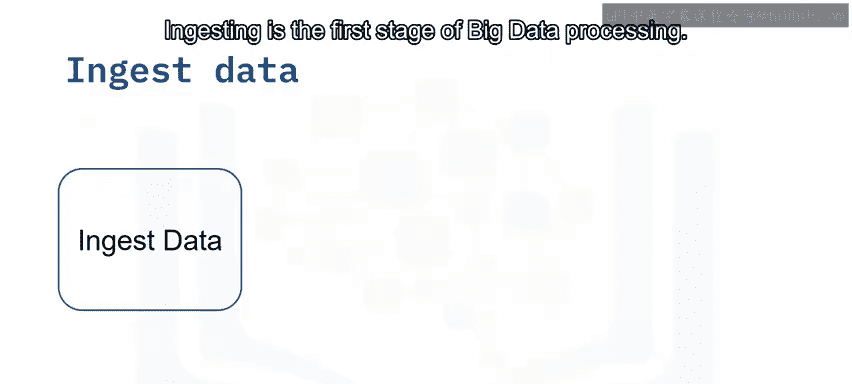

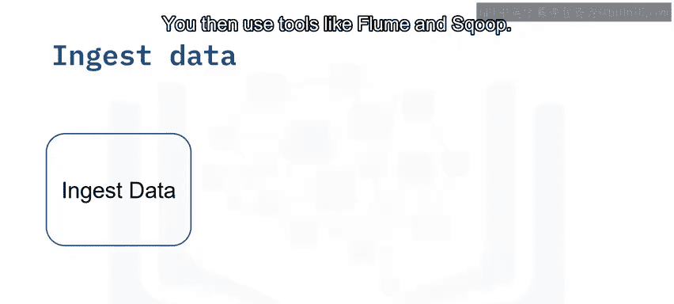

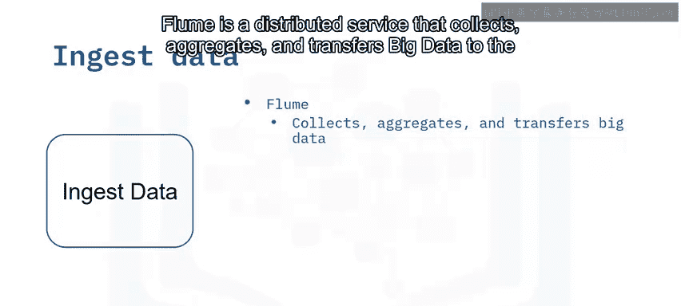

在数据摄取之后，需要将数据存储起来。HDFS和HBase是此阶段的关键组件。

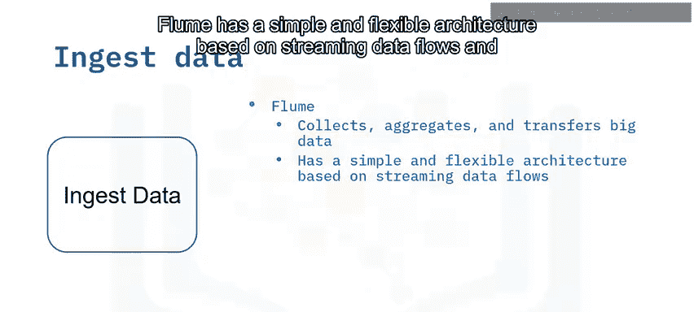

以下是此阶段涉及的技术：

*   **HDFS**：作为主要的分布式存储系统。
*   **HBase**：一个运行在HDFS之上的面向列的非关系型数据库系统。它提供对Hadoop文件系统的实时读写访问。HBase使用哈希表在索引中存储数据，并允许随机访问数据，这使得查找速度更快。
*   **Cassandra**：一个可扩展的NoSQL数据库，设计为没有单点故障。

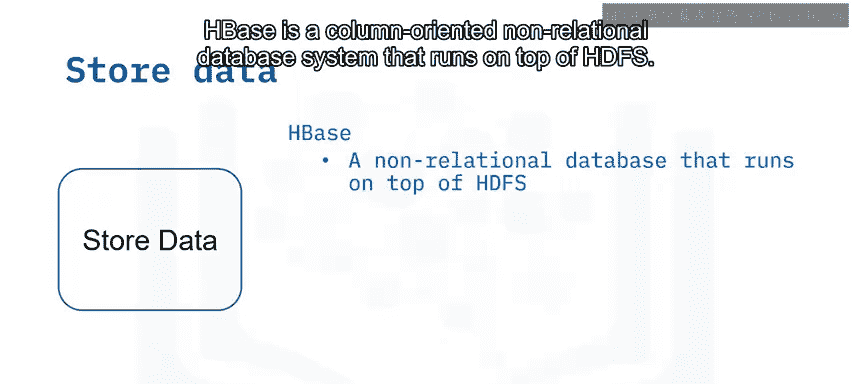

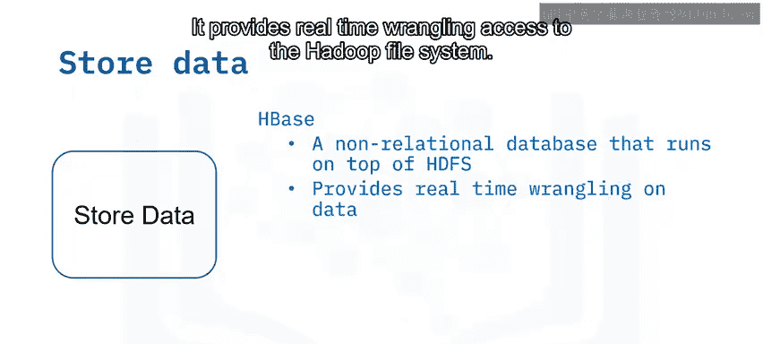

### 3. 处理与分析阶段

数据存储后，需要被分发到像Pig和Hive这样的MapReduce框架中进行处理和分析，处理通过并行计算完成。

以下是此阶段的主要工具：

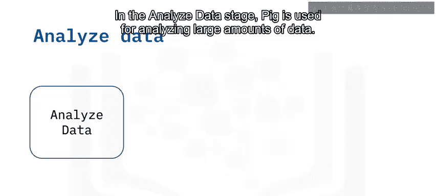

*   **Pig**：用于分析大量数据。Pig是一种过程式数据流语言和过程式编程语言，它遵循一系列命令的顺序执行。
*   **Hive**：主要用于创建报告，并在集群的服务端运行。Hive是一种声明式编程语言，这意味着它允许用户表达他们希望接收哪些数据。

### 4. 数据访问阶段

最后一个阶段是数据访问，用户在此阶段可以访问经过分析和提炼的数据。

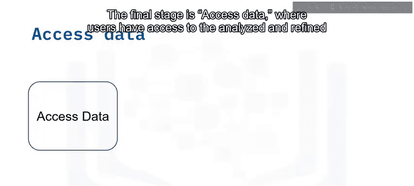

以下是此阶段的常用工具：

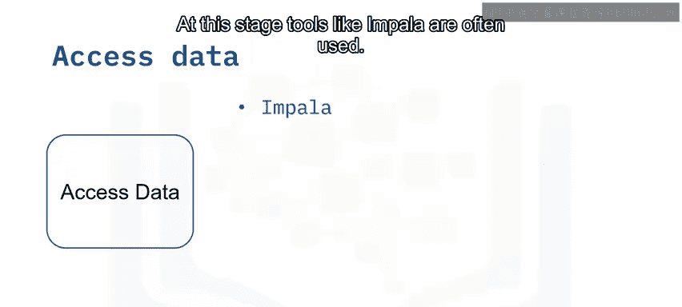

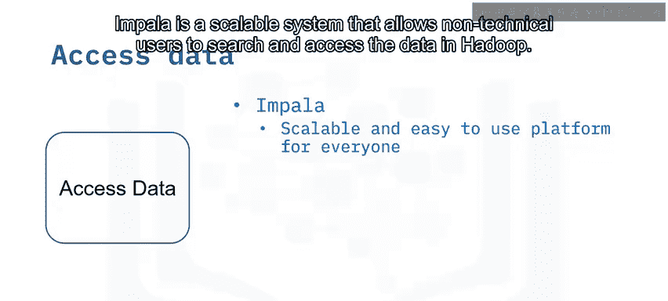

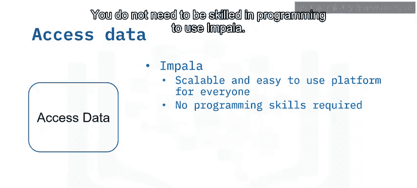

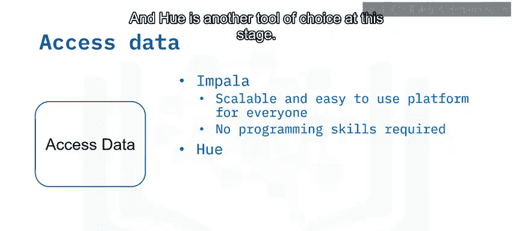

*   **Impala**：一个可扩展的系统，允许非技术用户搜索和访问Hadoop中的数据。使用Impala不需要具备熟练的编程技能。
*   **Hue (Hadoop User Experience)**：Hue允许你上传、浏览和查询数据。你可以在Hue中运行Pig作业和工作流。Hue还为Hive和MySQL等多种查询语言提供了SQL编辑器。

## 总结 🎯

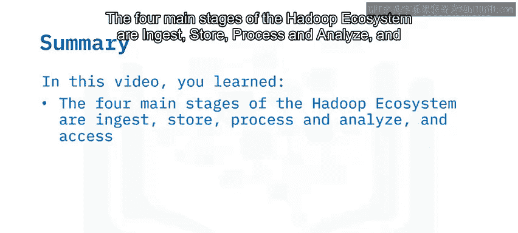

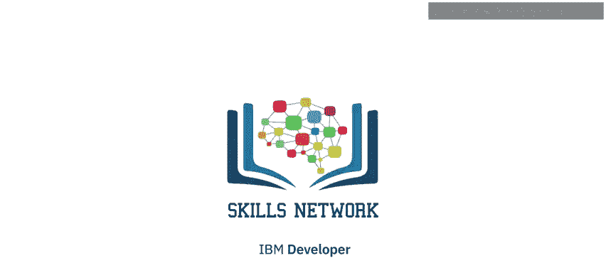

本节课中我们一起学习了Hadoop生态系统的四个主要阶段：**摄取**、**存储**、**处理与分析**以及**访问**。我们还了解了与每个阶段相关的一些工具示例，例如Flume、Sqoop、HBase、Pig、Hive、Impala和Hue，并理解了每个阶段如何与其他阶段相互作用，共同完成大数据的处理流程。