# 012：Hadoop分布式文件系统（HDFS）详解 🗂️

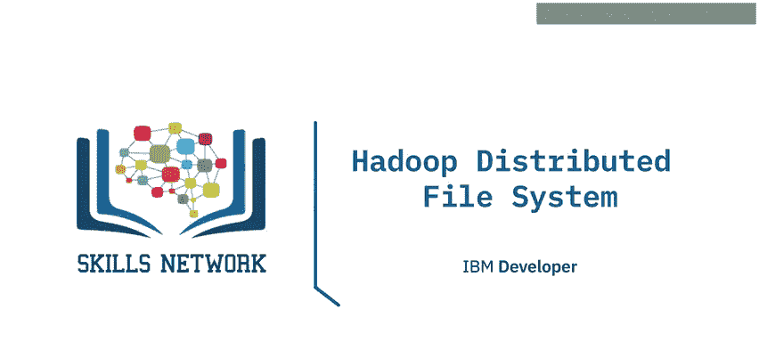

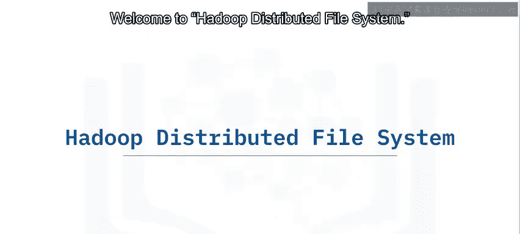

在本节课中，我们将要学习Hadoop分布式文件系统（HDFS）。HDFS是Hadoop生态系统的核心存储层，专为存储和处理海量数据而设计。我们将了解其基本概念、关键特性、架构以及数据读写的工作原理。

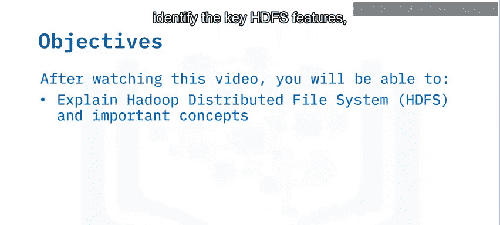

---

## HDFS概述

HDFS代表Hadoop分布式文件系统。分布式文件系统是一种分布在多个文件服务器上的文件系统，它允许程序员从任何网络或计算机访问或存储文件。HDFS是Hadoop的存储层，其工作原理是将文件分割成块，然后创建这些块的副本并将它们存储在不同的机器上。HDFS旨在无缝访问流数据，这意味着它在传输数据时提供恒定的比特率，而不是以波动的方式传输数据。HDFS使用命令行界面与Hadoop交互。

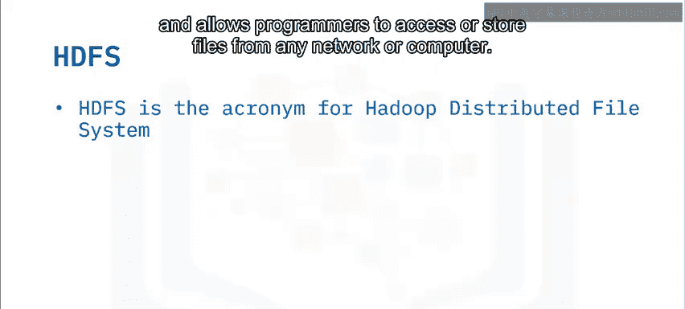

## HDFS的关键特性

HDFS具有多个使其适合大数据处理的关键特性。

以下是HDFS的主要特性列表：

*   **成本效益**：存储数据的商用硬件价格不高，因此降低了存储成本。
*   **海量存储**：HDFS可以存储高达PB级别的海量数据，支持任何格式，包括结构化和非结构化数据。
*   **数据分块**：它将海量数据分割成称为“块”的小块。
*   **容错性**：HDFS能够复制数据，并在某个硬件单元发生故障时，最大限度地减少与数据丢失相关的成本。如果一台计算机发生数据丢失，数据可以在另一台计算机上找到，工作可以继续进行。
*   **高可扩展性**：单个集群可以扩展到数百个节点。
*   **可移植性**：HDFS设计为可以轻松地从一种平台迁移到另一种平台。

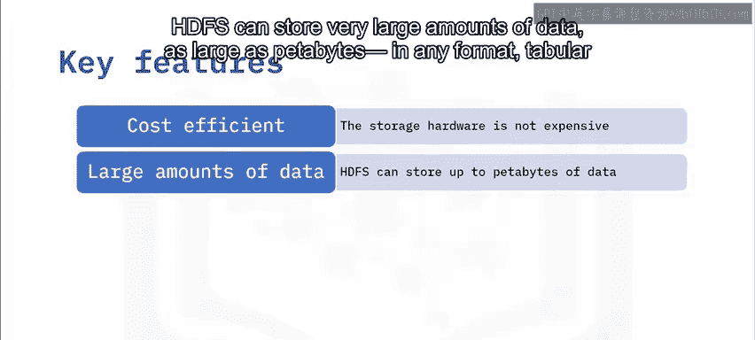

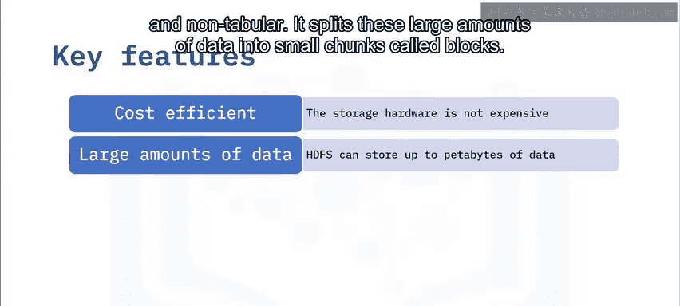

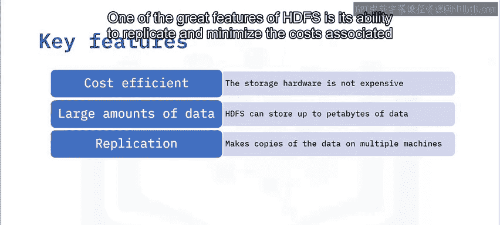

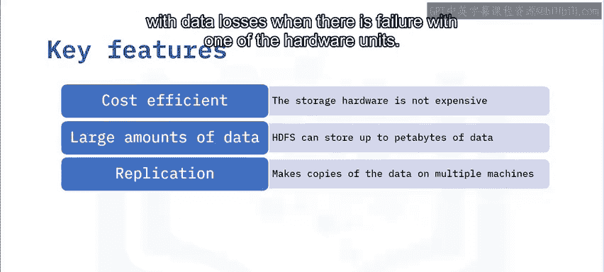

## HDFS核心概念

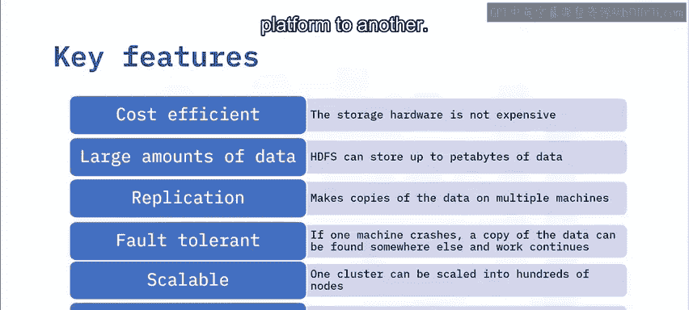

为了熟悉Hadoop，需要了解几个核心概念。当HDFS接收文件时，文件会被分解成更小的块。

### 数据块

**块**是可以读取或写入的最小数据量，它提供了容错能力。根据系统配置，默认块大小可以是64MB或128MB。

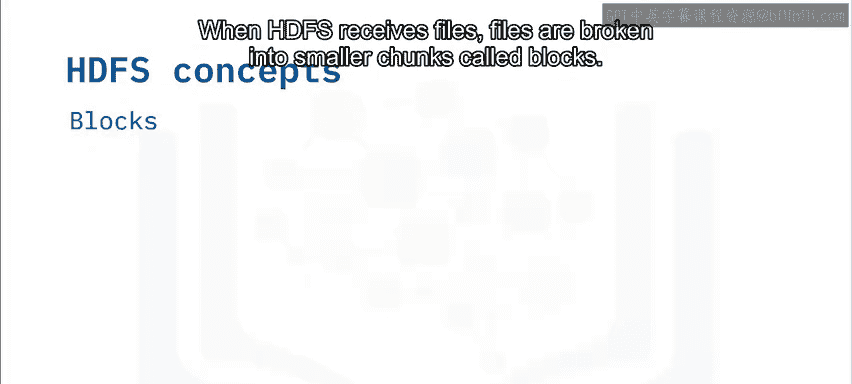

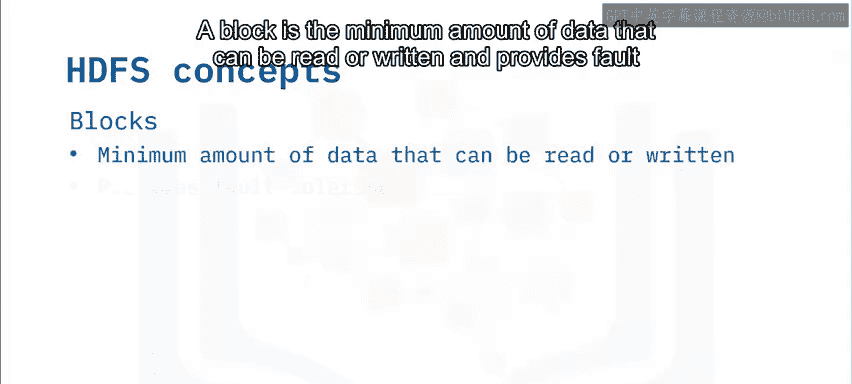

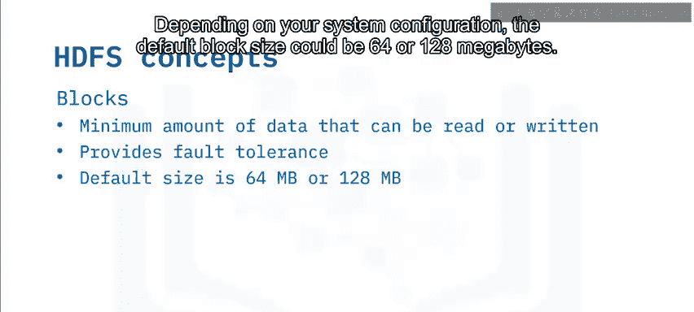

例如，如果我们有一个500MB的文件，默认块大小为128MB，那么该文件将被分成三个128MB的块和一个116MB的块。只有当文件大小是默认块大小的整数倍时，才会得到大小相等的分割。因此，每个存储的文件不一定占用预配置块大小的全部存储空间。

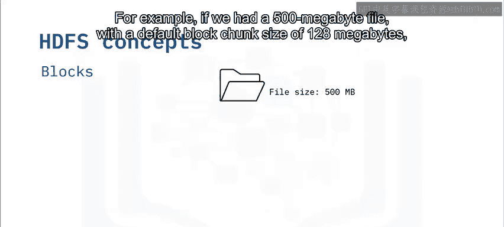

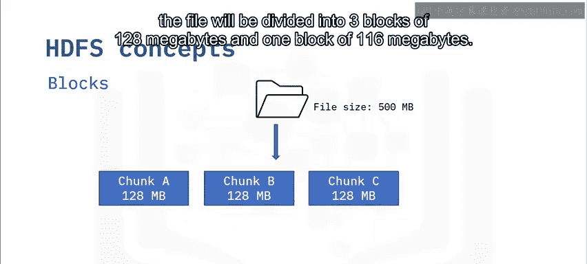

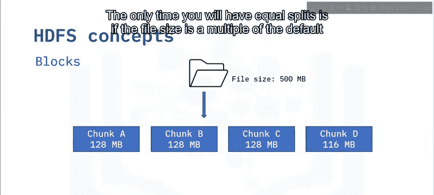

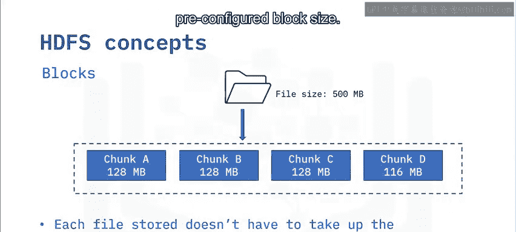

### 节点

让我们从节点开始。**节点**是负责存储和处理数据的单个系统，可以将其视为存储数据的一台机器或计算机。

HDFS遵循主从架构概念。HDFS有两种类型的节点：

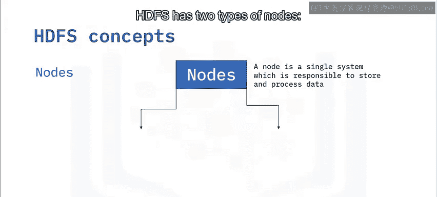

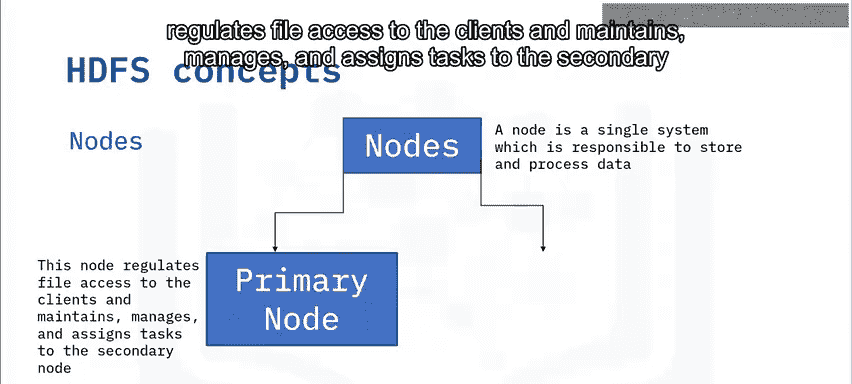

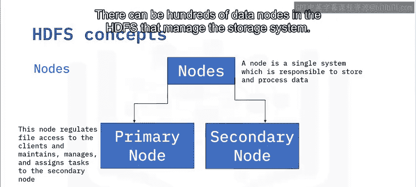

*   **主节点（NameNode）**：管理客户端对文件的访问，并维护、管理和向从节点分配任务。
*   **从节点（DataNode）**：在HDFS中可以有数百个数据节点来管理存储系统。它们根据名称节点的指令执行读写请求。

### 机架感知

在执行读写等操作时，名称节点通过选择离自己最近的数据节点来最大化性能，这很重要。这可以通过选择同一机架或附近机架上的数据节点来实现。这称为**机架感知**。

一个**机架**是大约40到50个使用相同网络交换机的数据节点的集合。机架感知用于减少网络流量并提高集群性能。为了实现机架感知，名称节点保存机架ID信息。

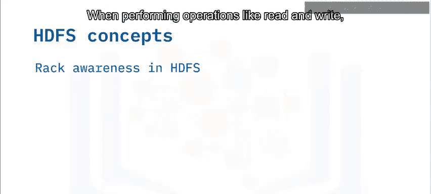

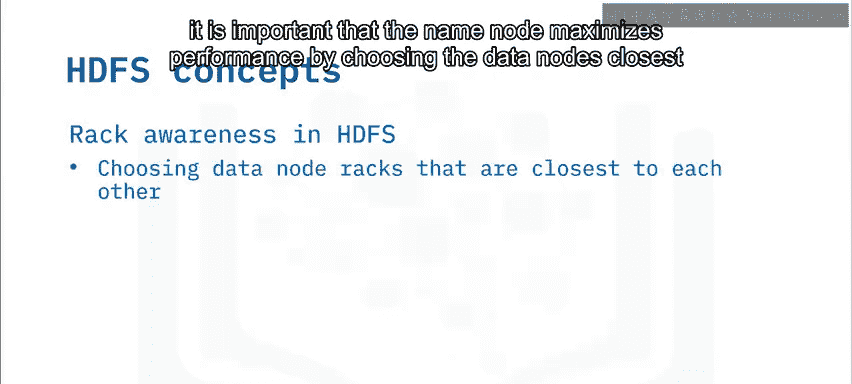

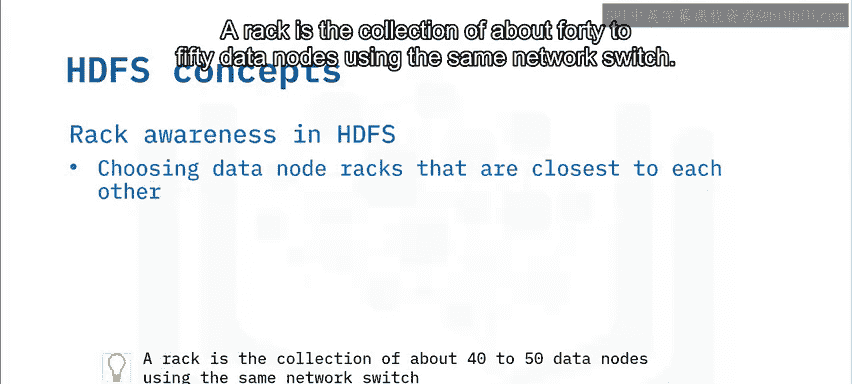

复制也通过机架感知完成。它通过确保数据节点的副本位于不同的机架上来实现。这样，如果一个机架宕机，你仍然可以从另一个机架获取数据。

### 数据复制

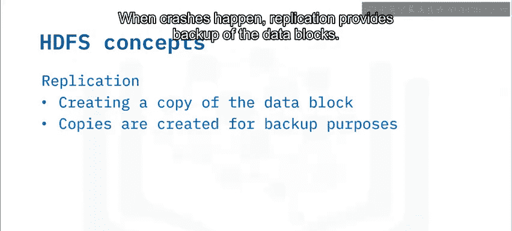

HDFS以优化复制而闻名。HDFS使用机架感知概念来创建副本，以确保数据可靠可用，并合理利用网络带宽。

**复制**是创建数据块的副本。当发生崩溃时，复制提供了数据块的备份。**复制因子**定义为复制数据块的次数。根据配置，可以设置所需的副本数量。

让我们看之前的500MB文件示例。如果我们的复制因子是2，它将为每个块创建两个副本。这意味着我们将有 `4个块 * 2 = 8` 个文件块副本用于备份。HDFS使用机架感知概念，将块保存在不同的机架中，以确保在另一个机架上有可用的副本。例如，你可以有四个机架，每个机架存放两个副本。如果其中一个机架宕机或崩溃，你仍然可以在不同的机架上有数据块的副本，并且仍然可以使用数据。

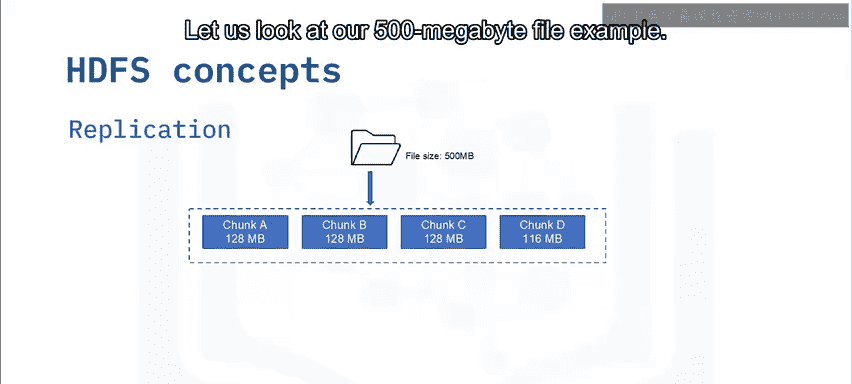

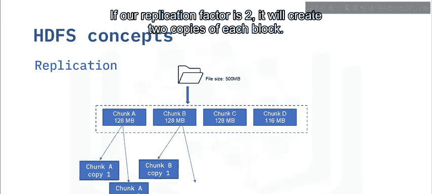

## HDFS读写操作

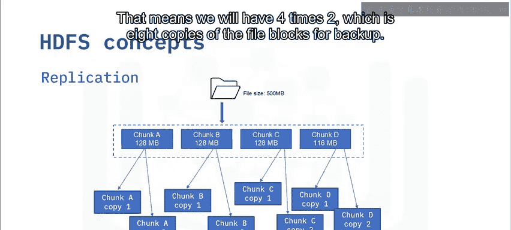

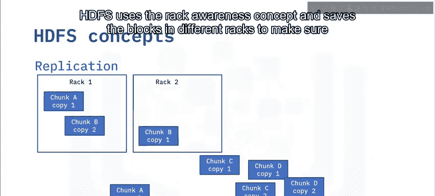

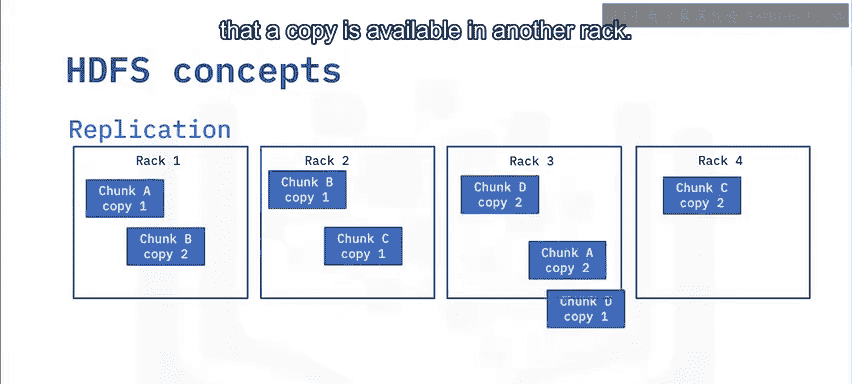

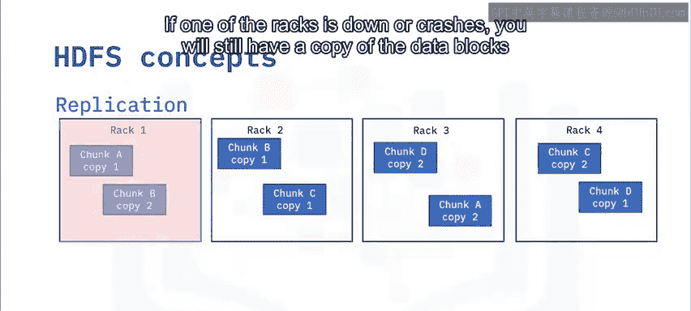

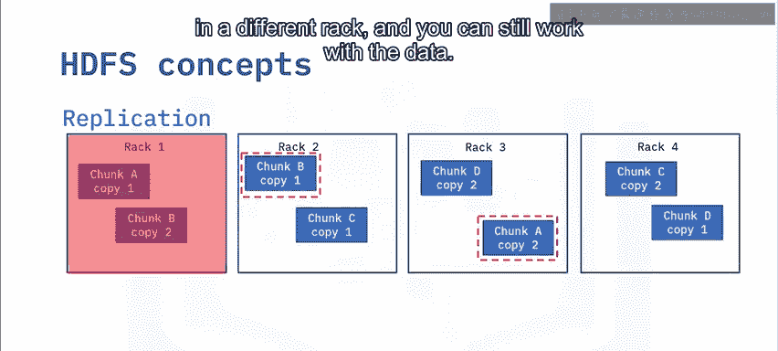

另一个重要概念是HDFS中读写操作的执行方式。HDFS允许“一次写入，多次读取”操作。这意味着你无法编辑已存储在HDFS中的文件，但可以向其追加新数据。

### 读操作流程

让我们从读操作的工作原理开始。假设我们有一个文本文件。

1.  客户端将向主节点（即名称节点）发送请求，以获取包含数据块的数据节点的位置。
2.  名称节点将验证客户端是否具有正确的权限，并向客户端提供位置信息。HDFS中的客户端与主节点和从节点交互，以满足用户的请求。
3.  然后，客户端将通过FSDataInputStream对象向最近的数据节点发送请求，通过调用`read`方法来读取所有文件。
4.  当客户端完成后，客户端将使用`close`方法结束会话。

### 写操作流程

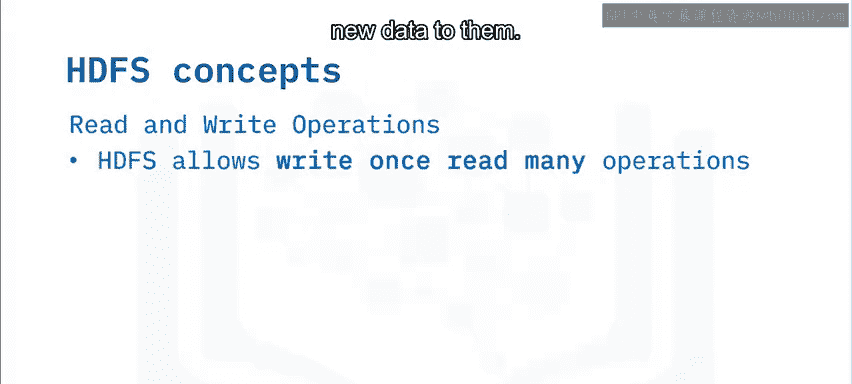

接下来，我们看看写操作的工作原理。

与读操作类似，名称节点确认客户端拥有正确的权限。名称节点确保检查系统中不存在该文件。如果文件已存在，客户端将收到一个IO异常。如果文件不存在，客户端将获得写入权限以及数据节点信息。一旦客户端完成，数据节点开始创建副本并向客户端发送确认。

## HDFS架构

Hadoop遵循主从节点架构概念。主节点是名称节点。该架构的特点是每个集群有一个名称节点和多个数据节点（即从节点）。

在内部，一个文件被分割成一个或多个块，这些块存储在一组数据节点中。名称节点负责监督文件的打开、关闭、重命名等操作，并将文件块映射到数据节点。数据节点负责处理客户端的读写请求，并根据名称节点的指令执行文件块的创建、复制和删除。

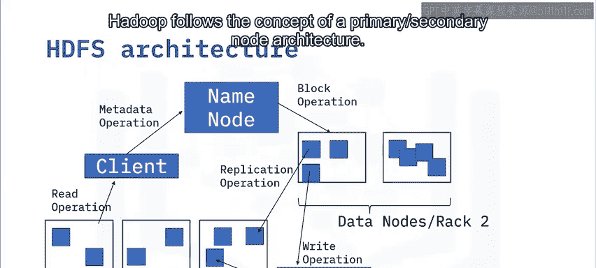

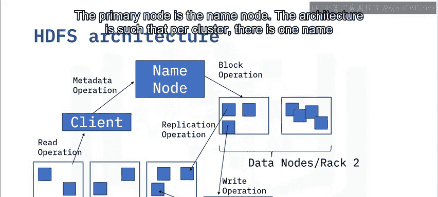

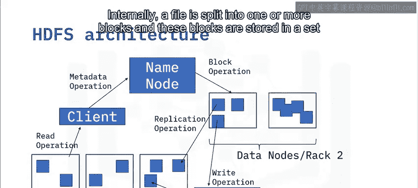

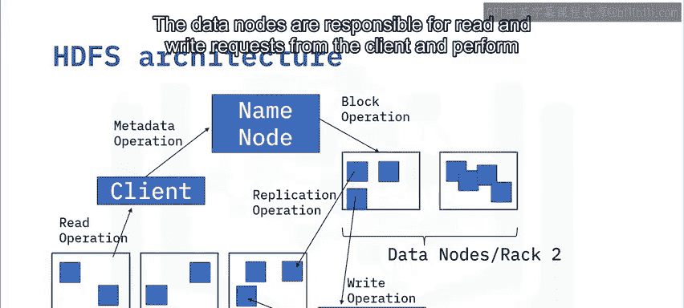

---

## 总结

本节课中我们一起学习了Hadoop分布式文件系统（HDFS）。我们了解到HDFS的关键优势包括其成本效益、可扩展性、数据存储扩展能力和数据复制能力。**块**是文件的最小单位。**复制**创建数据块的副本用于备份目的。**机架感知**有助于减少网络流量并提高集群性能。HDFS支持“一次写入，多次读取”操作。