# 013：Hive入门 🐝

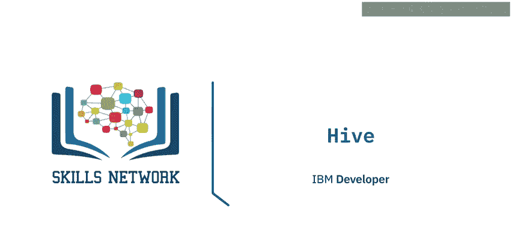

在本节课中，我们将要学习Hive。Hive是Hadoop生态系统中的一个重要数据仓库工具，它使得使用类似SQL的语言处理大规模数据成为可能。我们将了解Hive的用途、核心特性、与传统数据库的区别以及其架构组成。

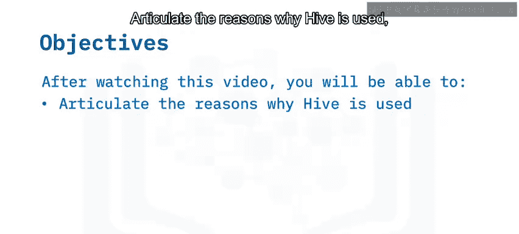

## 什么是Hive？📊

Hive是Hadoop内部的一个数据仓库软件，设计用于读取、写入和管理大规模的表格式数据，并进行数据分析。

数据仓库存储来自许多不同来源的历史数据，以便您可以对其进行分析并提取洞察。这些洞察通常用于生成报告。

Hive具有可扩展性和快速处理能力，因为它专为处理PB级别的数据而设计。如果您熟悉SQL，那么Hive将非常易于使用，因为Hive查询语言（HiveQL）基于SQL。这使得学习曲线更平缓，因为已经熟悉关系型数据库的用户可以轻松掌握其概念。

Hive支持多种文件格式，包括：
*   **SequenceFile**：由二进制键值对组成的文件。
*   **RCFile**：行列式文件，将表中的列存储在列式数据库中。
*   **文本文件或平面文件**：常见的纯文本格式。

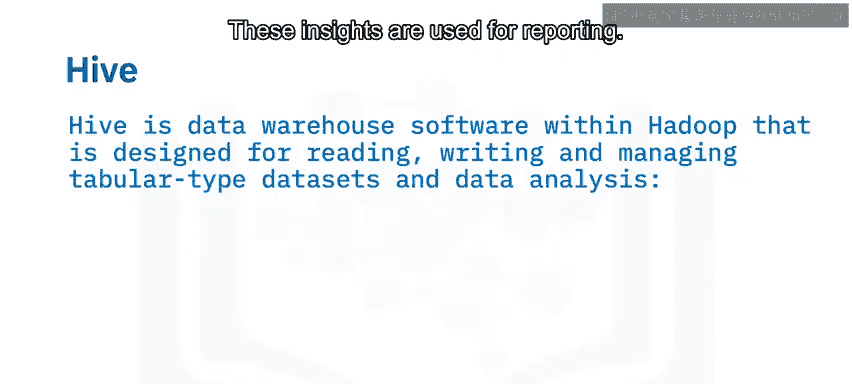

此外，Hive允许根据用户需求执行数据清洗和过滤任务。

## Hive与传统RDBMS的区别 ⚖️

上一节我们介绍了Hive的基本概念，本节中我们来看看它与传统关系型数据库管理系统（RDBMS）有何不同。

RDBMS是一种专门为关系型数据库设计的数据库管理系统。关系型数据库以结构化的格式（即由行和列组成的表）存储数据。

以下是传统RDBMS与Hive之间的主要区别：

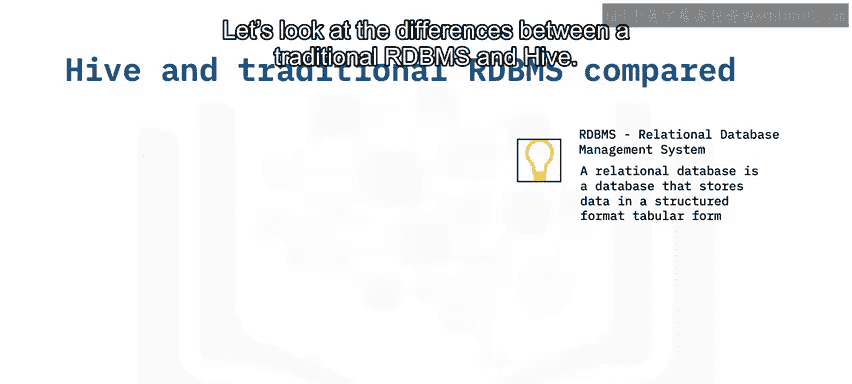

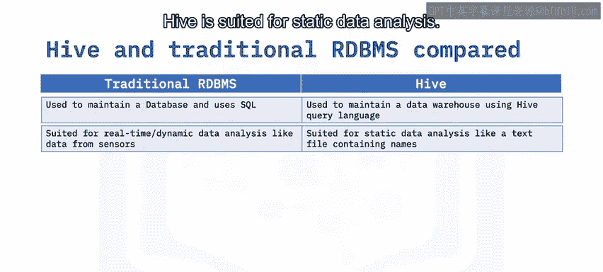

*   **用途与查询语言**：
    *   传统RDBMS用于维护数据库，并使用结构化查询语言（SQL）。
    *   Hive用于维护数据仓库，并使用受SQL启发的Hive查询语言（HiveQL）。

*   **数据分析类型**：
    *   传统RDBMS适合实时数据分析，例如处理来自传感器的数据。
    *   Hive适合静态数据分析。

*   **读写操作**：
    *   传统RDBMS允许用户执行所需的任意多次读写操作。
    *   Hive基于“一次写入，多次读取”的方法论。

*   **数据规模**：
    *   传统RDBMS可以处理高达TB级别的数据。
    *   Hive设计用于处理PB级别的数据。

*   **数据模式**：
    *   传统RDBMS强制要求在加载数据之前必须验证模式（Schema）。
    *   Hive在加载数据时不强制验证模式。

*   **数据分区**：
    *   传统RDBMS可能并不总是内置对数据分区的支持。
    *   Hive支持分区。**分区**意味着根据特定列（如日期或城市）的值将表划分为多个部分。

## Hive架构 🏗️

了解了Hive与传统数据库的区别后，现在我们来深入探讨Hive的架构。Hive架构主要包含三个部分：Hive客户端、Hive服务以及Hive存储与计算。

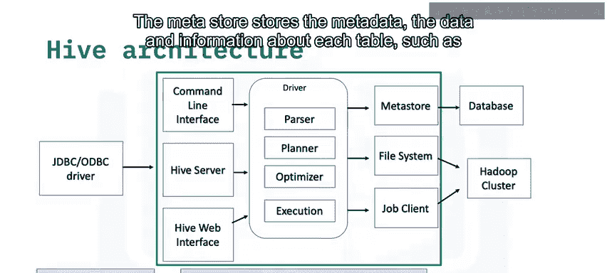

以下是Hive架构的组成部分：

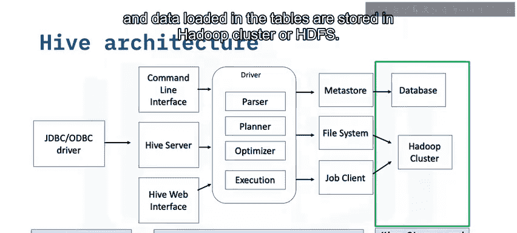

*   **Hive客户端**：Hive根据应用程序类型提供不同的驱动程序进行通信。例如，对于基于Java的应用程序，Hive使用JDBC驱动程序；其他类型的应用程序则使用ODBC驱动程序。这些驱动程序与服务器通信。

*   **Hive服务**：客户端交互通过Hive服务完成，所有查询操作都在这里进行。
    *   **命令行界面**：作为Hive服务的接口。
    *   **驱动程序**：接收通过命令行提交的查询语句，监控每个会话的进度和生命周期，并存储查询语句生成的元数据。
    *   **元存储**：存储元数据，即关于每个表的数据和信息，例如位置和模式。

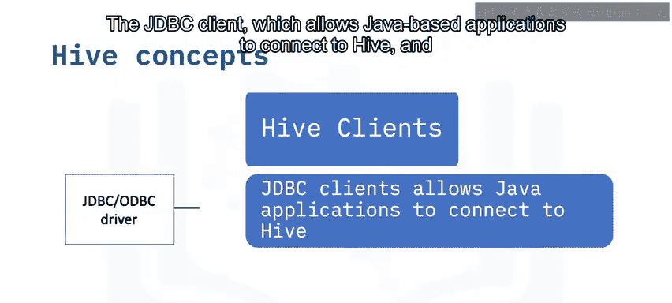

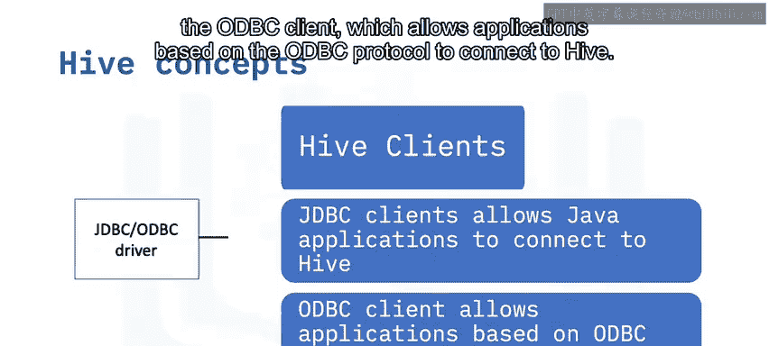

*   **Hive存储与计算**：元存储、文件系统和作业客户端进而与Hive存储和计算进行通信，以执行操作。表的元数据信息存储在某种数据库中，而查询结果以及加载到表中的数据则存储在Hadoop集群或HDFS中。

## Hive核心概念详解 🔍

让我们更详细地了解架构中的各个概念。

**Hive客户端**中的组件包括：
*   **JDBC客户端**：允许基于Java的应用程序连接到Hive。
*   **ODBC客户端**：允许基于ODBC协议的应用程序连接到Hive。

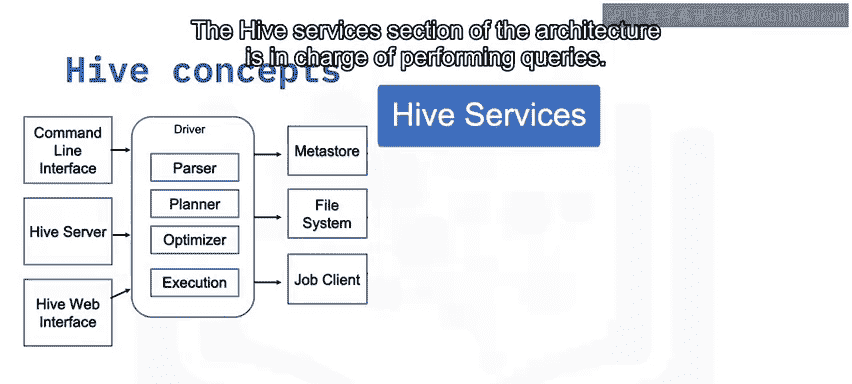

**Hive服务**部分负责执行查询：
*   **Hive服务器**：用于运行查询，并允许多个客户端提交请求。它构建为支持JDBC和ODBC客户端。
*   **编译器**：驱动程序在启动会话后，将接收到的查询语句发送给编译器。
*   **优化器**：对执行计划执行转换，并拆分任务以帮助提高速度和效率。
*   **执行器**：在优化器拆分任务后，执行器执行这些任务。

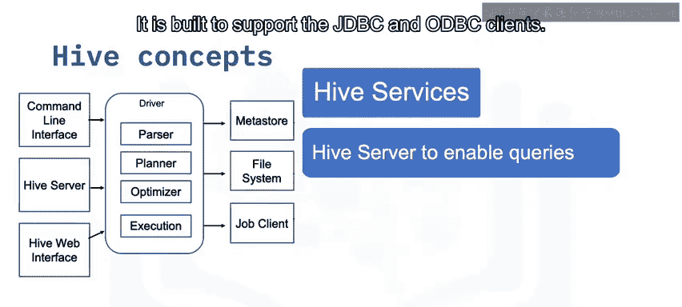

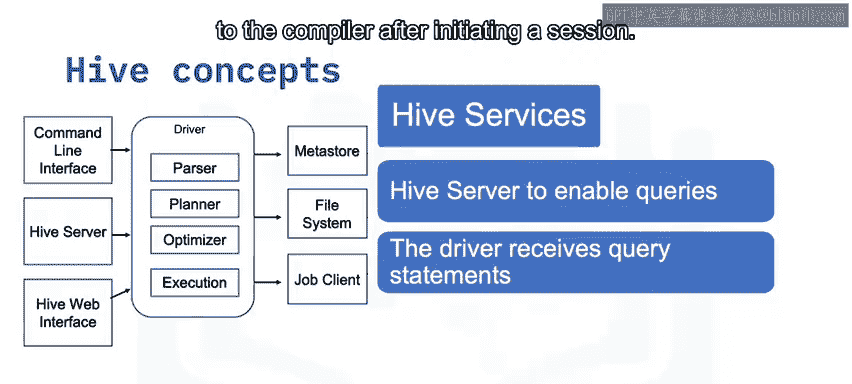

**元存储**是元数据的存储库，元数据是关于表的信息。元存储负责将这些信息集中保存在一个地方。

## 总结 📝

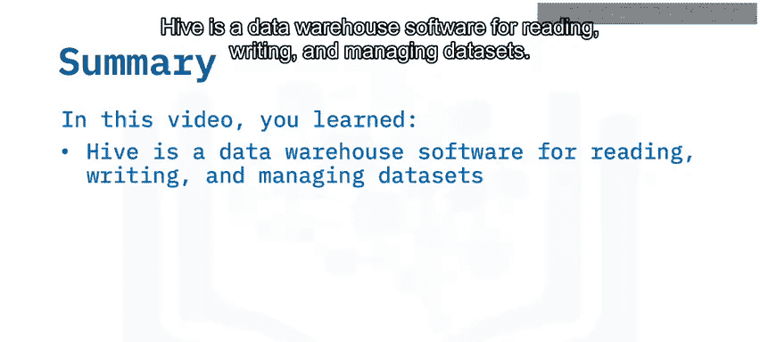

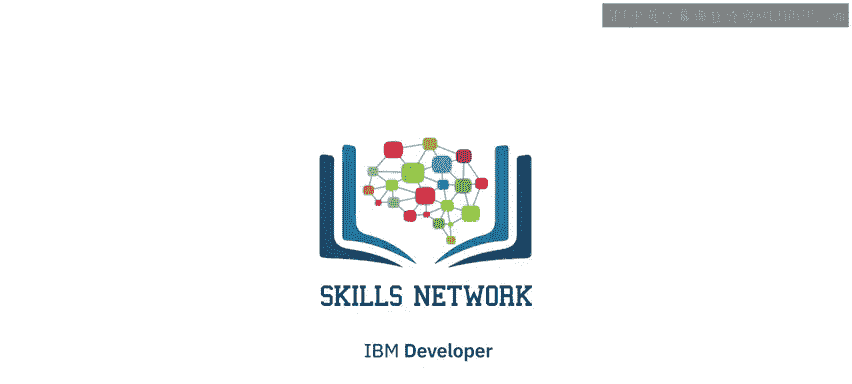

本节课中，我们一起学习了Hive。你了解到Hive是一个用于读取、写入和管理数据集的数仓软件。尽管Hive的工作方式与传统RDBMS非常相似，但它们略有不同。Hive架构的三个主要部分是Hive客户端、Hive服务以及Hive存储与计算。掌握这些基础知识，是使用Hive处理大数据的重要第一步。