# 014：HBase入门 🗄️

在本节课中，我们将要学习HBase。HBase是一个运行在Hadoop分布式文件系统（HDFS）之上的列式非关系型数据库管理系统。我们将了解它的定义、核心特性、与HDFS的区别以及其基本架构。

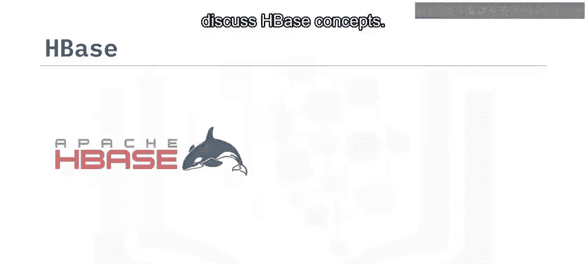

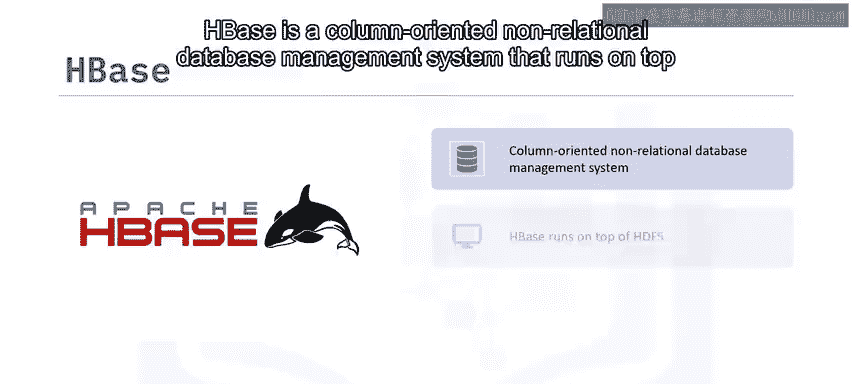

## 概述

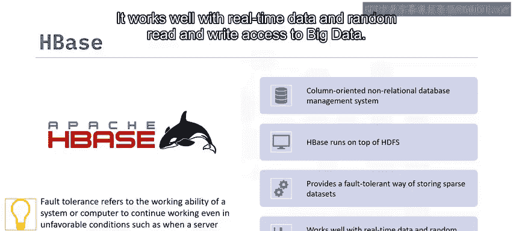

HBase是一个**列式非关系型数据库管理系统**，它运行在Hadoop分布式文件系统（HDFS）之上。它提供了一种容错的方式来存储稀疏数据集，并能很好地处理实时数据和对大数据进行随机读写访问。

## HBase的定义与特性

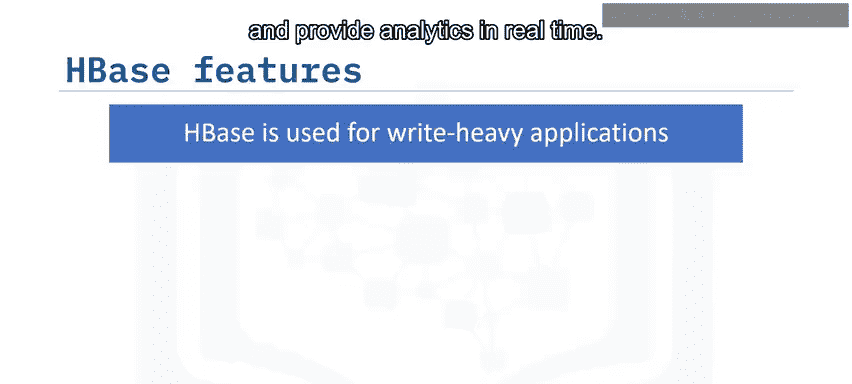

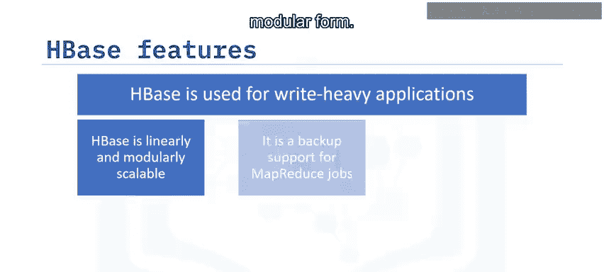

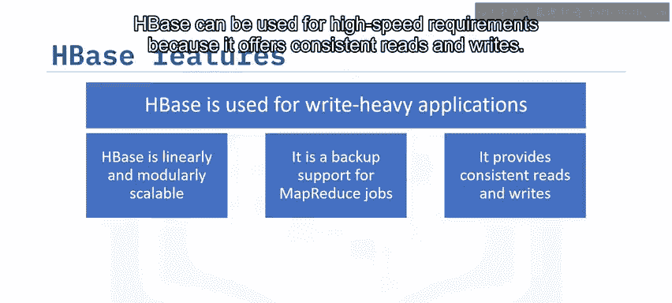

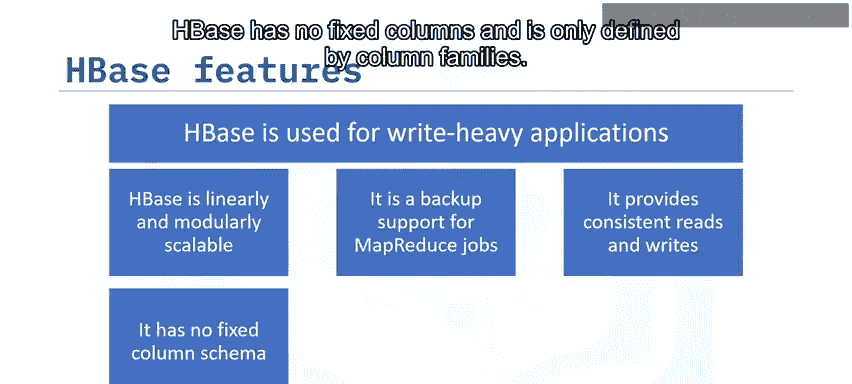

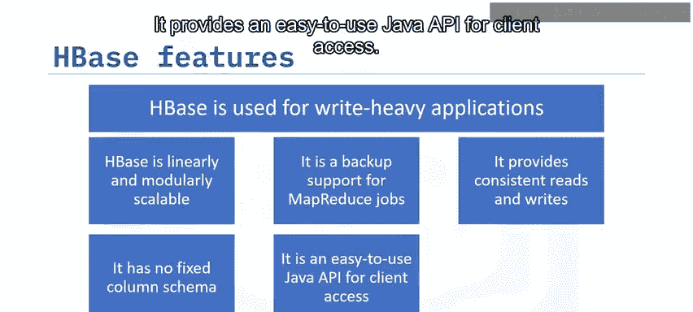

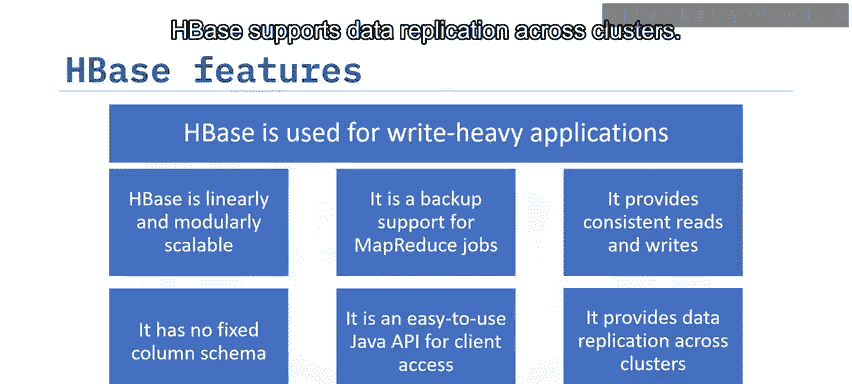

HBase是一个列式、非关系型的数据库管理系统。其核心特性包括：

*   **容错性**：指系统或计算机在不利条件下（如服务器崩溃）仍能继续工作的能力。
*   **实时数据处理**：擅长处理实时数据和提供对大数据的随机读写访问。
*   **写密集型应用**：用于存储海量数据、实时处理和分析。
*   **线性可扩展**：支持线性和模块化两种形式的扩展。
*   **MapReduce作业支持**：可作为MapReduce作业的备份支持。
*   **高性能**：提供一致的读写操作，满足高速需求。
*   **灵活的模式**：没有固定的列，只通过**列族**来定义，模式灵活可变。
*   **易用的Java API**：提供了易于使用的Java API供客户端访问。
*   **跨集群数据复制**：支持跨集群的数据复制。

## HBase核心概念：列与列族

在HBase中，**列**代表一个对象的属性。例如，如果表存储医院心脏监护仪的传感器数据，每一行可能是一条日志记录，一个典型的列可能包含患者详情或记录时间等信息。

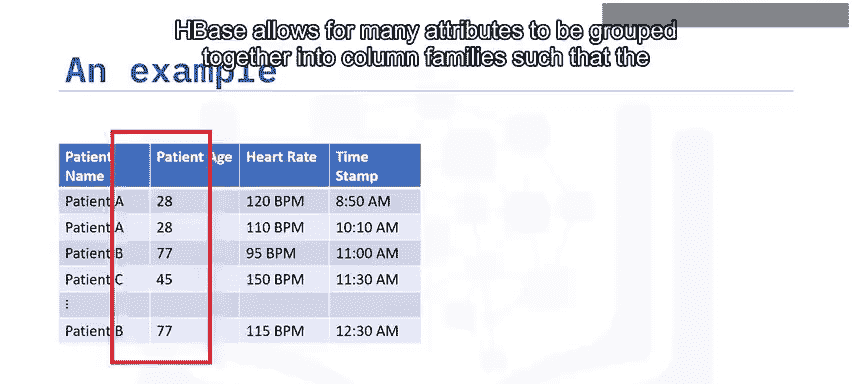

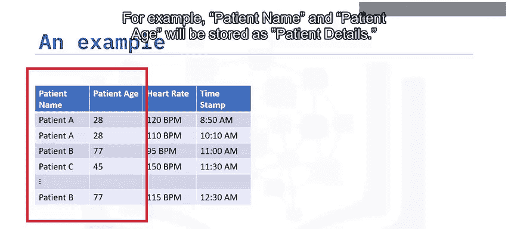

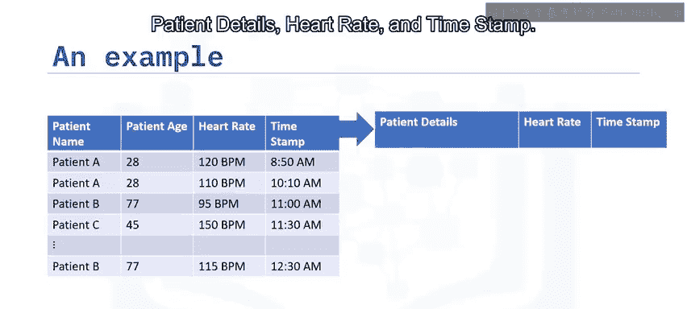

HBase允许将多个属性分组到**列族**中，使得列族中的所有元素都存储在一起。例如，患者姓名和患者年龄可以存储在名为`patient_details`的列族中。因此，HBase中的列看起来会像`patient_details:name`、`patient_details:age`、`heart_rate`和`timestamp`。

在HBase中创建模式时，必须预定义表模式并指定列族。但可以随时向列族中添加新列，这使得模式能够灵活适应不断变化的应用程序需求。

## HBase与HDFS的区别

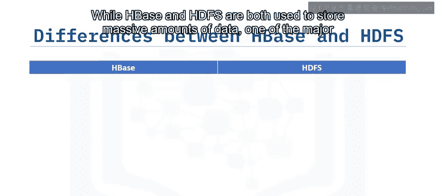

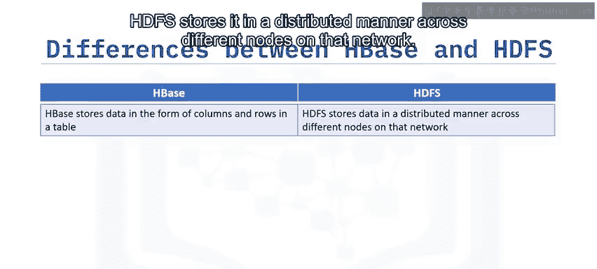

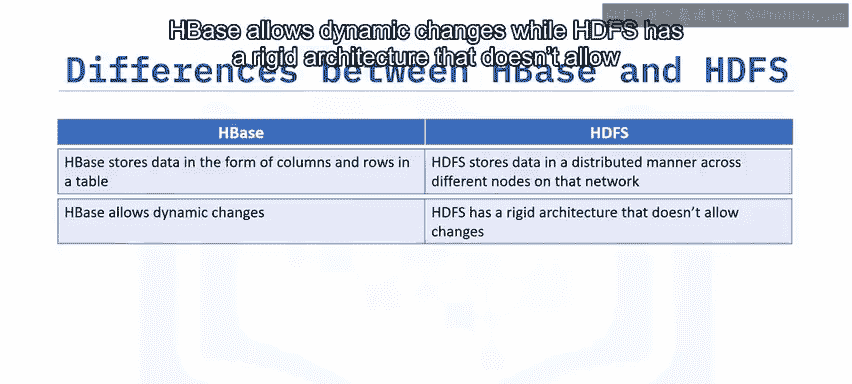

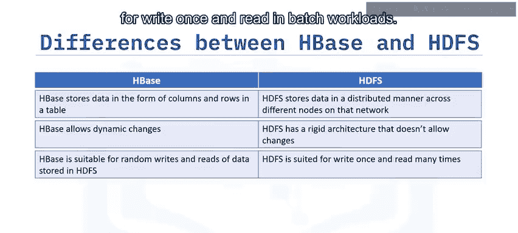

上一节我们介绍了HBase的核心概念，本节中我们来看看HBase与HDFS的主要区别。虽然两者都用于存储海量数据，但存在关键差异：

*   **数据组织方式**：
    *   HBase以表格的行列形式存储数据。
    *   HDFS以分布式方式将数据存储在网络的不同节点上。
*   **架构灵活性**：
    *   HBase允许动态变更。
    *   HDFS架构相对固定，不允许轻易变更。
*   **适用场景**：
    *   HBase适用于记录级别的读、写、更新和删除工作负载。
    *   HDFS更底层，类似于文件系统属性，更适合“一次写入，批量读取”的工作负载。
*   **功能**：
    *   HBase支持大数据的存储**和**处理。
    *   HDFS主要用于存储。

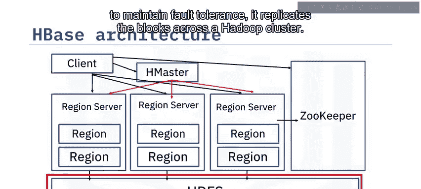

## HBase架构

HBase架构主要包含四个核心组件，它们协同工作，使HBase能够高效运行在HDFS之上。

以下是HBase架构的主要组成部分：

1.  **HMaster**：主服务器。它监控Region Server实例，将区域分配给Region Server，向不同的Region Server分发服务，并管理对模式和元数据操作所做的任何更改。
2.  **Region Server**：区域服务器。它们接收来自客户端的读写请求，并将请求分配给特定列族所在的区域。它们负责服务和管理分布式集群中的区域，无需始终通过HMaster。Region Server可以直接与客户端通信以处理请求。
3.  **Region**：区域。它是HBase集群的基本构建元素和最小单元，由列族组成。一个区域包含多个存储区（每个列族一个），并有两个组件：**HFile**（存储实际数据）和**MemStore**（内存存储区）。
4.  **ZooKeeper**：一个集中式服务，用于维护配置信息、在节点间保持健康的连接、为分布式应用程序提供同步，并通过触发错误消息来跟踪服务器故障和网络分区，然后开始修复故障节点。

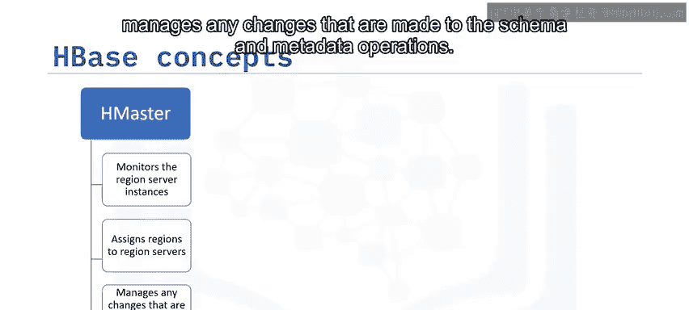

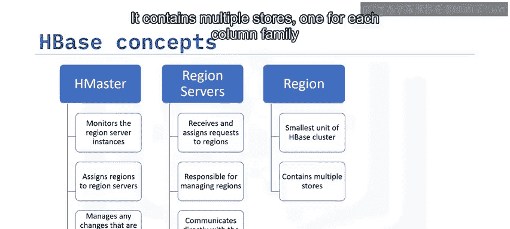

HDFS为存储提供了分布式环境，它将每个文件存储在多个块中，并通过在Hadoop集群中复制块来保持容错性。

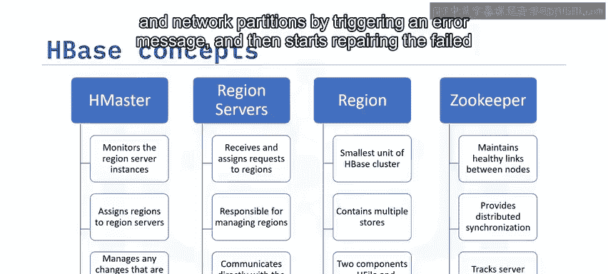

## 总结

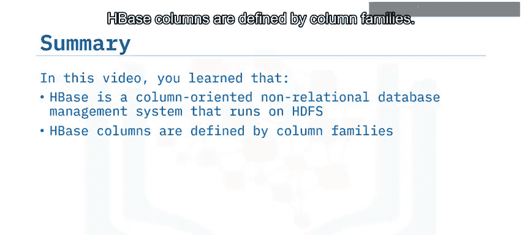

本节课中我们一起学习了HBase。我们了解到HBase是一个运行在HDFS之上的列式非关系型数据库管理系统。HBase的列由列族定义，它具有线性可扩展、高效的特点，并提供了易于使用的Java API供客户端访问。HBase与HDFS的一个关键区别在于，相较于HDFS的固定架构，HBase允许动态变更。HBase的架构主要由HMaster、Region Server、Region、ZooKeeper和底层的HDFS组成。