# 015：为什么使用Apache Spark 🚀

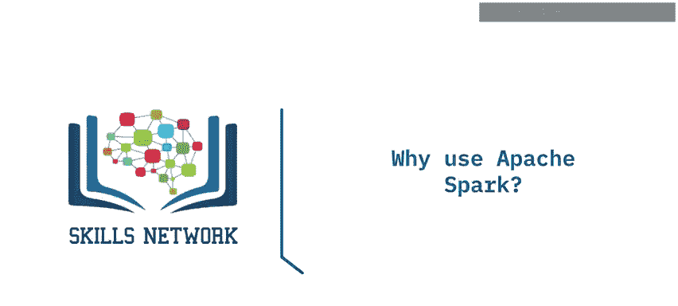

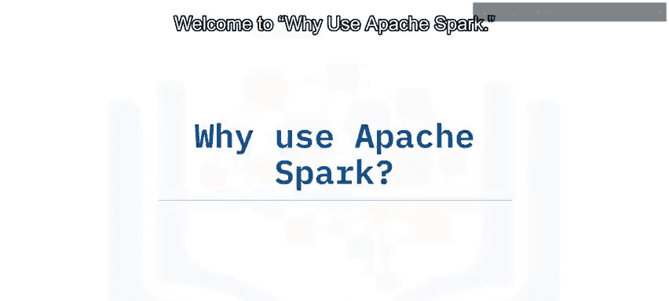

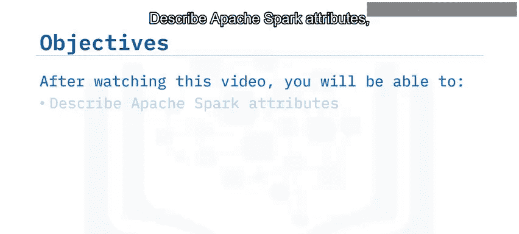

在本节课中，我们将学习Apache Spark的核心概念、分布式计算的基础知识，以及Spark相较于传统大数据工具（如MapReduce）的优势。课程目标是帮助你理解Spark的关键特性及其在大数据处理中的重要性。

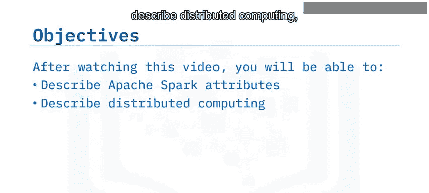

## 什么是Apache Spark？💡

Apache Spark是一个开源的**内存**应用框架，用于对海量数据进行分布式数据处理和迭代分析。

让我们来解析这个定义中的关键词：
*   **开源**：Spark完全开源，由Apache基金会管理，因此得名Apache Spark。
*   **内存**：这意味着所有操作主要在内存（RAM）中进行，数据处理速度极快。
*   **分布式数据处理**：Spark利用多台计算机协同工作来处理数据。
*   **海量数据集**：Spark能够很好地扩展以处理大规模数据。

Spark主要使用Scala语言编写，这是一种支持面向对象和函数式编程的通用编程语言。Spark运行在Java虚拟机（JVM）上。

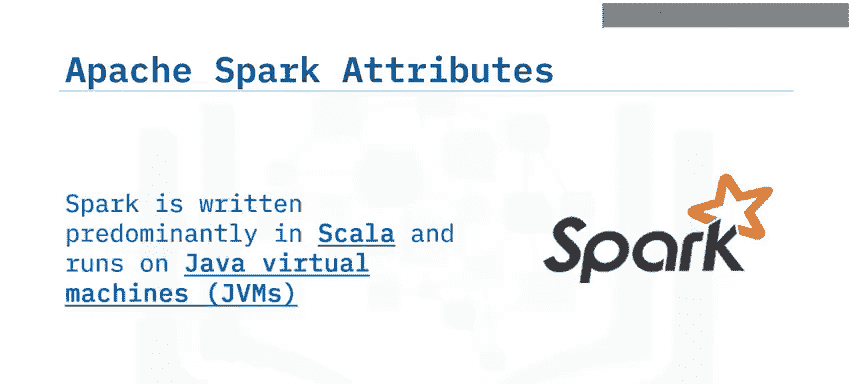

## 分布式计算简介 🔗

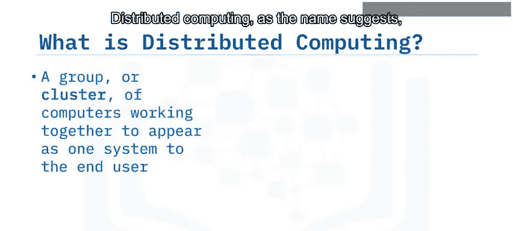

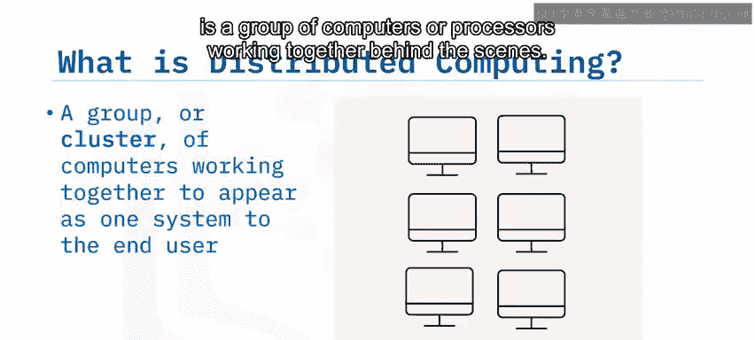

上一节我们介绍了Spark是一个分布式处理框架，本节中我们来看看什么是分布式计算。

分布式计算，顾名思义，是指一组计算机或处理器在幕后协同工作。

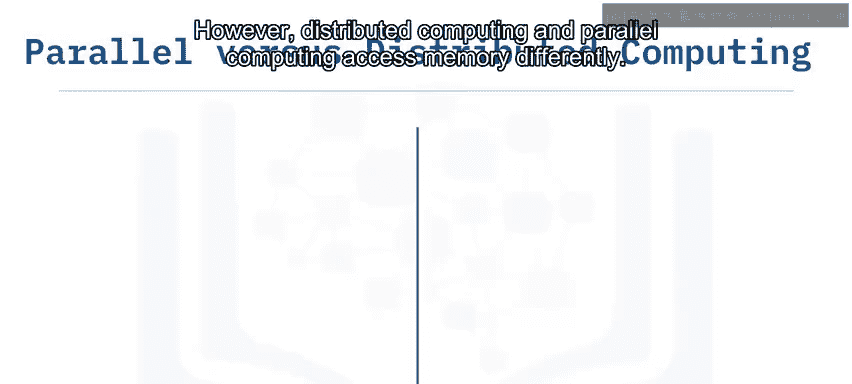

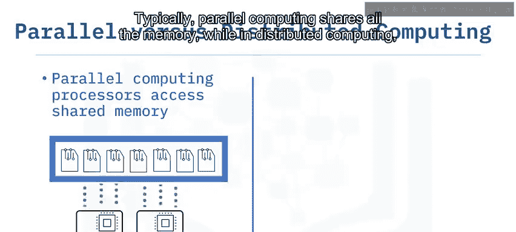

人们经常将分布式计算和并行计算这两个术语互换使用，因为这两种计算类型有许多相似之处。然而，它们在内存访问方式上有所不同：通常，并行计算共享所有内存，而在分布式计算中，每个处理器访问自己的内存。

## 分布式计算的优势 📈

以下是分布式计算的两个主要优势：

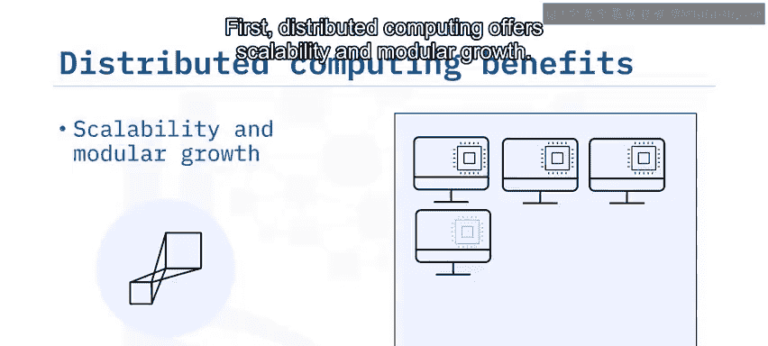

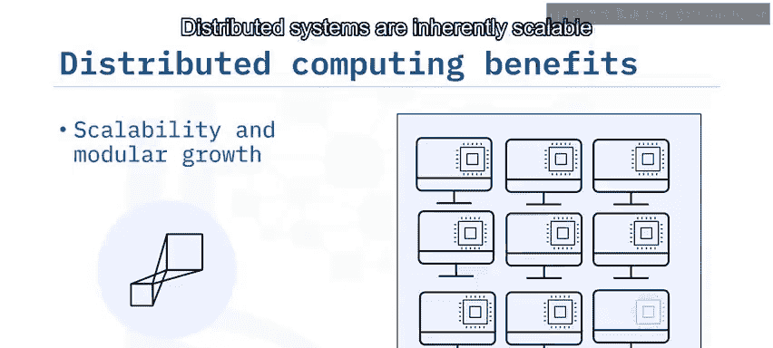

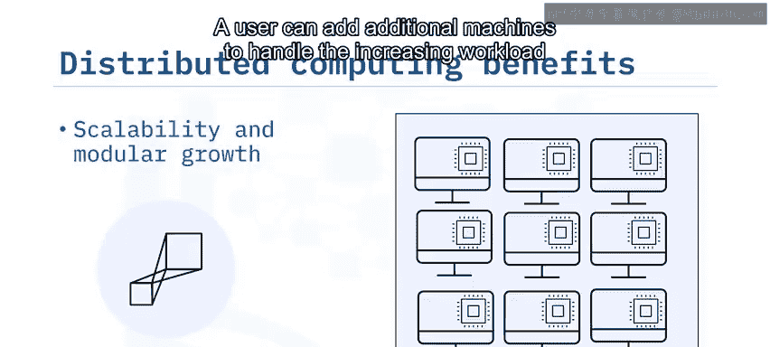

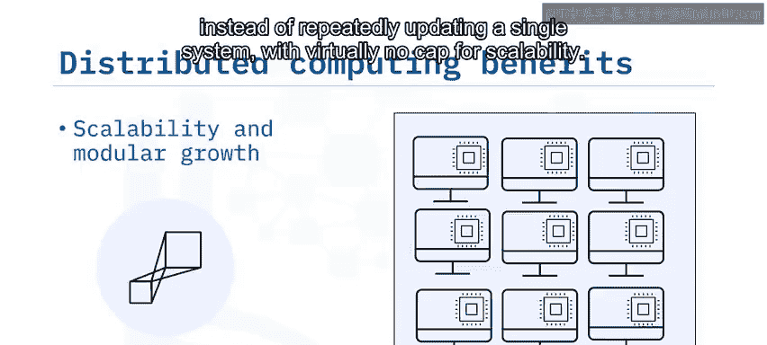

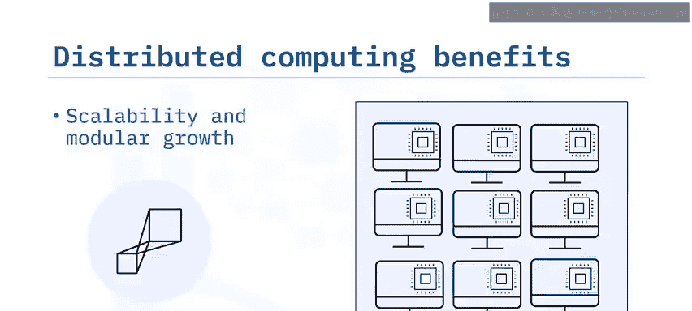

**1. 可扩展性与模块化增长**
分布式系统本质上是可扩展的，因为它们跨多台机器工作，并可以水平扩展。用户可以通过添加额外的机器来处理不断增加的工作负载，而不是反复升级单个系统，其可扩展性几乎没有上限。

**2. 容错性与冗余**
分布式系统需要容错性和冗余，因为它们使用的独立节点可能会发生故障。分布式计算不仅提供容错性，还提供冗余以确保业务连续性。例如，一个运行着8台机器集群的业务，即使单台或多台机器离线，也能继续运行。

## Apache Spark的优势 ⚡

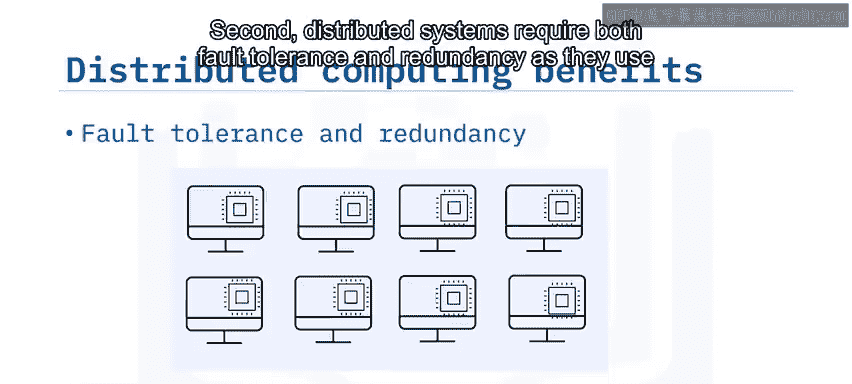

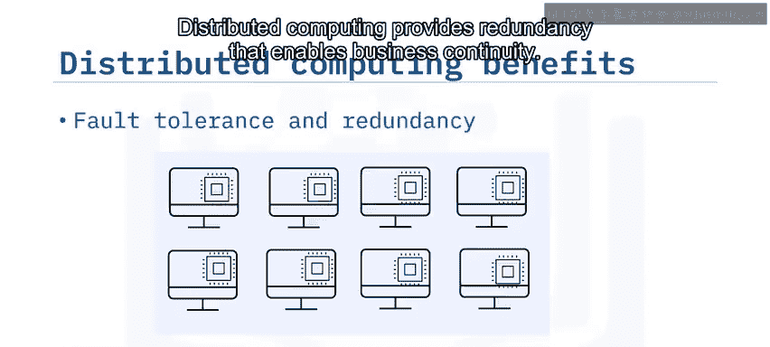

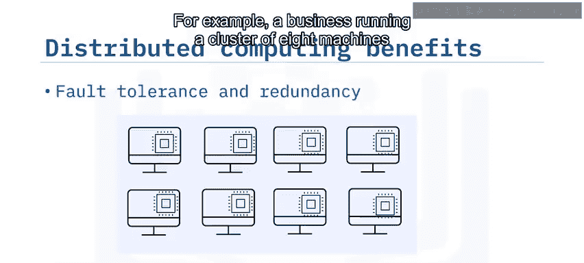

Spark完全具备了分布式计算的所有优势。它支持大规模数据处理和分析的计算框架，并在商用硬件上提供并行分布式数据处理能力、可扩展性和容错性。

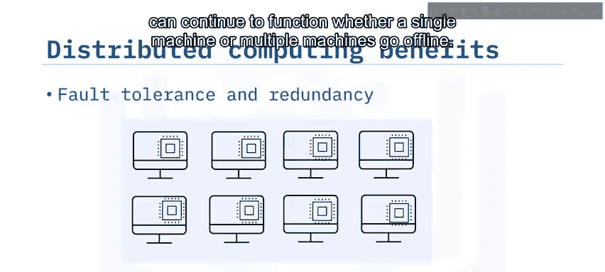

此外，Spark还提供了内存处理，并创建了一个全面的统一框架来管理大数据处理。Spark通过易于使用的Python、Scala和Java API，实现了编程的灵活性。

## Spark vs. MapReduce 🔄

那么，Apache Spark与更传统的大数据工具（如MapReduce）相比如何？

传统的MapReduce作业会创建需要读写磁盘或HDFS的迭代。这些读写操作通常非常耗时且成本高昂。

Apache Spark通过将大量所需数据保存在内存中，并避免昂贵的磁盘I/O操作，解决了MapReduce遇到的读写问题，从而将整体处理时间减少了数个数量级。

## Spark的应用场景 🛠️

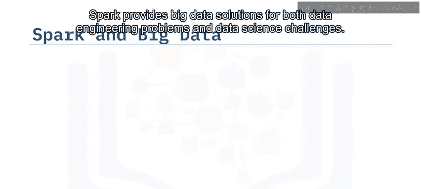

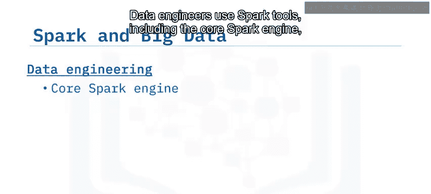

Spark为数据工程问题和数据科学挑战都提供了大数据解决方案。

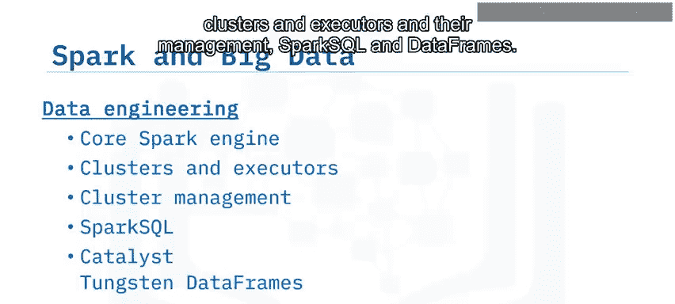

*   **数据工程**：数据工程师使用Spark工具，包括核心Spark引擎、集群和执行器及其管理、SparkSQL和数据帧。
*   **数据科学与机器学习**：Spark还通过Spark MLlib和流处理等库支持数据科学和机器学习。

## 总结 📝

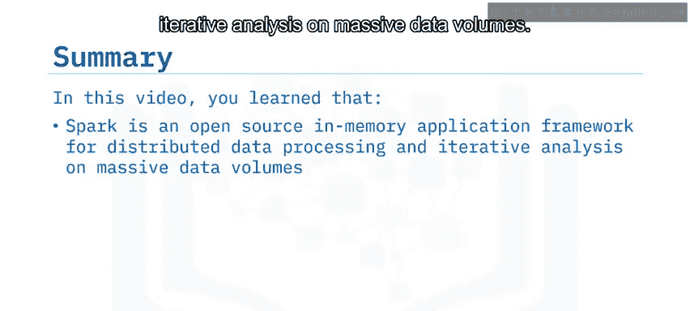

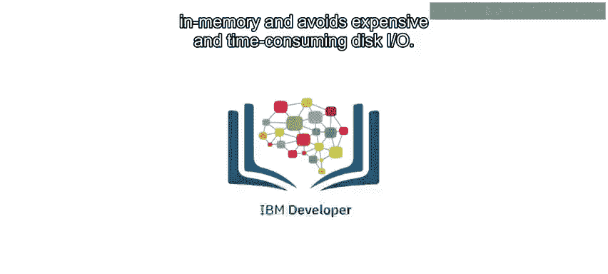

本节课中我们一起学习了：
*   **Apache Spark** 是一个用于海量数据分布式处理和迭代分析的开源内存应用框架。
*   **分布式计算** 是一组在幕后协同工作的计算机或处理器。
*   分布式系统和Apache Spark都具有**固有的可扩展性和容错性**。
*   Apache Spark将大部分所需数据保存在**内存**中，避免了昂贵且耗时的磁盘I/O操作。