# 016：函数式编程基础 🧮

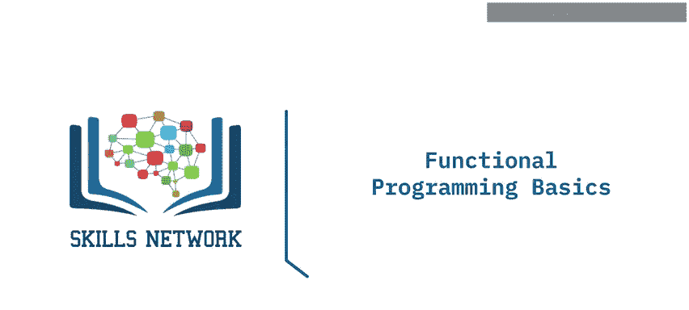

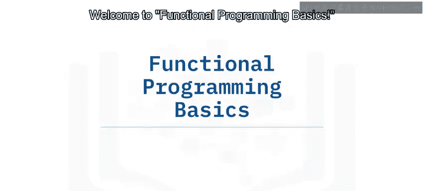

在本节课中，我们将要学习函数式编程的基础概念，包括其定义、核心思想、与Spark的关系以及Lambda函数的作用。

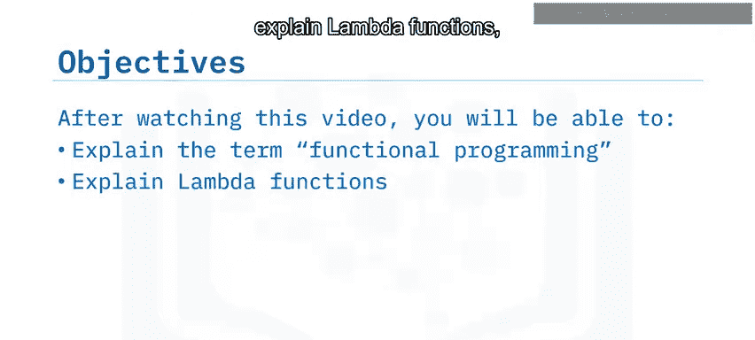

## 什么是函数式编程？ 🤔

上一节我们介绍了课程概述，本节中我们来看看函数式编程的具体定义。

函数式编程是一种遵循数学函数形式的编程范式。回想代数课中的 `f(x)` 表示法。这种表示法本质上是**声明式**的，而非**命令式**的。

所谓声明式，是指代码或程序的重点在于解决方案的**“做什么”**，而不是解决方案的**“如何做”**。声明式语法抽象了实现细节，只强调最终输出，即“做什么”。在函数式编程中，我们使用表达式，如前文提到的 `f(x)` 表达式。

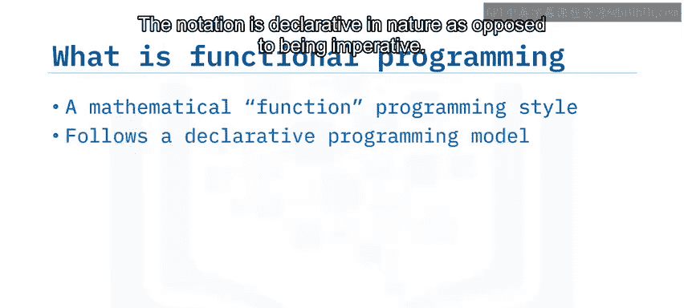

## 函数式编程的历史与语言 🕰️

了解了基本概念后，我们来看看函数式编程的发展历程。

历史上，LISP（列表处理语言）是第一个函数式编程语言，始于20世纪50年代。但如今已有许多函数式编程语言可供选择，包括 **Scala**、**Python**、**R** 和 **Java**。Scala 是这个编程语言家族中最新的代表。

Apache Spark 主要用 Scala 编写，它将函数视为**一等公民**。这意味着在 Scala 中，函数可以作为参数传递给其他函数，可以被其他函数返回，也可以像变量一样使用。

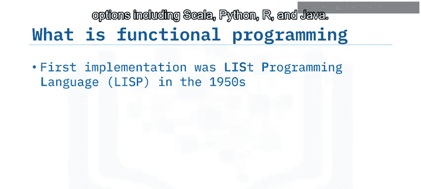

以下是一个简单的函数式程序示例，它将数字加一：

我们定义函数 `f(x) = x + 1`。

## 函数式编程的优势：声明式与并行化 ⚡

我们已经看到了一个简单示例，现在来探讨函数式编程的核心优势。

我们可以将此函数应用于一个大小为4的列表，如图所示。程序会将列表中的每个元素加一。这就是使用函数式编程的优势：你可以直接将函数应用于整个列表或数组。

如果你使用命令式范式的过程代码执行相同的任务，你将构建一个 `for` 循环来遍历数组，并将每个元素加一。这种编程范式与前面的示例不同，它明确列出了要执行的所有步骤，包括“遍历每个元素”、“将每个元素加一”。这段代码强调的是“如何做”。

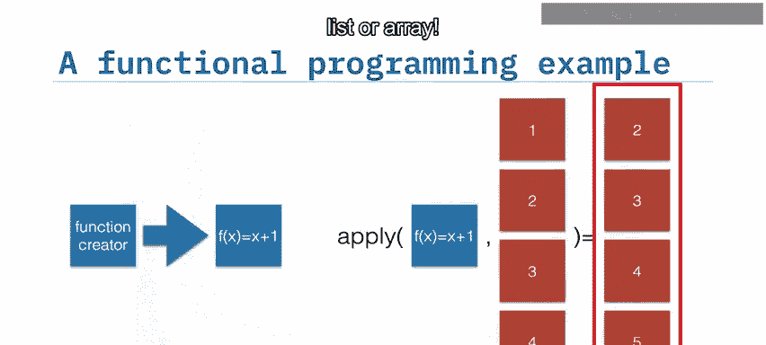

请对比这个传统的编程示例与强调解决方案“做什么”部分的函数式编程示例。

**并行化**是函数式编程的主要好处之一。考虑之前的例子，程序将数组元素加一。以下是一个从1到9的更大数组。

你可以将任务拆分为三个不同的计算块，这些块可以称为节点。然后并行运行这三个任务或节点。这种方法的美妙之处在于，你不需要更改任何函数定义或代码。你需要做的只是并行运行多个任务实例。

通过应用隐式并行化的函数式编程能力，你可以通过添加更多计算和资源来将算法扩展到任何规模，而无需修改程序或代码。结果与函数仅在单个节点上运行相同。然而，在这种情况下，函数并行运行了三次，且无需对函数或代码进行任何更改。

## Lambda函数与Spark 🚀

函数式编程应用了一个称为 **Lambda演算** 的数学概念。为了简化解释，Lambda演算基本上指出，每个计算都可以表示为一个应用于数据集的**匿名函数**。

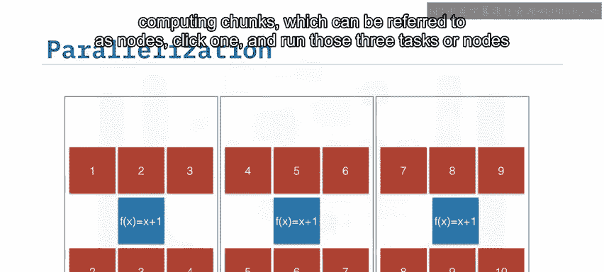

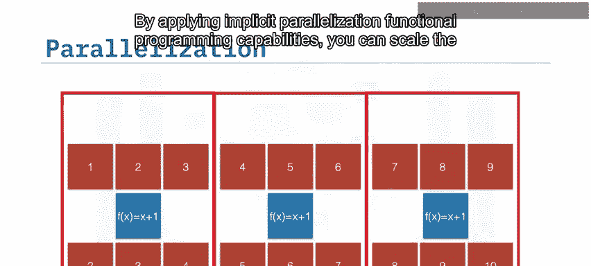

**Lambda函数**（或运算符）是用于编写函数式编程代码的匿名函数。以下是使用Lambda函数和运算符以函数式编程风格编写的代码，用两种流行语言实现两个数字相加：左侧是 **Scala**，右侧是 **Python**。

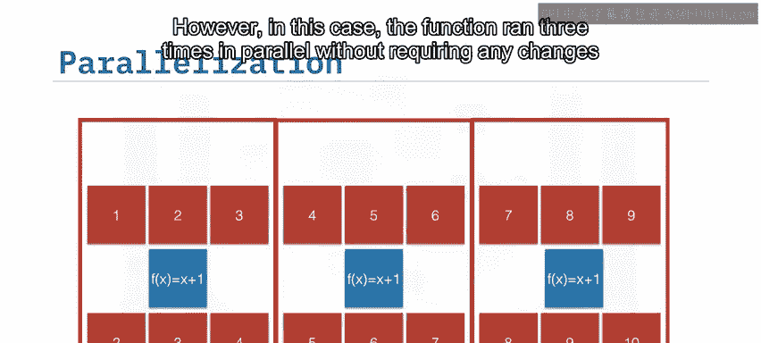

请注意，这两种代码在流程上如何相似，并直接抽象出结果，这是声明式编程范式的标志。

以下是代码示例：

**Scala:**
```scala
val add = (x: Int, y: Int) => x + y
```

**Python:**
```python
add = lambda x, y: x + y
```

Apache Spark 能够通过Lambda函数在工作节点之间分配工作并进行并行化计算，从而快速处理大数据。所有以这种方式实现的Spark程序本质上都是并行的。

因此，无论你分析1千字节还是1拍字节的数据，都没有关系。只需向Spark集群添加额外的资源即可完成。

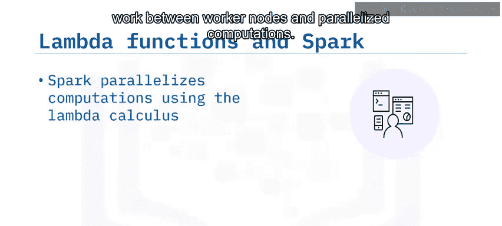

## 总结 📝

本节课中我们一起学习了函数式编程的基础知识。

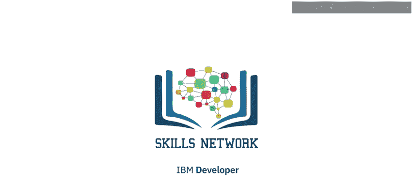

在本视频中，你学到了：
*   函数式编程遵循一种声明式编程模型，强调“做什么”而不是“如何做”，并使用表达式。
*   **Lambda函数**（或运算符）是实现函数式编程的匿名函数。
*   Spark 使用 **Lambda演算** 来并行化计算。
*   所有函数式的Spark程序本质上都是并行的。