# 017：使用弹性分布式数据集进行并行编程 🚀


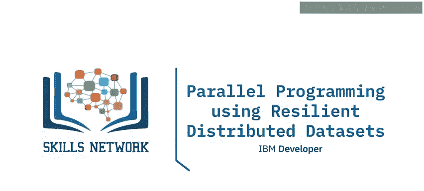

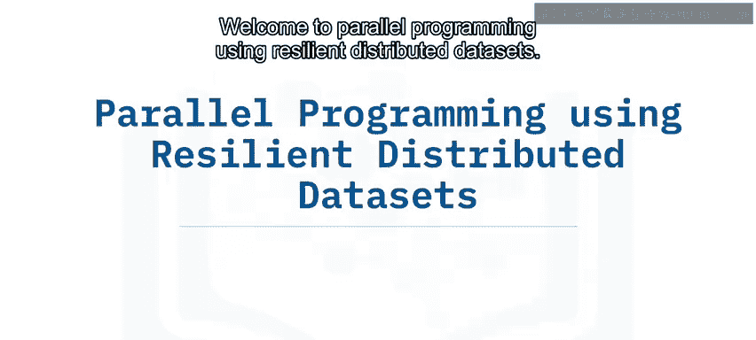

在本节课中，我们将要学习Apache Spark的核心数据结构——弹性分布式数据集（RDD），并了解如何利用RDD进行并行编程。

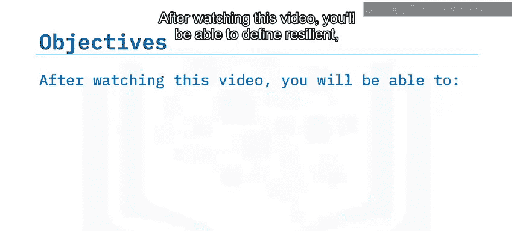

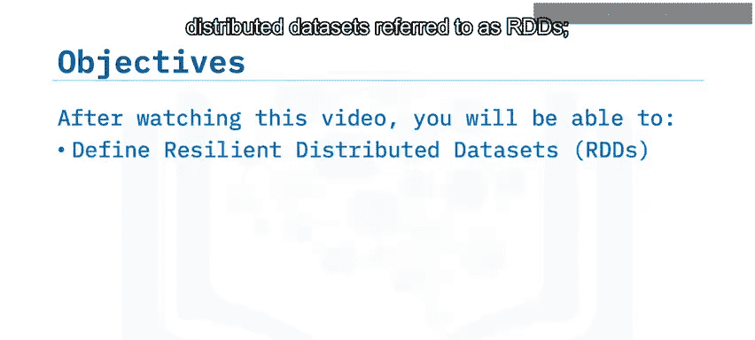

## 什么是弹性分布式数据集（RDD）？

弹性分布式数据集，简称RDD，是Spark的主要数据抽象概念。

一个RDD是一个**容错**的元素集合，这些元素被**分区**在集群的各个节点上，能够进行**并行操作**。此外，RDD是**不可变**的，这意味着一旦创建，数据集就不能被改变。

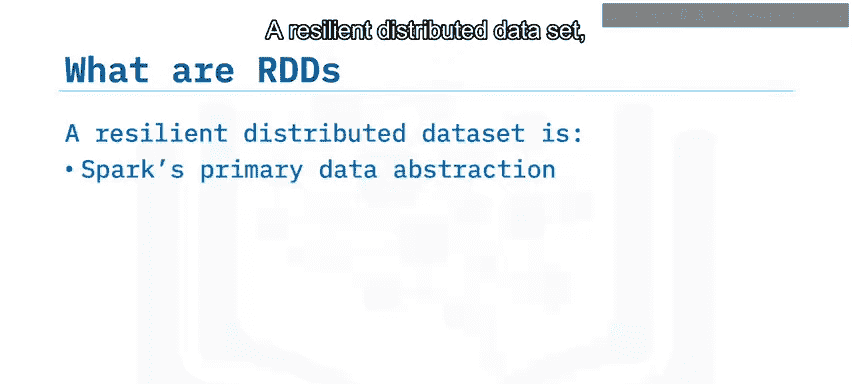

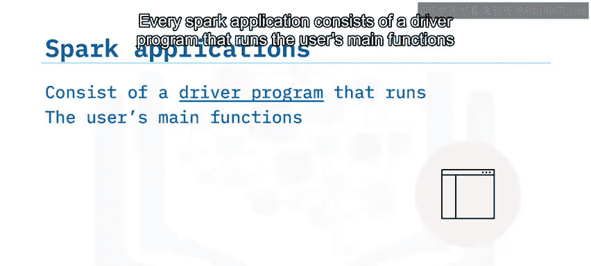

## Spark应用程序的构成

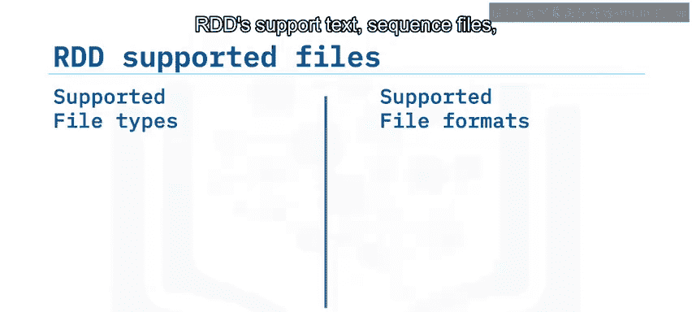

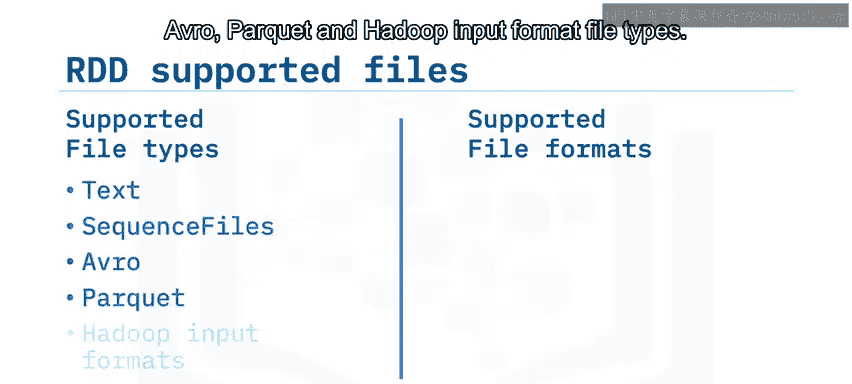

每个Spark应用程序都包含一个驱动程序，该程序运行用户的主函数，并在集群上执行多个并行操作。

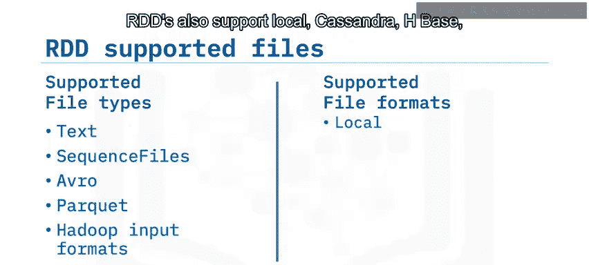

## RDD支持的数据源

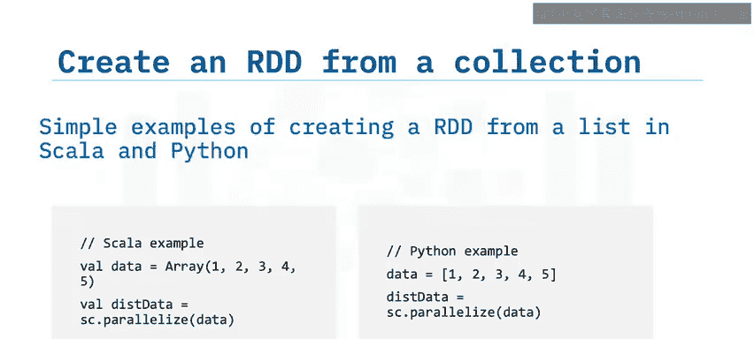

RDD支持多种文件类型和数据源，这使其非常灵活。

以下是RDD支持的主要数据源类型：

*   **文件类型**：文本文件、序列文件、Avro、Parquet以及Hadoop输入格式文件。
*   **存储系统**：本地文件系统、Cassandra、HBase、HDFS、Amazon S3。
*   **数据库**：多种关系型数据库和NoSQL数据库。

## 创建RDD的三种方法

上一节我们介绍了RDD的概念和支持的数据源，本节中我们来看看如何实际创建一个RDD。

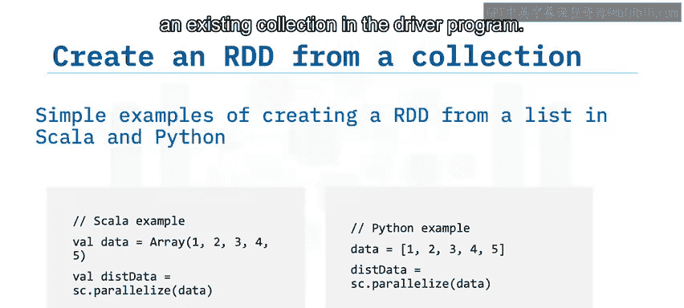

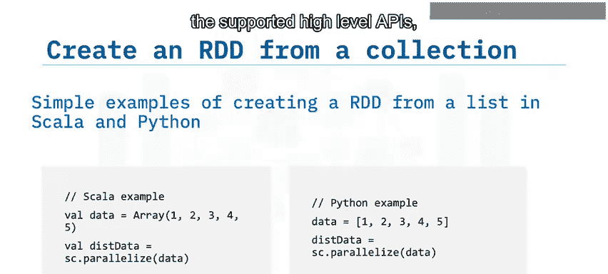

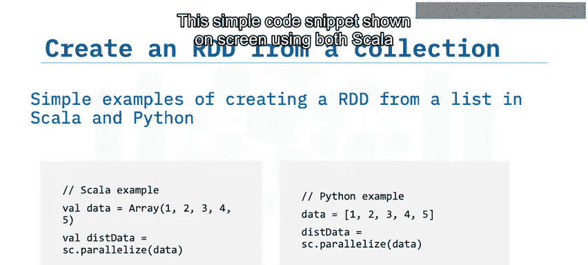

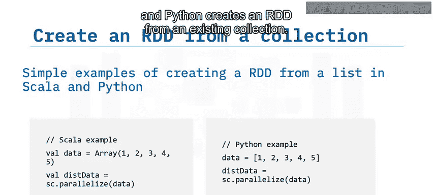

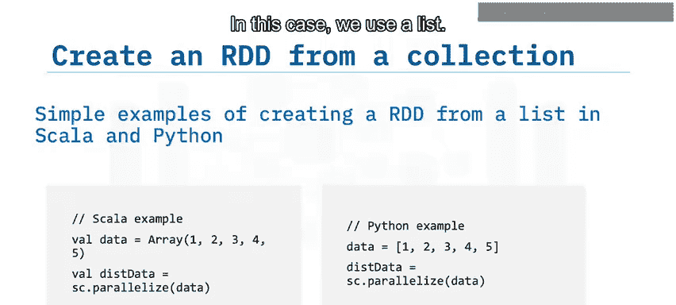

以下是创建RDD的三种主要方法：

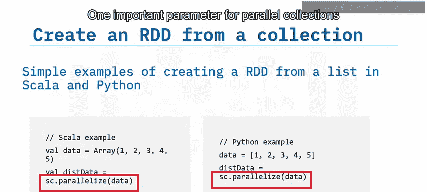

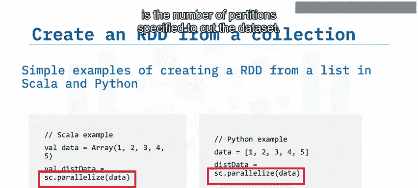

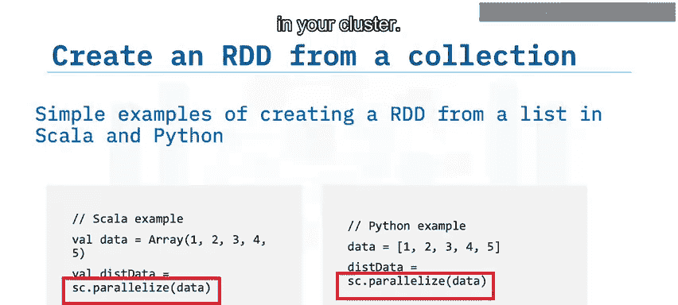

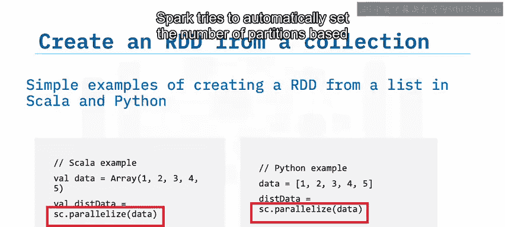

1.  **从外部文件系统创建**：可以从Hadoop支持的文件系统（如HDFS、Cassandra、HBase或Amazon S3）中的外部或本地文件创建RDD。
2.  **并行化现有集合**：在驱动程序中对一个现有集合应用 `parallelize` 函数。驱动程序可以使用Python、Java或Scala等高级API。以下代码片段展示了如何使用Scala和Python从列表创建RDD：
    ```scala
    // Scala 示例
    val data = Array(1, 2, 3, 4, 5)
    val rdd = sc.parallelize(data)
    ```
    ```python
    # Python 示例
    data = [1, 2, 3, 4, 5]
    rdd = sc.parallelize(data)
    ```
    为并行集合设置分区数是一个重要参数。Spark会为集群中的每个分区运行一个任务。通常，你希望为集群中的每个CPU核心设置2到4个分区。Spark会尝试根据集群自动设置分区数，但你也可以通过向 `parallelize` 函数传递第二个参数来手动设置。
3.  **转换现有RDD**：通过对一个已有的RDD应用转换操作来创建新的RDD。

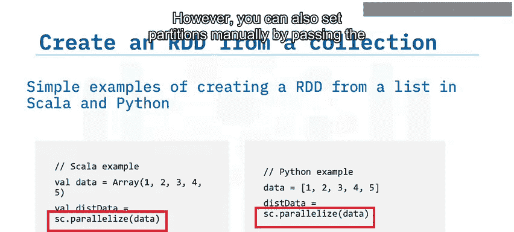

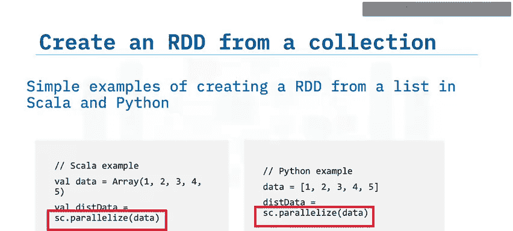

## 什么是并行编程？

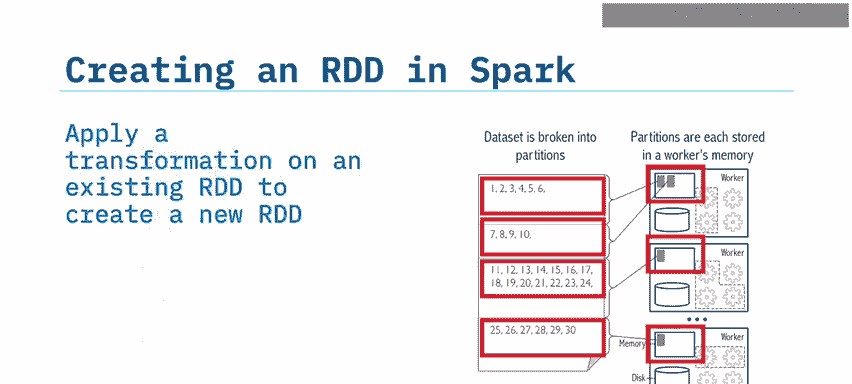

在了解了如何创建RDD后，我们来定义并行编程。

并行编程，类似于分布式编程，是指**同时使用多个计算资源来解决一个计算任务**。它将任务分解为离散的部分，然后使用多个处理器并发地解决这些部分。这些处理器访问一个共享的内存池，其中内置了控制和协调机制。

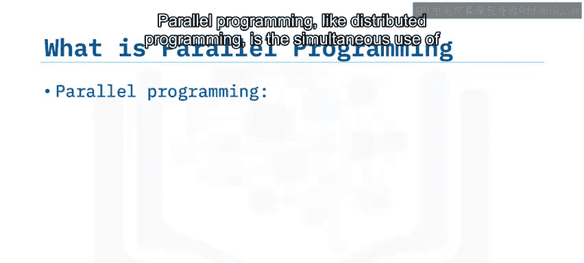

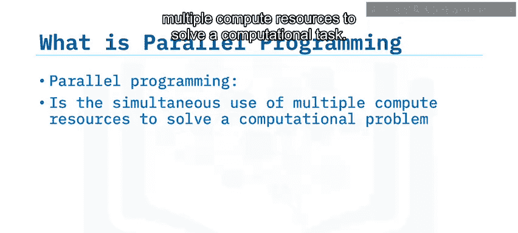

## RDD如何实现并行编程？

RDD的设计天然支持并行操作。

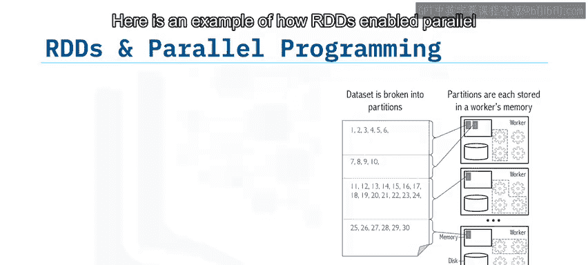

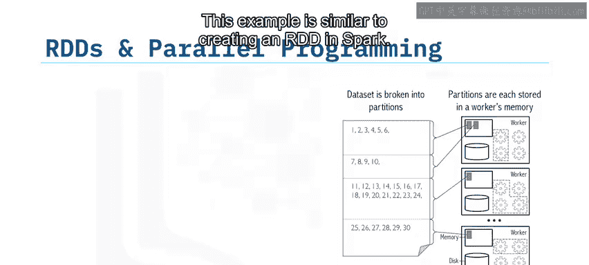

以下是一个RDD实现并行编程的示例，类似于创建RDD的过程：通过并行化一个对象数组或将数据集分割成分区来创建RDD。节点接收这些分布式分区。Spark根据RDD的创建方式，为集群的每个分区运行一个任务，从而实现对RDD的并行操作。

## RDD如何提供弹性（容错性）？

RDD通过**不可变性**和**缓存**机制在Spark中提供弹性。

首先，由于数据是不可变的，RDD总是可以恢复的。另一个关键的Spark能力是能够在内存中**持久化**或**缓存**数据集。缓存是容错的，并且总是可恢复的，因为RDD是不可变的，并且Hadoop数据源本身也是容错的。

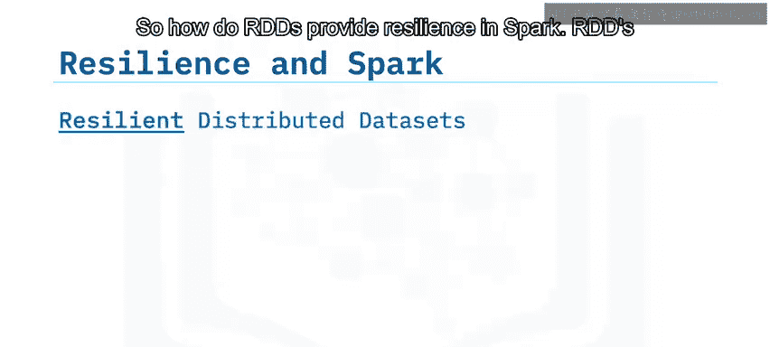

当你持久化一个RDD时，每个节点将其计算出的分区存储在内存中，并在对该数据的其他操作中重用这些分区。持久化允许未来的操作快得多，通常能加速10倍以上。持久化或缓存是迭代算法和快速交互式使用的关键工具。

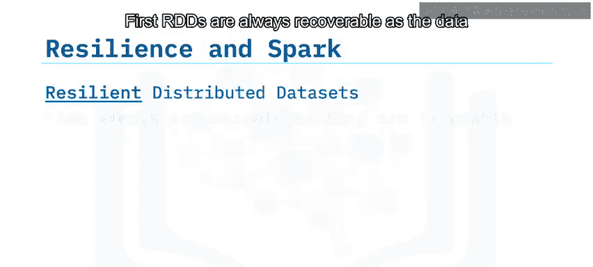

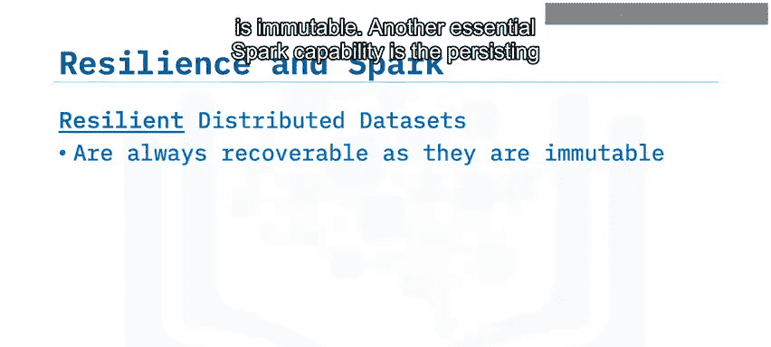

## 总结

本节课中我们一起学习了弹性分布式数据集（RDD）的核心概念。

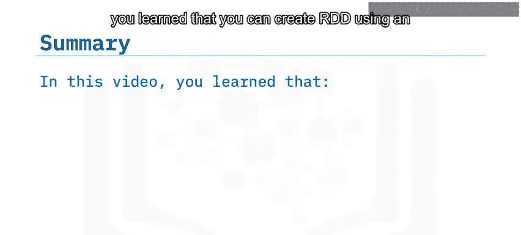

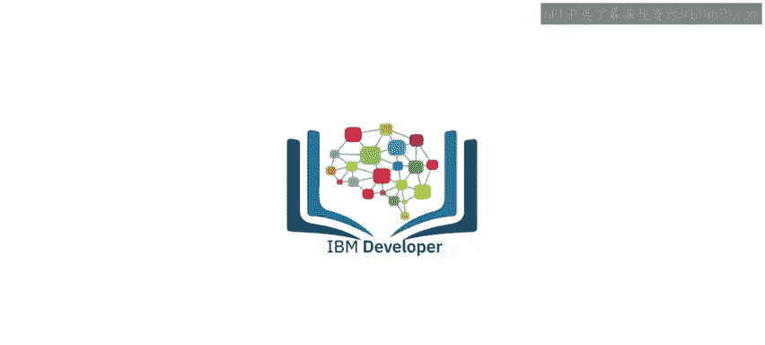

我们了解到，可以通过三种方式创建RDD：从Hadoop支持的外部文件、从现有集合、或从另一个RDD转换而来。RDD是不可变的，并且总是可恢复的。并行编程是同时使用多个计算资源来解决计算任务。RDD能够在内存中持久化或缓存数据集，这极大地加速了迭代操作。