# 018：Apache Spark中的数据并行扩展 🚀

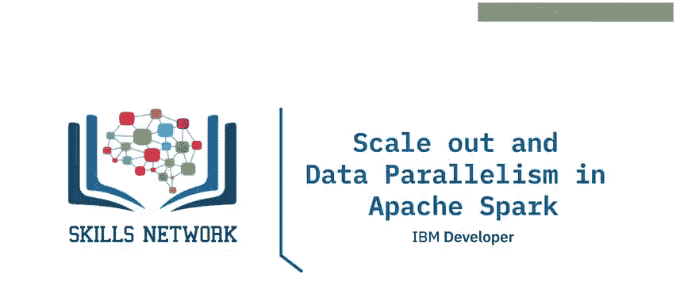

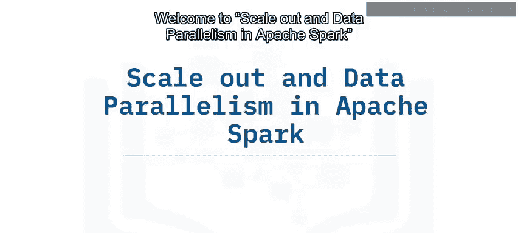

在本节课中，我们将要学习Apache Spark的核心架构及其如何通过数据并行性来处理大规模数据。我们将了解Spark的主要组件，并解释其扩展机制。

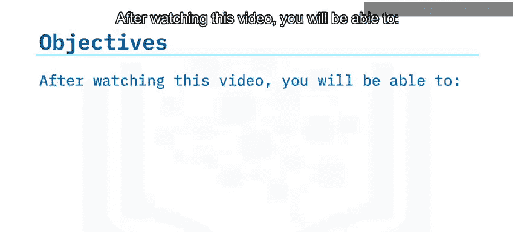

---

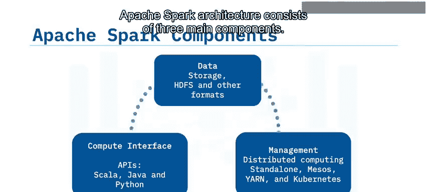

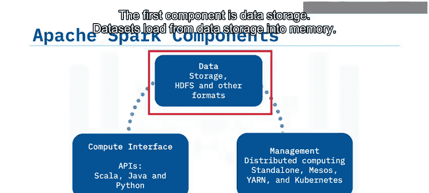

## Apache Spark架构概述 🏗️

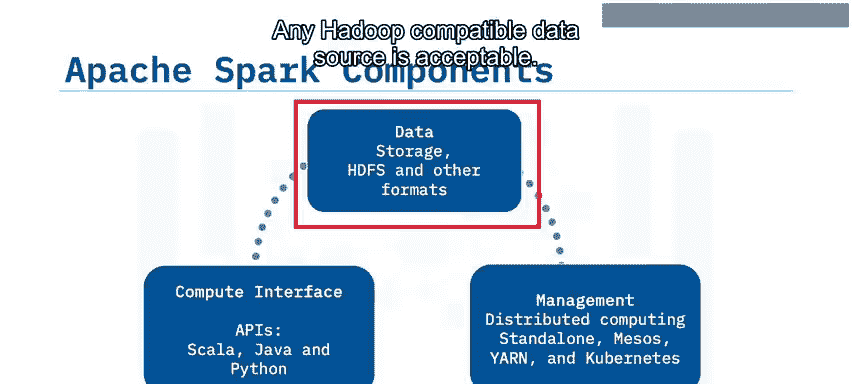

Apache Spark架构由三个主要组件构成。

以下是这三个核心组件：

1.  **数据存储**：数据集从数据存储加载到内存中。任何与Hadoop兼容的数据源均可接受。
2.  **高级编程API**：这是第二个组件。Spark提供了Scala、Python和Java的API。
3.  **集群管理框架**：这是最后一个组件，它负责处理Spark的分布式计算方面。Spark的集群管理框架可以作为独立服务器、Mesos或YARN（另一种资源协调器）存在。集群管理框架对于扩展大数据处理至关重要。

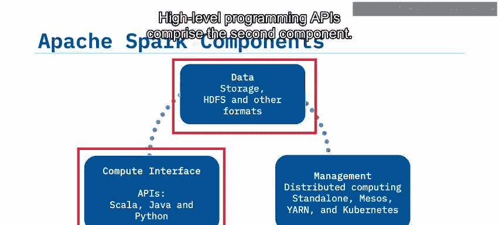

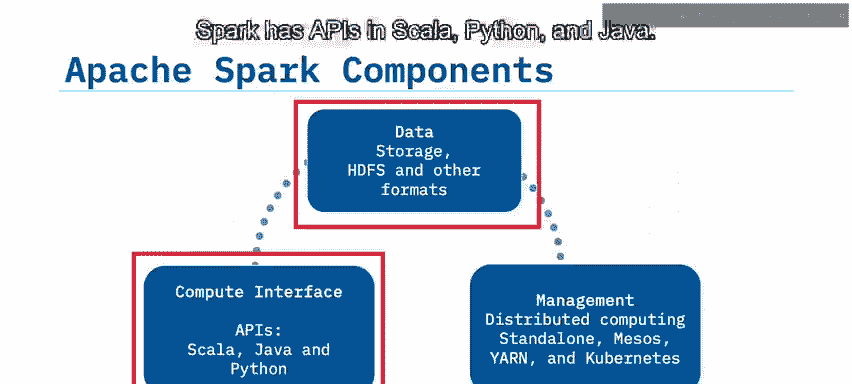

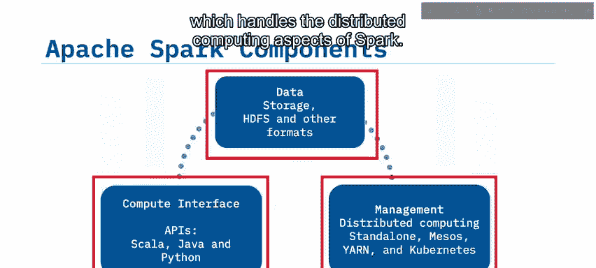

这三个部分的简单可视化关系是：来自Hadoop文件系统的数据流入计算接口或API，然后流入不同的节点以执行分布式并行任务。

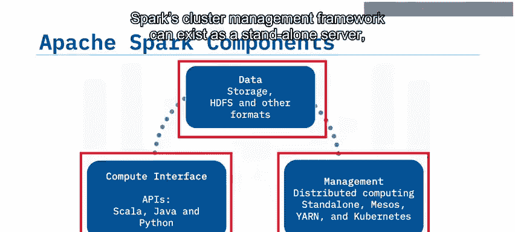

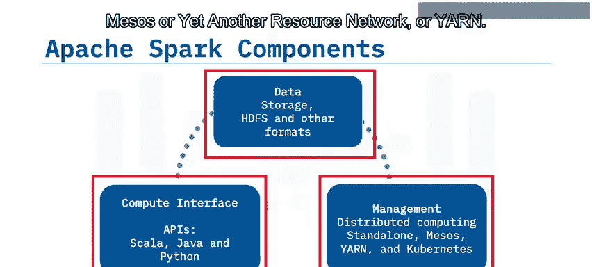

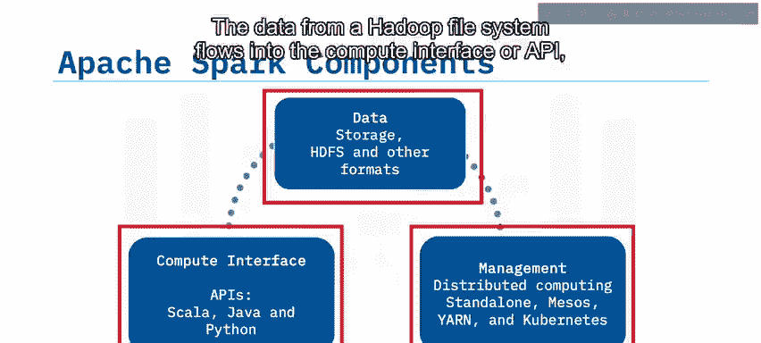

---

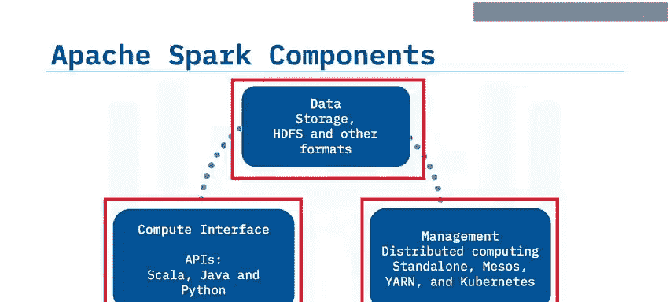

## Spark核心引擎 ⚙️

上一节我们介绍了Spark的整体架构，本节中我们来看看其核心引擎。

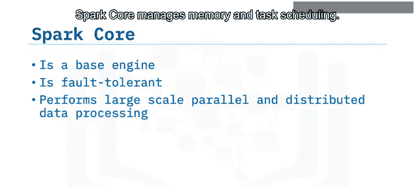

通常所说的“Spark”指的是其基础引擎，正式名称为**Spark Core**。具备容错能力的Spark Core是进行大规模并行和分布式数据处理的基础引擎。

Spark Core负责管理内存和任务调度。它还包含了用于定义RDD（弹性分布式数据集）和其他数据类型的API。此外，Spark Core将元素的分布式集合在集群中进行并行化处理。

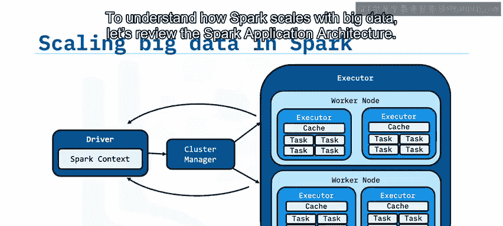

---

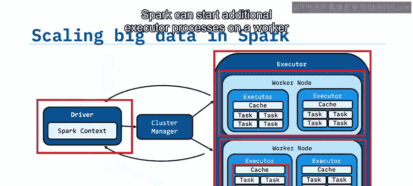

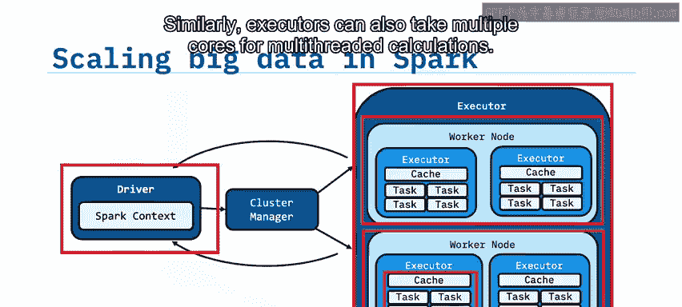

## Spark应用架构与扩展机制 📈

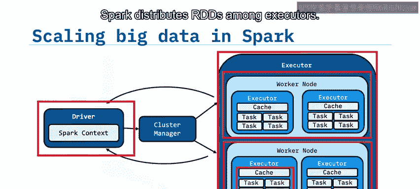

为了理解Spark如何随大数据扩展，让我们回顾一下Spark应用架构。

Spark应用由**驱动程序**和**执行器程序**组成。执行器程序运行在工作节点上。如果工作节点有足够的内存和核心可用，Spark可以在其上启动额外的执行器进程。同样，执行器也可以占用多个核心以进行多线程计算。

Spark将RDD分布在各个执行器之间。驱动程序和执行器之间会进行通信。驱动程序包含应用程序需要运行的Spark作业，并将作业拆分为任务提交给执行器。当执行器完成任务后，驱动程序接收任务结果。

我们可以用一个比喻来理解：如果将Apache Spark比作一个大公司，那么驱动程序代码就像是公司的管理层，负责决策工作分配、资源获取等。初级员工就是执行器，他们使用提供的资源完成分配给他们的工作。而工作节点则对应员工所在的实体办公场所。

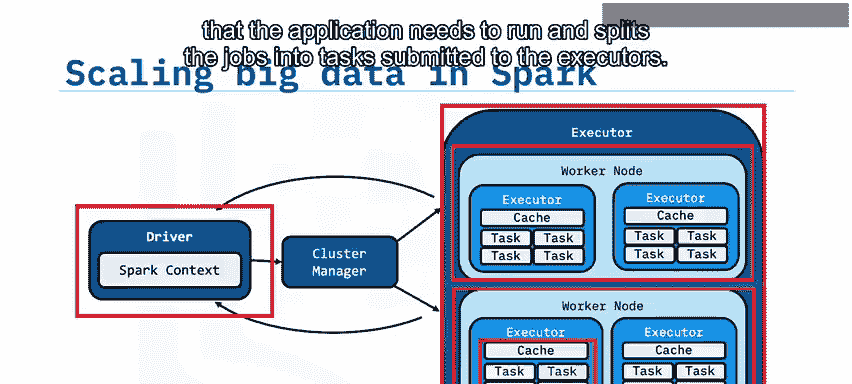

您可以通过增加额外的工作节点来逐步扩展大数据处理能力。

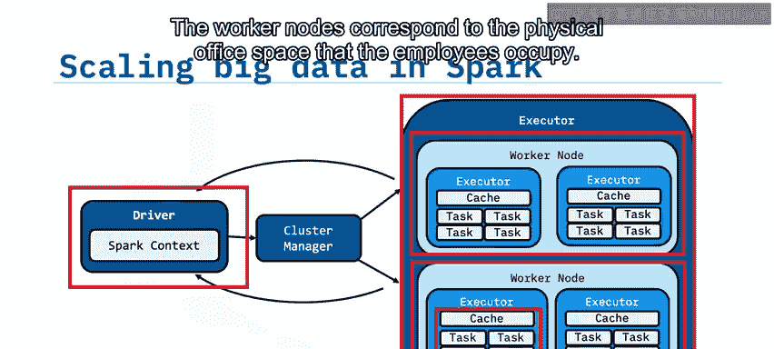

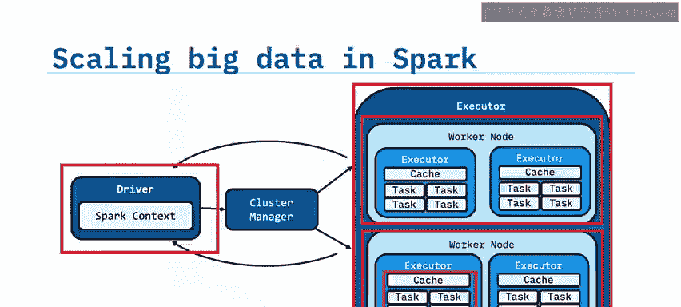

---

## 总结 📝

本节课中我们一起学习了Apache Spark的架构和扩展原理。

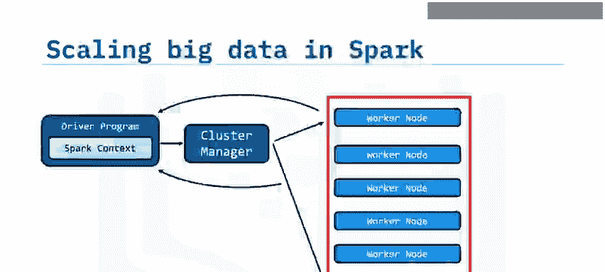

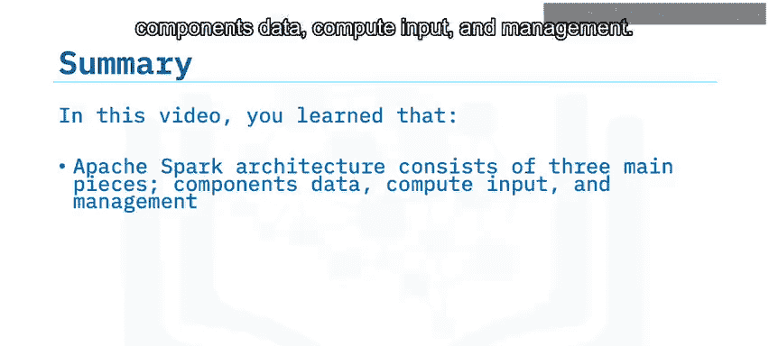

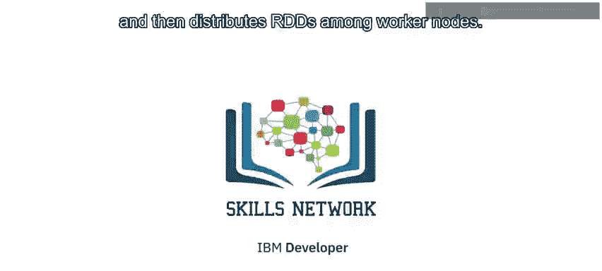

总结要点如下：
*   Apache Spark架构由三个主要部分组成：**数据**、**计算输入**和**管理**。
*   具备容错能力的**Spark Core**基础引擎执行大规模并行和分布式数据处理，管理内存，调度任务，并包含定义RDD的API。
*   **Spark驱动程序**与集群通信，并将RDD分布到各个工作节点上。