# 019：DataFrame与SparkSQL 🚀


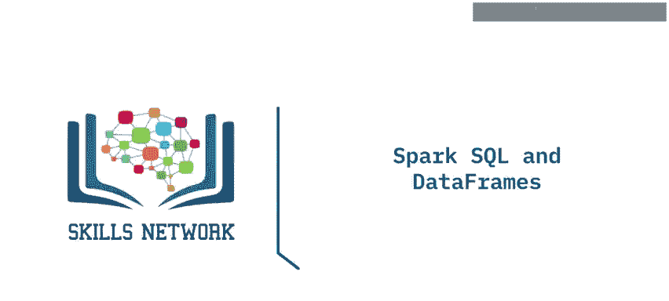

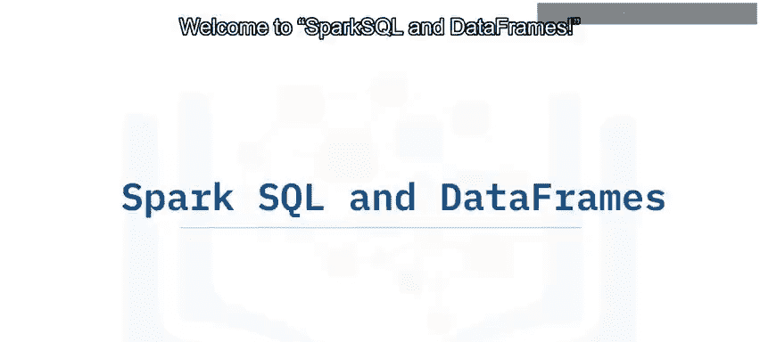

在本节课中，我们将要学习SparkSQL和DataFrame的核心概念。我们将了解它们是什么、如何工作以及它们带来的优势。通过本教程，你将能够定义SparkSQL和DataFrame，理解查询的组成部分，并解释为何在数据处理中它们如此重要。

## 概述：什么是SparkSQL？ 🧠

SparkSQL是Spark中用于**结构化数据处理**的模块。

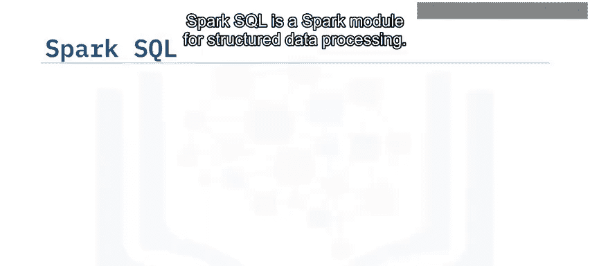

你可以通过SQL查询和DataFrame API与SparkSQL进行交互。SparkSQL支持Java、Scala、Python和R等多种编程语言的API。重要的是，SparkSQL使用相同的执行引擎来计算结果，无论你使用哪种API或语言进行计算。这使得开发者可以选择最自然的方式来表达特定的数据转换操作。

以下是一个使用Python的SparkSQL查询示例：
```python
# 假设`people`已被注册为一个表视图
spark.sql("SELECT * FROM people")
```
在这个例子中，`SELECT * FROM people`就是通过SparkSQL运行的SQL查询语句。

## SparkSQL的优化特性 ⚙️

与基础的Spark RDD API不同，SparkSQL包含了**基于成本的优化器**、**列式存储**和**代码生成**等技术。这些优化为Spark提供了关于**数据结构**和**计算过程**的额外信息，从而能够执行更高效的优化。

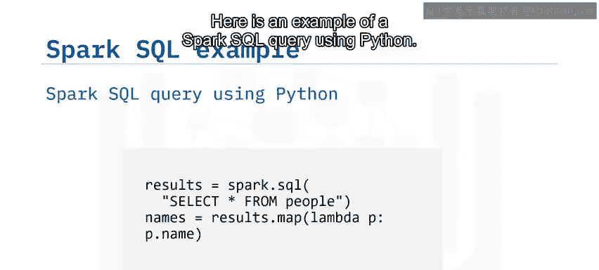

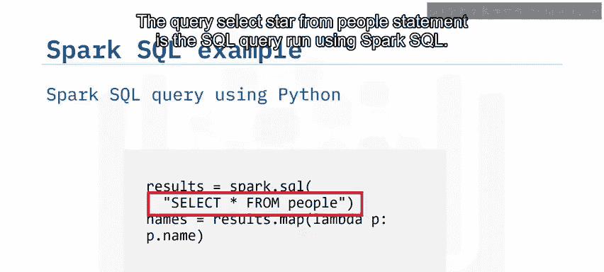

## 深入理解DataFrame 📊

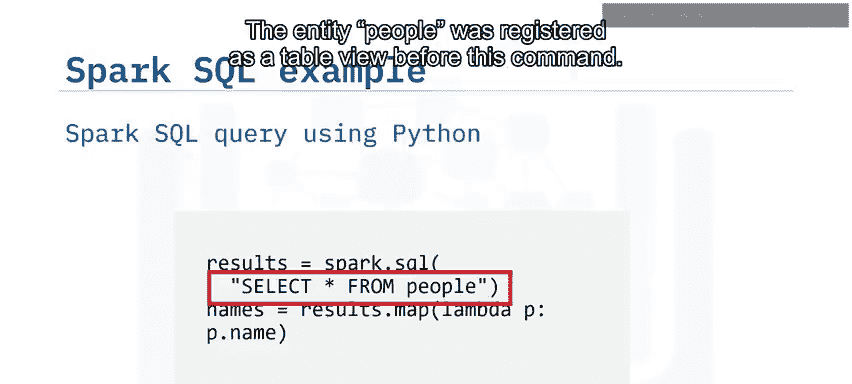

那么，什么是DataFrame呢？

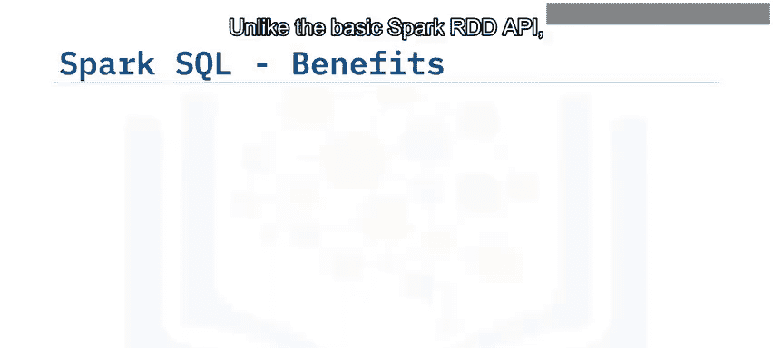

一个**DataFrame**是一个被组织成**命名列**的数据集合。在概念上，DataFrame等同于关系型数据库中的一张表，也类似于R或Python中的DataFrame，但Spark的DataFrame拥有更丰富的优化功能。

DataFrame构建在SparkSQL的RDD API之上，它利用RDD来执行关系型查询。

以下是一个简单的Python代码片段，演示了如何从JSON文件读取数据并创建一个DataFrame：
```python
# 从JSON文件创建DataFrame
df = spark.read.json("path/to/people.json")
# 将DataFrame注册为一个临时视图，以便使用SQL查询
df.createOrReplaceTempView("people")
```

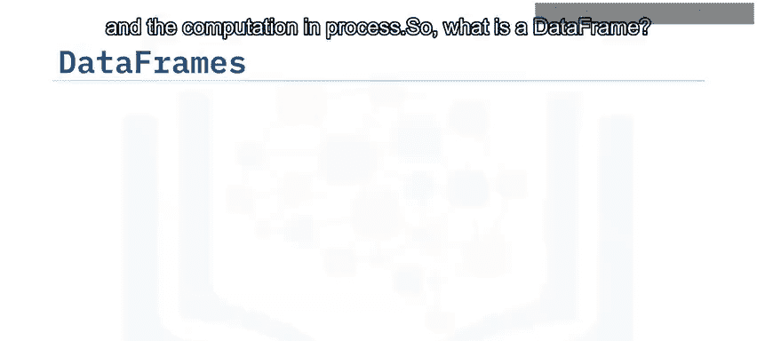

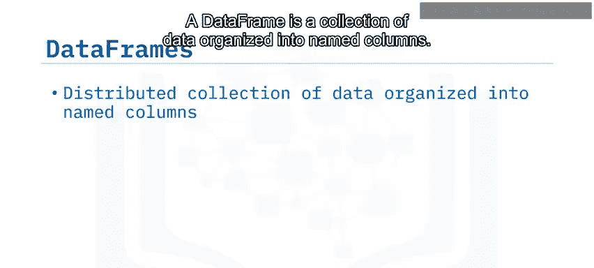

## DataFrame的优势 🌟

DataFrame提供了许多显著的优势：

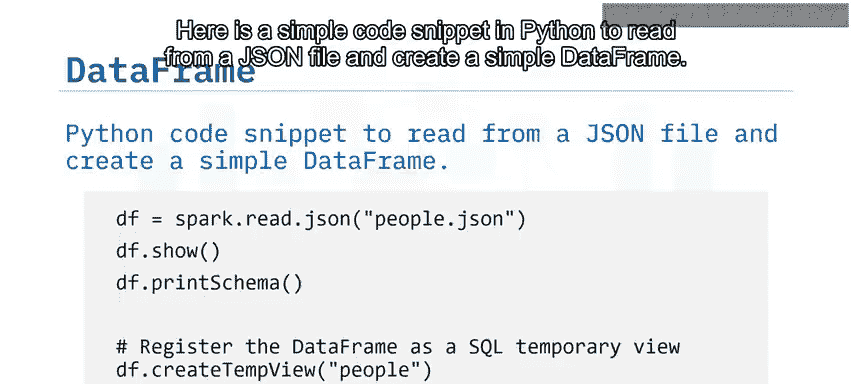


*   **高度可扩展性**：其处理能力可以从单台笔记本电脑上的几千字节，扩展到大型机器集群上的数PB数据。
*   **广泛的数据格式支持**：支持多种数据格式和存储系统。
*   **强大的优化能力**：通过Catalyst优化器提供查询优化和代码生成功能。
*   **开发者友好**：通过Spark与大多数大数据工具集成，并为Python、Java、Scala和R提供了API。

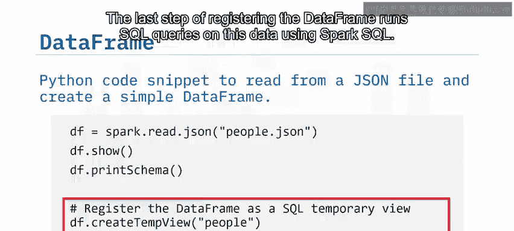

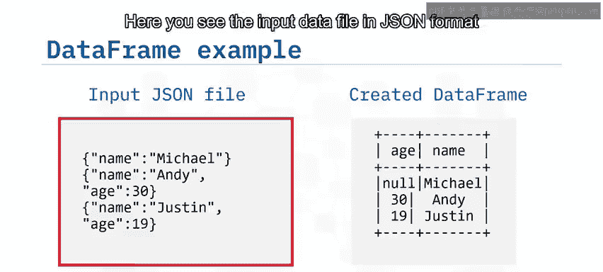

## 实践：多种查询方式 🔄

DataFrame的灵活性体现在它支持多种查询方式。以下代码片段展示了如何运行相同的SQL查询并获得结果，目标都是显示DataFrame中的`name`列。


第一种是传统的SQL查询方式：
```python
spark.sql("SELECT name FROM people").show()
```

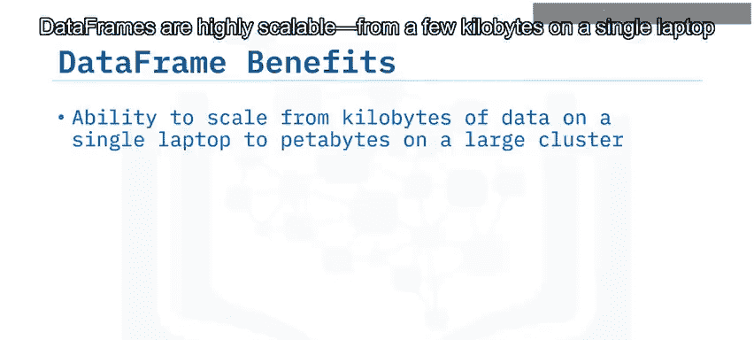

而接下来的两个例子则使用了DataFrame的Python API来完成相同的任务：
```python
# 使用DataFrame API的select方法
df.select("name").show()
# 使用DataFrame API的col方法（更面向对象）
from pyspark.sql.functions import col
df.select(col("name")).show()
```

这三种方式最终达到的效果是完全一致的。

同样地，要查询DataFrame中年龄大于21岁的人员，也有不同的方法。

第一种是SQL查询：
```python
spark.sql("SELECT * FROM people WHERE age > 21").show()
```

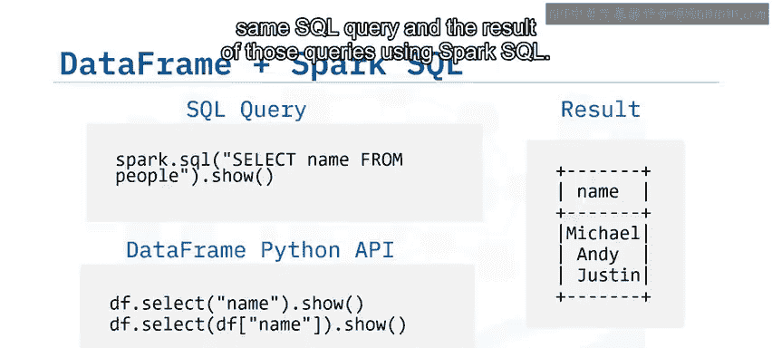

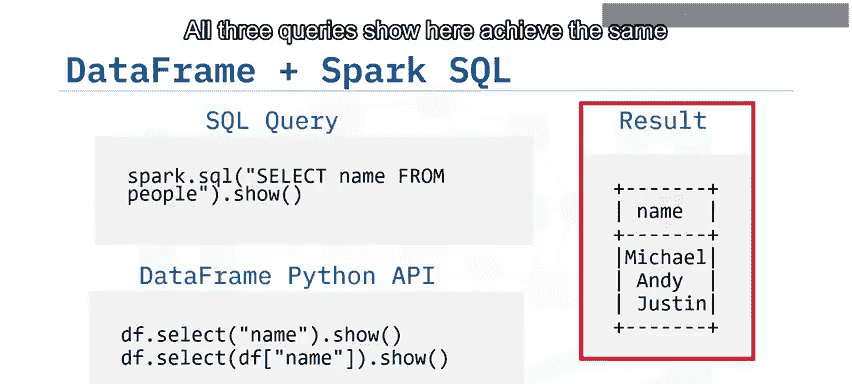

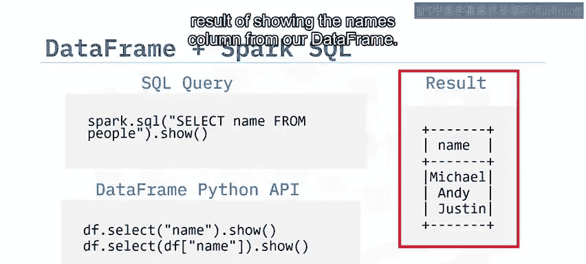

第二种是使用DataFrame API：
```python
df.filter(df.age > 21).show()
```

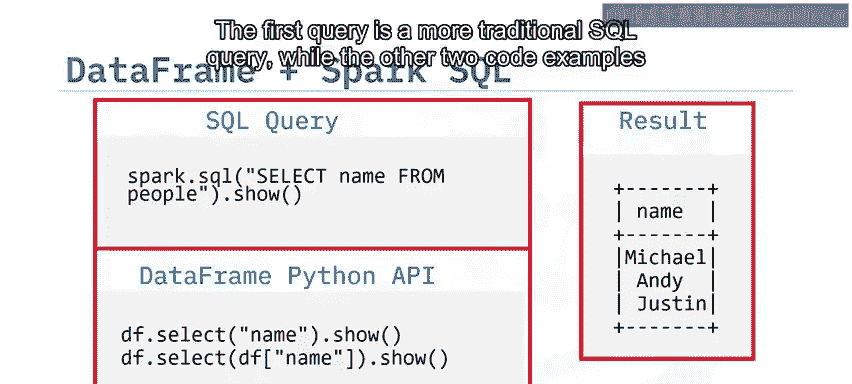

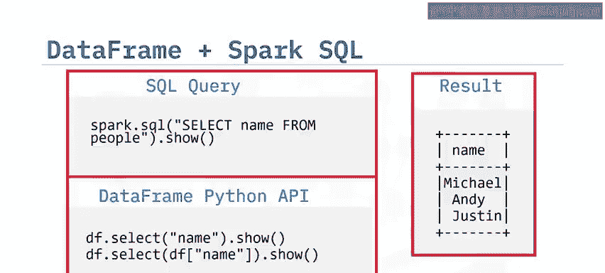

这两种方法都能有效地筛选出符合条件的数据。

## 总结 📝

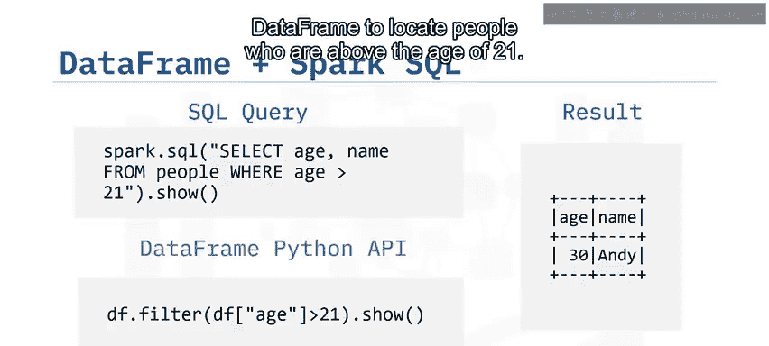

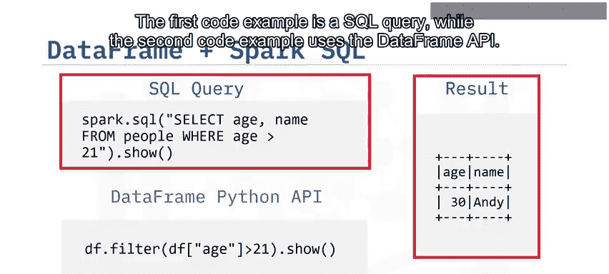

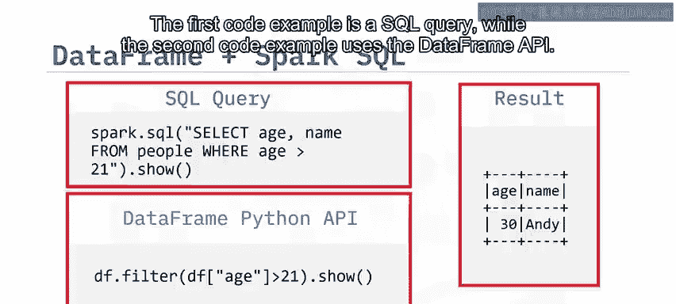

本节课中，我们一起学习了SparkSQL和DataFrame。

我们了解到，SparkSQL是Spark中用于结构化数据处理的模块，它提供了一个名为DataFrame的编程抽象，并且本身也可以作为一个分布式SQL查询引擎。

DataFrame在概念上等同于关系型数据库中的表，或R/Python中的DataFrame，但得益于Spark的架构，它具备了更强大的优化能力。

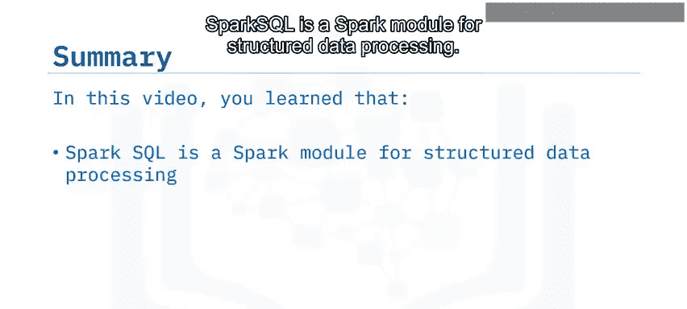


掌握SparkSQL和DataFrame，是高效进行大规模结构化数据处理的关键一步。