# 001：NoSQL概述

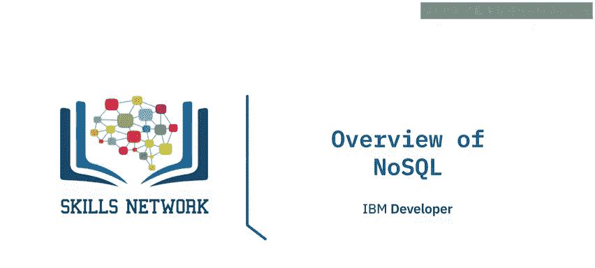

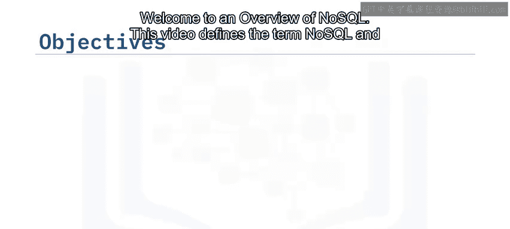

在本节课中，我们将要学习NoSQL数据库的基本概念。我们将定义“NoSQL”这一术语及其所指的技术，并描述NoSQL在数据库发展历程中的历史背景。

## 🏷️ 名称的由来

首先，我们来谈谈“NoSQL”这个名称。这个名称是在一次讨论所有新兴开源分布式数据库的活动中被提出的，并沿用至今。

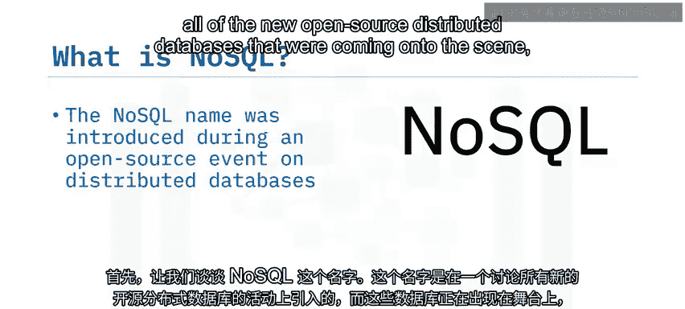

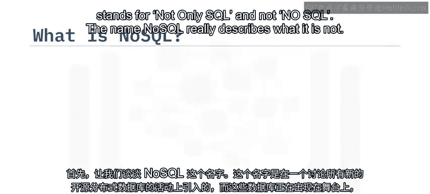

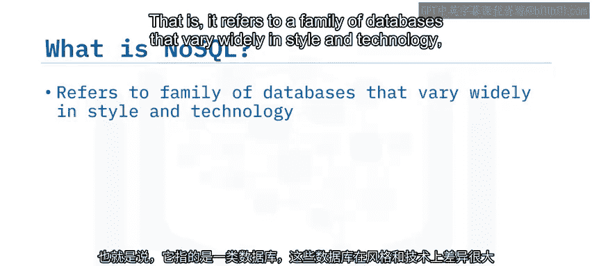

与字面意思相反，NoSQL实际上代表“Not Only SQL”（不仅仅是SQL），而不是“No SQL”（没有SQL）。这个名称实际上描述的是它不是什么。它指的是一个在风格和技术上差异很大的数据库家族，但它们都共享一个共同特征：本质上是非关系型的。

这意味着它们不是标准的行与列结构的关系型数据库管理系统（RDBMS）。因此，描述这类数据库的一个更贴切的名称是“非关系型数据库”。

## ✨ NoSQL数据库的优势

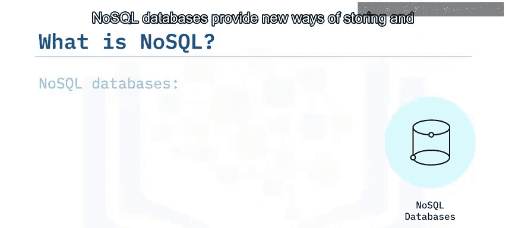

NoSQL数据库提供了存储和查询数据的新方法，解决了现代应用程序面临的诸多问题。最重要的是，大多数NoSQL数据库旨在处理与大数据运动相关的、不同类型的扩展性问题。

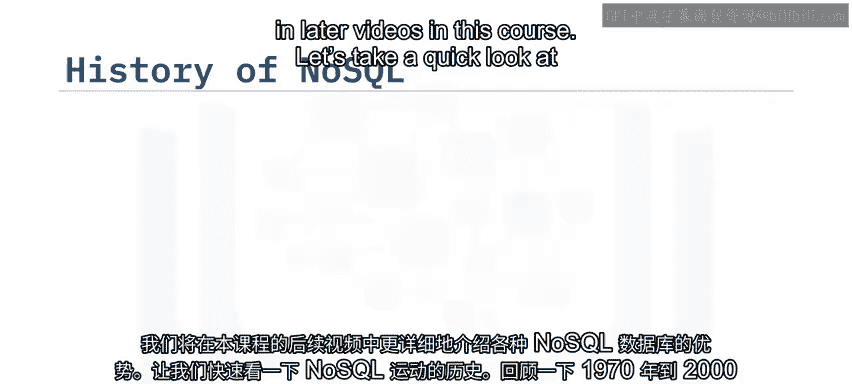

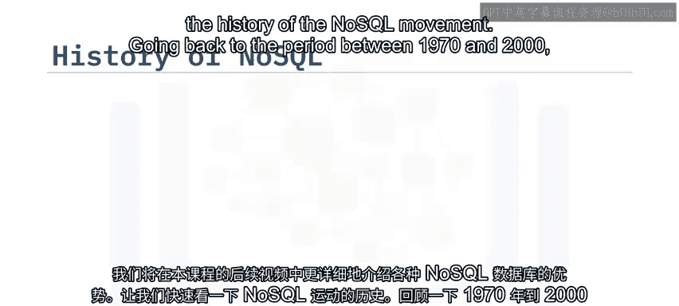

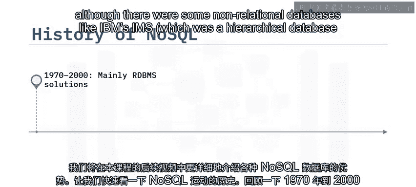

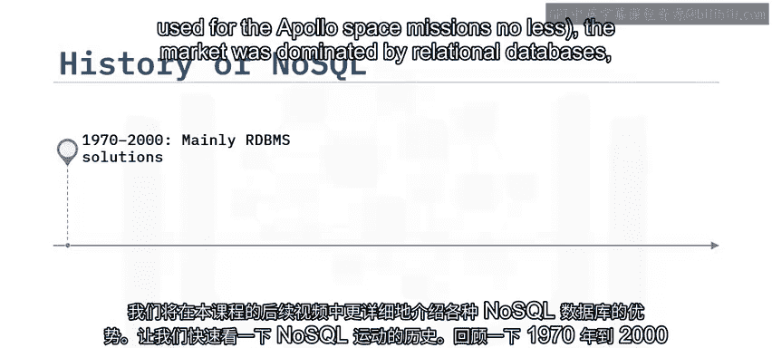

这里所说的“扩展性”，既指数据的规模，也指并发操作数据的用户数量。NoSQL数据库通常在其用例上也更加专业化，并且相比关系型数据库，能为应用程序功能的开发提供更简单的方案。在本课程后续的视频中，我们将更详细地探讨各种NoSQL数据库的优势。

## 📜 NoSQL运动的历史

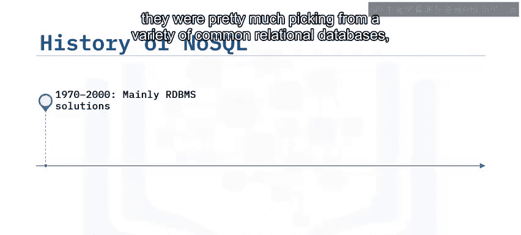

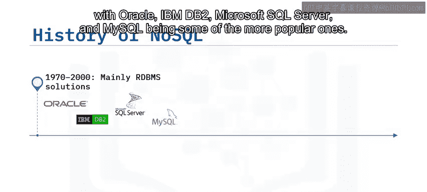

接下来，让我们快速回顾一下NoSQL运动的历史。

回溯到1970年至2000年期间，尽管存在一些非关系型数据库，例如IBM的IMS（一种用于阿波罗太空任务的分层数据库），但市场主要由关系型数据库主导。

因此，当应用程序架构师和开发人员需要为其应用程序选择数据存储时，他们基本上是从各种常见的关系型数据库中挑选，其中Oracle、IBM DB2、Microsoft SQL Server和MySQL是较为流行的选择。

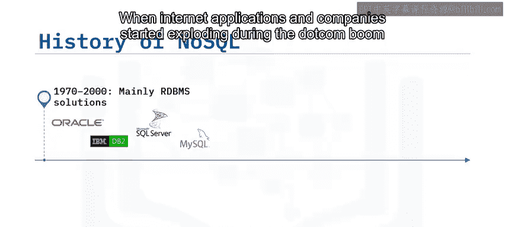

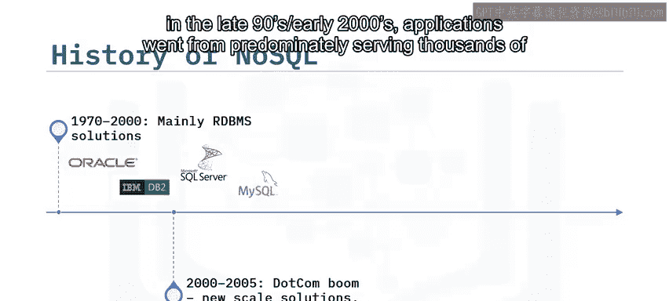

当互联网应用和公司在90年代末至21世纪初的互联网泡沫时期开始爆炸式增长时，应用程序的主要服务对象从公司内部的数千名员工，转变为需要服务公共互联网上的数百万用户。对这些应用而言，可用性和性能至关重要。

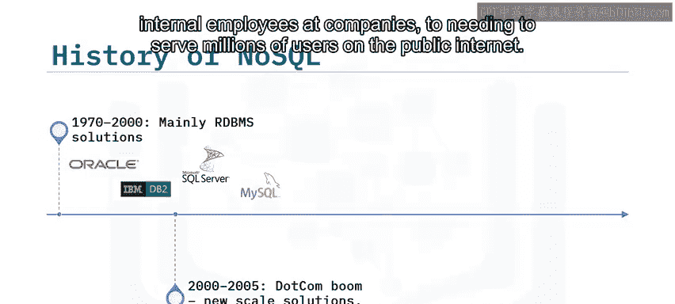

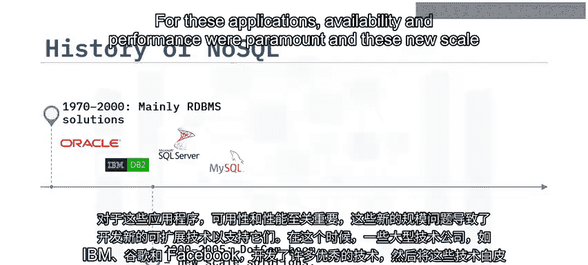

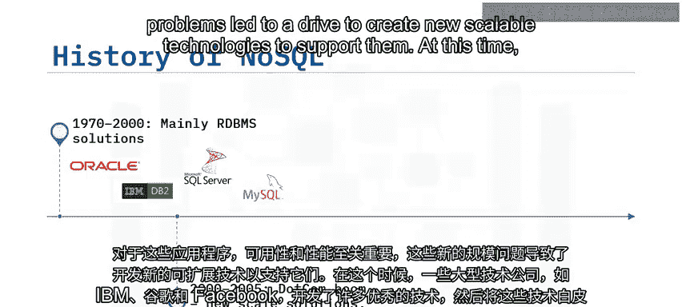

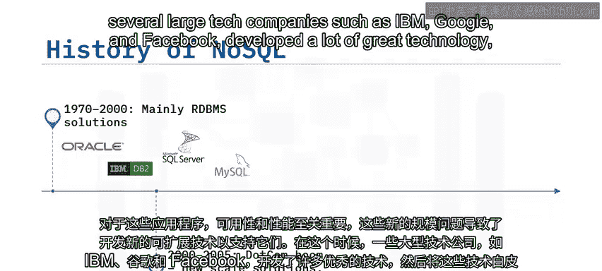

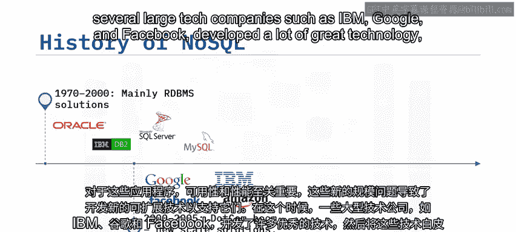

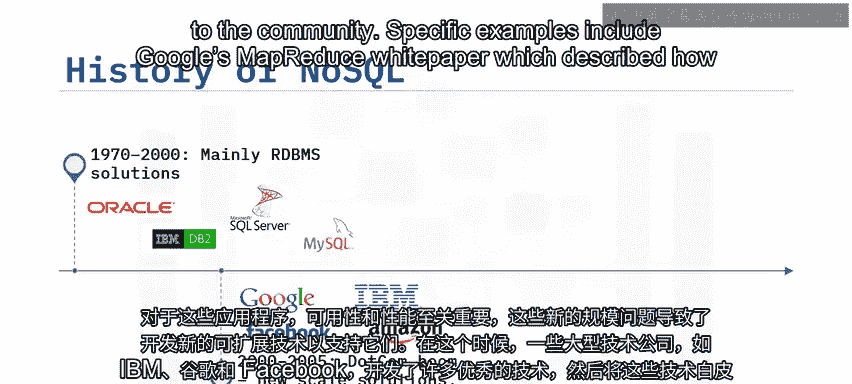

这些新的扩展性问题推动了创建新的可扩展技术来支持它们。当时，IBM、谷歌和Facebook等几家大型科技公司开发了大量优秀技术，并随之向社区发布了白皮书或开源了这些技术。

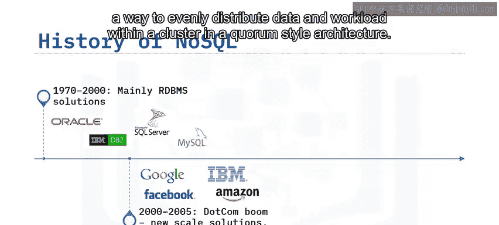

具体的例子包括谷歌的MapReduce白皮书（描述了如何在分布式系统上处理大型数据集）和亚马逊的Dynamo白皮书（详细阐述了一种在仲裁风格架构的集群内均匀分布数据和工作负载的方法）。

在21世纪后期，几种新的数据库开始涌现，其中大量来自开源社区。像Apache CouchDB、Cassandra、HBase，以及MongoDB、Redis、Riak和Neo4j等数据库在应用程序中得到了更广泛的使用，特别是在那些需要比关系型数据库所能处理的更大规模的应用中。

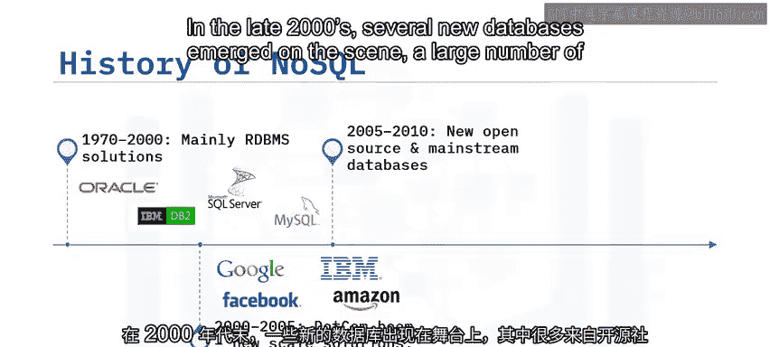

在过去十年左右的时间里，一些NoSQL数据库采用了完全托管的服务模式，也称为“数据库即服务”（DBaaS）。这种模式将管理和维护工作从最终用户身上转移，让开发人员能够专注于使用这些现代数据库构建应用程序。一些例子包括IBM Cloudant和Amazon DynamoDB。

## 🎯 总结

本节课中我们一起学习了以下内容：
*   “NoSQL”这个名称代表“Not Only SQL”（不仅仅是SQL）。
*   “NoSQL”这个术语指的是一类在架构上为非关系型的数据库。
*   尽管各种NoSQL数据库的实现技术在细节上各不相同，但它们都共享一些共同特征。
*   从历史上看，关系型数据库更为普遍，但自2000年以来，由于大数据的扩展性需求，NoSQL数据库在数据库市场中变得越来越流行。