# 003：键值数据库详解


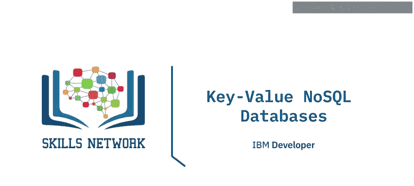

在本节课中，我们将学习NoSQL数据库的四大主要类别之一：**键值数据库**。我们将探讨其架构、核心特点、适用场景以及一些流行的实现方案。

---

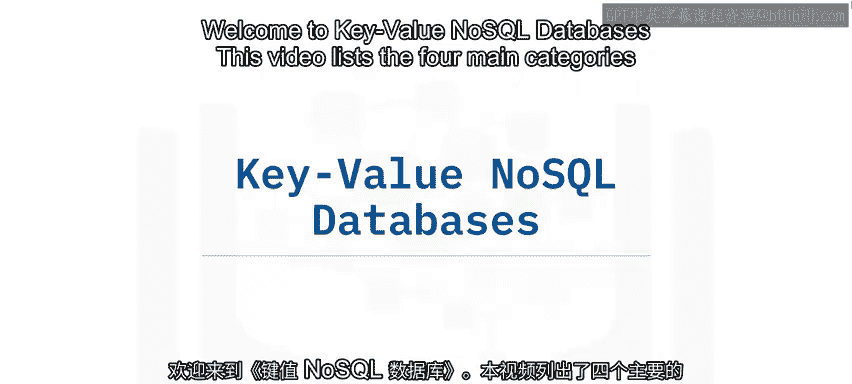

## 🏗️ 键值数据库架构

上一节我们介绍了NoSQL数据库的四大类别。本节中，我们来看看其中架构最简单的**键值数据库**。

在键值数据库中，所有数据都以一个**键**和一个对应的**值**（通常是一个不透明的二进制大对象，即Blob）的形式存储。从架构上讲，它们是NoSQL数据库中最简单的一类，因为其核心数据结构可以抽象为一个**哈希映射**。

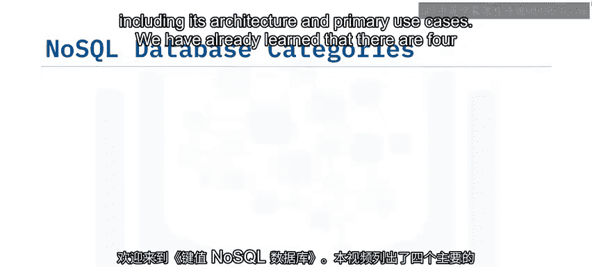

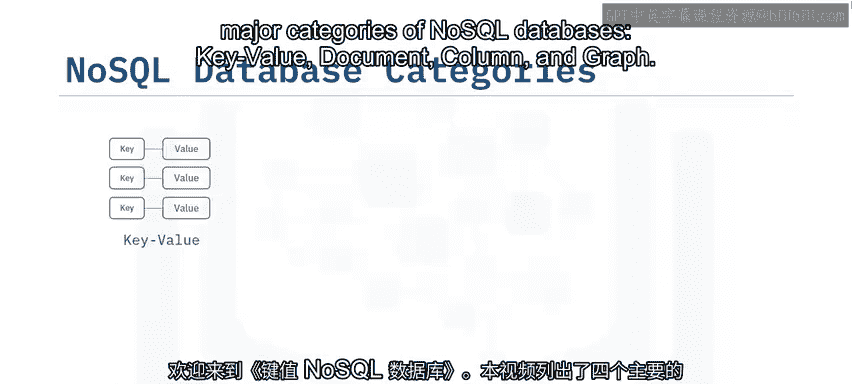

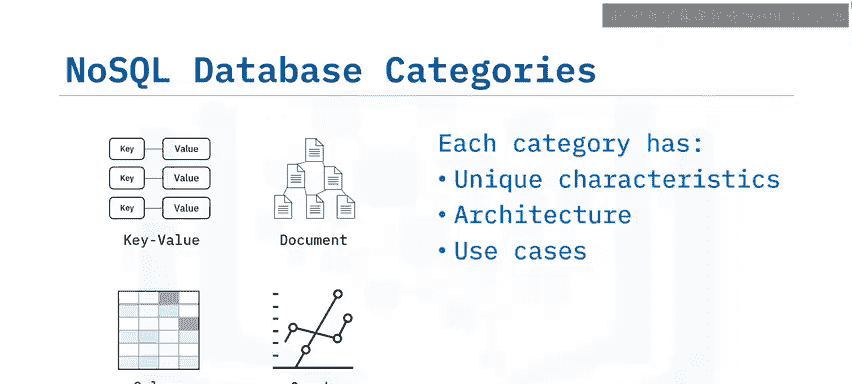

其基本存储模型可以用以下伪代码表示：
```python
# 一个简化的键值存储概念模型
key_value_store = {
    "user_session_12345": "{'username': 'alice', 'last_login': '2023-10-27'}",
    "shopping_cart_67890": "{'items': [{'id':1, 'qty':2}], 'total': 50.00}",
    # ... 更多键值对
}
```

这种结构使其在基础的**创建、读取、更新、删除**操作上非常高效。同时，键值数据库通常具有良好的可扩展性，可以轻松地在多个节点上进行**分片**。每个分片包含一定范围的键及其关联的值。

---

## ⚙️ 核心特点与局限性

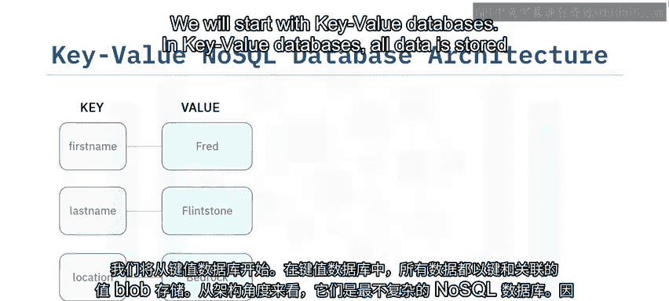

了解了基本架构后，我们来看看键值数据库的主要特点和需要注意的局限性。

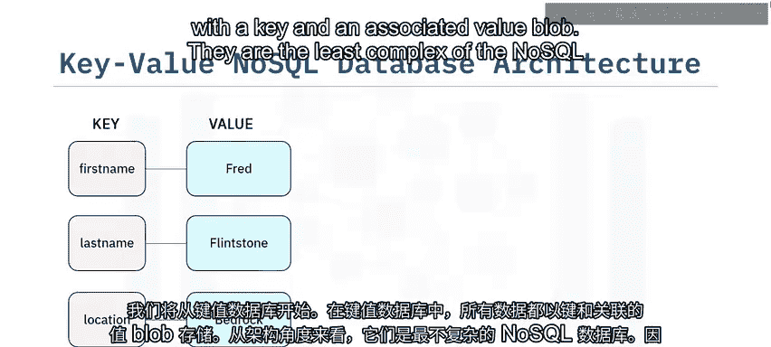

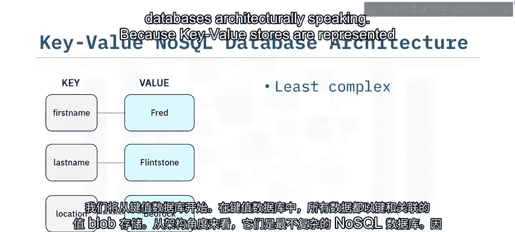

以下是键值数据库的核心特点：
*   **简单高效**：专为基于键的快速CRUD操作优化。
*   **易于扩展**：通过键的范围进行分片，水平扩展能力强。
*   **原子性**：针对单个键的操作是原子的。

然而，这些数据库通常不适合处理复杂查询或连接多个数据片段。由于**值**（Value Blob）对数据库系统是不透明的，因此在数据的索引和查询方面，通常比其他类型的数据库灵活性更低。

---

## 🎯 典型应用场景

基于上述特点，键值数据库有其明确的适用场景。

当您需要为**基础的CRUD操作**提供快速性能，且您的**数据之间关联性不强**时，键值数据库是理想选择。以下是几个典型用例：

*   **存储和检索Web应用的会话信息**：每个用户会话会获得一个唯一键，所有会话数据作为一个整体存储在值中，所有操作都基于这个唯一键进行。
*   **存储应用程序内的用户配置和偏好设置**。
*   **存储在线商店或市场的购物车数据**。

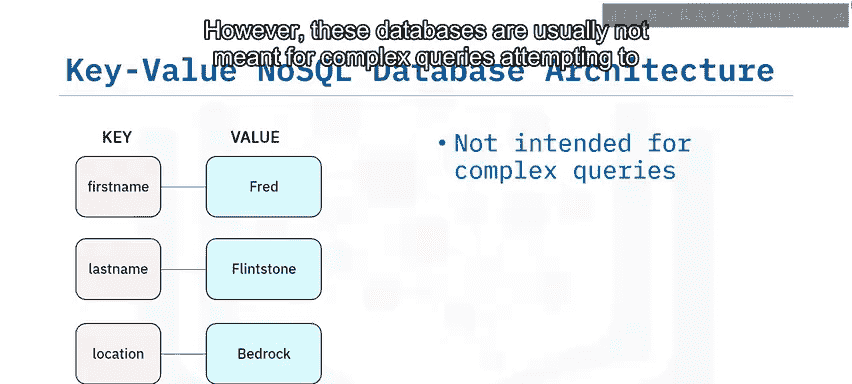

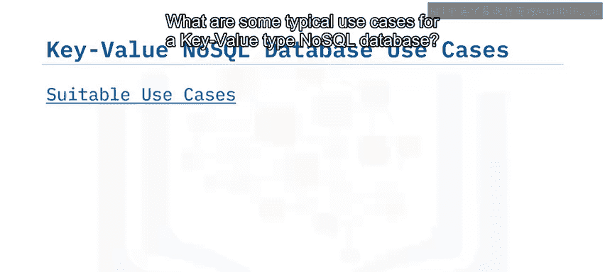

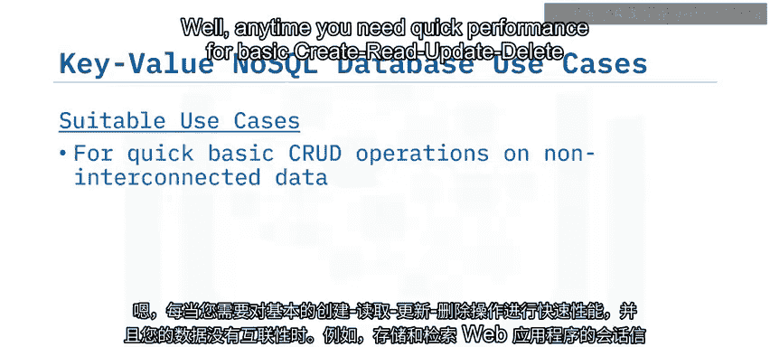

在这些案例中，复杂查询或处理不同键之间关系的需求很少。

---

## ⚠️ 不适用场景

当然，键值数据库并非万能。了解其不擅长的场景同样重要。

键值数据库**不适合**需要处理大量数据间关联的场景。例如：

*   当您的数据具有复杂的**多对多关系**时，例如社交网络或推荐引擎场景，键值数据库可能表现不佳。
*   如果您的用例要求涉及多个键的**多操作事务**具有高度一致性，您可能需要考虑支持ACID事务的数据库。
*   如果您预期需要**基于值（而非键）进行查询**，那么明智的做法是考虑**文档型**NoSQL数据库。

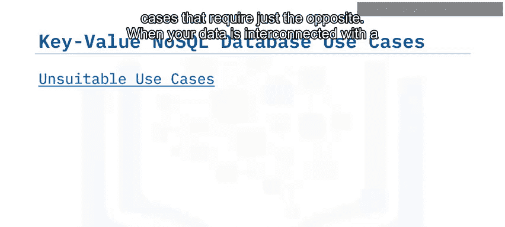

---

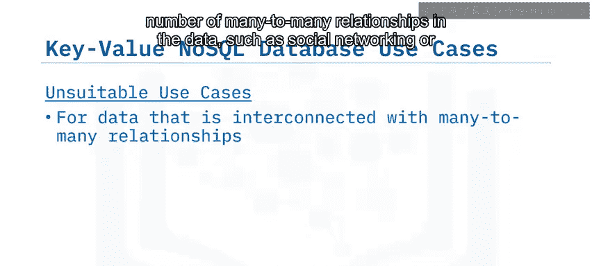

## 🌟 流行实现方案

最后，我们来了解一些市场上流行的键值数据库实现。

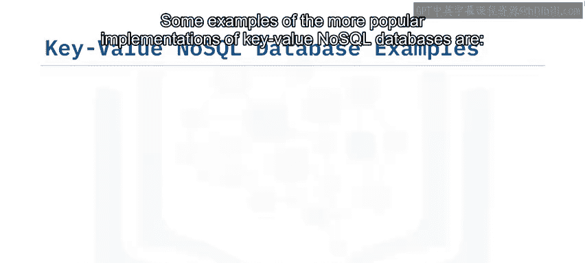

以下是一些知名的键值NoSQL数据库：
*   Amazon DynamoDB
*   Oracle NoSQL Database
*   Redis
*   Aerospike
*   Riak KV
*   Memcached
*   Project Voldemort

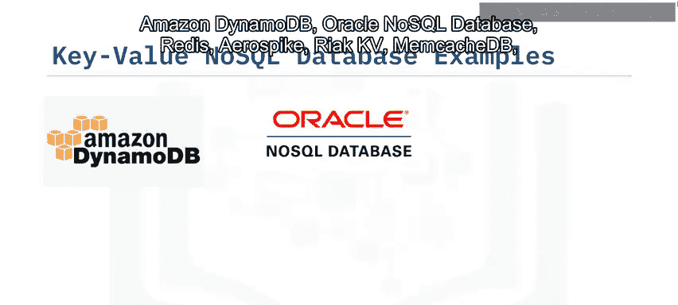

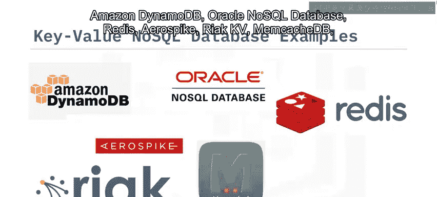

---

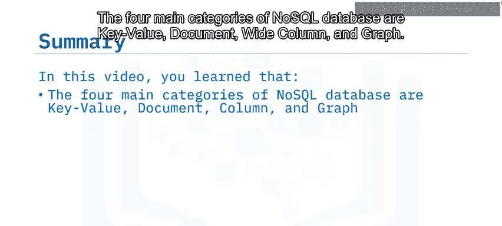

## 📝 课程总结

本节课中，我们一起学习了NoSQL数据库的四大类别之一：**键值数据库**。

我们了解到，键值数据库在架构上最为简单，数据以**键-值对**的形式存储，核心模型是**哈希映射**。它的主要优势在于为简单的CRUD操作提供极快的性能，并且易于水平扩展。其典型应用包括存储会话信息、用户配置和购物车数据等场景。但同时，它不适合处理复杂关系查询或多键事务。

下一节，我们将继续探索NoSQL数据库的另一重要类别：**文档数据库**。