# 004：文档型数据库

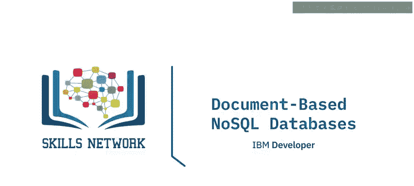

在本节课中，我们将要学习NoSQL数据库的一个重要类别：**文档型数据库**。我们将了解其基本架构、核心特性、适用场景以及一些流行的实现方案。

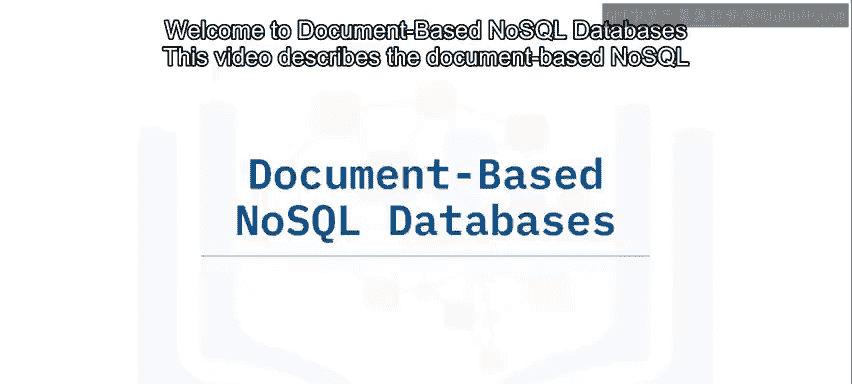

---

## 概述：什么是文档型数据库？

文档型数据库在键值模型的基础上进行了扩展，其核心特点是让“值”变得可见且可查询。在文档型数据库中，每一条数据都被视为一个**文档**，通常以`JSON`或`XML`格式存储。

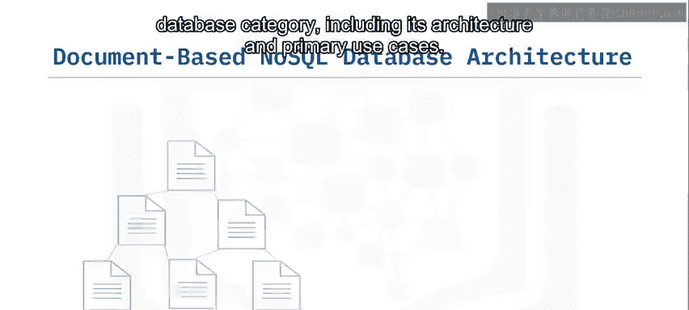

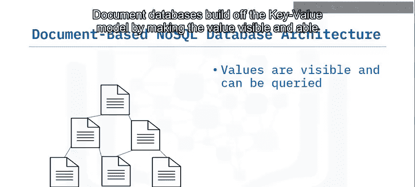

上一节我们介绍了键值型数据库，本节中我们来看看文档型数据库如何通过结构化文档提供更强大的数据操作能力。

---

## 核心特性与架构

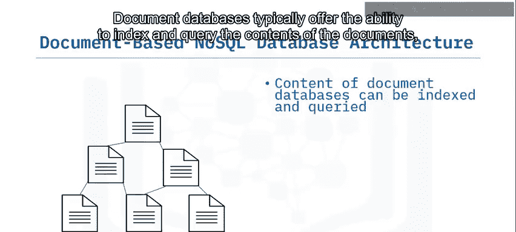

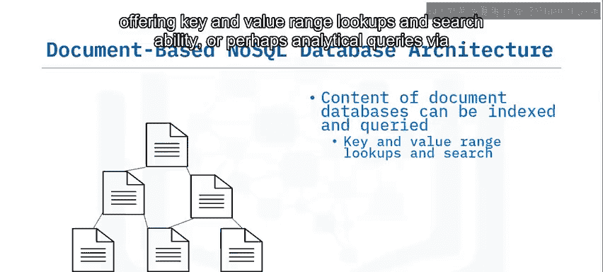

文档型数据库具备以下几个关键特性：

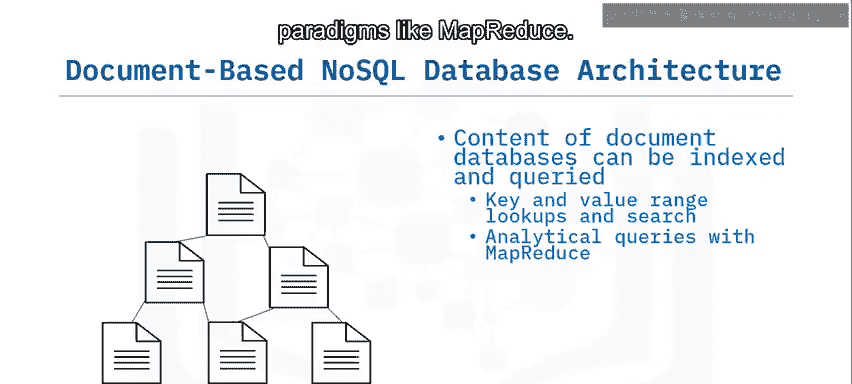

*   **灵活的模式**：每个文档都可以拥有不同的结构，无需包含相同的信息。这为存储半结构化或非结构化数据提供了极大的便利。
*   **可查询的内容**：与简单的键值存储不同，文档型数据库允许对文档内容进行索引和查询。这包括基于键和值范围的查找，甚至可以通过类似`MapReduce`的范式进行复杂的分析查询。
*   **水平可扩展性**：它们支持通过分片在多个节点上进行水平扩展。分片通常基于文档中的某个唯一键进行。
*   **事务保证**：文档型存储通常只保证**单文档操作的原子性事务**。这意味着涉及多个文档的复杂事务可能无法得到完全支持。

---

## 主要应用场景

以下是文档型NoSQL数据库的一些典型应用场景：

*   **应用程序或流程的事件日志记录**：每个事件实例都可以构成一个新的文档，其中包含与该事件相关的所有信息。
*   **在线博客平台**：每个用户、每篇博文、每条评论或点赞都可以存储为一个独立的文档。所有文档都包含与其数据类型相关的信息，例如用户名、帖子内容或创建时间戳。
*   **Web和移动应用的操作数据集**：文档型数据库非常适合为Web和移动应用程序存储操作数据或元数据。它们的设计初衷就考虑了互联网、`JSON`、RESTful API和非结构化数据。

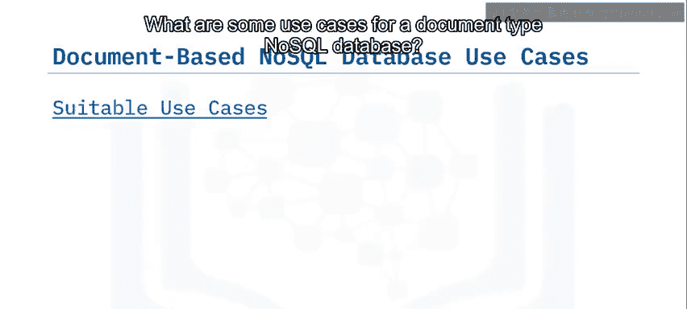

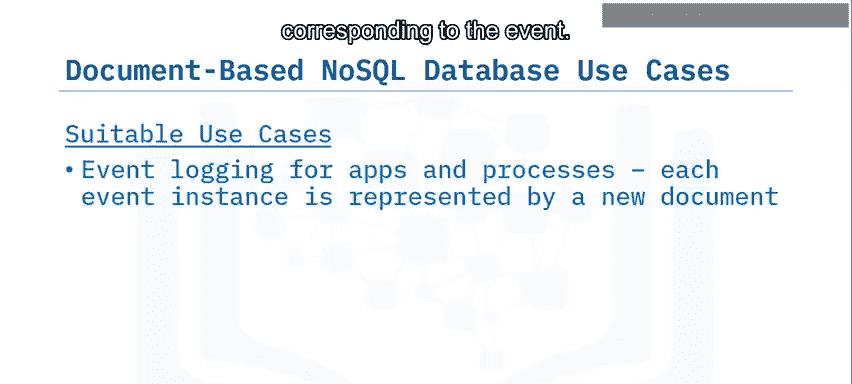

---

## 不适用场景

了解何时不应使用文档型数据库同样重要：

*   **需要ACID事务的场景**：如果您的用例要求跨多个文档的强一致性ACID事务，文档型数据库可能无法满足需求。在这种情况下，关系型数据库可能是更好的选择。
*   **数据天然符合规范化表格模型**：如果您发现自己正在强行将数据塞入“面向聚合”的设计中，而数据本身更自然地符合规范化的表格模型，那么您应该考虑使用关系型数据库。

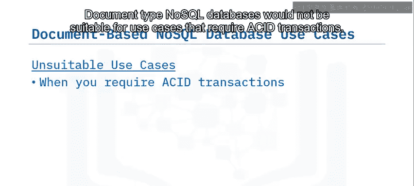

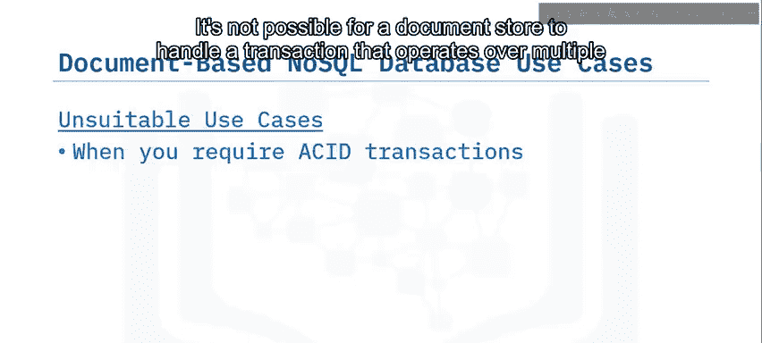

---

## 流行实现方案

文档型数据库是当前使用最广泛的NoSQL数据库类别之一。以下是一些流行的文档型NoSQL数据库实现：

*   IBM Cloudant
*   MongoDB
*   Apache CouchDB
*   Terrastore
*   OrientDB
*   Couchbase
*   RavenDB

---

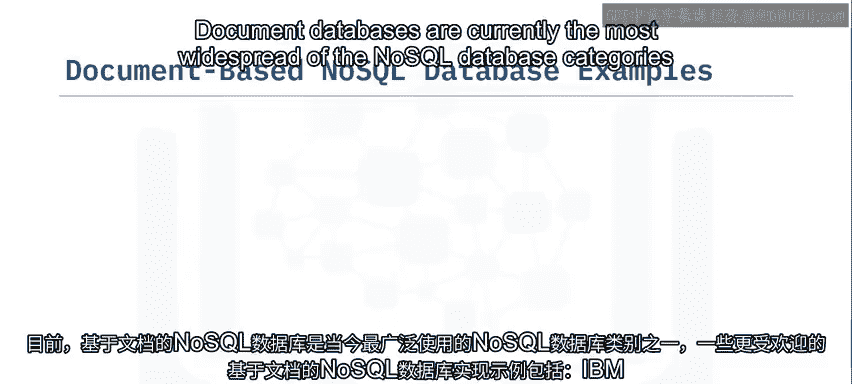

## 总结

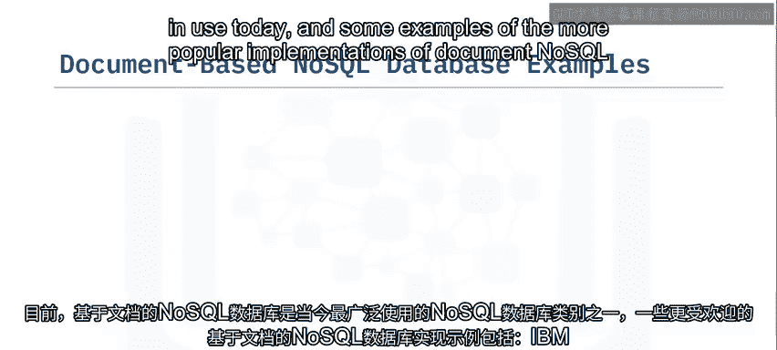

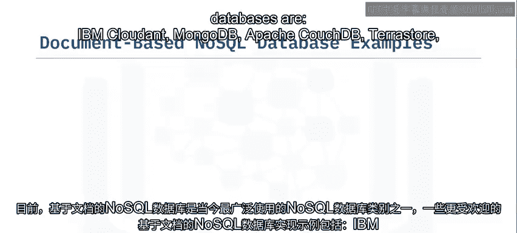

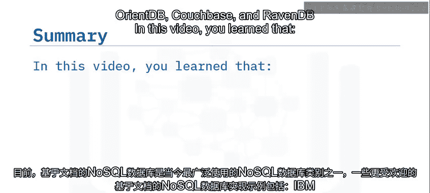

本节课中，我们一起学习了文档型NoSQL数据库。我们了解到，文档型数据库使用**文档**（通常为`JSON`或`XML`格式）来存储数据，每个文档都提供**灵活的模式**。它们的主要应用场景包括**应用事件日志记录**、**在线博客**以及为**Web和移动应用**提供操作数据存储。同时，我们也明确了其在需要跨文档ACID事务或数据高度规范化场景下的局限性。