# 005：列式NoSQL数据库类别

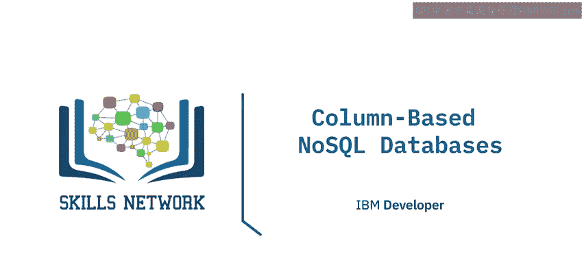

在本节课中，我们将学习列式NoSQL数据库。我们将了解其架构、核心概念以及主要应用场景。

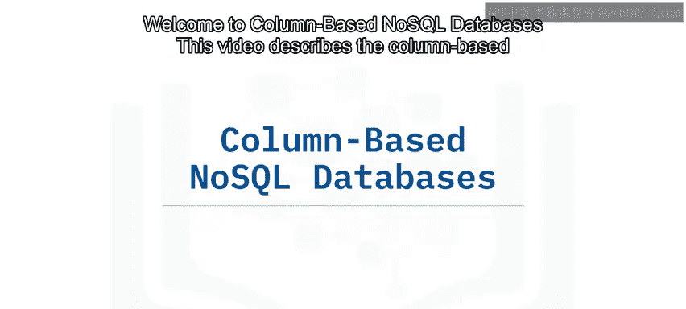

---

## 🏗️ 列式数据库的起源与架构

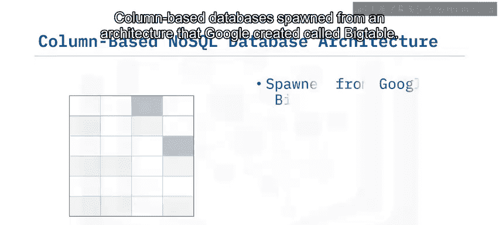

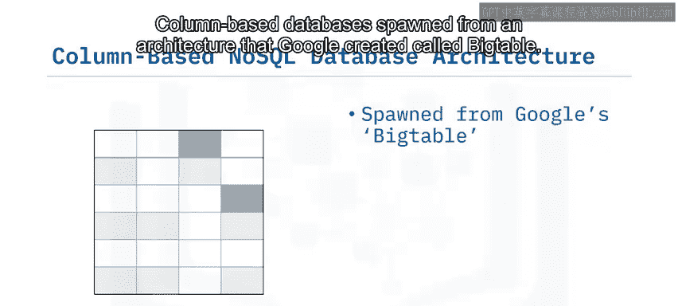

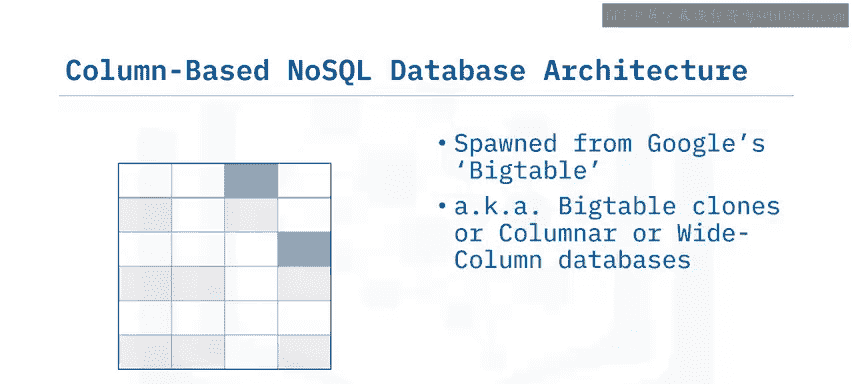

列式数据库源自谷歌创建的名为**Big Table**的架构。因此，这些数据库通常也被称为**Big Table克隆**、**列式数据库**或**宽列数据库**。

从名称可以看出，这类数据库在存储和访问数据时，关注的是**列**和**列组**。

---

## 🔑 核心概念：列族

列族由若干行组成，每一行都有一个唯一的键或标识符，并且属于一个或多个列。这些列被分组在一起形成列族，因为它们经常被一起访问。

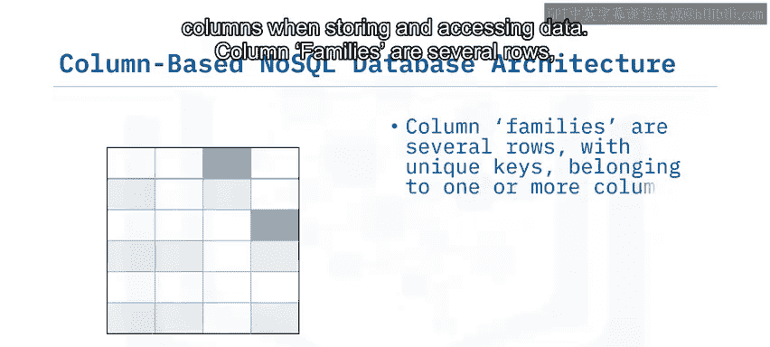

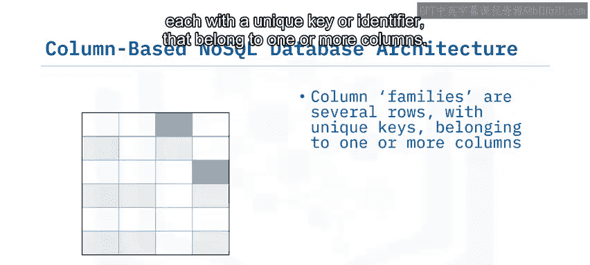

需要特别指出的是，**列族中的行并不要求共享相同的列**。它们可以共享所有列、一个子集的列，或者完全不共享任何列。此外，列可以被添加到任意数量的行中，而不必添加到所有行。

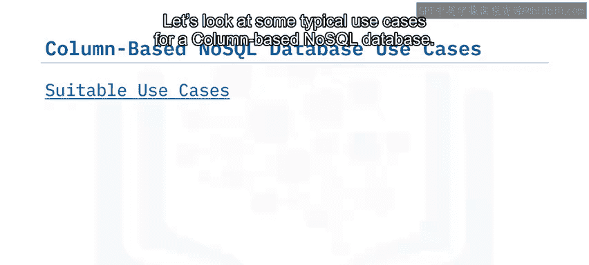

---

## 💡 列式数据库的典型应用场景

以下是列式NoSQL数据库的一些典型应用场景。

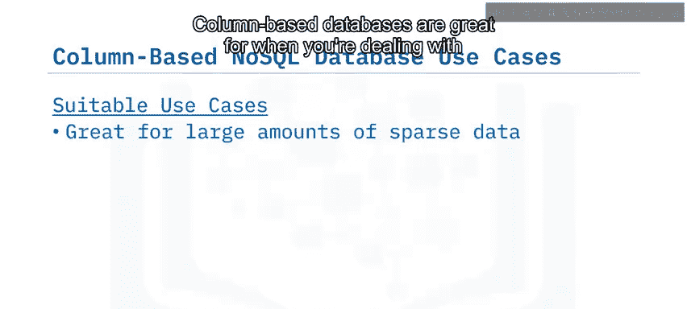

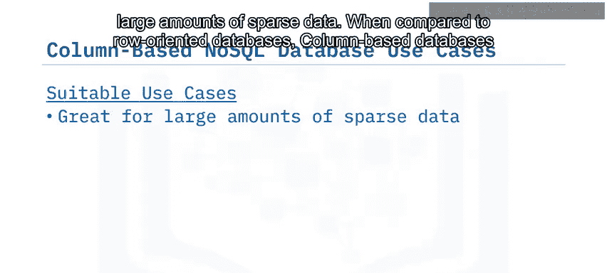

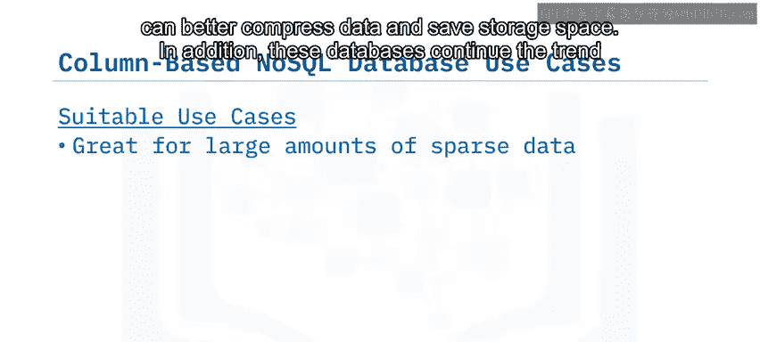

### 优势场景

*   **处理大量稀疏数据**：与面向行的数据库相比，列式数据库在处理大量稀疏数据时表现更佳。它们能更好地压缩数据，节省存储空间。
*   **水平可扩展性**：与键值数据库和文档数据库一样，列式数据库延续了水平扩展的趋势，能够部署在跨节点的集群上。

### 具体用例

*   **事件日志和博客**：类似于文档数据库，列式NoSQL数据库也可用于事件日志和博客，但数据存储方式不同。例如，在企业日志记录中，每个应用程序可以写入自己的一组列，并且每行的键可以按特定方式格式化，以便于根据应用程序和时间戳进行查找。
*   **计数器**：计数器是列式数据库的一个独特用例。有些应用程序需要一种简单的方法来计数或在事件发生时递增。像**Cassandra**这样的列式数据库具有特殊的列类型，允许简单的计数器功能。
*   **具有时效性的数据**：列可以设置**生存时间**参数，这使得它们适用于具有过期日期或时间的数据，例如试用期或广告定时。

### 不适用场景

另一方面，在以下情况下应避免使用列式数据库：
*   **需要传统ACID事务**：如果应用需要关系数据库提供的传统ACID事务保证，则不适合。列式数据库的读写原子性仅在行级别。
*   **查询模式在早期开发中可能频繁变化**：如果在开发早期查询模式可能发生变化，并需要对列式设计进行大量修改，这可能会代价高昂并拖慢生产时间线。

---

## 🛠️ 流行的列式NoSQL数据库实现

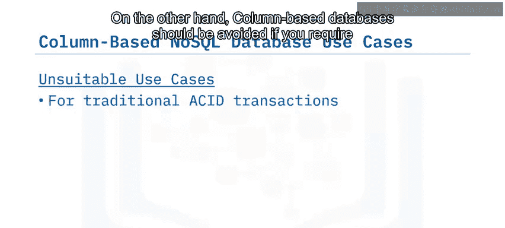

一些更流行的列式NoSQL数据库实现包括：
*   **Cassandra**
*   **HBase**
*   **HyTable**
*   **Accumulo**

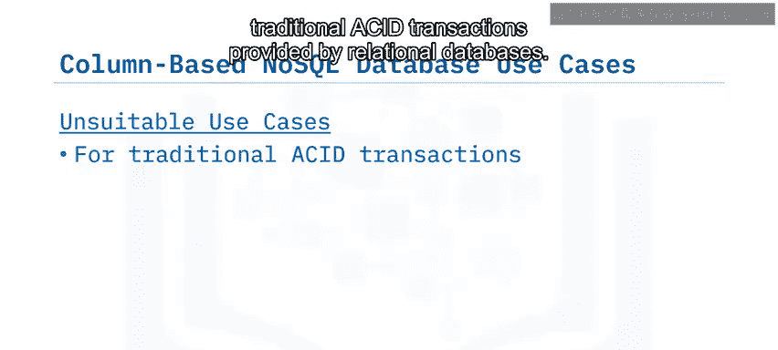

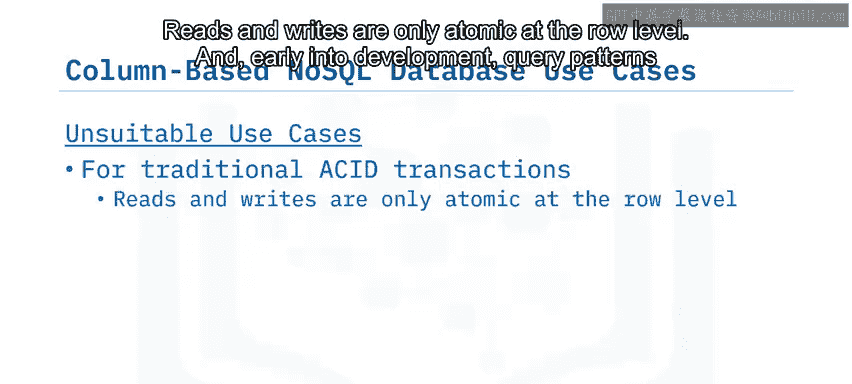

---

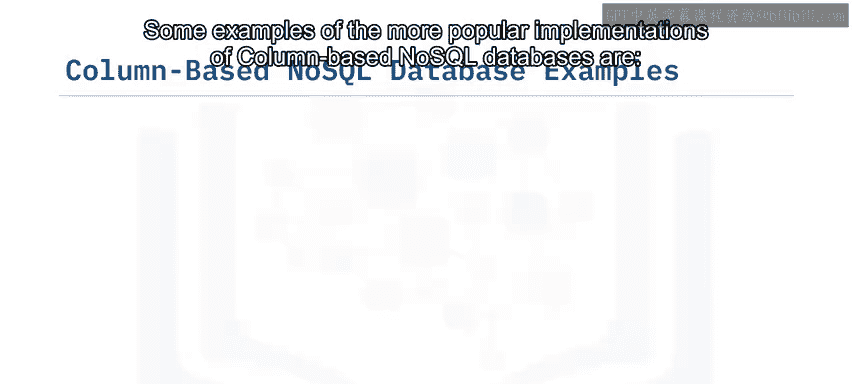

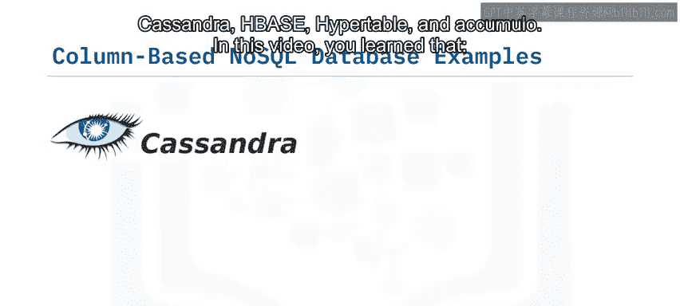

## 📝 课程总结

本节课中，我们一起学习了列式NoSQL数据库。

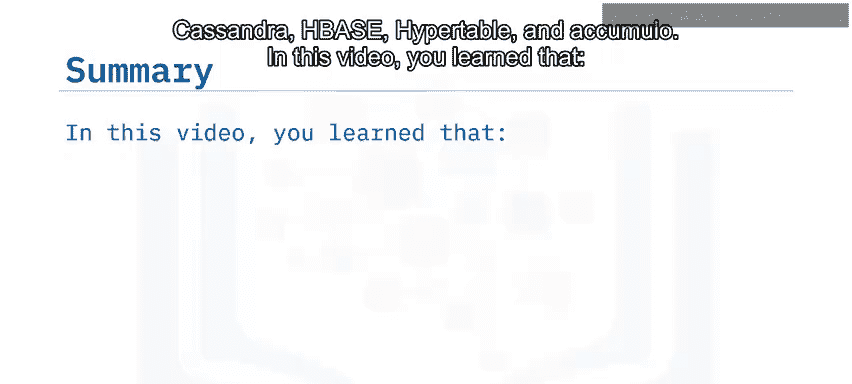

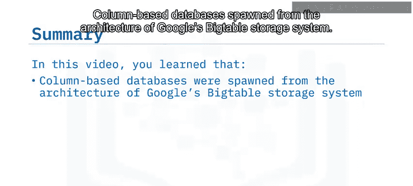

我们了解到，列式数据库源自谷歌的**Big Table**存储系统架构。这类数据库将数据存储在**列**或**列组**中。

**列族**是由若干具有唯一键的行组成的，这些行属于一个或多个列。

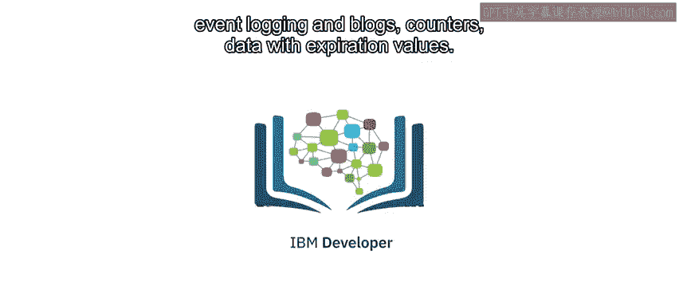

列式NoSQL数据库的主要应用场景包括：**事件日志和博客**、**计数器**以及**具有时效性值的数据**。