# 006：图形数据库 🕸️


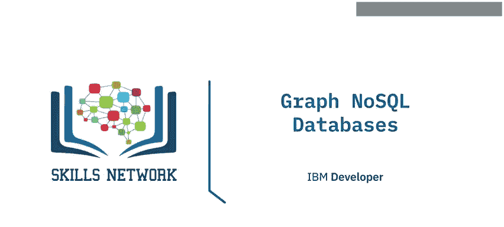

在本节课中，我们将要学习NoSQL数据库的最后一个类别——图形数据库。我们将了解其架构、核心特性、适用场景以及一些流行的实现。

## 概述

图形数据库是NoSQL数据库的一个重要分支，它采用独特的方式存储和查询数据。与之前讨论的键值、文档和列族数据库不同，图形数据库专注于实体之间的关系。本节我们将深入探讨图形数据库的架构和主要用例。

## 图形数据库架构

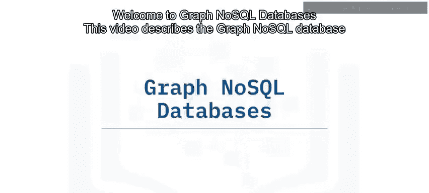

上一节我们介绍了其他NoSQL数据库类别，本节中我们来看看图形数据库的独特架构。

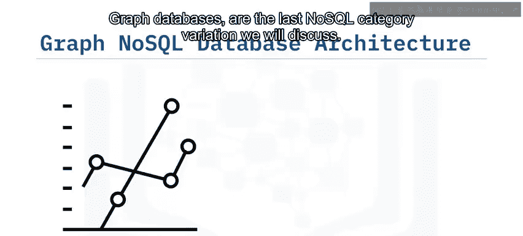

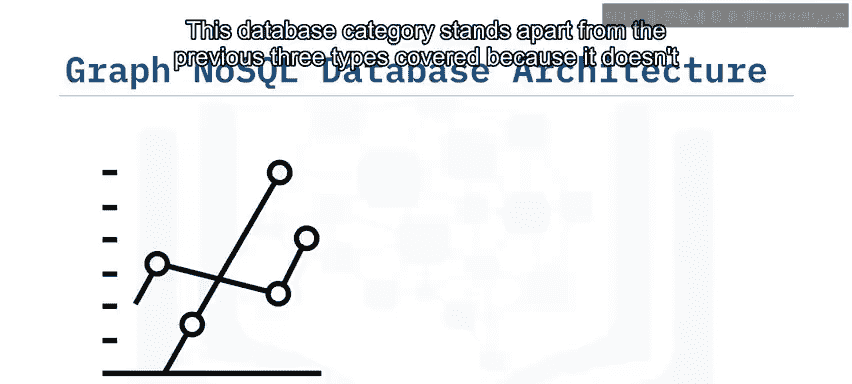

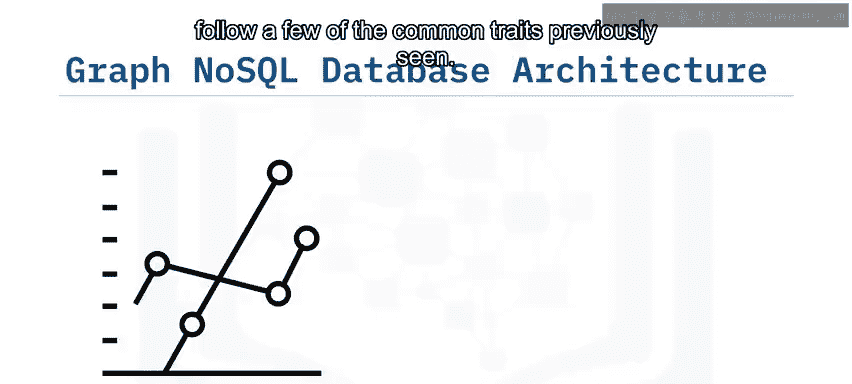

图形数据库将信息存储在**实体**（或称**节点**）和**关系**（或称**边**）中。其核心思想可以用以下概念模型表示：

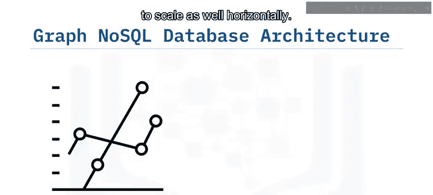

```
(节点A) --[关系]--> (节点B)
```

当您的数据集类似于图形数据结构时，图形数据库的表现会非常出色。遍历所有关系既快速又高效。然而，这类数据库在水平扩展方面往往表现不佳。

## 核心特性

以下是图形数据库的一些关键特性：

*   **不推荐分片**：由于遍历一个节点分散在多个服务器上的图形会变得困难并损害性能，因此通常不推荐对图形数据库进行分片。
*   **ACID事务兼容**：与之前讨论的其他NoSQL数据库非常不同，图形数据库通常遵循ACID（原子性、一致性、隔离性、持久性）事务原则。这可以防止节点之间存在不存在的悬空关系。

## 典型用例

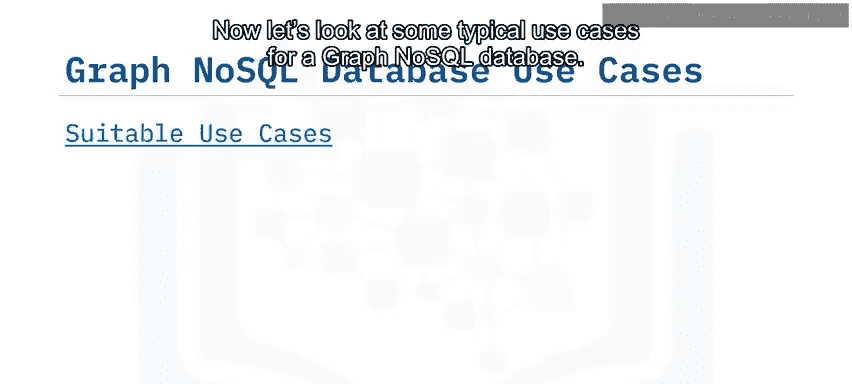

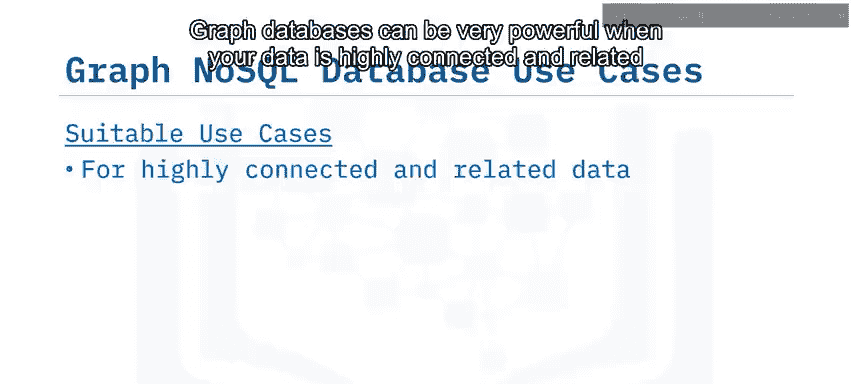

现在让我们看看图形数据库的一些典型应用场景。当您的数据高度互联并以某种方式相关时，图形数据库会非常强大。

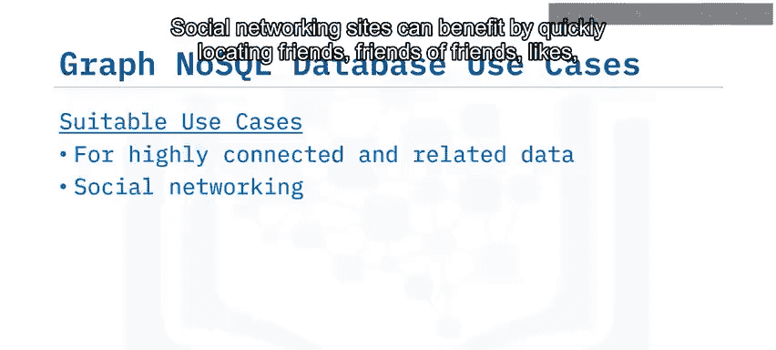

以下是图形数据库的主要适用领域：

*   **社交网络**：可以快速定位朋友、朋友的朋友、点赞关系等。
*   **路由、空间和地图应用**：可以轻松地为其数据建模，以查找附近位置或构建最短路径导航。
*   **推荐引擎**：可以利用产品之间的紧密关系和链接，轻松为客户提供其他选项。

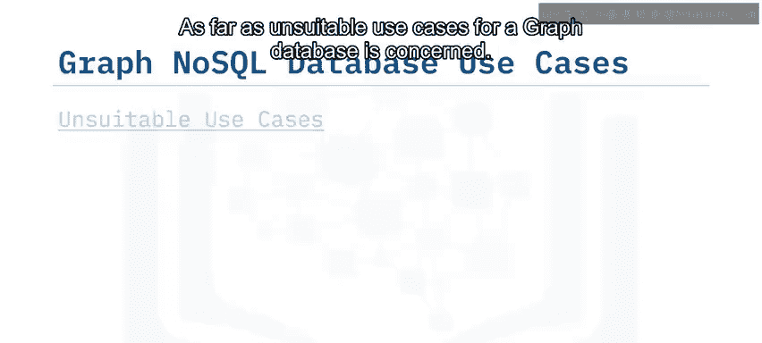

## 不适用场景

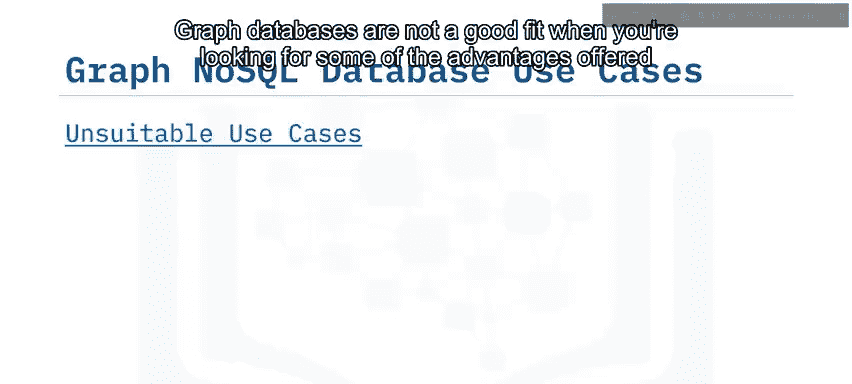

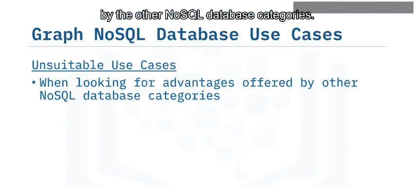

就图形数据库的不适用场景而言，当您需要其他NoSQL数据库类别提供的某些优势时，图形数据库并不是一个好的选择。

当应用程序需要进行水平扩展时，您很快就会遇到这类数据存储相关的限制。

另一个普遍的缺点是，当尝试用给定参数更新所有或部分节点时，这类操作可能被证明是困难且非平凡的。

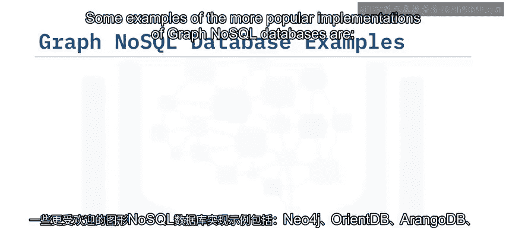

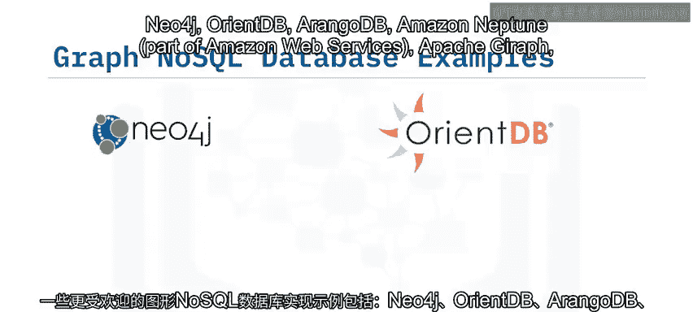

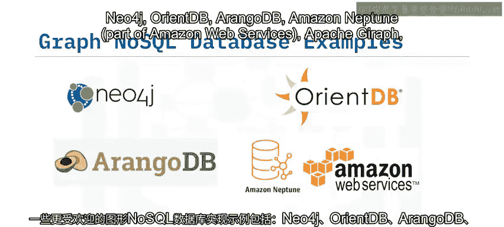

## 流行实现

以下是一些较流行的图形NoSQL数据库实现示例：

*   Neo4j
*   OrientDB
*   ArangoDB
*   Amazon Neptune（亚马逊网络服务的一部分）
*   Apache Giraph
*   JanusGraph

## 总结

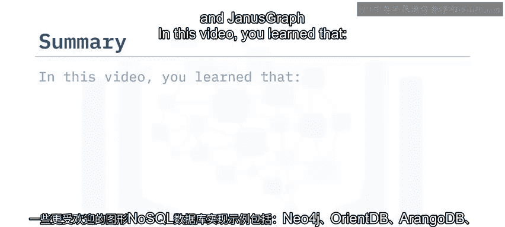

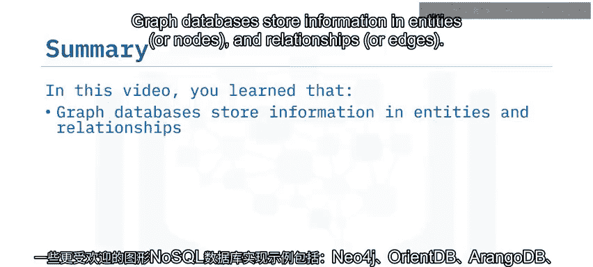

本节课中，我们一起学习了图形数据库。我们了解到，图形数据库将信息存储在实体（节点）和关系（边）中。当您的数据类似于图形数据结构时，图形数据库表现优异。图形数据库不适合分片，但遵循ACID事务。图形NoSQL数据库类别的主要用例适用于高度互联和相关的数据，例如社交网站、路由、空间和地图应用以及推荐引擎。