# 008：分布式数据库 🗄️

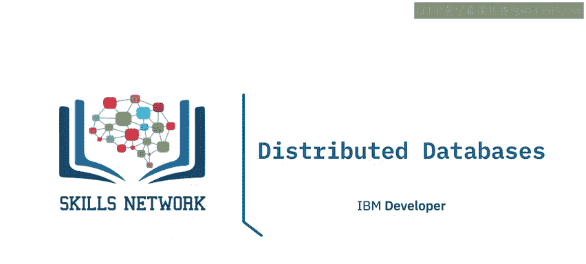

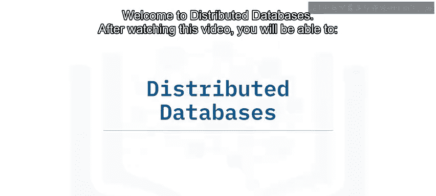

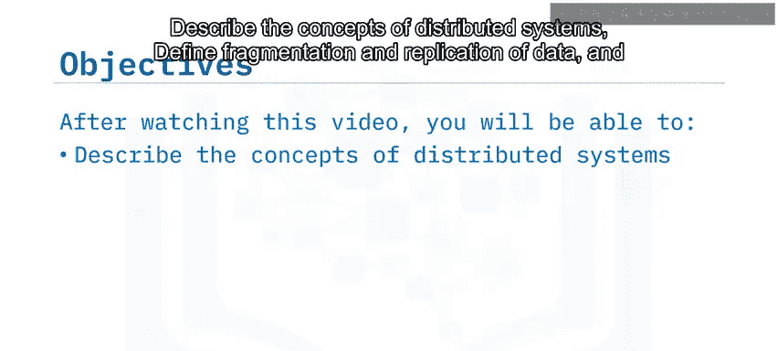

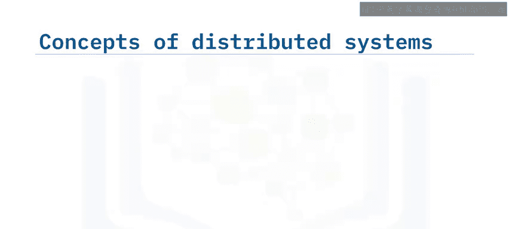

在本节课中，我们将要学习分布式数据库的核心概念。我们将了解什么是分布式数据库，以及它如何通过数据分片和复制来工作。同时，我们也会探讨分布式系统的优势与面临的挑战。

## 分布式数据库概述

分布式数据库是由多个相互连接的数据库组成的集合。这些数据库物理上分布在不同的地理位置，并通过计算机网络进行通信。

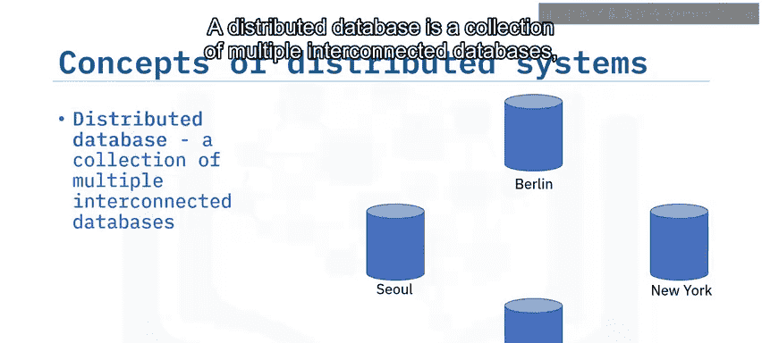

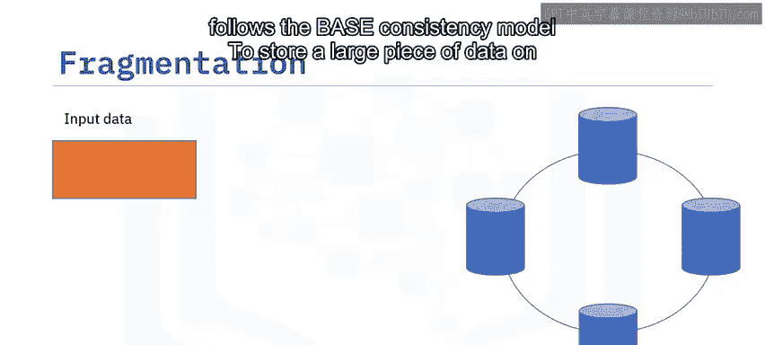

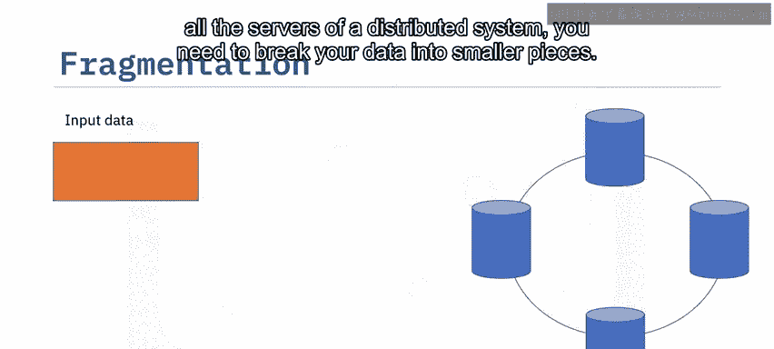

## 数据分片与复制

为了在分布式系统的所有服务器上存储大量数据，你需要将数据分解成更小的片段。这个过程被称为**数据分片**，在某些NoSQL数据库中也称为数据分区或分片。

无论名称如何，所有分布式系统都需要提供一种存储大块数据的方法。这个过程通常通过键值对记录中的键以两种方式完成：
*   按字典顺序对所有键进行分组。例如，所有以A开头或在A到C之间的键可以存储在特定的服务器上。
*   将所有具有相同键的记录分组，并将它们放在同一台服务器上。例如，所有以商店ID为键的交易记录。这样，当查询“给我某个商店的所有销售额”时，所有记录都将位于单个服务器上。

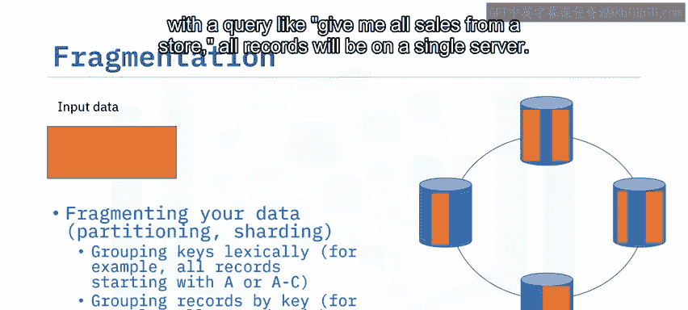

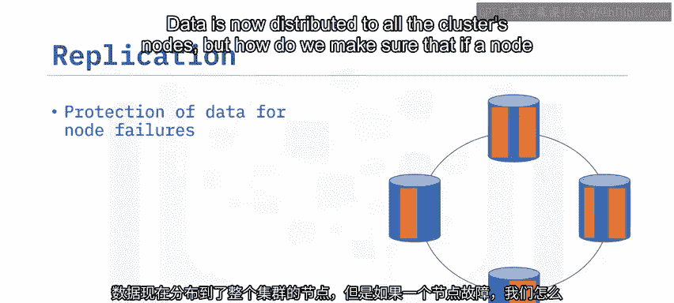

数据现在已经分布到集群的所有节点。但如何确保一个节点故障时，不会丢失该节点上的所有数据？这是通过**复制**实现的，即你的数据的所有分片或分区都冗余地存储在两个或更多站点。

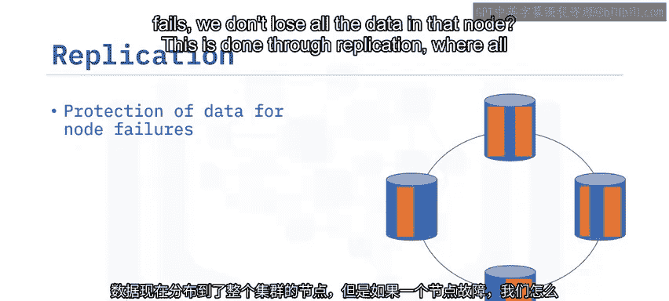

因此，在复制中，系统维护数据的副本。复制提高了数据在不同站点的可用性。如果一个节点故障，可以从另一个节点检索该数据片段。

## 分布式系统的优势与挑战

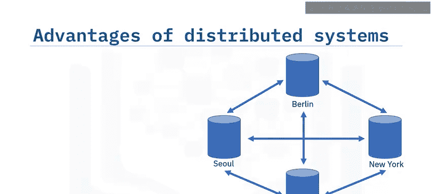

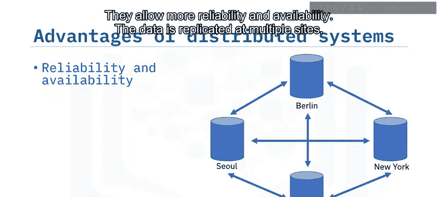

分布式系统具有众多优势。它们提供了更高的可靠性和可用性。数据在多个站点复制。如果本地服务器不可用，可以从另一个可用服务器检索数据。

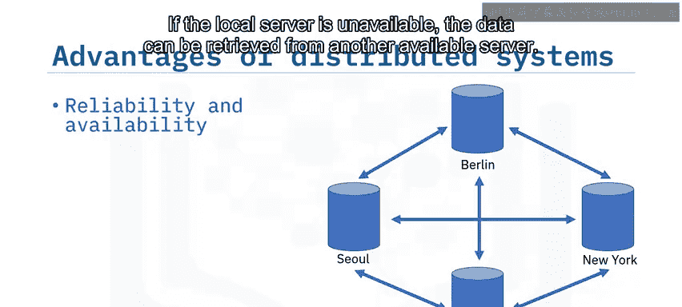

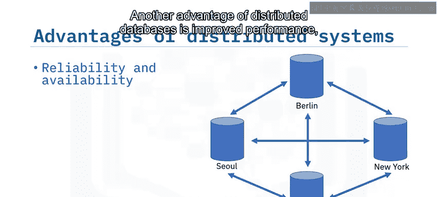

分布式数据库的另一个优势是提高了性能，尤其是在处理海量数据时。查询处理时间减少，这也有助于提升性能。你可以轻松地扩展系统容量，只需向集群添加新服务器即可。分布式系统还提供持续运行，减少了对中心站点的依赖。

分布式数据库解决了当今应用服务的许多技术问题，如可用性、快速扩展和全球覆盖。但其架构也引入了一些挑战。

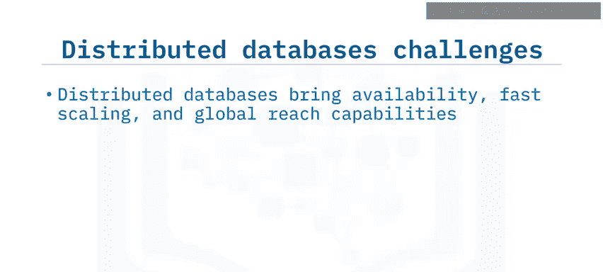

其中之一是**并发控制**。因为同一份数据存储在多个位置，如果你修改、更新或删除数据，如何确保数据同步的安全性？为了解决这个问题，一些分布式数据库将针对某个数据分片的操作定向到仅一个节点，然后由集群与其他节点同步。

另一些数据库则写入所有持有该特定数据分片的节点，并根据一致性要求从尽可能多的节点读取。在这两种情况下，开发者都可以控制操作的一致性，或者规定需要多少个节点响应才能使某个操作被视为成功。

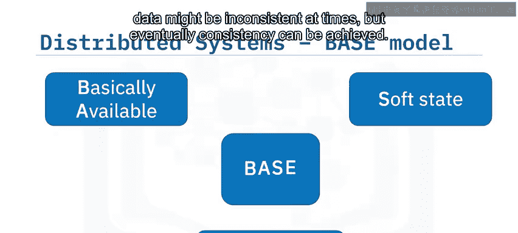

由于并发控制问题，分布式数据库在设计上并不真正支持事务，或者只提供非常有限的事务支持。请记住上一视频中的BASE模型。分布式数据库遵循BASE模型，即基本可用、软状态、最终一致性。系统始终保持可用，数据有时可能不一致，但最终可以达到一致性。

## 总结

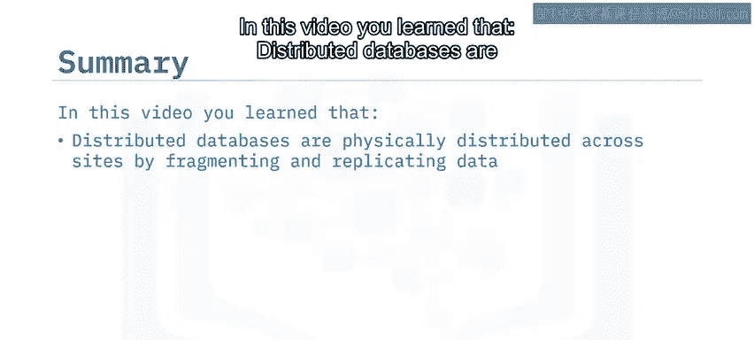

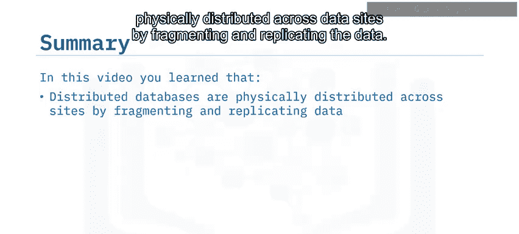

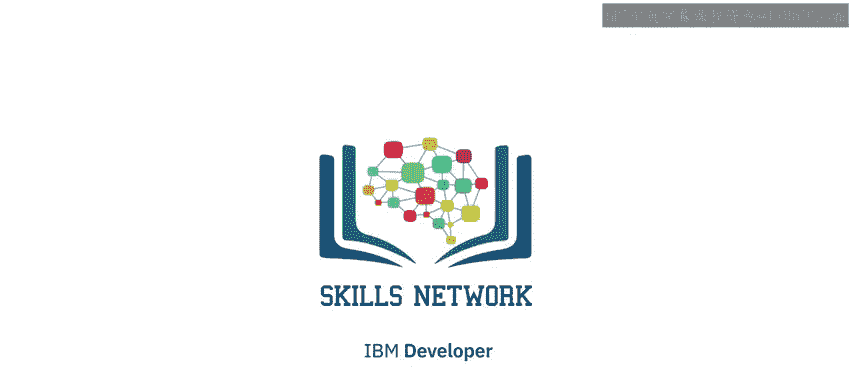

本节课中，我们一起学习了分布式数据库。我们了解到，分布式数据库通过数据分片和复制在物理上分布于各个数据站点。分片使组织能够通过将数据分解成更小的片段，将大量数据存储在分布式系统的所有服务器上。复制意味着你的数据的所有分区都冗余地存储在两个或更多站点；通过复制，如果一个节点故障，可以从另一个节点检索该数据片段。分布式数据库提供了若干优势，但也有其缺点，并且分布式数据库遵循BASE一致性模型。