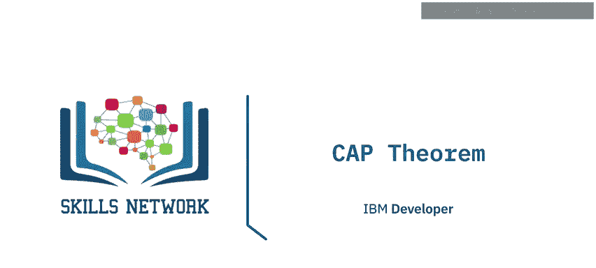
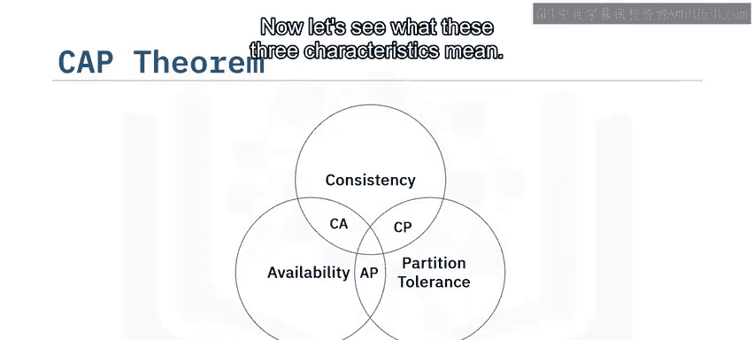
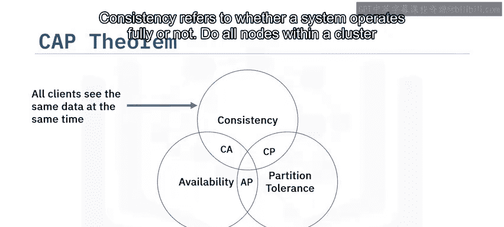
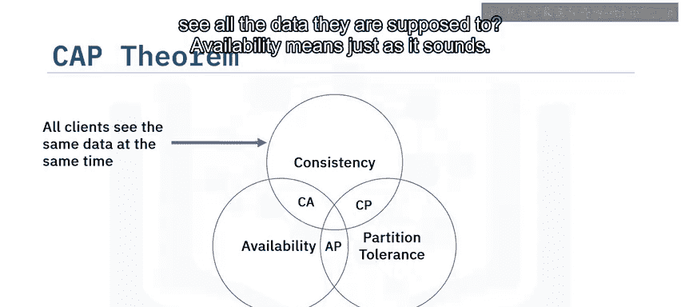
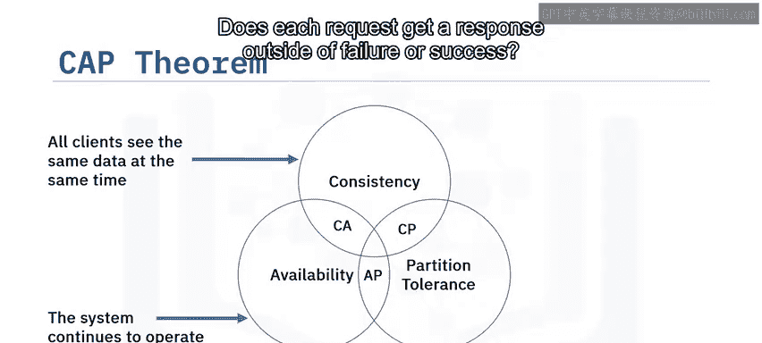
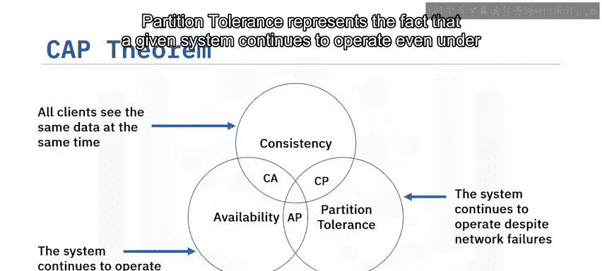
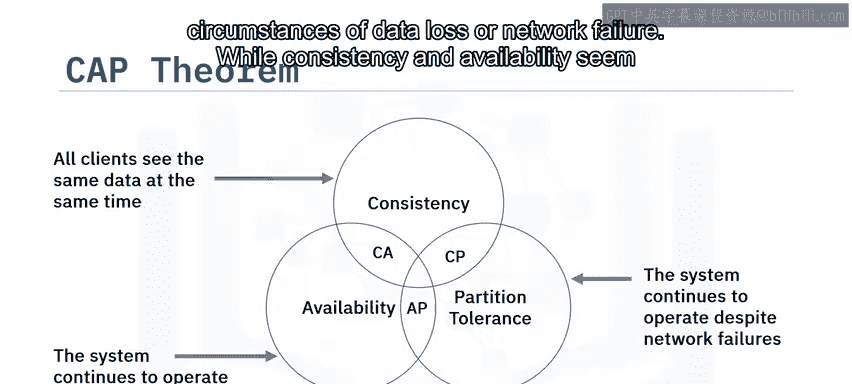
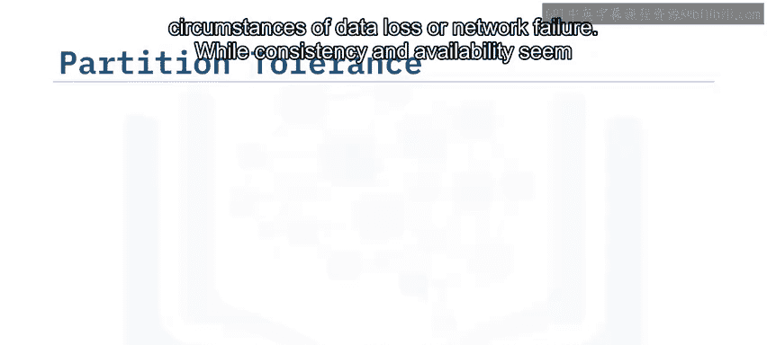
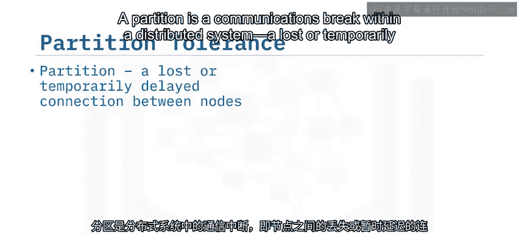
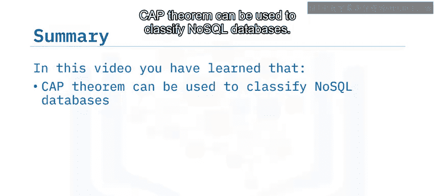

# 009：CAP定理 🧩

在本节课中，我们将学习CAP定理。通过本节内容，你将能够定义CAP定理，描述其核心特性，并了解其历史背景与现实意义。

## CAP定理的起源与背景

在21世纪初，大数据Hadoop架构作为首个能够存储和处理海量数据的开源分布式架构被创建。与此同时，越来越多的服务要求数据库也实现分布式部署。这些业务不仅需要其服务在全球大部分地区保持活跃和可访问，还要求服务始终保持可用性。

对于高度依赖数据一致性的关系型数据库而言，在分布式系统中同时保证可用性这一新概念似乎是不可能的。CAP定理证实了这一点。

CAP定理也被称为布鲁尔定理，因为它最初由埃里克·A·布鲁尔教授在2000年的一次分布式计算演讲中提出。两年后，麻省理工学院的塞斯·吉尔伯特和南希·林奇教授对其进行了修订，此后还有许多其他贡献者。

该定理指出，在分布式系统中成功设计、实现和部署应用程序需要三个基本的系统需求。它们是：**一致性**、**可用性**和**分区容错性**。一个分布式系统最多只能同时保证这三个理想特性中的两个。

## 理解CAP的三个特性

上一节我们介绍了CAP定理的由来，本节中我们来看看这三个核心特性的具体含义。

### 一致性

一致性指的是系统是否完全运行。集群中的所有节点是否都能看到它们应该看到的所有数据？

**公式描述**：对于任何数据读取操作，系统返回的值必须是最近一次成功写入操作的结果。

### 可用性

可用性正如其名，指的是每个请求是否都能得到响应，无论该响应是成功还是失败。

**公式描述**：对于每一个向非故障节点发起的请求，系统必须在有限时间内给出响应。

### 分区容错性

分区容错性代表一个系统即使在发生数据丢失或网络故障的情况下，也能继续运行的能力。

**公式描述**：系统在遇到网络分区（即节点间通信中断）时，仍能继续提供服务。

## 深入探讨分区容错性

一致性和可用性的概念相对直观，那么分区容错性具体指什么呢？

在分布式系统中，分区是指通信中断，即节点之间连接丢失或暂时延迟。

分区容错性意味着，尽管系统中节点之间发生任意数量的通信故障，集群也必须能够继续工作。

在分布式系统中，分区是无法避免的。因此，分区容错性成为了像NoSQL这样的原生分布式系统的一个基本特性。

例如，在一个有八个分布式节点的集群中，可能会发生网络分区，导致所有节点间的通信中断。在这种情况下，我们将不再是一个八节点集群，而是变成两个可用的、更小的四节点集群。只有当网络通信重新建立时，两个集群之间的一致性才能恢复。

对于分布式系统，分区容错性已从一种可选项变为一种必需品。它通过跨节点和网络组合充分复制记录来实现，NoSQL等系统就是如此。

## CAP定理在NoSQL中的应用

由于分区容错性是强制性的，一个系统只能在**一致性+分区容错性** 或 **可用性+分区容错性** 之间做出选择。

现有的NoSQL系统，如MongoDB或Cassandra，可以用CAP定理来分类。

以下是两种典型选择：
*   **MongoDB**：选择**一致性**作为解决方案的主要设计驱动力。
*   **Apache Cassandra**：选择**可用性**。

这并不意味着MongoDB无法保持可用性，或者Cassandra无法实现完全一致性。它意味着这些解决方案首先确保自己是**一致的**（对于MongoDB）或**可用的**（对于Cassandra），而另一个特性则是可调整的。

## 总结

本节课中我们一起学习了CAP定理。你了解到CAP定理可用于对NoSQL数据库进行分类。NoSQL数据库需要在可用性和一致性之间做出权衡选择，而分区容错性是NoSQL数据库的一个基本特性。

