# 010：从RDBMS迁移到NoSQL数据库的挑战

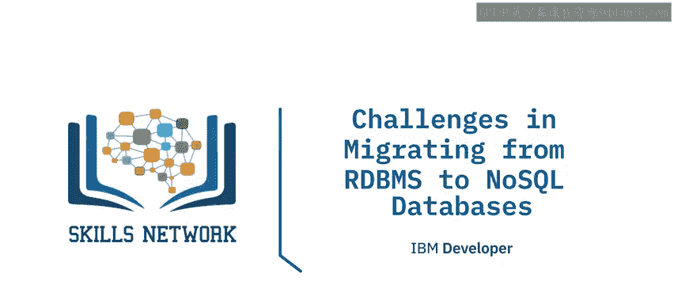

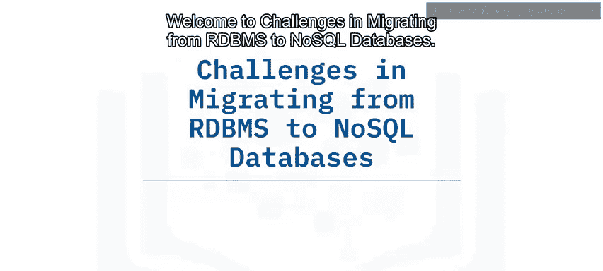

在本节课中，我们将要学习从关系型数据库管理系统迁移到NoSQL数据库时可能遇到的挑战。我们将探讨RDBMS和NoSQL各自最适合的应用场景，并详细分析两者之间的主要区别。

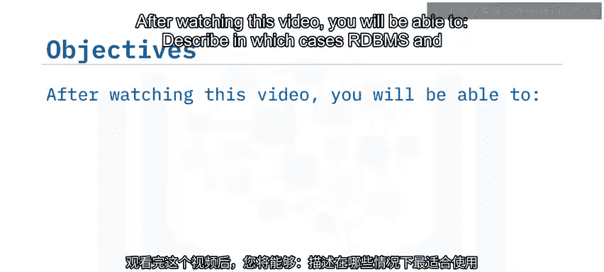

## 🎯 RDBMS与NoSQL：并非替代关系

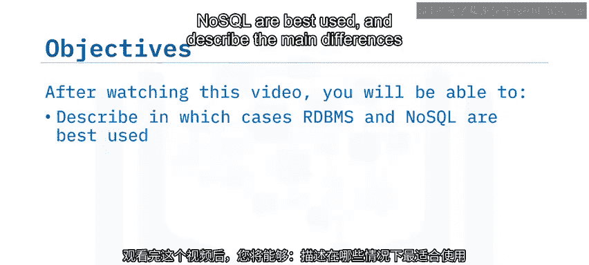

有时存在一种误解，认为NoSQL是RDBMS的替代品，或者必须在关系型数据库和非关系型数据库之间做出选择。实际上，RDBMS和NoSQL数据库并非竞争关系，因为它们服务于截然不同的需求和用例。

虽然从RDBMS系统迁移到NoSQL系统是可行的，但这一决策应基于最终解决方案所需的特性。这种变更可能由对更高性能或更灵活性的需求驱动。无论出于何种原因，都需要根据NoSQL能为你带来的价值来分析这些需求。

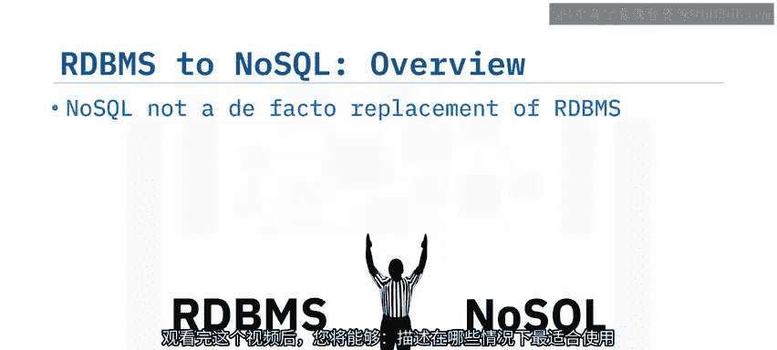

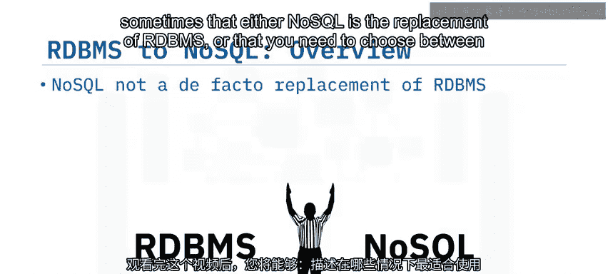

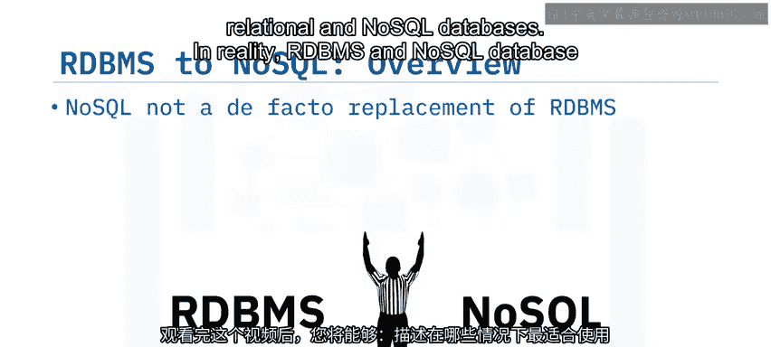

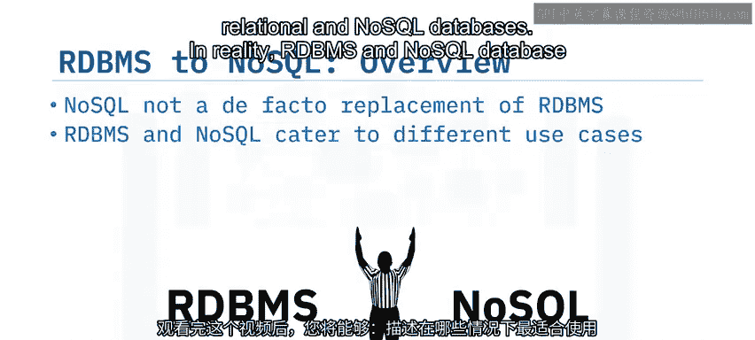

让我们看看一些通常选择关系型或非关系型数据库的通用场景。

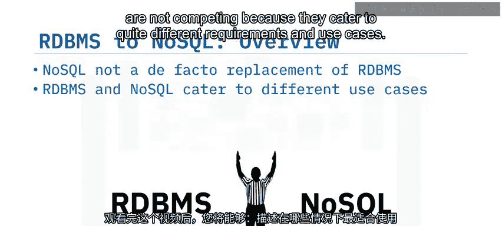

## 🔍 何时选择关系型数据库

以下是适合使用关系型数据库的情况：

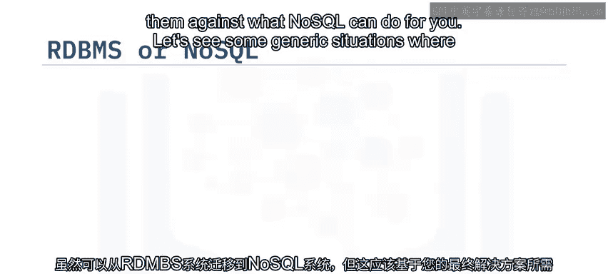

*   **数据需要完全一致性**：例如银行交易系统，要求数据时刻保持精确一致。
*   **数据结构化程度高**：数据可以清晰地组织成行和列，并具有预定义的模式。
*   **需要多文档/记录事务**：操作涉及多个数据项，要求要么全部成功，要么全部失败。
*   **涉及复杂的表连接**：查询需要频繁地在多个表之间建立关联以获取信息。

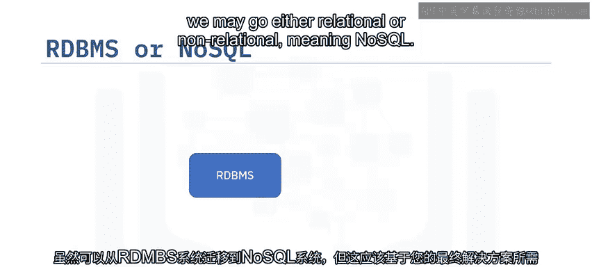

在这些情况下，关系型数据库是更合理的选择。

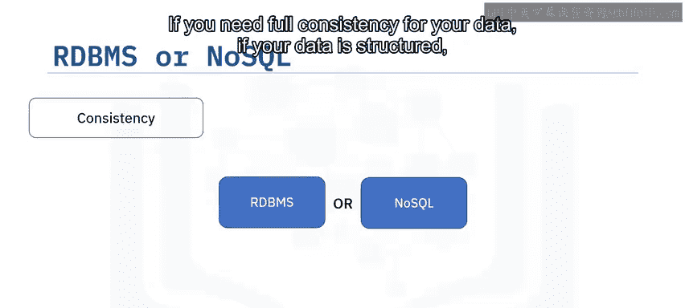

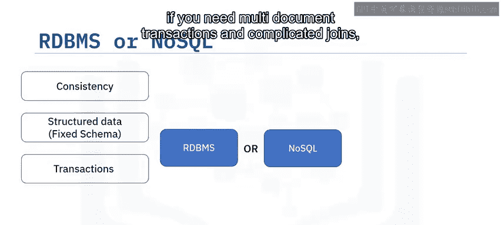

## 🚀 何时选择NoSQL数据库

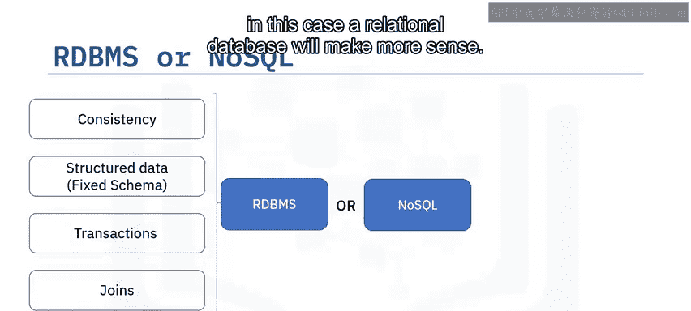

上一节我们介绍了关系型数据库的适用场景，本节中我们来看看NoSQL数据库的优势领域。

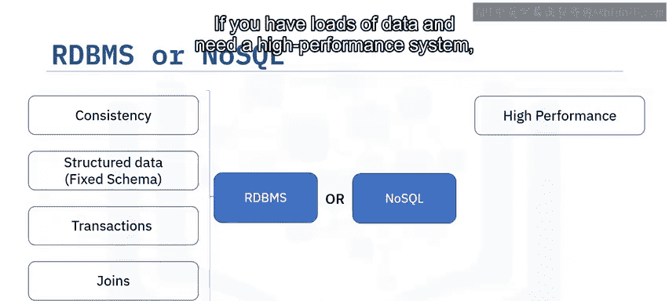

以下是适合使用NoSQL数据库的情况：

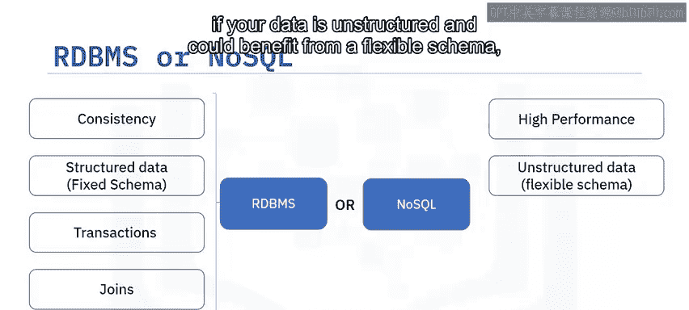

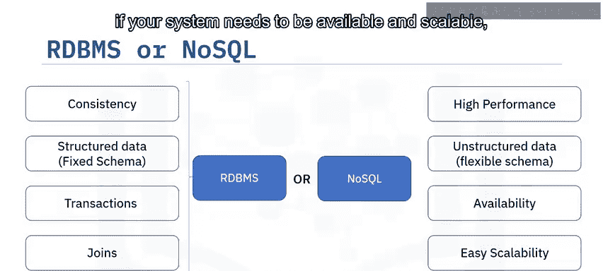

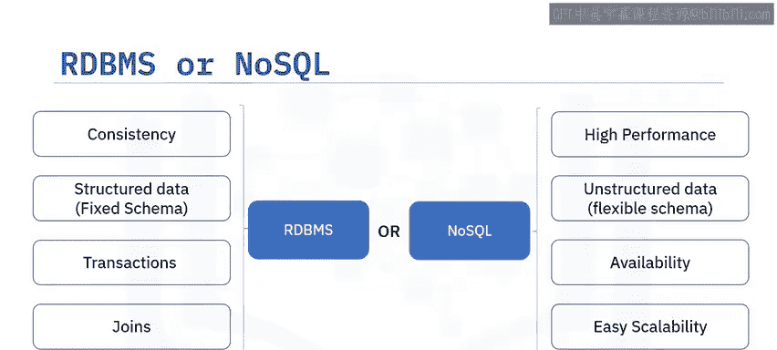

*   **数据量巨大且需要高性能系统**：例如处理海量用户日志或传感器数据。
*   **数据结构非结构化或半结构化**：数据格式灵活多变，可以从灵活的模式中受益。
*   **系统需要高可用性和可扩展性**：服务需要能够应对流量激增，并保证持续在线。

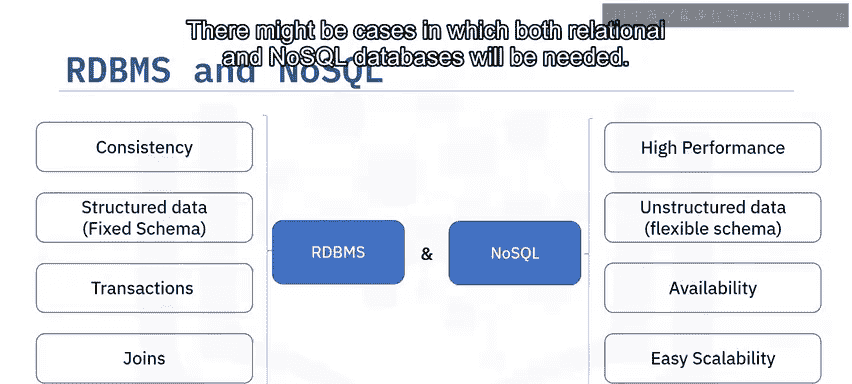

在这些情况下，NoSQL数据库是更合理的选择。

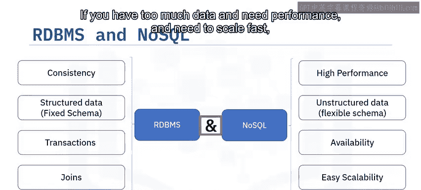

## 🤝 混合架构的可能性

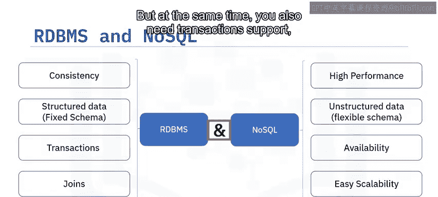

在某些情况下，可能需要同时使用关系型和非关系型数据库。

如果你面临海量数据、需要高性能和快速扩展，但同时你的数据又需要事务支持和复杂连接，那么你可能会考虑一种组合解决方案。例如，核心交易数据存放在RDBMS中以保证一致性，而用户生成的内容或日志数据则存放在NoSQL数据库中以实现扩展。

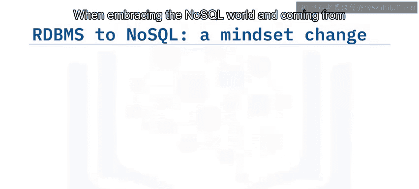

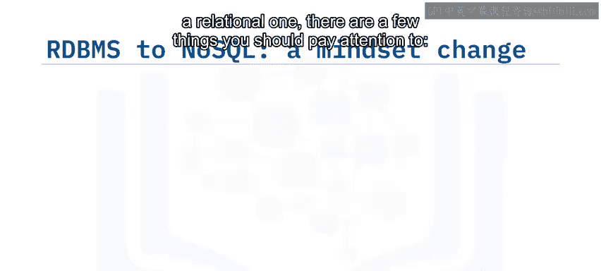

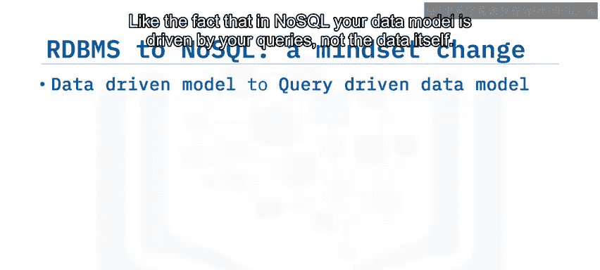

## 💡 迁移时需要关注的核心概念差异

从关系型世界转向NoSQL世界时，有几个关键点需要注意。

**首先，数据建模的驱动因素不同。**

在关系型数据库中，解决方案设计始于数据本身，即实体及其关系。而在NoSQL中，**数据模型由你的查询需求驱动，而非数据本身**。NoSQL模型应基于应用程序如何与数据交互来设计，而不是如何将模型存储为一个或多个表中的行。

**其次，数据规范化与反规范化。**

在RDBMS中，数据通常是规范化的，以减少冗余。而在NoSQL中，数据是反规范化的。从查询出发意味着你将相应地构建磁盘上的数据结构。因此，你可能需要以不同的模型存储相同的数据，只是为了回答特定的查询问题，这会导致数据反规范化。

**第三，对一致性与可用性的权衡理解。**

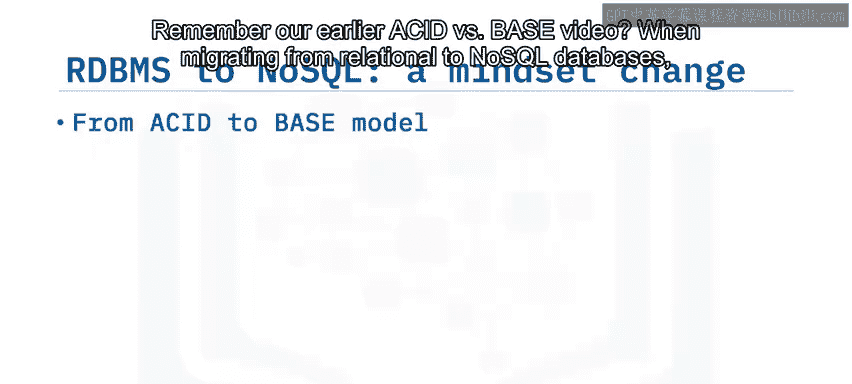

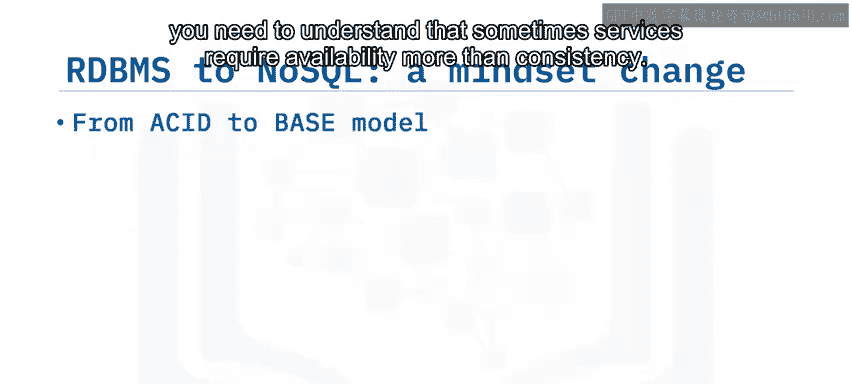

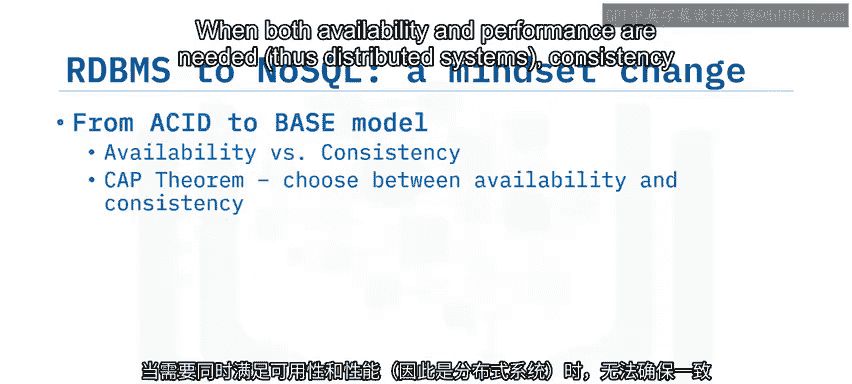

回顾我们之前关于ACID与BASE的视频，从关系型数据库迁移到NoSQL数据库时，需要理解有时服务对可用性的要求高于一致性。当同时需要高可用性和高性能时，在分布式系统中，一致性无法得到绝对保证。

记住**CAP定理**，当今许多在线服务更看重可用性而非强一致性。正因如此，它们寻找能够提供高可用性的系统，同时考虑到它们处理的数据量及其地理分布。

**最后，关于事务与连接的支持。**

需要了解的一点是，NoSQL数据库并非设计用于支持事务、连接或复杂处理（除少数有限情况外）。从RDBMS迁移到NoSQL时，你需要考虑这一点。

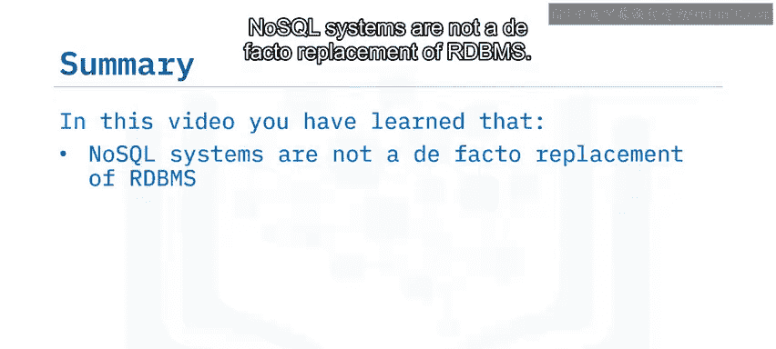

## 📝 总结

本节课中我们一起学习了以下核心内容：

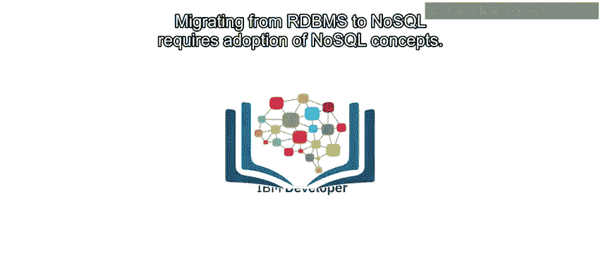

*   NoSQL系统并非RDBMS的事实替代品，RDBMS和NoSQL服务于不同的用例。
*   你的解决方案可以同时使用RDBMS和NoSQL。
*   从RDBMS到NoSQL的迁移可能由数据量驱动的性能需求、模式或系统可扩展性的灵活性需求所触发。
*   从RDBMS迁移到NoSQL需要采纳NoSQL的设计理念，特别是**由查询驱动数据模型**以及接受数据的**反规范化**。