# 011：MongoDB概述


在本节课中，我们将要学习MongoDB的基础知识。MongoDB是一种流行的NoSQL数据库，它采用文档模型来存储数据。通过本节课的学习，你将能够解释MongoDB是什么，列举其核心组件，并描述其适用场景。

## 🧩 什么是MongoDB？


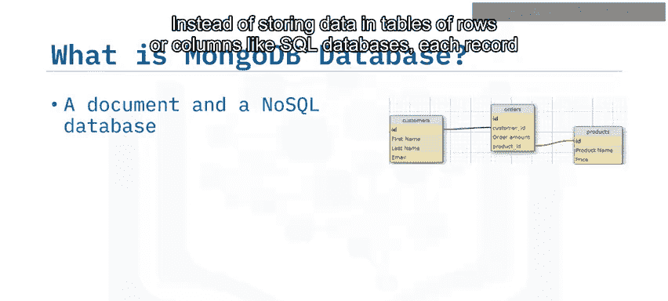

MongoDB是一种**文档型NoSQL数据库**。与SQL数据库将数据存储在由行和列组成的表中不同，MongoDB数据库中的每条记录都是一个**文档**，数据以非关系型方式存储。


文档类似于关联数组，例如JavaScript对象或Python字典。以下是一个表示学生信息的文档示例：

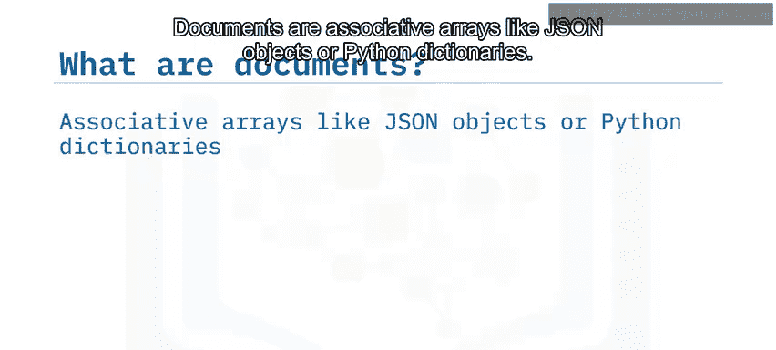

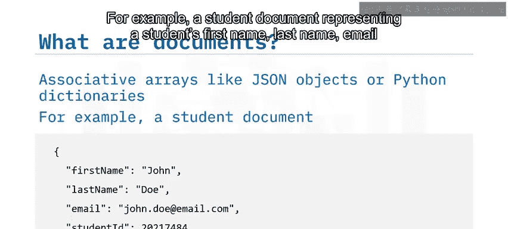


```json
{
  "first_name": "John",
  "last_name": "Doe",
  "email": "john.doe@example.com",
  "student_id": 12345
}
```


## 📂 MongoDB的核心组件

上一节我们介绍了MongoDB的基本概念，本节中我们来看看它的核心组件是如何组织数据的。

### 集合（Collection）


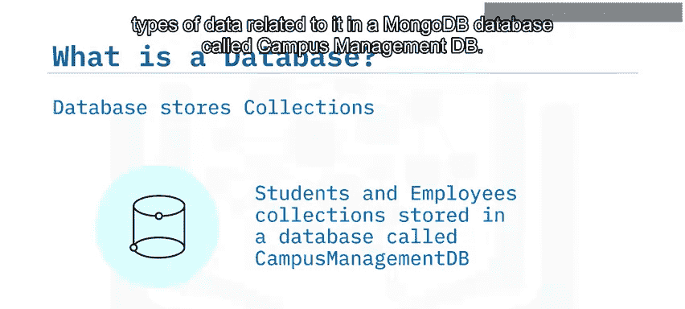

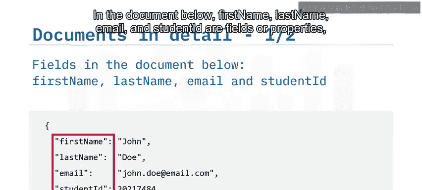

在MongoDB中，相似类型的文档被分组到一个**集合**中。例如，一个校园管理系统会将所有学生记录（文档）存储在名为 `students` 的集合中。同样，所有员工文档则存储在 `employees` 集合中。

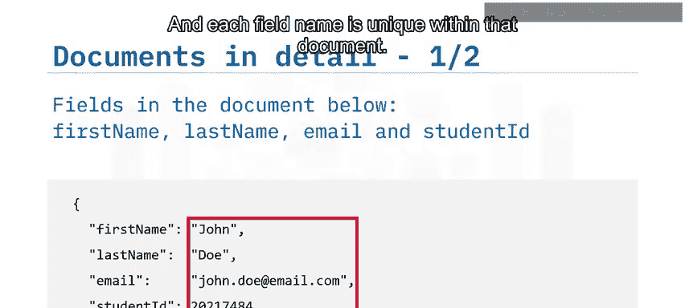

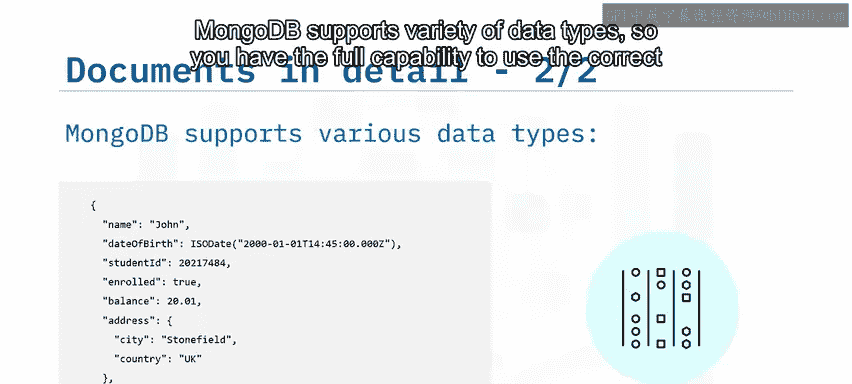

### 数据库（Database）

一个MongoDB**数据库**用于存储与特定应用相关的所有不同类型的数据。沿用之前的例子，校园管理系统的所有数据可以存储在一个名为 `CampusManagementDB` 的MongoDB数据库中。

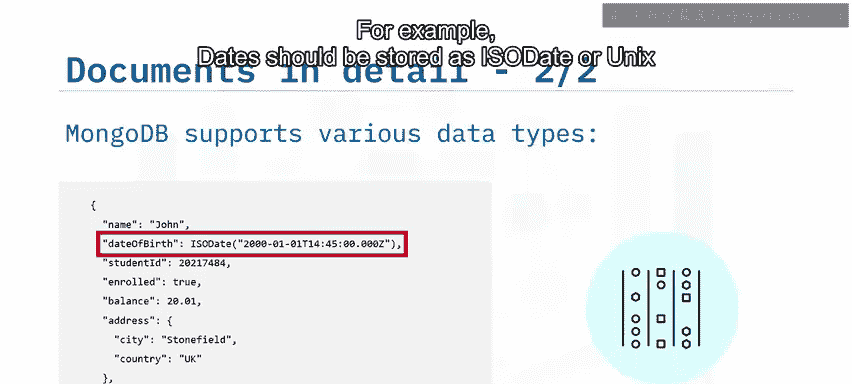


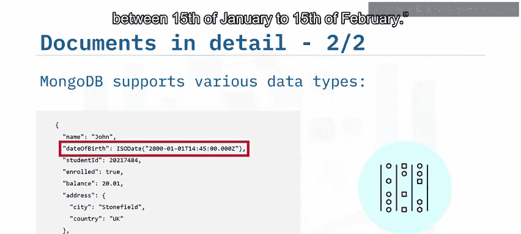

### 文档结构

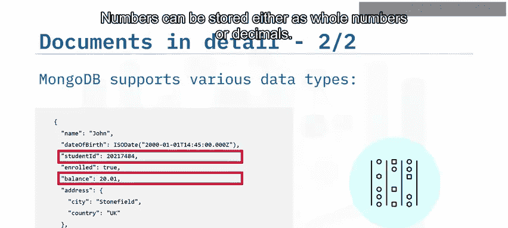

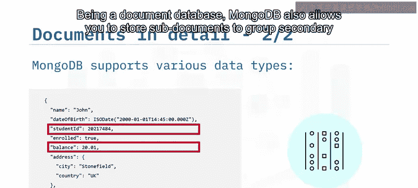

让我们剖析一下前面的学生文档。文档由**字段**（或属性）及其对应的**值**组成。例如，`first_name`、`last_name`、`email` 和 `student_id` 都是字段。每个字段名在该文档内是唯一的。

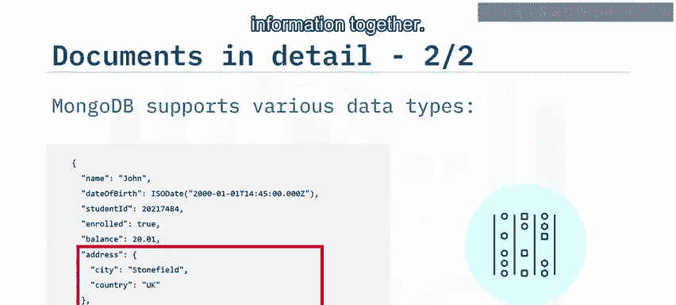

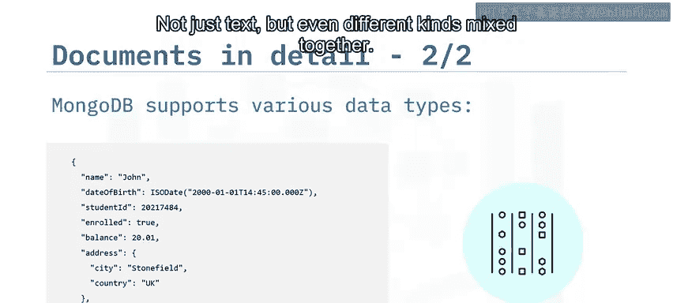

## 🔢 MongoDB支持的数据类型

MongoDB支持多种数据类型，这使你能够使用正确的类型来存储信息。


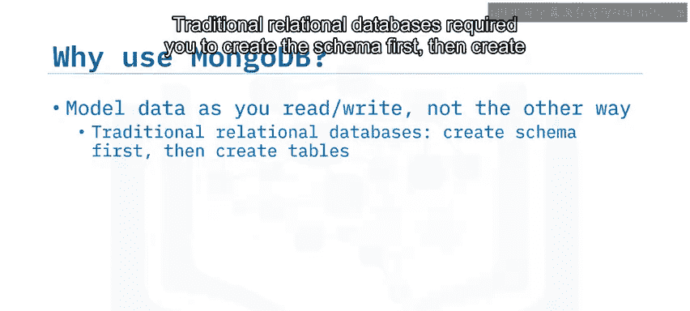

以下是MongoDB支持的一些关键数据类型：

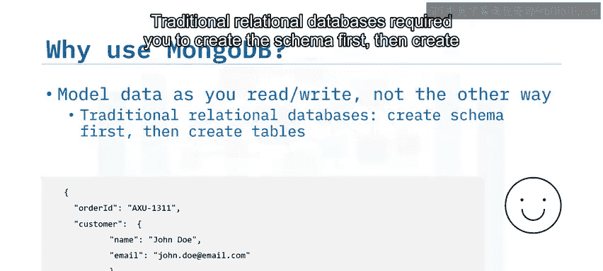

*   **日期**：应存储为ISO日期或Unix时间戳格式。这有助于执行诸如“查询所有出生在1月15日至2月15日之间的学生”这类操作。
*   **数字**：可以存储为整数或小数。
*   **子文档**：MongoDB允许在文档中嵌套存储子文档，以便将次要信息分组在一起。
*   **数组**：支持存储值的列表，列表中的元素不仅可以是文本，还可以是不同类型的数据混合在一起。


## ⚙️ MongoDB的优势与特性

了解了MongoDB的数据组织方式和类型后，本节我们来看看它为何如此受欢迎，以及它提供了哪些强大特性。

使用MongoDB非常便捷，因为你可以专注于要写入的数据以及如何读取它。

*   **灵活的模式**：传统的关系型数据库要求你先创建模式（Schema），然后创建用于存放数据的表结构。如果你决定存储一个额外的字段，就必须修改表结构。而在MongoDB中，你可以**随需而变**。
*   **处理多样数据**：MongoDB使你能够轻松引入任何**结构化或非结构化数据**。
*   **高可用性**：通过保存数据的多个副本（我们将在后续主题中详细讨论），MongoDB提供了高可用性。
*   **易于设计复杂结构**：你可以在MongoDB中轻松设计复杂的数据结构，而无需担心其存储方式和关联方式的复杂性。例如，如果你的校园管理应用也在美国推出，那里不存储邮政编码（postcode）而是使用邮政编码（zip code），你可以轻松调整文档结构。
*   **可扩展性**：MongoDB提供的可扩展性意味着，随着数据需求的增长，你可以通过引入更大、更快、更好的硬件进行**垂直扩展**，或者通过分区数据（分片）进行**水平扩展**。
*   **灵活的部署**：所有这些功能，无论你是在本地运行自我管理的MongoDB，还是使用混合或云托管的全托管服务（如IBM Cloud Databases for MongoDB，或AWS、Azure和Google Cloud上的MongoDB Atlas）都可以实现。

## 📝 课程总结

本节课中我们一起学习了MongoDB的基础知识。

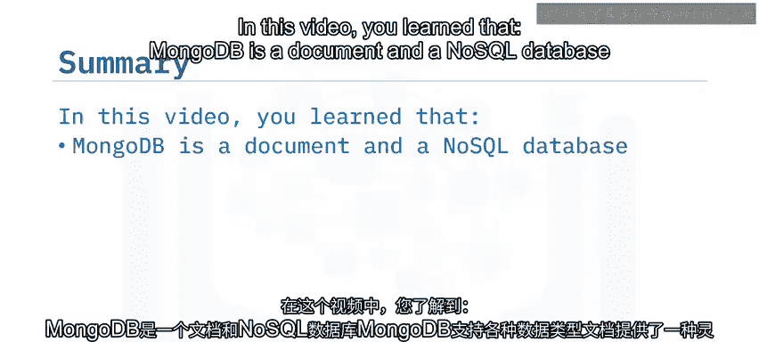


我们了解到：
1.  MongoDB是一个**文档型NoSQL数据库**。
2.  MongoDB支持**多种数据类型**，为数据存储提供了灵活性。
3.  文档提供了一种**灵活的数据存储方式**。
4.  相似类型的MongoDB文档被分组到**集合**中。
5.  MongoDB允许你按照读写需求来建模数据，可以处理**结构化和非结构化数据**，并提供**高可用性**。
6.  由于其存储结构化或非结构化数据的灵活性，MongoDB可以用于**多种用途**。