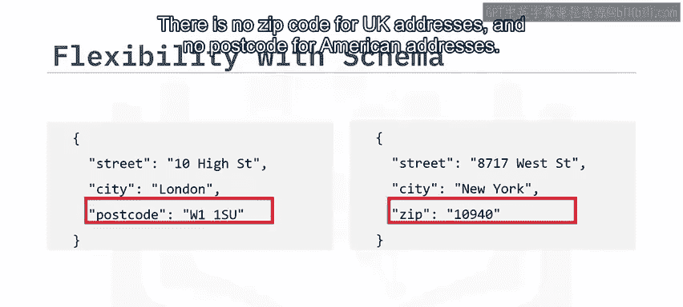
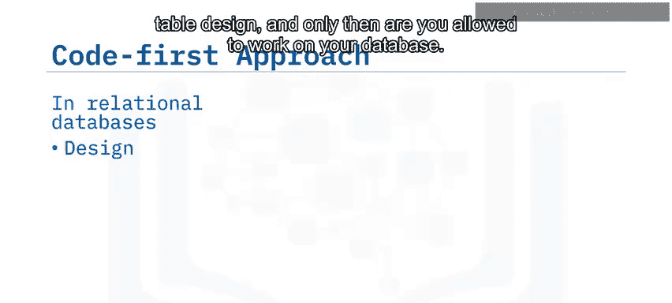
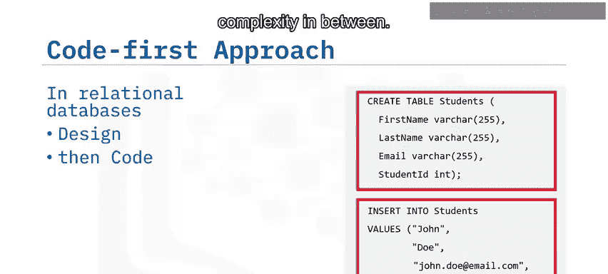
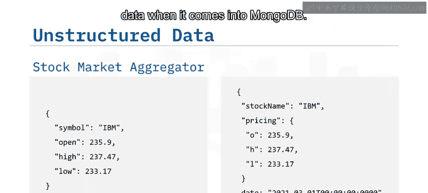
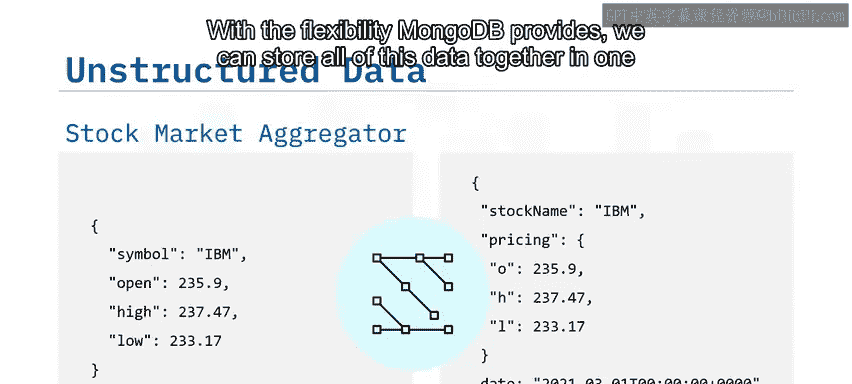
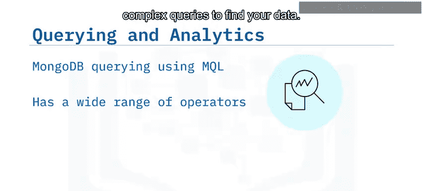
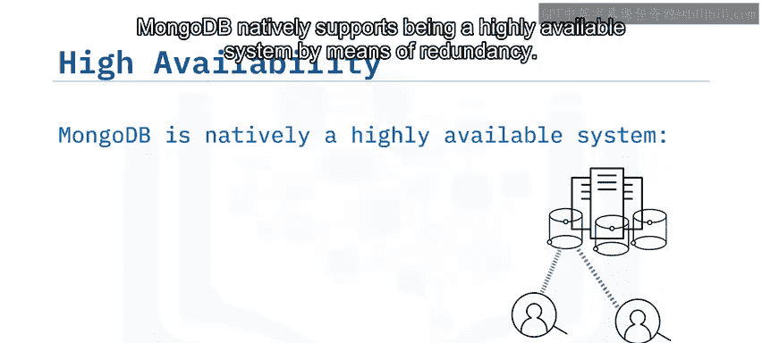
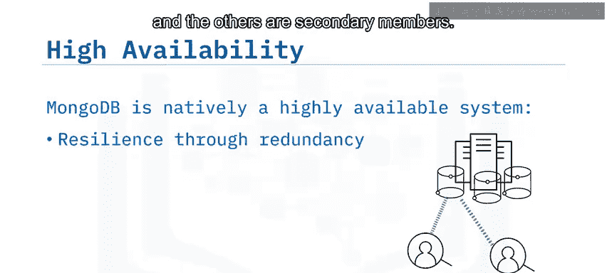
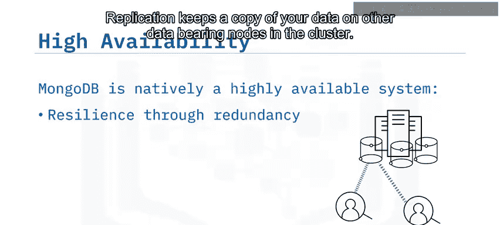

# 012：MongoDB的优势

在本节课中，我们将学习MongoDB这一流行的NoSQL数据库的几个关键优势。我们将了解它如何通过灵活的模式、代码优先的开发方式、强大的查询能力以及高可用性设计，来满足现代应用不断变化的数据需求。

## 🎯 灵活的模式

第一个关键优势是MongoDB模式的灵活性。

请看这里展示的两个地址。英国地址没有邮政编码（zip code），而美国地址没有邮政编码（postcode）。

在关系型数据库的世界里，每个字段名必须在每一行中都存在，这会导致我们不得不使用过于宽泛的字段，或者产生大量空值的字段。

但在MongoDB中以这种格式存储数据不是问题，因为它允许我们拥有这种模式上的灵活性。这也使我们能够存储非结构化数据。例如，可以合并来自不同来源、不同形状的数据进行分析或存储。

## 🚀 代码优先的开发方式

使用MongoDB的第二个好处是其代码优先的开发方式。

关系型数据库在开始时增加了复杂性，因为你首先需要创建表设计，然后才被允许操作数据库。

由于MongoDB基于文档工作，这意味着你可以在没有任何中间复杂性的情况下访问数据。没有复杂的表定义。一旦连接到MongoDB数据库，你就可以立即开始写入你的第一条数据。这也消除了使用任何第三方框架来进行读写操作的需要。

## 🔄 可演进的模式

第三个关键优势是可演进的模式。

想象一下你经营一家快递公司，需要存储送货地址。随着2020年引入的送货程序发生巨大变化，你需要以最小的干扰快速演进你的模式，以存储关于无接触配送的额外信息。

使用MongoDB，这很容易实现。你只需要开始在送货文档中存储这些额外信息即可。

## 📊 查询与分析能力

下一个关键优势是查询和分析能力。

MongoDB查询语言（MQL）提供了许多操作符，可以用来构建相当复杂的查询来查找数据。如果你的查询更加复杂，你可以在MongoDB内部使用聚合管道。

例如，按年级分组所有学生的成绩，并按学期找出得分最高的学生。

## 🛡️ 高可用性

我们将讨论的最后一个关键优势是高可用性。

MongoDB通过冗余的方式，原生支持成为一个高可用性系统。

典型的MongoDB设置是三个节点的副本集，其中一个是主成员，其他的是次要成员。复制会在集群中的其他数据承载节点上保留一份数据副本。如果一个系统发生故障，另一个会接管，你不会看到任何停机时间。

这也适用于系统维护的情况，例如你可能需要将一个节点下线以进行软件、操作系统、文件系统、安全补丁或MongoDB版本的更新。我们将在课程后面的复制和分片部分更多地讨论这个主题。

## 📝 总结

本节课中，我们一起学习了MongoDB的主要优势。

你了解到，在使用MongoDB时，数据库模式可以是灵活的，你可以根据需要更改它，而无需涉及复杂的数据定义语言语句。MongoDB采用代码优先的开发方式，而不是先设计再编码的方式。MongoDB还利用了可演进的模式，可以在服务器上使用聚合管道进行复杂的数据分析，并且MongoDB提供了原生高可用性。