# 013：MongoDB的常见用例 🎯

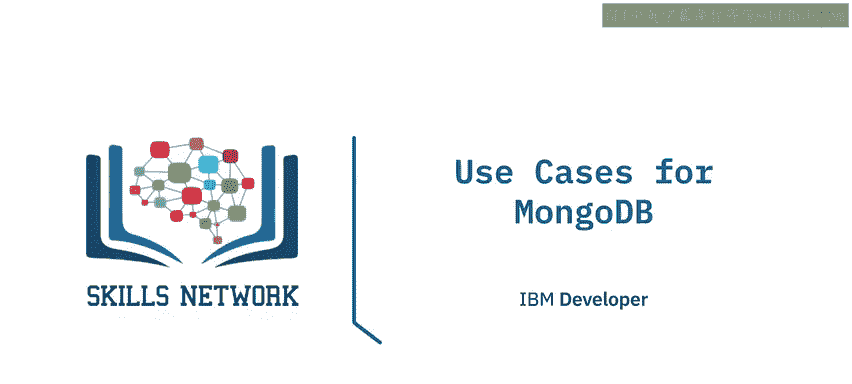

在本节课中，我们将学习MongoDB数据库在不同领域的具体应用场景。通过学习这些用例，你将能够理解MongoDB如何凭借其灵活性和可扩展性，解决现实世界中的复杂数据问题。

## 概述：多源统一视图 📊

上一节我们介绍了MongoDB的基本特性，本节中我们来看看它的第一个核心应用场景。

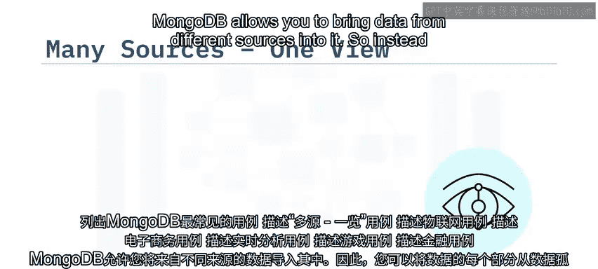

MongoDB允许你将来自不同源头的数据整合进来。这意味着，你的数据不必再分散在各个孤立的系统中。你可以将多种形态和格式的数据摄取到MongoDB中，从而获得一个统一的整体视图。这得益于MongoDB支持的**灵活模式**。

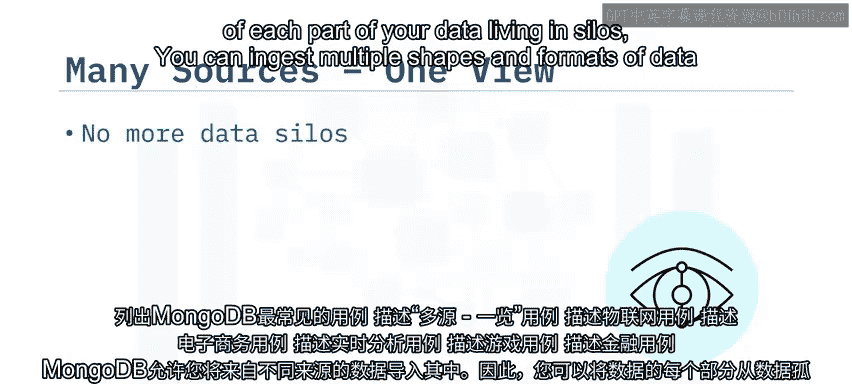

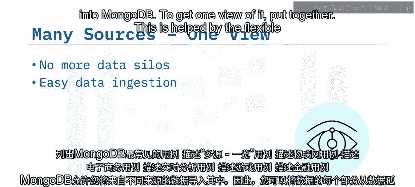

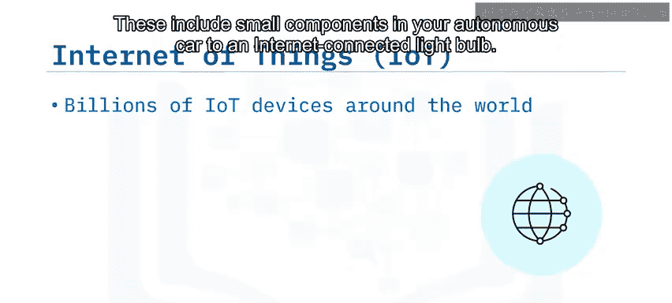

## 物联网用例 🌐

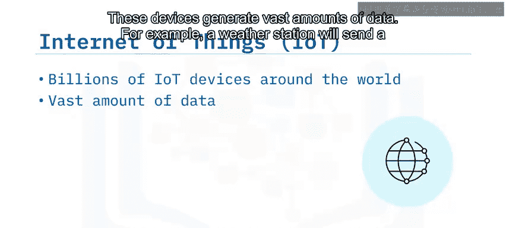

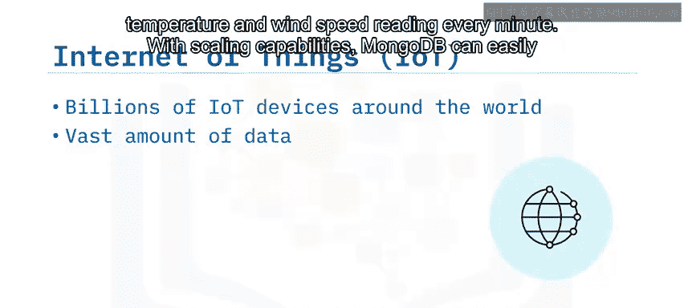

物联网设备在全球范围内有数十亿台，从自动驾驶汽车中的微小组件到联网的智能灯泡。这些设备会产生海量数据，例如，一个气象站可能每分钟都会发送温度和风速读数。

凭借其**可扩展能力**，MongoDB可以轻松地在全球范围内分布式存储所有这些数据。一旦数据存入MongoDB，利用其**强大的查询能力**，所有这些数据都可以用于复杂的分析和决策制定。

## 电子商务用例 🛒

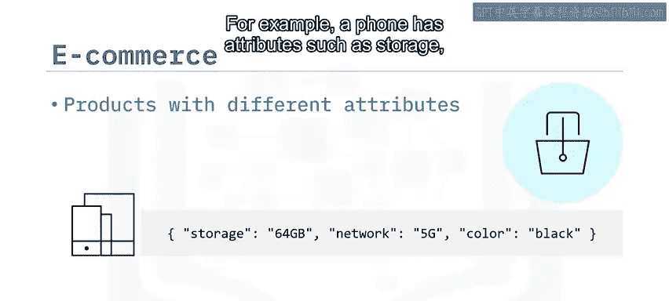

MongoDB同样适用于电子商务解决方案。电商网站上销售的商品具有不同的属性。例如，一部手机有存储容量、网络制式和颜色等属性；一本书则有出版社、作者和页数等属性。

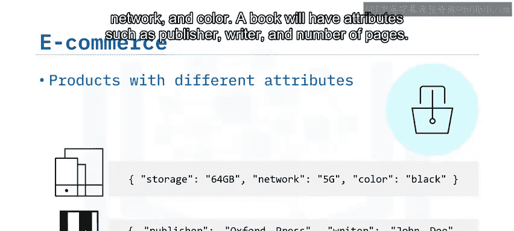

此外，商品还有诸如热门评论、价格、库存和其他元数据等属性。借助MongoDB中的**文档、子文档和列表属性**，你可以将这些信息存储在一起，从而优化读取性能。这使得MongoDB成为需要**动态模式**的用例的绝佳选择。

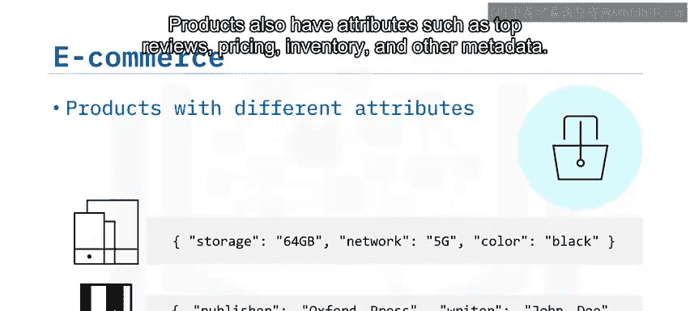

## 实时分析用例 📈

当你需要进行实时分析时，MongoDB是一个很好的选择。大多数组织都希望基于数据做出更好的决策。进行历史分析相对容易，但只有少数能够对每分钟发生的变化做出响应，而这通常是由于复杂的提取、转换和加载过程造成的。

使用MongoDB，你可以在数据存储的位置完成大部分分析工作。这些数据可以是半结构化的，也可以是完全非结构化的。所有这些分析都可以**实时**进行。

## 游戏用例 🎮

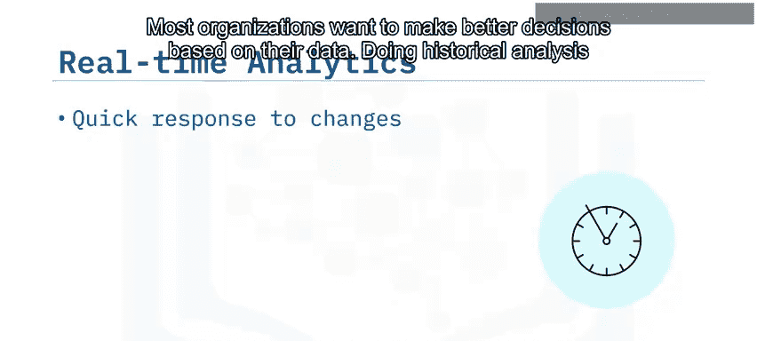

MongoDB在游戏世界中也有一席之地。随着全球范围内多人游戏的普及，数据的跨地域传输变得至关重要。凭借其**原生可扩展性**，MongoDB使得触达全球用户变得更加容易。

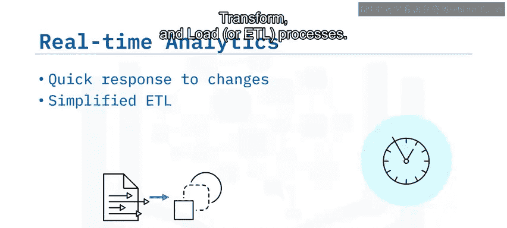

此外，借助**灵活的模式**，支持不断变化的数据需求也变得更为简单。

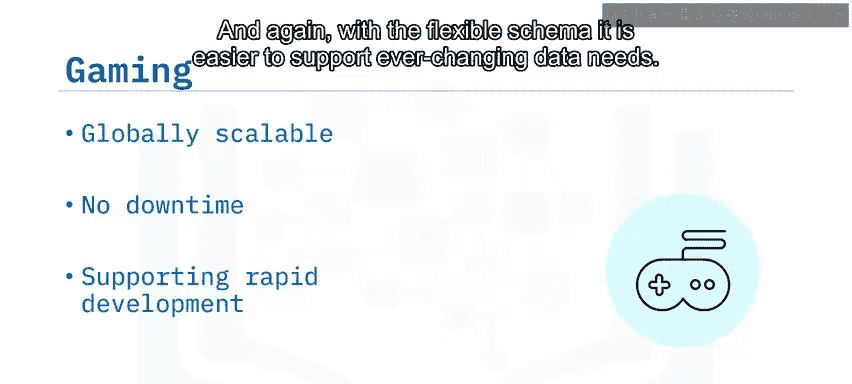

## 金融用例 💳

MongoDB在金融行业也有应用场景。如今，我们希望银行交易尽可能快捷，同时也期望金融行业能保障我们的信息安全。

使用MongoDB，你可以每秒在数据库上执行数千次操作，并且所有信息在传输和磁盘存储时都是**加密**的。你还可以额外加密单个字段，以避免任何数据泄露事件。

最后，与所有行业一样，金融机构对服务的可靠性和全天候可用性有更高的要求。我们期望金融服务能够不间断地可用。这使得MongoDB成为银行、交易公司和整个金融行业的良好选择。

## 总结

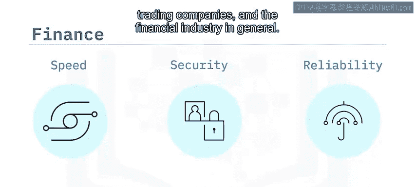

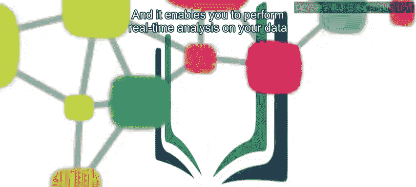

本节课中，我们一起学习了MongoDB在多种场景下的应用。它提供的**可扩展性**使其易于在全球范围内工作，并使你能够对数据进行**实时分析**。从整合多源数据到支持物联网、电子商务、实时分析、游戏和金融等关键领域，MongoDB的灵活架构和强大功能使其成为处理现代数据挑战的有力工具。