# 016：聚合框架 🧮


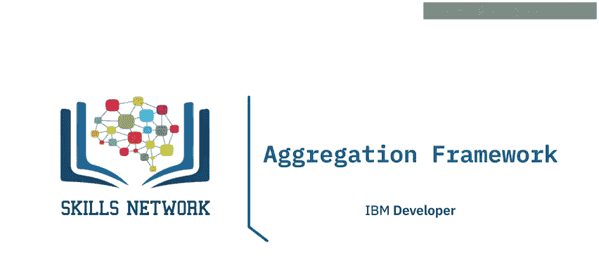


在本节课中，我们将要学习MongoDB中的聚合框架。聚合框架是MongoDB中一个强大的数据处理工具，它允许我们对数据进行一系列操作，以得到我们想要的分析结果。我们将了解聚合框架是什么、它是如何构建的、最常用的阶段有哪些，以及它可以在哪些场景下使用。

---


## 什么是聚合框架？ 🛠️

聚合框架，有时也被称为聚合管道，是一系列应用于数据的操作，目的是获得期望的结果。例如，为了了解学生是否真正掌握了知识，你可能希望查看2020年各课程的平均学生分数。这通常意味着需要先筛选出2020年的文档，然后按课程对这些文档进行分组，最后计算每年的平均分数。

聚合框架的工作方式就像一个管道：文档从一端进入，经过一个或多个处理阶段，最终以期望的格式从另一端输出。


---


## 聚合框架的核心阶段 📊

聚合管道由多个阶段组成，每个阶段对数据进行特定的转换。以下是一些最常用的阶段：

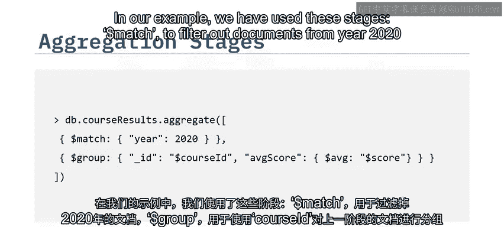

**$match**：用于筛选文档。例如，只选择年份为2020的文档。
```javascript
{ $match: { year: 2020 } }
```

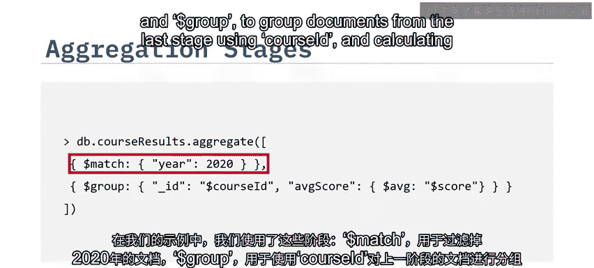

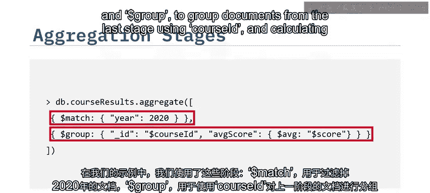

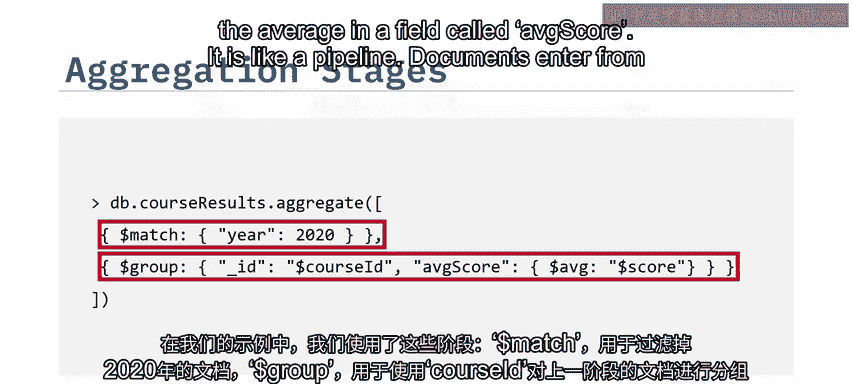

**$group**：用于按指定字段对文档进行分组，并可以执行聚合计算，如求平均值。
```javascript
{ $group: { _id: "$course_id", averageScore: { $avg: "$score" } } }
```

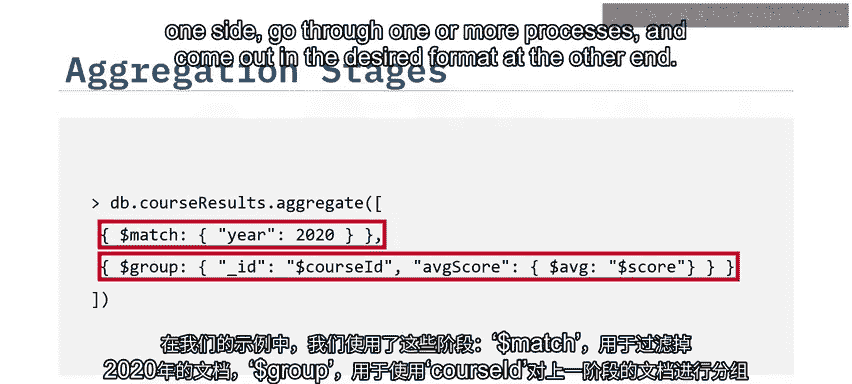


**$project**：用于改变文档的结构，或选择性地包含或排除某些字段。
```javascript
{ $project: { courseName: 1, averageScore: 1 } }
```


**$sort**：用于对文档进行排序。
```javascript
{ $sort: { averageScore: -1 } }
```

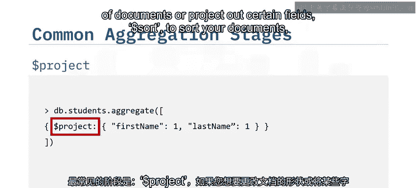

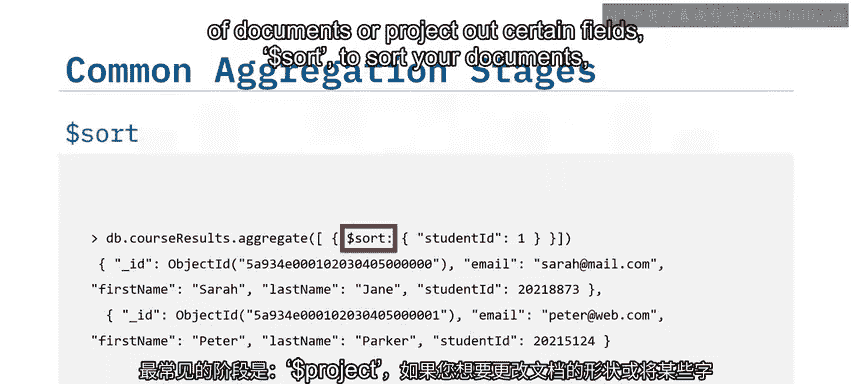

**$count**：用于计算文档数量，并将结果赋值给一个字段。
```javascript
{ $count: "totalStudents" }
```

**$merge**：用于将前一阶段的结果存储到目标集合中。
```javascript
{ $merge: { into: "results_collection" } }
```

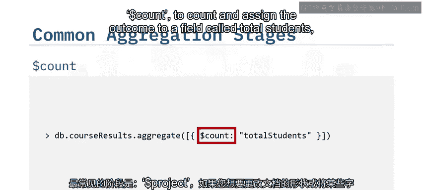

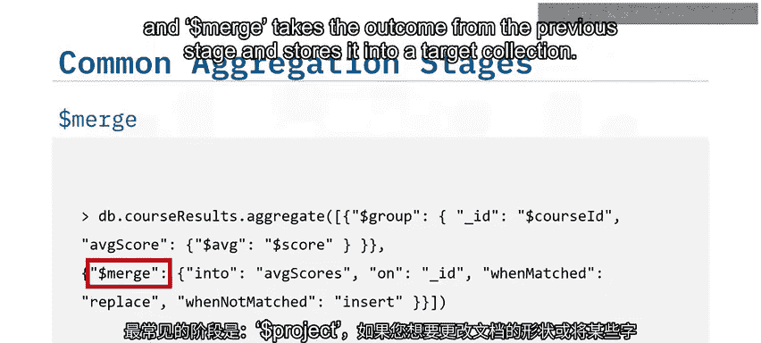

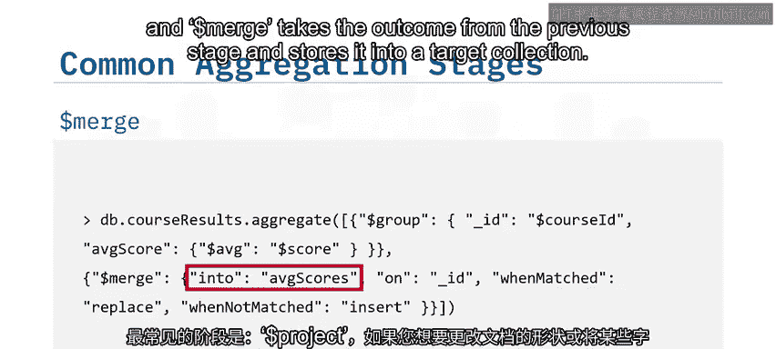

聚合阶段可以在管道中重复使用，这为我们提供了极大的灵活性来构建复杂的数据处理流程。

---

## 聚合框架的应用场景 🎯


上一节我们介绍了聚合框架的核心阶段，本节中我们来看看聚合框架可以在哪些实际场景中应用。


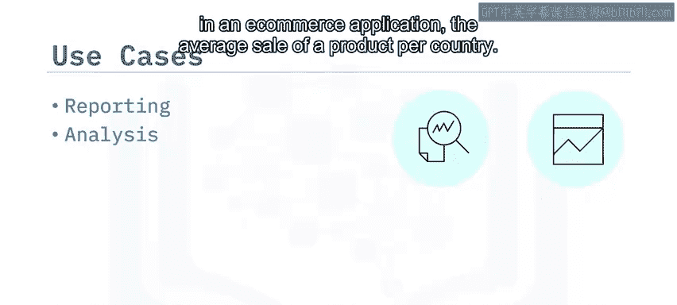

聚合框架非常适合生成各种报告和分析。例如：
*   在教育应用中，可以跟踪学生按课程的进度。
*   在电子商务应用中，可以计算每个国家产品的平均销售额。

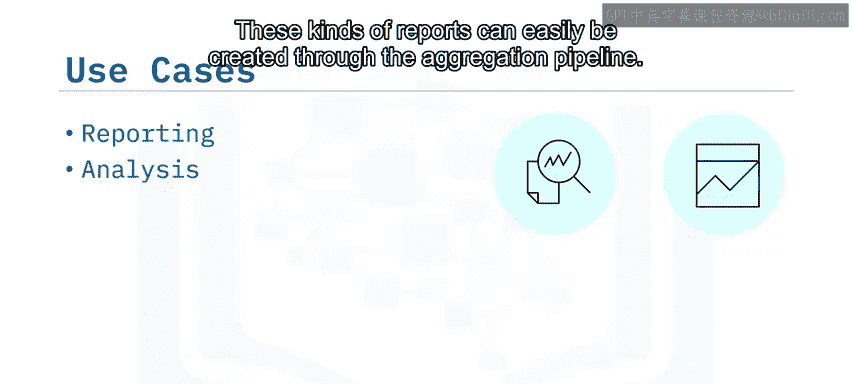

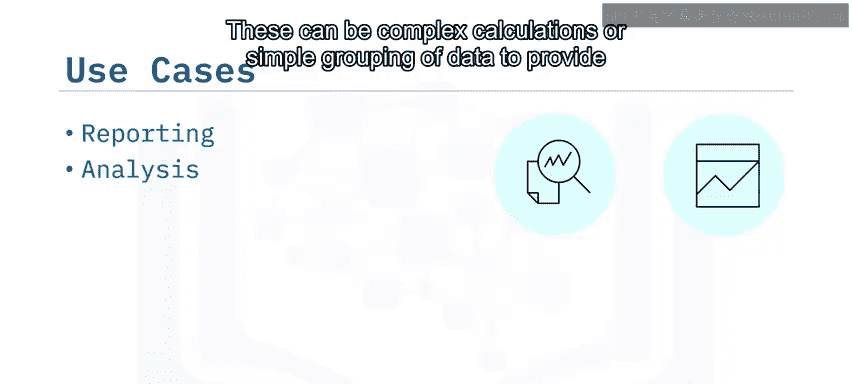

这些报告可以通过聚合管道轻松创建。无论是复杂的计算，还是简单的数据分组以提供数据的不同视角，聚合框架都能胜任。

---


## 总结 📝

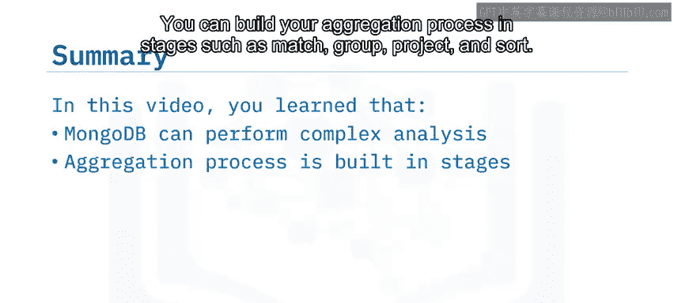


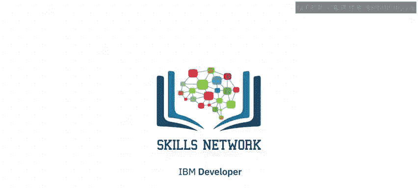

本节课中我们一起学习了MongoDB的聚合框架。我们了解到，使用聚合框架可以对MongoDB中的数据进行复杂的分析。我们可以通过构建包含`$match`、`$group`、`$project`、`$sort`等阶段的聚合管道来处理数据。最终的结果可以直接查询，也可以通过`$merge`阶段存储到另一个集合中，为数据分析和报告生成提供了强大的支持。