# 017：复制与分片 🧩

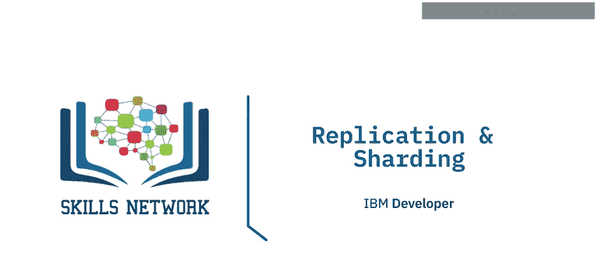

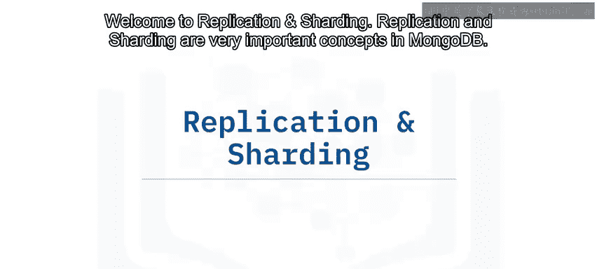

在本节课中，我们将学习MongoDB中两个核心概念：**复制**和**分片**。它们是实现数据库高可用性与可扩展性的关键技术。我们将了解它们如何工作，以及它们如何帮助构建健壮、高性能的数据库系统。

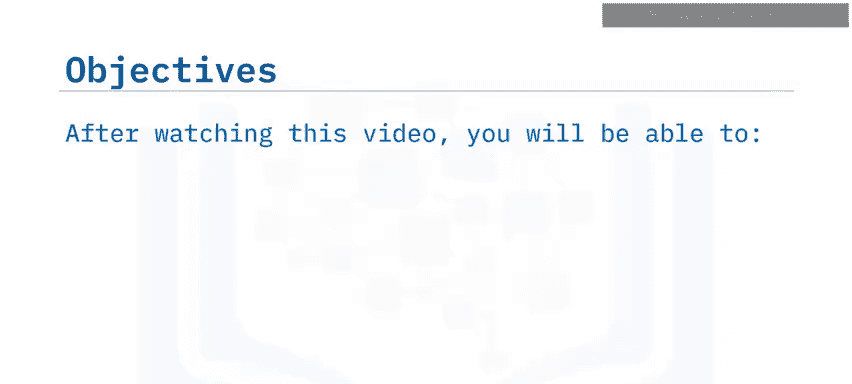

---

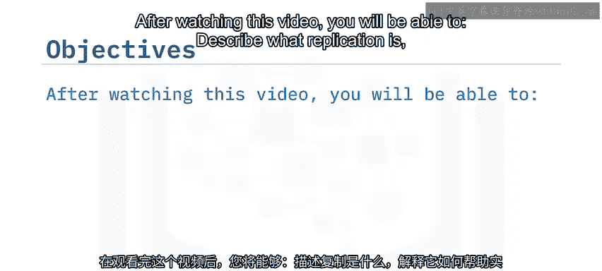

## 复制：实现高可用性 🔄

上一节我们介绍了NoSQL数据库的基本概念，本节中我们来看看**复制**。复制是MongoDB中用于确保数据高可用性和冗余的关键机制。

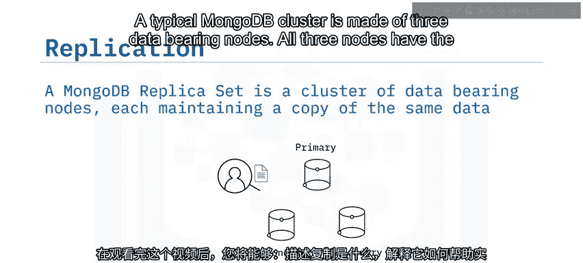

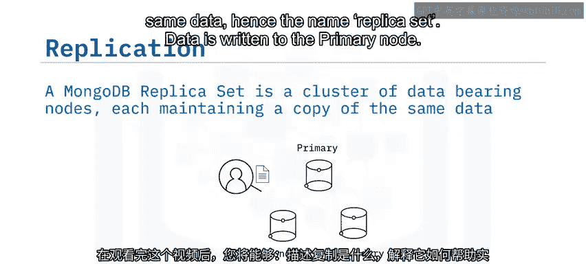

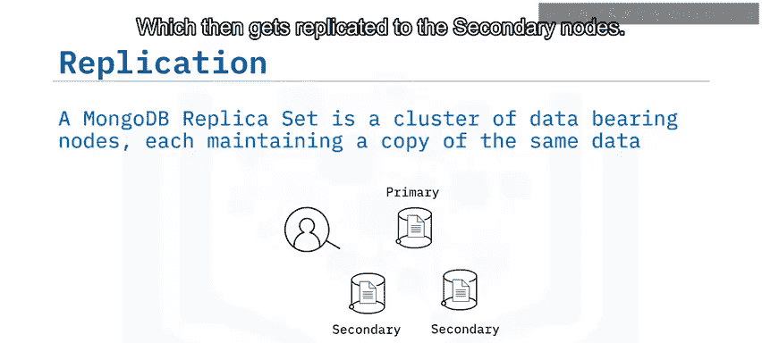

一个典型的MongoDB集群由三个数据承载节点组成。这三个节点拥有相同的数据，因此被称为**副本集**。数据首先写入**主节点**，随后被复制到**从节点**。

通过复制创建数据的多个副本，可以实现冗余。这样，即使某台服务器硬件发生故障，你仍然拥有数据的多个副本。

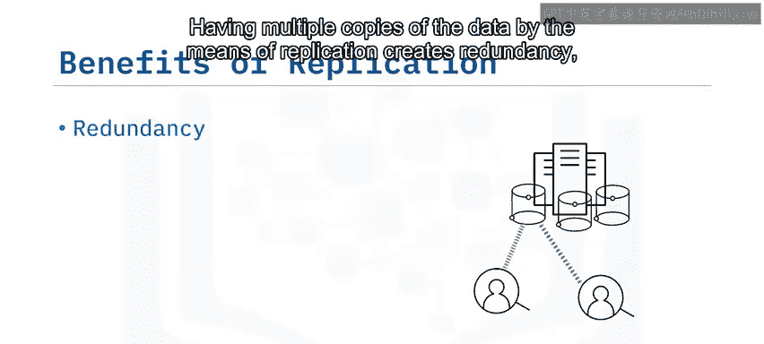

这为你在故障期间或计划维护期间提供了一个高可用的数据库。

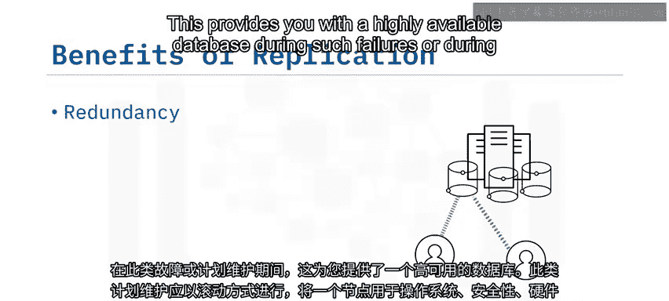

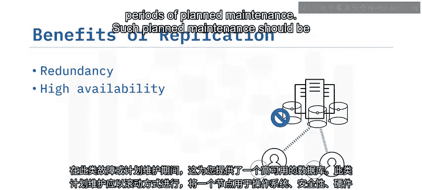

此类计划维护应以滚动方式进行，例如，一次将一个节点下线以进行操作系统、安全、硬件或软件更新，或升级MongoDB本身。

关于复制的一个常见误解是，它可以防止灾难，例如意外删除数据库。由于它是一个副本集，在主节点上发生的任何操作都会被复制到从节点。

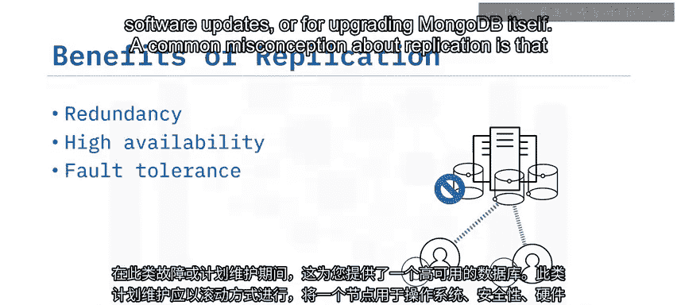

对于灾难恢复场景，我们依赖于**备份和恢复**。

---

## 分片：实现水平扩展 📊

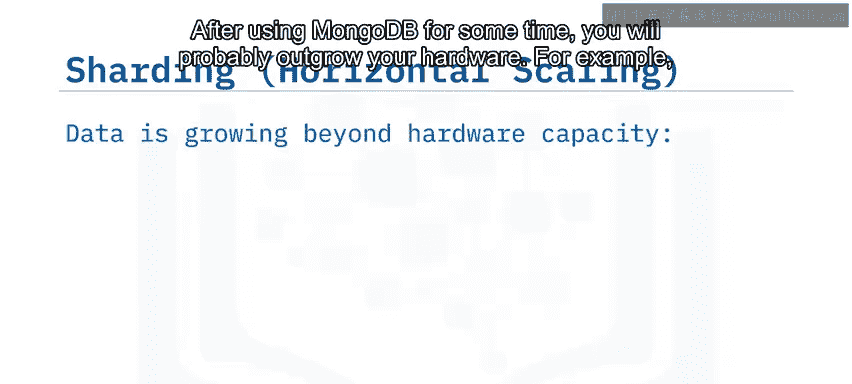

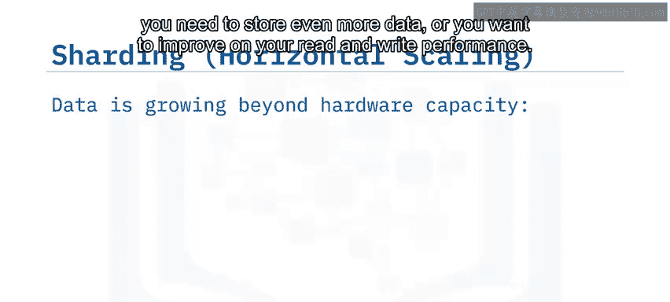

在使用MongoDB一段时间后，你可能会发现硬件资源不足。例如，你需要存储更多数据，或者希望提高读写性能。自然地，你会投资于更大、更快的硬件来增加容量，但有时这并不可行。

在这些情况下，你可以通过实施**分片**来进行水平扩展，即对你最大的集合进行分区。

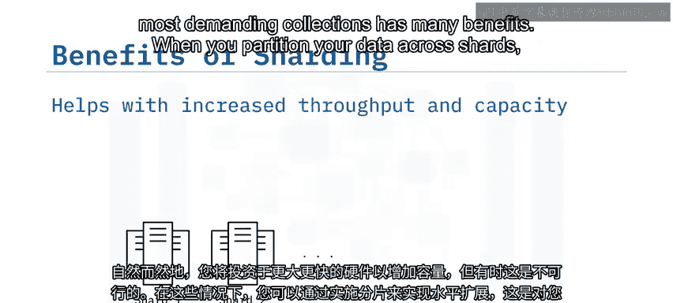

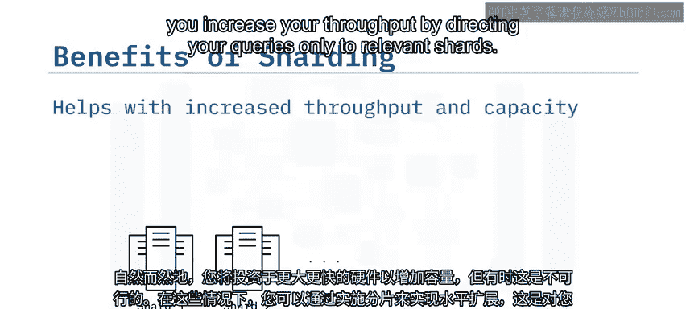

以下是分片的主要好处：

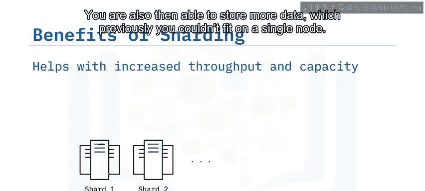

*   **提高吞吐量**：当你将数据分区到多个分片上时，通过将查询仅定向到相关的分片，可以提高吞吐量。
*   **增加存储容量**：你能够存储更多数据，这些数据之前无法存放在单个节点上。
*   **基于区域的数据分布**：你还可以根据区域跨分片分割数据。例如，美国客户的数据仅存储在美国运行的分片上，而欧洲客户的数据则存储在基于欧洲的分片上。

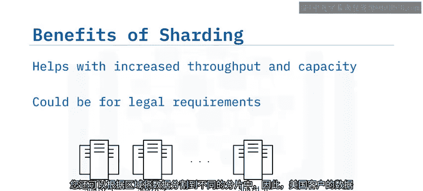

作为一个全球性应用程序，你获得的是一个统一的数据库视图来进行管理。

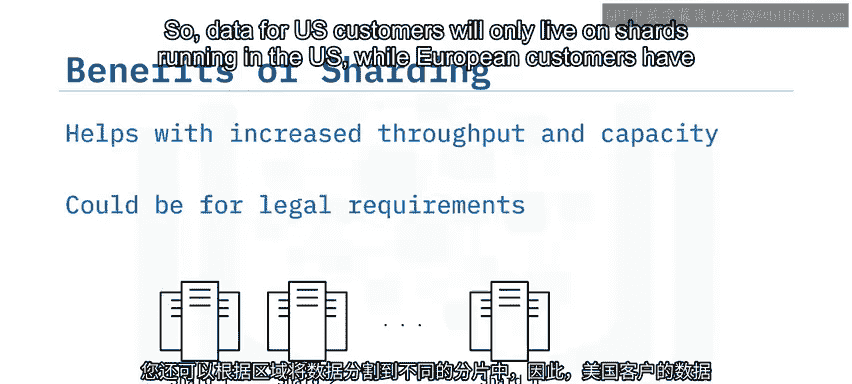

---

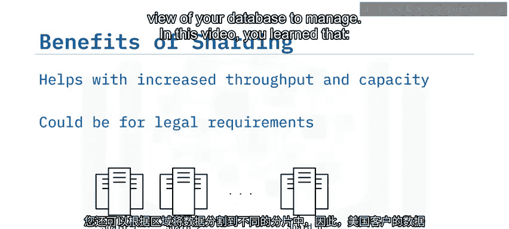

## 总结 📝

本节课中我们一起学习了MongoDB的两个核心扩展概念。

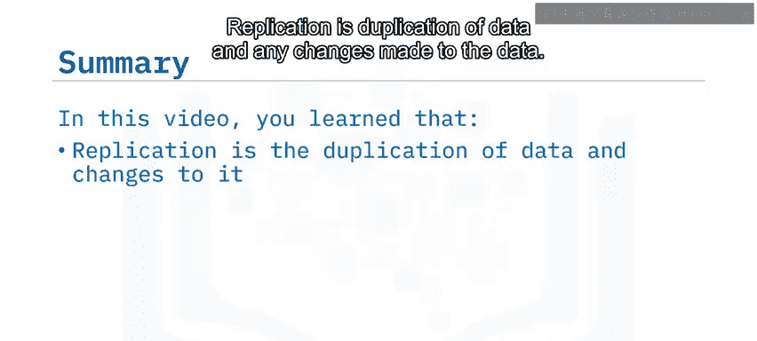

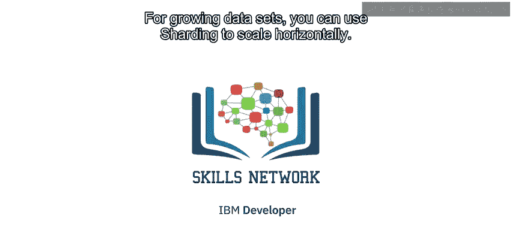

*   **复制**是数据的复制以及对数据所做的任何更改。它提供了数据的容错能力、冗余和高可用性。但复制无法防止灾难，例如文档、集合甚至数据库的误删除。对于这些人为错误，我们需要依靠**备份**。
*   对于不断增长的数据集，你可以使用**分片**来进行水平扩展，以应对更大的数据量和更高的性能需求。