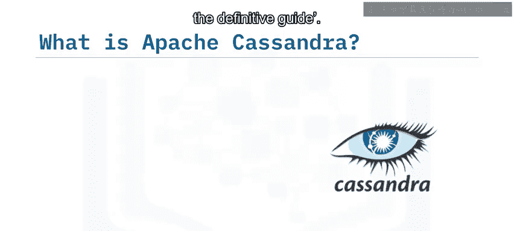
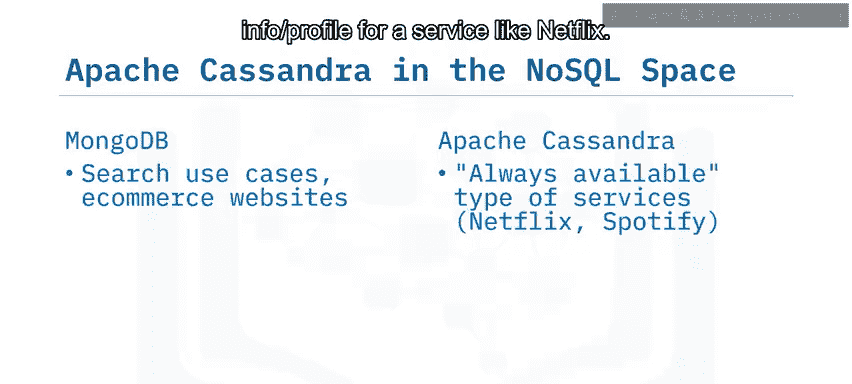
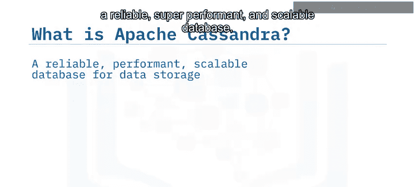
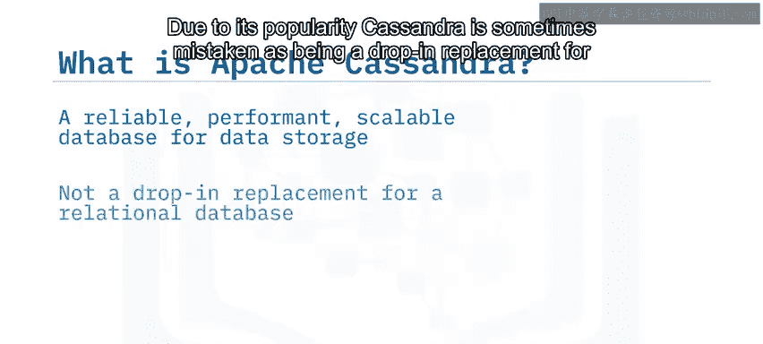
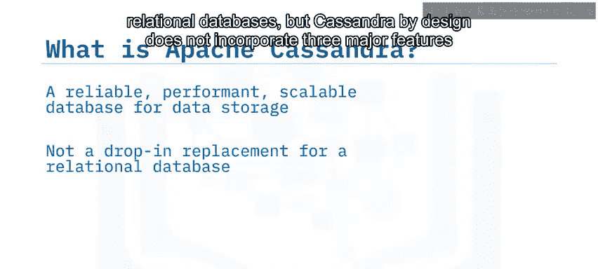
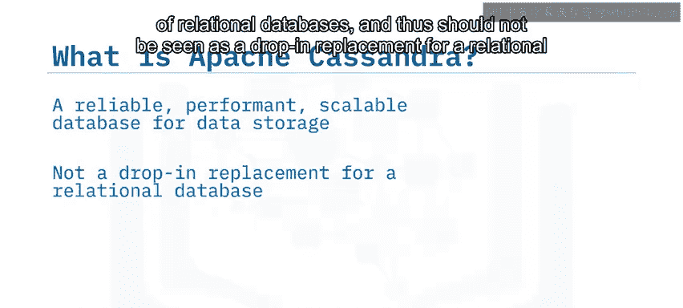
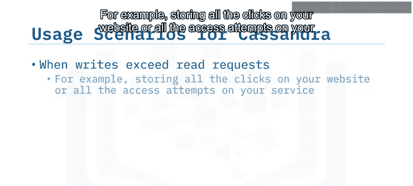
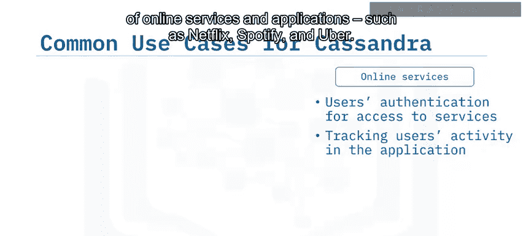

# 019：Apache Cassandra概述 🗃️

在本节课中，我们将学习Apache Cassandra的基本概念、核心特性、适用场景以及它与MongoDB等NoSQL数据库的主要区别。课程旨在帮助初学者理解Cassandra的设计哲学和典型应用案例。

## 什么是Apache Cassandra？ 🤔

上一节我们介绍了NoSQL数据库的多样性，本节中我们来看看其中一款重要的数据库：Apache Cassandra。

根据《Cassandra权威指南》一书中的定义，Apache Cassandra是一个**开源、分布式、去中心化、弹性可扩展、高可用、容错、可调一致性**的数据库。其分布式设计基于亚马逊的Dynamo，数据模型则借鉴了谷歌的Bigtable。它最初由Facebook创建，目前被许多主流网站所使用。

以下是一些使用Cassandra的知名服务：
*   Netflix
*   Spotify
*   Uber

## Cassandra与MongoDB的对比 ⚖️

我们已经了解了面向文档的数据库MongoDB，现在我们来对比一下Cassandra与它的不同。

NoSQL数据库通常针对特定用例设计。例如，MongoDB通常适用于数据可以表示为键值对文档类型的搜索相关场景。但是，对于那些需要**极快速记录数据并立即提供读取**，同时面对数十万请求的场景呢？

比如，记录在线商店的交易流水，或存储Netflix这类服务的用户访问信息或配置文件。在这种情况下，Apache Cassandra这样的解决方案可能更为适用。

以下是两者的主要区别：

*   **设计目标不同**：MongoDB侧重于**读取密集型**用例，非常注重数据一致性。Cassandra则服务于需要**快速存储数据、按键检索、始终可用、快速扩展和服务器地理分布**的用例。
*   **架构不同**：MongoDB采用主从架构，而Cassandra采用更简单的**点对点（P2P）** 架构。

## Cassandra的核心特性 ✨

Cassandra拥有一系列使其区别于其他NoSQL解决方案的特性。

以下是其主要功能列表：

*   **分布式与去中心化**：采用简单的点对点架构，这使得Cassandra成为最易安装部署的NoSQL数据库之一。
*   **始终可用与可调一致性**：优先保证**可用性**，同时允许调整一致性级别，具备容错能力。
*   **极高的写入吞吐量**：在保持集群其他操作（如读取）性能的同时，实现极快的写入速度。
*   **线性快速扩展**：能够以线性方式极其快速地扩展集群，无需重启或重新配置服务。
*   **多数据中心部署支持**：对于需要全球访问的服务极其有用。
*   **类SQL的友好查询语言**：使用`CQL`进行查询，降低了学习成本。

## Cassandra的定位与限制 ⚠️

Apache Cassandra是目前全球最受欢迎的数据库解决方案之一，它可靠、高性能且可扩展。由于其流行度，有时会被误认为是关系型数据库的直接替代品。

但Cassandra在设计上**不包含**关系型数据库的三个主要特性，因此不应被视为其直接替代品：

1.  **不支持连接（Joins）**
2.  **聚合（Aggregation）支持有限**
3.  **对事务（Transactions）的支持有限**

虽然Cassandra的写入操作本身具有**原子性、隔离性和持久性**，但“一致性”部分并不完全适用，因为它没有参照完整性或外键的概念。

简而言之，如果你考虑用Cassandra来跟踪银行的账户余额，可能并不合适。**如果您的应用涉及连接和聚合需求，最好将Cassandra与Apache Spark这类处理引擎配合使用。**

## Cassandra的最佳适用场景 🎯

那么，Apache Cassandra在哪些使用场景下是一个好的选择呢？

以下是Cassandra表现优异的几种情况：

*   **写入密集型应用**：当应用程序的写入量超过读取量时，例如存储网站的所有点击记录或服务的所有访问尝试。
*   **数据更新或删除较少**：数据以近似追加的方式进入系统。
*   **通过已知主键（分区键）访问数据**：分区键有助于数据在集群内均匀分布。
*   **查询中无需连接或复杂聚合**：如前所述，这是Cassandra的设计限制。

## 常见用例 🌍

如前所述，Cassandra非常适合需要**全球范围、始终在线**的在线服务和应用程序，如Netflix、Spotify和Uber。当然，还有许多其他用例可以利用其能力。

以下是几个典型用例：

*   **为电子商务网站存储交易数据以进行分析**，或存储用户与网站的交互数据以实现个性化体验。
*   **存储用户配置文件信息**，用于会话丰富化或授予个性化的服务访问权限。
*   **时间序列数据**：Cassandra在时间序列用例中表现出色，数据按时间顺序追加进入，例如来自传感器的天气更新。您的查询可以针对特定传感器在特定时间间隔内发生的情况。

## 总结 📝

本节课中我们一起学习了Apache Cassandra。我们了解到，Apache Cassandra是一个开源、分布式、去中心化、弹性可扩展、高可用、容错、可调一致性的数据库。

它最适合被那些需要**数据库始终可用、能在高流量情况下快速扩展、可以地理分布式部署、且要求高写入性能**的“始终在线”型在线应用程序使用。

典型的应用者包括Netflix、Uber和Spotify等在线服务，电子商务网站以及时间序列应用程序。