# 020：Apache Cassandra的关键功能 🚀

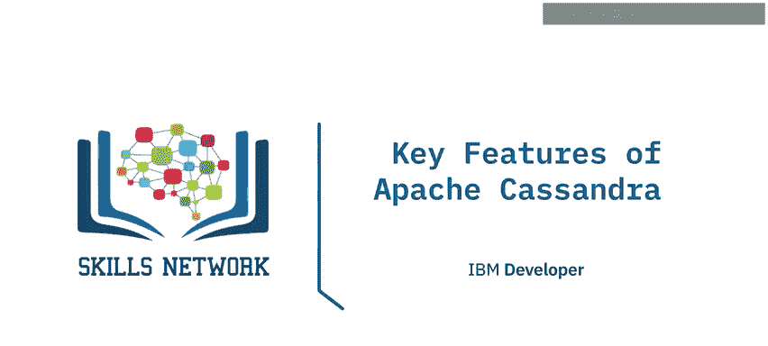

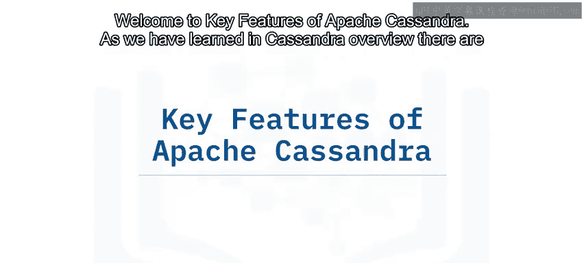

在本节课中，我们将学习Apache Cassandra数据库的核心特性。我们将探讨其分布式与去中心化架构、数据复制机制、可用性与一致性的权衡、可扩展性、高写入吞吐量以及其查询语言CQL。这些特性共同构成了Cassandra作为高性能、高可用NoSQL数据库的基础。

---

## 分布式与去中心化架构

上一节我们介绍了Cassandra的概览，本节中我们来看看其架构的两个核心特征：**分布式**与**去中心化**。

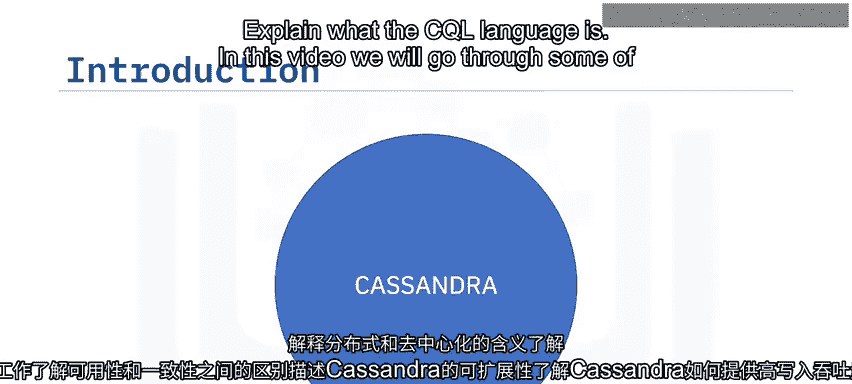

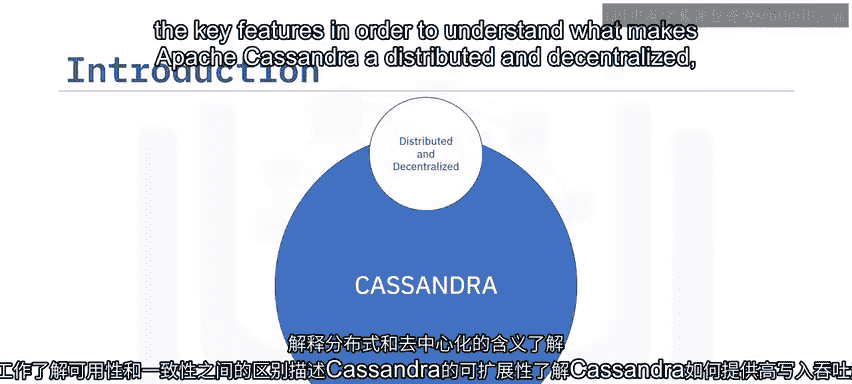

*   **分布式**意味着Cassandra集群可以运行在多台机器上。对于用户和应用程序而言，整个集群呈现为一个统一的整体。其架构设计使得Cassandra应用客户端和服务器能够提供足够的信息，以最优方式在集群中路由用户请求。因此，作为最终用户，你可以向集群中的**任何**Cassandra节点写入数据，Cassandra都能理解并处理你的请求。
*   **去中心化**意味着Cassandra集群中的每个节点都是**相同**的，即没有主节点或从节点之分。Cassandra使用**点对点（P2P）通信协议**，并通过一种名为 **`gossip`** 的协议来保持所有节点的同步。

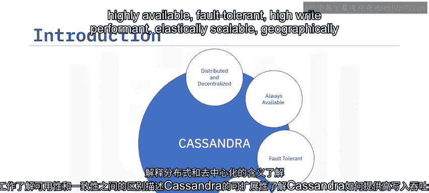

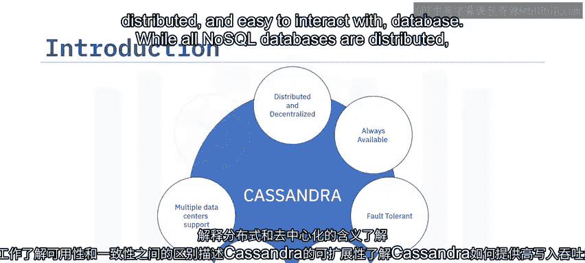

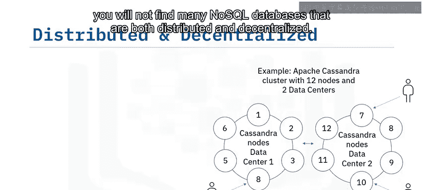

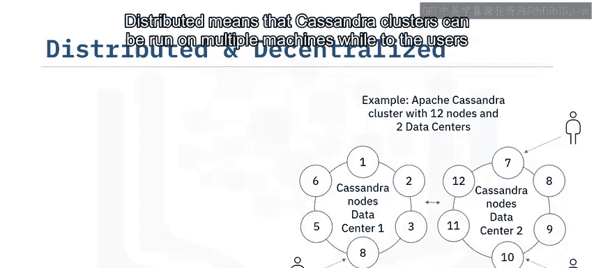

---

## 数据分布与复制

理解了架构基础后，我们来看看数据是如何在这种分布式架构中存储和复制的。

数据在集群中的分布始于计划执行的查询。例如，如果你的查询是“我想知道某个州的所有用户”，那么你需要根据“州”这一列来分组数据。这是通过声明一个以“州”列作为**分区键**的表来实现的。Cassandra会根据你声明的分区键对数据进行分组，然后通过哈希每个分区键（称为**令牌**）来在集群中分布数据。

每个Cassandra节点都有一个预定义的、支持的令牌区间列表。数据根据键值的哈希结果和集群中预定义的令牌分配，被路由到相应的节点。

数据在集群中初始分布后，Cassandra会进行**数据复制**。

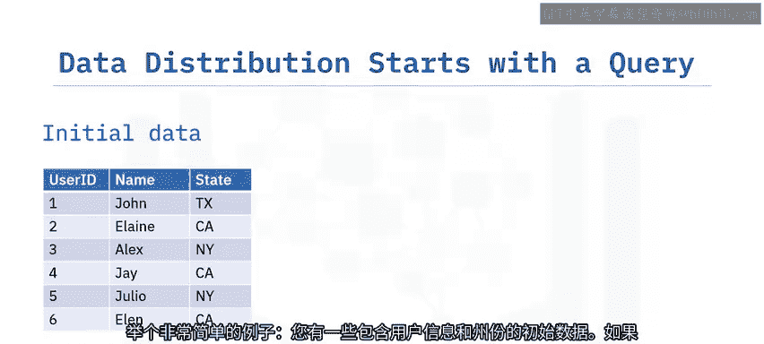

以下是数据复制的关键点：
*   **副本数量**指的是在特定时间有多少个节点包含某一份数据。
*   数据复制在集群中**顺时针**进行，同时会考虑节点的机架和数据中心位置。
*   复制根据设定的**复制因子**进行，该因子指定了每个分区数据副本将存储在多少个节点上。

---

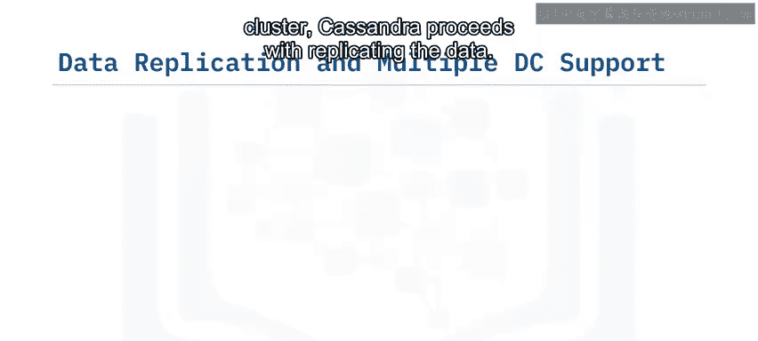

## 高可用性与最终一致性

数据复制带来了高可用性。Cassandra经常被称为具有**最终一致性**或**可调一致性**，因为默认情况下，它会为了**实现高可用性而在一定程度上牺牲强一致性**。

根据**CAP定理**，分布式系统无法同时保证强一致性和高可用性。Cassandra被设计为**始终可用**，这意味着即使集群部分节点失效，仍然会有节点可以响应服务请求，尽管返回的数据可能不是最新的。

好消息是，开发者可以精确控制他们需要的一致性级别（强一致性或最终一致性）。数据的一致性可以在操作级别进行控制。如果存在数据不一致，这些冲突将在**读操作**期间得到解决。

---

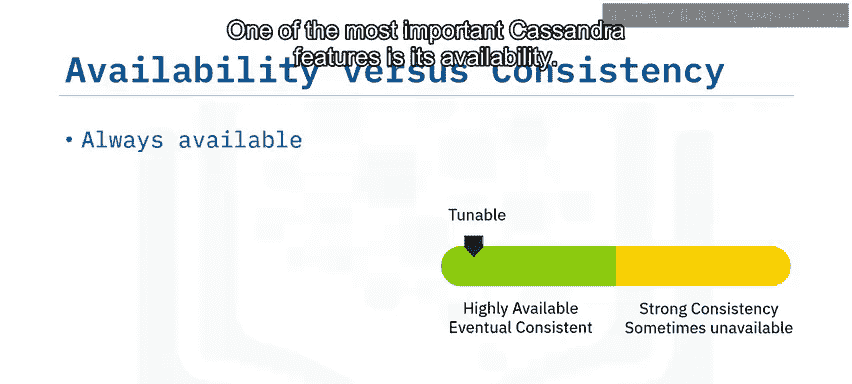

## 容错性与线性可扩展性

容错性是Cassandra分布式和去中心化特性的固有优势。所有节点功能相同、以点对点方式通信、数据被分布式存储和复制，这些特点使得Cassandra在节点发生故障时具有很高的容错性和适应性。

用户联系集群中的一个节点。如果该节点无响应，用户将收到错误信息并联系另一个节点。

同样的架构灵活性也体现在Cassandra扩展集群能力的方式上。集群通过简单地**添加节点**来扩展，性能随节点数量的增加而**线性提升**。新添加的节点会立即开始处理流量，而现有节点会将其部分职责转移给新节点。添加和移除节点的操作都可以**无缝**进行，不会中断集群运行。

---

## 高写入吞吐量

Cassandra通过以下方式优雅地处理大量写入操作：
1.  并行地向所有持有数据副本的节点进行写入。
2.  一个重要的特性是，默认情况下，在节点级别**没有“先读后写”**的操作。
3.  写入操作在**内存**中执行，然后刷新到磁盘。
4.  在磁盘上，数据以**顺序追加**的方式写入，后续通过**压缩**过程来调和数据。

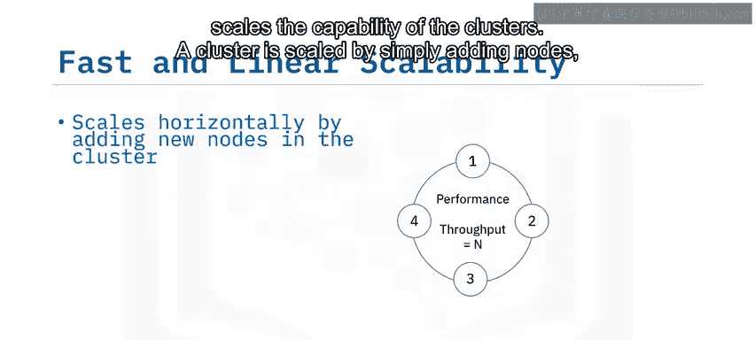

---

## Cassandra查询语言（CQL）

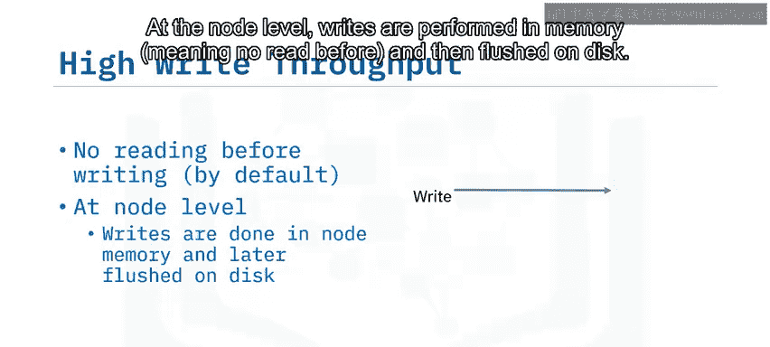

最后，我们来了解与Cassandra交互的语言。**Cassandra查询语言**，简称**CQL**，是用于数据定义和操作的语言。

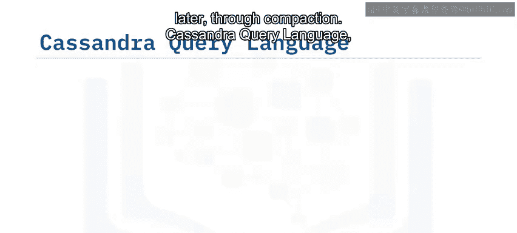

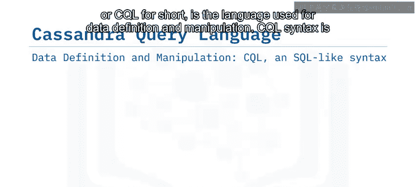

CQL的语法与SQL相似，这减少了开发者开始使用Cassandra所需的时间。诸如`CREATE TABLE`、`INSERT`、`UPDATE`、`DELETE`、`ALTER`等操作都可以在CQL中使用。

需要注意的是，虽然CQL和SQL在语法上有相似之处，但相似性仅止于此。Cassandra中读写操作的执行方式与关系型数据库中的执行方式**不同**。

---

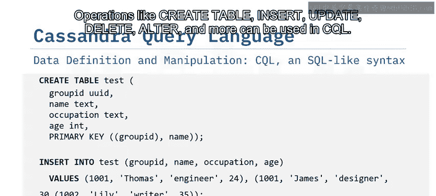

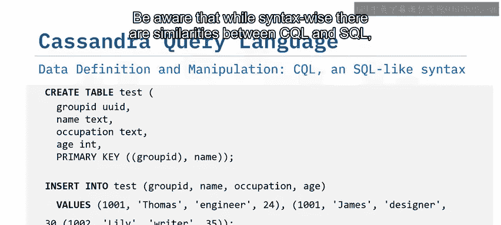

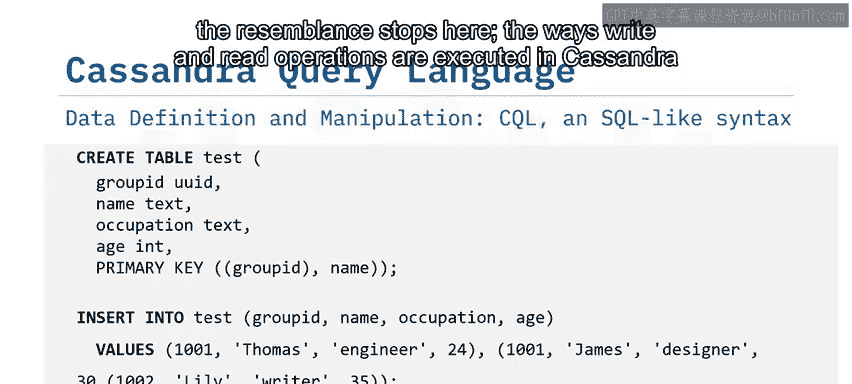

## 总结

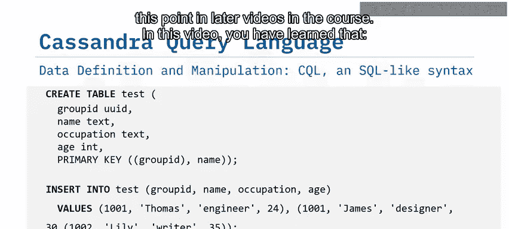

本节课中，我们一起学习了Apache Cassandra的关键功能：
*   其**分布式和去中心化**架构帮助Cassandra实现了高可用性、可扩展性和容错性。
*   数据分布和复制发生在一个或多个数据中心的集群中。
*   Cassandra提供了**高写入吞吐量**。
*   **CQL**是用来与Cassandra通信的语言。

理解这些核心功能是有效使用和设计Cassandra数据库系统的基础。在接下来的课程中，我们将更深入地探讨数据建模和查询执行的具体细节。