# 021：Cassandra数据模型（第一部分）📊


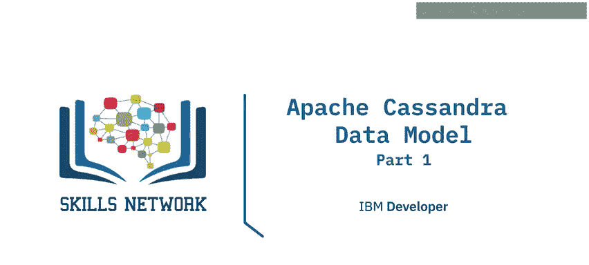

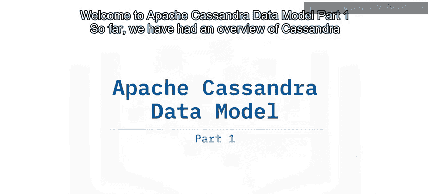

在本节课中，我们将学习Apache Cassandra数据模型的基础知识。我们将了解Cassandra如何存储数据，以及其核心概念如键空间、表、主键和分区键。这些知识对于理解Cassandra的高性能读写机制至关重要。


## 概述

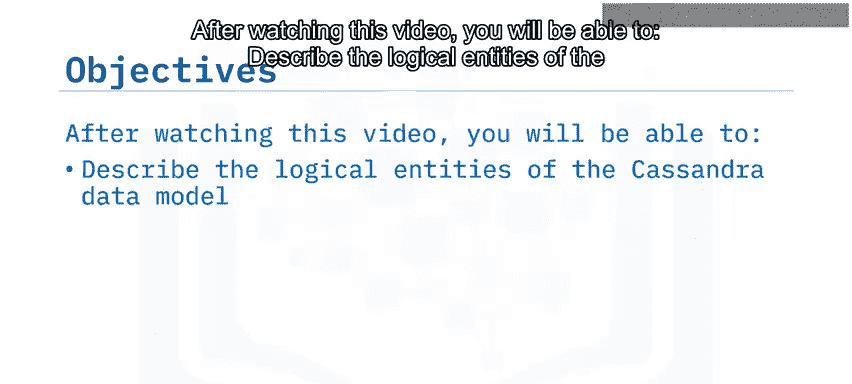

Cassandra将数据存储在表中，表的结构定义了数据在集群和节点级别的存储方式。表被分组在键空间中。键空间是一个逻辑实体，包含一个或多个表，并定义了一些应用于其所有表的选项，其中最突出的是键空间使用的复制策略。通常建议每个应用程序使用一个键空间。

## 键空间与表

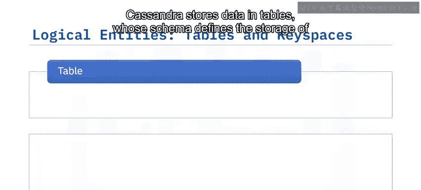

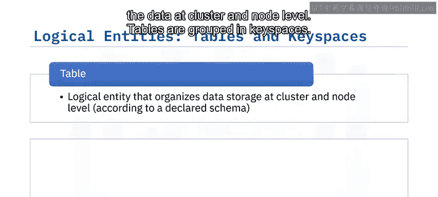

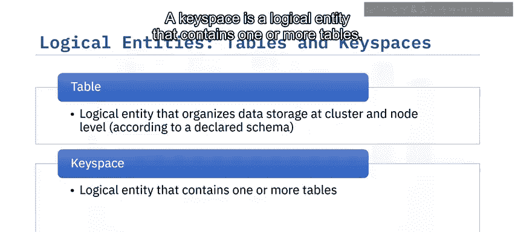

在后续视频中，我们将详细讨论键空间及其操作。现在，让我们看一个键空间和表定义的例子。

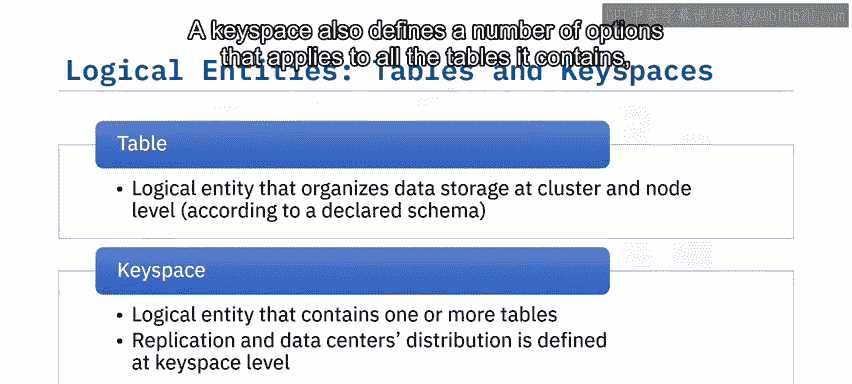

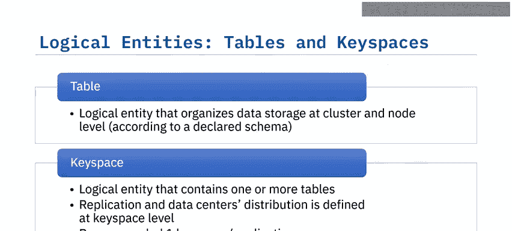

我们创建了一个名为`intro_cassandra`的键空间，其复制因子为5，数据在两个数据中心之间分割，数据中心1的复制因子为2，数据中心2的复制因子为3。


```sql
CREATE KEYSPACE intro_cassandra
WITH replication = {
    'class': 'NetworkTopologyStrategy',
    'datacenter1': 2,
    'datacenter2': 3
};
```

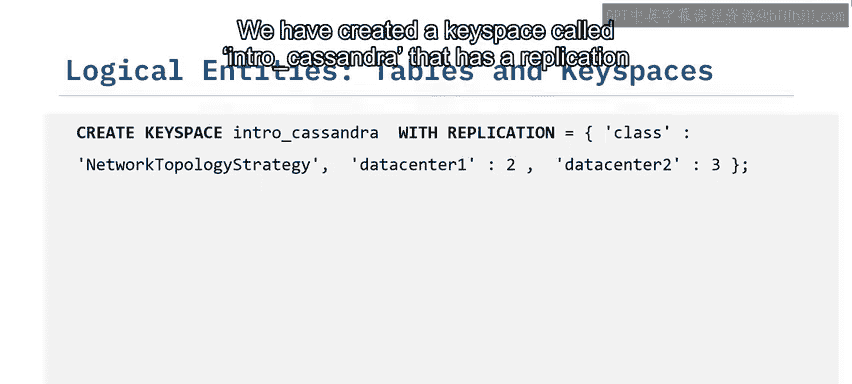

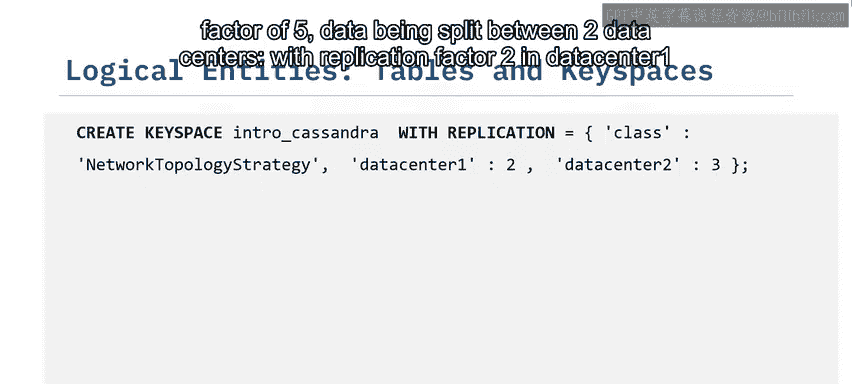

下一步是在这个键空间中创建表。为此，我们可以声明工作键空间（即`intro_cassandra`），或者直接创建表。在后一种情况下，我们需要在表名前加上目标键空间名称，例如`intro_cassandra.groups`。

```sql
CREATE TABLE intro_cassandra.groups (
    group_id int,
    group_name text,
    username text,
    age int,
    PRIMARY KEY (group_id, username)
);
```

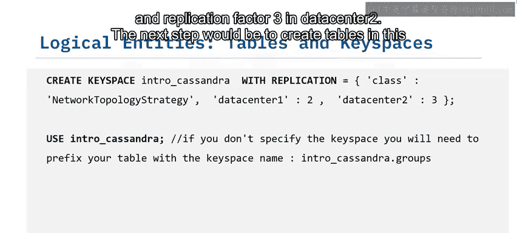

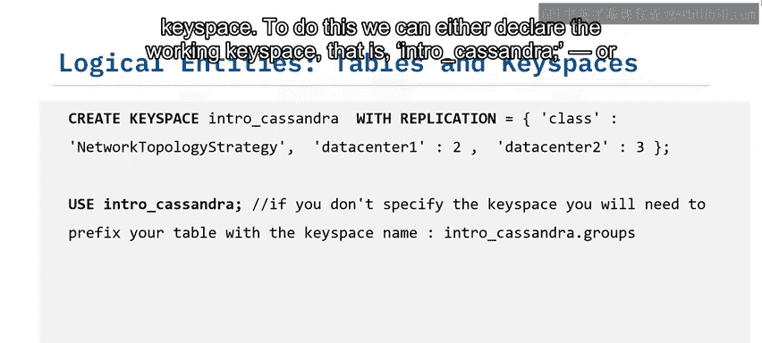

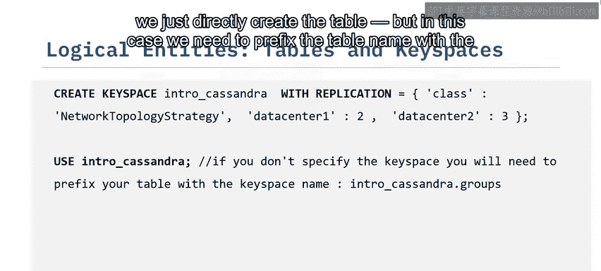

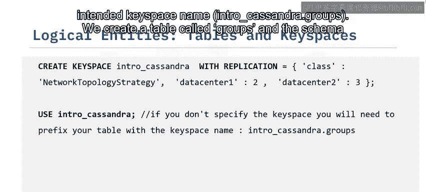

我们创建了一个名为`groups`的表及其模式。这个例子中展示的只是CQL（Cassandra查询语言）语法，我们在之前的“关键特性”视频中介绍过。我们将在本视频后面回到表模式。

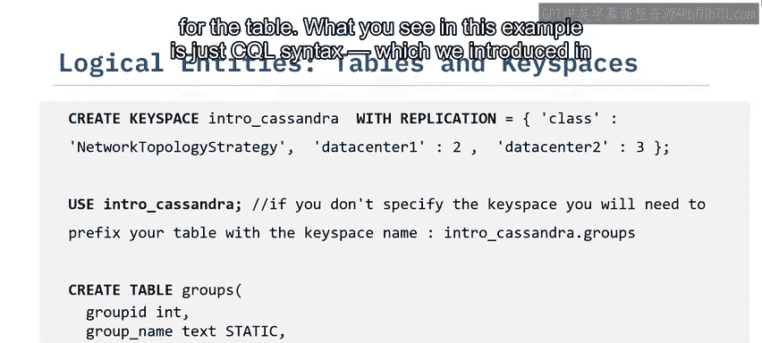

## 表与主键

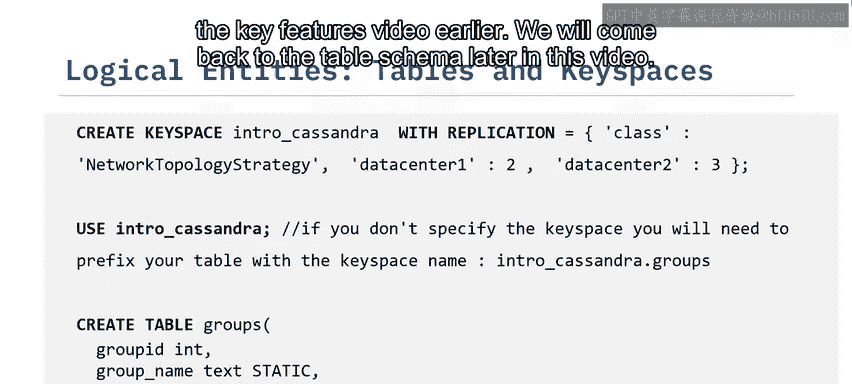

表是组织集群和节点级别数据存储的逻辑实体，它们包含列的行。你可以在不影响数据更新或运行查询的情况下创建、删除和修改表。为了创建一个表，我们需要使用Cassandra查询语言声明一个模式。表模式至少包括表的主键定义和表的常规列。

回到我们之前的例子，`groups`表存储关于几个组的信息，例如组ID、组名，以及每个组成员的用户名和年龄。你可以看到主键由两列组成：`group_id`和`username`。在Cassandra的术语中，`group_id`列被称为分区键，`username`列被称为聚类键。

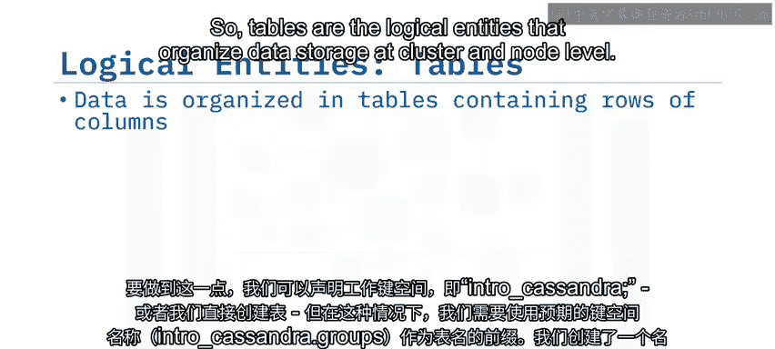

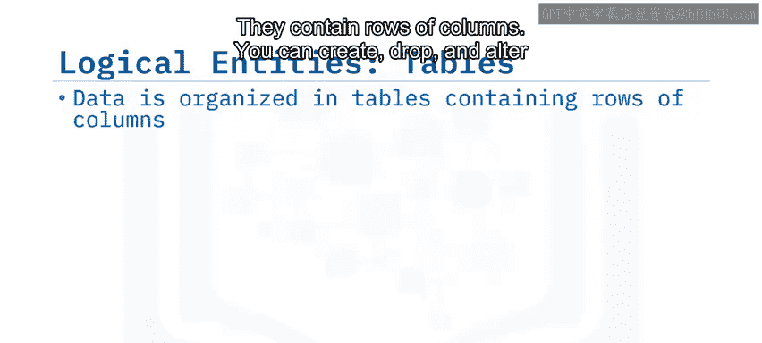

让我们更多地谈谈主键。首先，主键基本上是创建表时声明的表列的子集。除了声明表的列之外，还必须指定主键。一旦定义，主键就不能更改。

## 主键的双重角色

在Cassandra中，主键有两个角色。第一个角色是优化查询的读取性能。请记住，NoSQL系统是查询驱动的数据建模系统，这意味着只有在定义了你想回答的查询之后，才能开始表定义。你应该基于你的查询来构建主键。


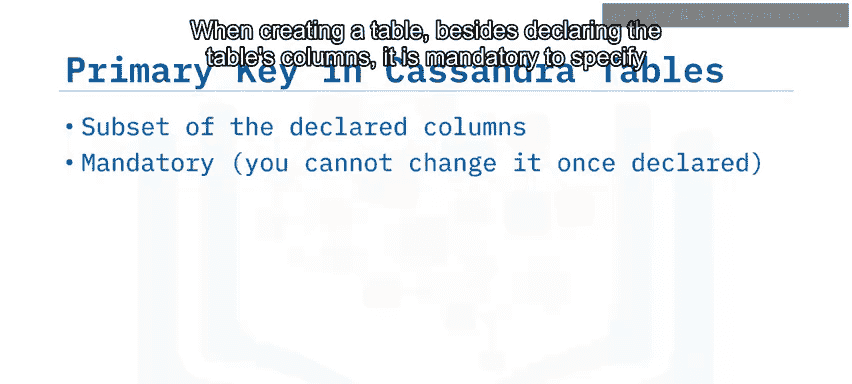

第二个角色是为查询提供唯一性。主键有两个组成部分：强制性的部分称为分区键，可选地，你可以有一个或多个聚类键。

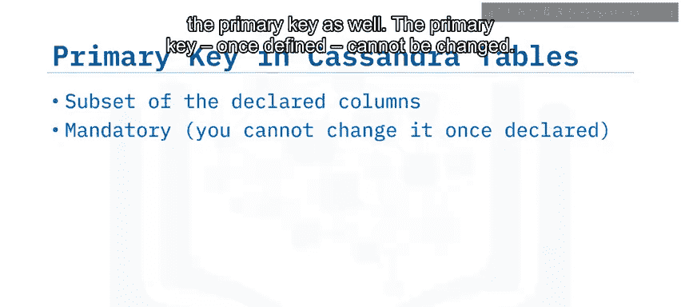

当数据被插入到集群的表中时，数据按分区键分组到分区中，第一步是对分区键应用哈希函数。分区键的哈希用于确定哪个节点及其后续副本将获得数据。

## 分区键与数据局部性

简单来说，分区键决定了数据在集群中的位置。

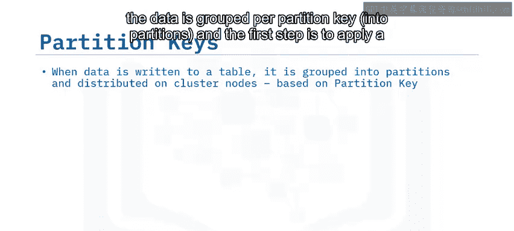

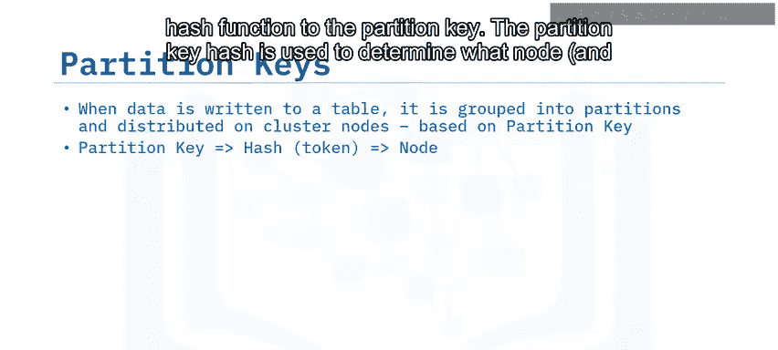

你可以在图表和表中看到，数据根据分区键`group_id`分组，并且每个分区被分布到集群的一个节点上。分区是Cassandra中的存储原子，这意味着一个分区的数据总是可以在一个节点及其副本上找到（在复制因子大于1的情况下）。

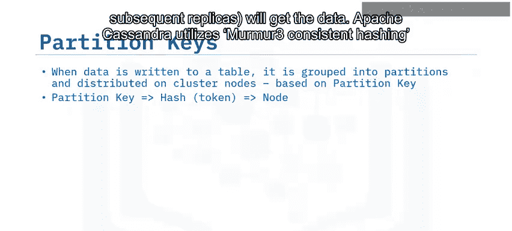

因此，如果我们想回答查询“组12中的所有用户”，那么查询可以只寻址第四个节点，并得到答案。在大型集群中，那些由数百或数千个节点组成的集群，限制回答查询所需联系的节点数量对于查询性能至关重要。

在我们进入下一个视频详细讨论聚类键之前，首先让我们定义另外两个概念：静态表和动态表。

## 静态表与动态表

当表的主键只包含分区键（单列或多列）而没有聚类键时，该表被称为静态表。

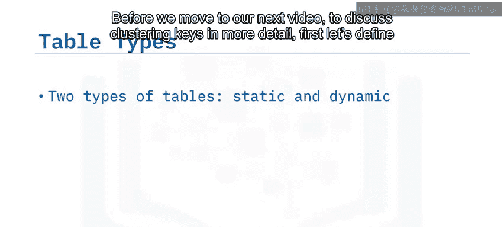

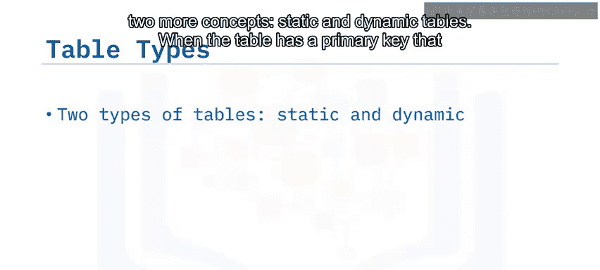

当表的主键由分区键（一个或多个）和聚类键（一个或多个）组成时，该表被称为动态表。

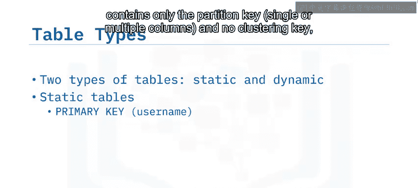

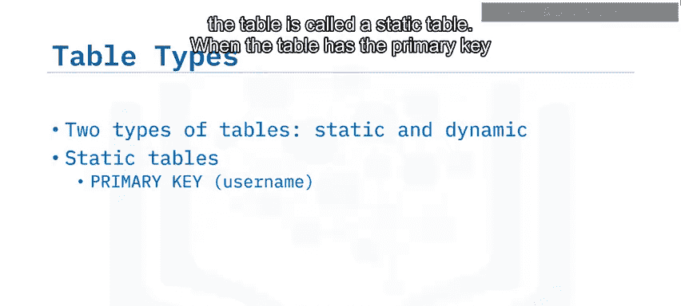

这个`users`表是一个静态表，正如你所看到的，主键只包含分区键。这意味着我们将拥有的不同用户数量就是我们表中将拥有的分区数量。

在静态表中，分区只有一个条目，因此被称为静态分区。

## 总结

在本节课中，我们一起学习了Cassandra数据模型的基础知识。我们了解到：

*   Cassandra将数据存储在表中，表被分组在键空间中。建议每个应用程序使用一个键空间。
*   你可以在不影响数据更新或运行查询的情况下创建、删除和修改表。
*   主键有两个角色：优化表上查询的读取性能，以及为条目提供唯一性。
*   主键有两个组成部分：一个强制性的分区键和一个或多个可选的聚类键。
*   Cassandra有两种类型的表：静态表和动态表。静态表是那些主键只包含分区键而没有聚类键的表。


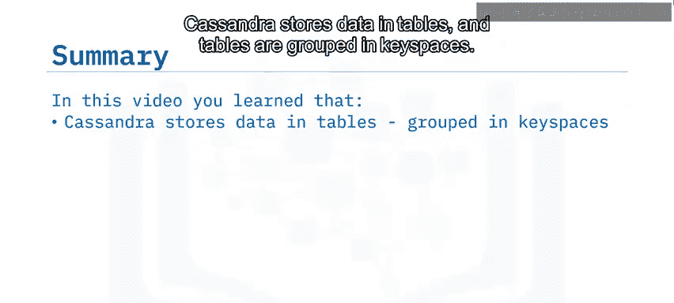

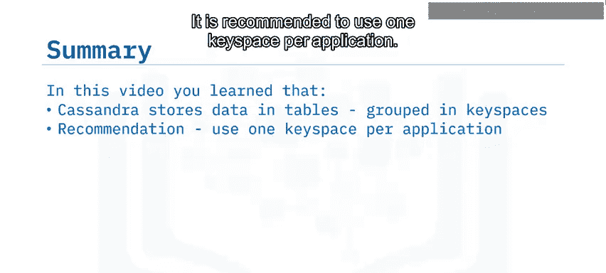

理解这些核心概念是掌握Cassandra高效数据存储和检索机制的关键。在下一部分，我们将深入探讨聚类键的作用以及动态表的工作方式。