# 022：Apache Cassandra 数据模型（第二部分）🔑

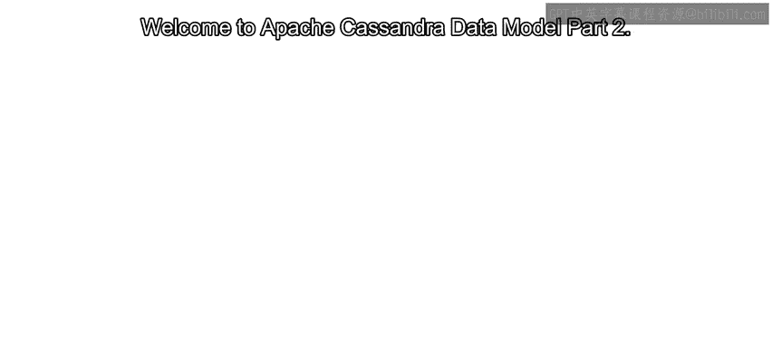

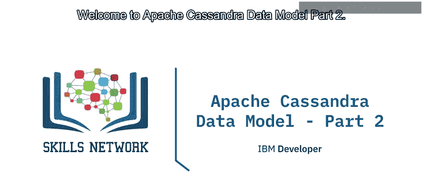

在本节课中，我们将继续学习Apache Cassandra的数据模型。我们将重点介绍**聚类键**的概念、**动态表**的特性，以及设计数据模型时需要遵循的基本指导原则。通过本课的学习，你将能够理解如何通过合理的主键设计来优化查询性能。

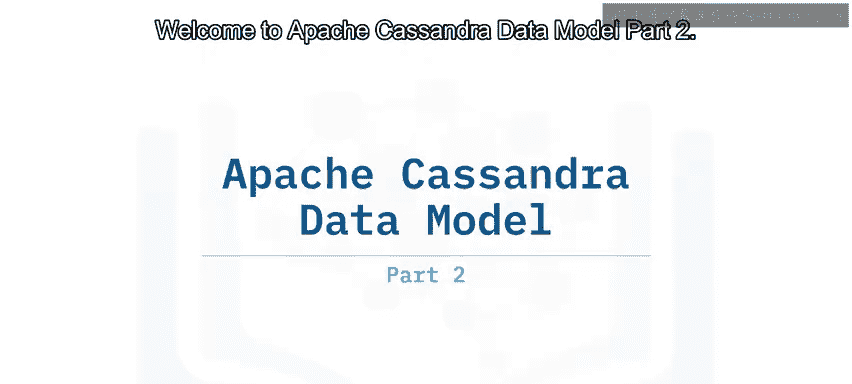


---


在上一节中，我们介绍了主键、分区键的作用以及静态表的定义。本节中，我们来看看主键的另一个关键组成部分——聚类键。

## 聚类键的作用

回顾上一节提到的 `groups` 表，其主键定义如下：
```sql
PRIMARY KEY (group_id, username)
```
其中，`group_id` 是**分区键**，而 `username` 是**聚类键**。

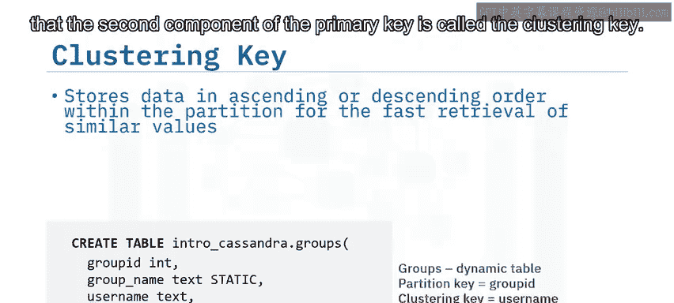

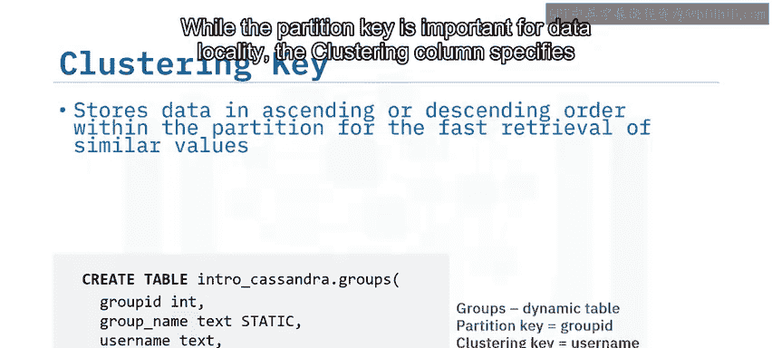

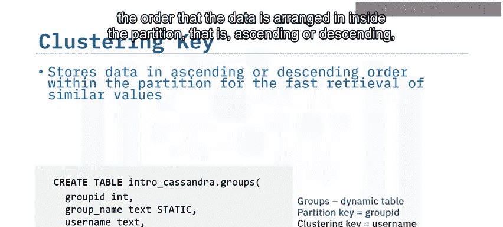

分区键决定了数据在集群中的物理存储位置（数据局部性）。而聚类键则负责**指定分区内部数据的排序方式**（升序或降序），并优化对分区内相似值（列数据）的检索。

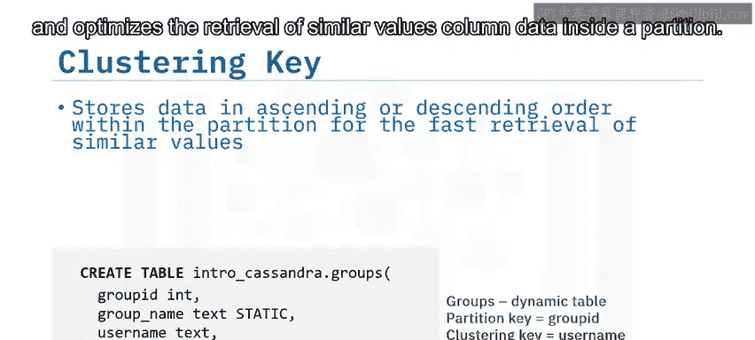

聚类键可以是单列或多列。在我们的例子中，聚类键只包含 `username` 这一列。这意味着在 `group_id` 分区内部，数据默认会按照 `username` 的升序进行存储。因此，当我们查询某个特定组的所有用户时，返回的数据将默认按用户名升序排列。

## 聚类键如何提升查询性能


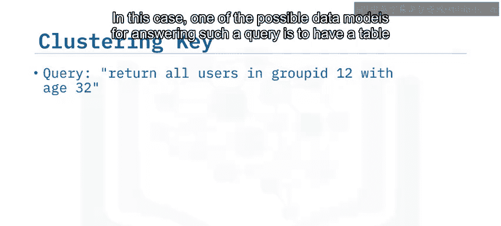

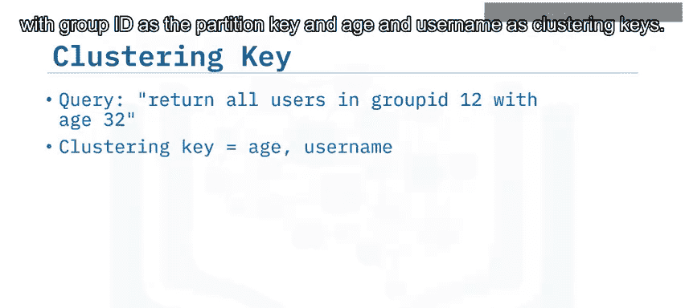

聚类键除了为主键条目提供唯一性外，更重要的是能显著提升**读查询的性能**。以下通过一个例子来说明。

假设我们需要回答这样一个查询：“**给我组ID为12且年龄为32的所有用户**”。为此设计的数据模型可能如下：

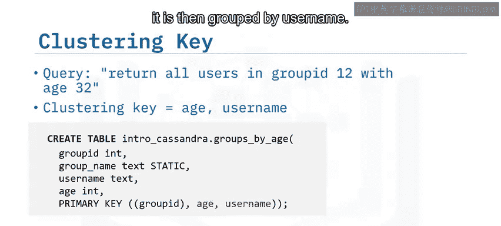

```sql
PRIMARY KEY (group_id, age, username)
```
这里，分区键是 `group_id`，聚类键由 `age` 和 `username` 两列组成。

在每个分区内部，数据首先会按照 `age` 进行分组和排序，然后在每个年龄组内，再按照 `username` 进行分组。这样，同一个组内所有年龄相同的用户会被存储在一起。

因此，执行上述查询时，系统只需定位到存储 `group_id=12` 分区的节点，并读取该分区内 `age=32` 的连续记录即可，极大地减少了需要扫描的数据量。

**从分区中减少需要读取的数据量对于查询时间至关重要，尤其是在处理大型分区时。** 如果没有聚类键的有序组织，Cassandra可能不得不读取数百MB的数据，而实际只需其中几KB的信息。

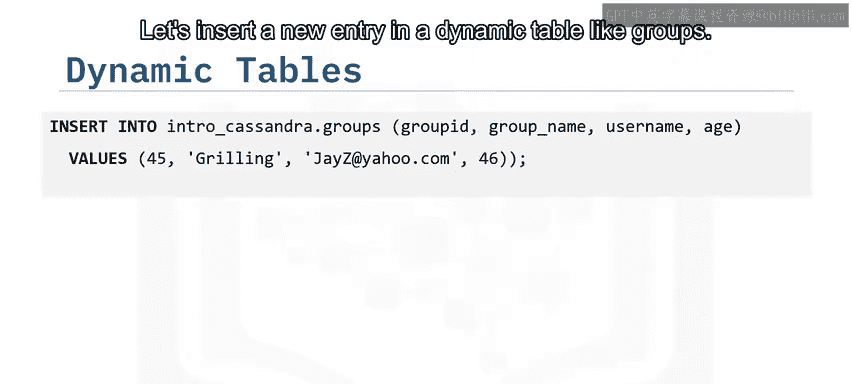

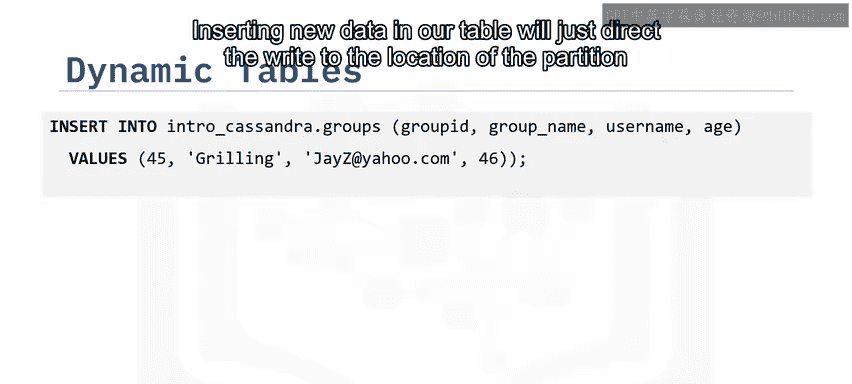

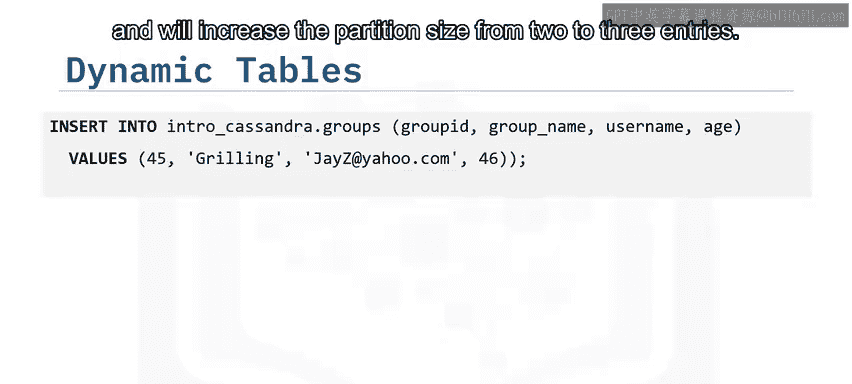

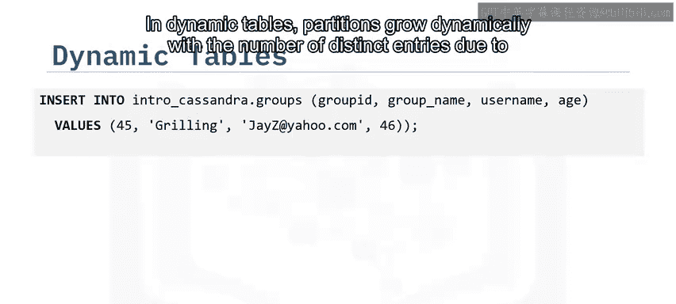

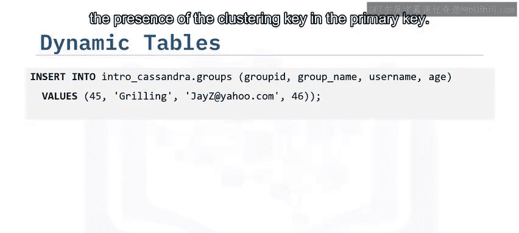

## 动态表与分区增长

在动态表中插入新数据，例如向 `groups` 表插入新条目，操作会定位到正确的分区并增加其大小。由于主键中包含聚类键，分区会随着不同条目数量的增加而**动态增长**。

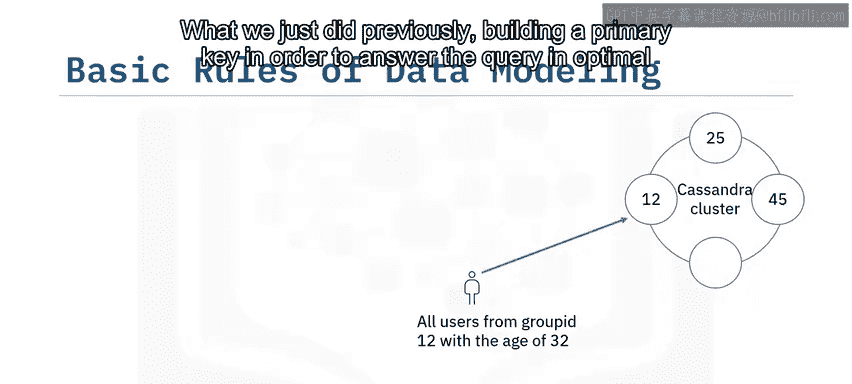

需要说明的是，在讨论的示意图中，为了简化，未考虑数据复制。例如，可能只有一个节点持有 `group_id=45` 的分区。只要集群结构不变，所有对组45的读写操作都会被路由到该特定节点。如果集群发生变更（如节点加入或离开），则会触发新的令牌分配和数据重新分布。

## 数据建模的基本指导原则

我们刚才所做的——为了以最优时间回答查询而构建主键——是数据建模过程的开始。Cassandra建模远不止定义主键，但为了保持简单，我们聚焦于这个最重要的部分。

以下是设计表主键时应考虑的简单规则：

1.  **选择合适的分区键**：分区键应能启动你的查询，同时确保数据在集群中均匀分布。例如，如果存在许多不同的组且各组大小相似，那么 `group_id` 可能是一个好的分区键选择。
2.  **最小化需要读取的分区数量**：设计的主键应能让你在回答特定查询时，尽可能减少需要读取的分区数量。请记住，数据是分布在集群中的。如果需要读取多个分区，则可能需访问多个节点，这会增加查询时间甚至导致超时。因此，最优的设计是**通过读取一个分区来回答查询**。

在总结之前还有一点需要注意：除了上述基本规则，请确保构建的聚类键能通过根据查询需求对列进行排序，来进一步减少需要读取的数据量。

---

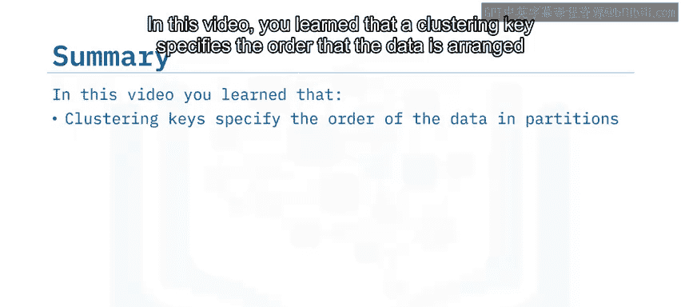

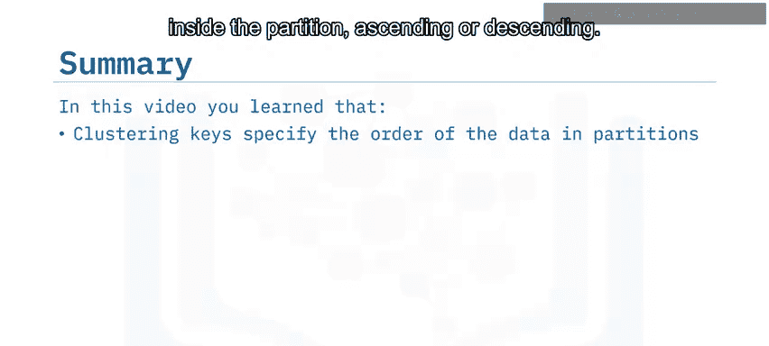

## 课程总结

本节课中，我们一起学习了Apache Cassandra数据模型的关键概念：

*   **聚类键**指定了数据在分区内部的排列顺序（升序或降序）。它可以是单列或多列键。
*   聚类键不仅为主键提供唯一性，还能通过组织分区内数据来**显著提升读查询性能**。
*   减少从分区中读取的数据量对查询时间至关重要，尤其是在处理大型分区时。
*   在**动态表**中，分区大小会随着条目数量的增加而动态增长。
*   数据建模的核心是**从你想要回答的查询出发**，然后基于查询来构建主键，以期获得最佳的读取性能。构建一个能在最优时间内回答查询的主键，是数据建模过程的重要开端。