# 024：CQL数据类型

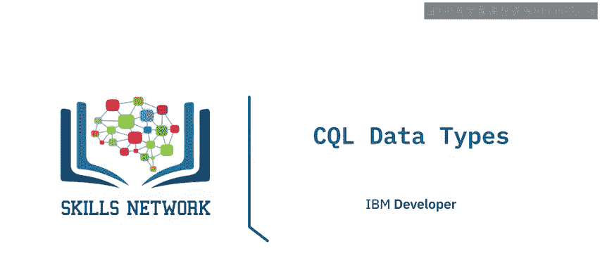

在本节课中，我们将学习Cassandra查询语言（CQL）支持的数据类型。我们将了解其主要分类，并学习如何在定义Cassandra表时使用这些数据类型。

CQL支持多种数据类型，它们主要可以分为三大类：**内置数据类型**、**集合数据类型**和**用户定义数据类型**。用户可以根据应用程序和数据模型的需求选择合适的数据类型。

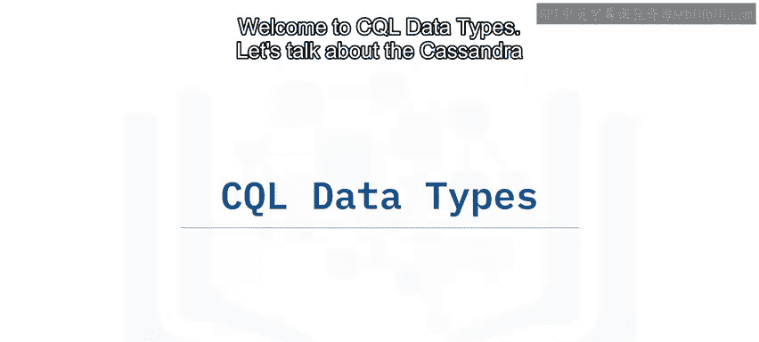

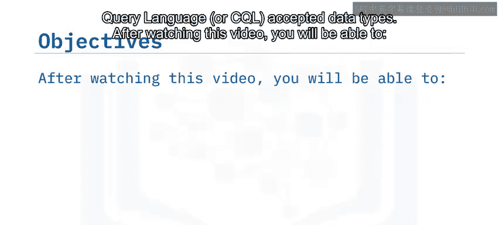

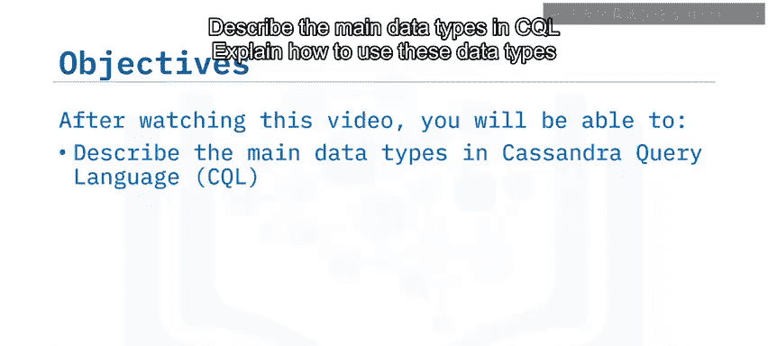

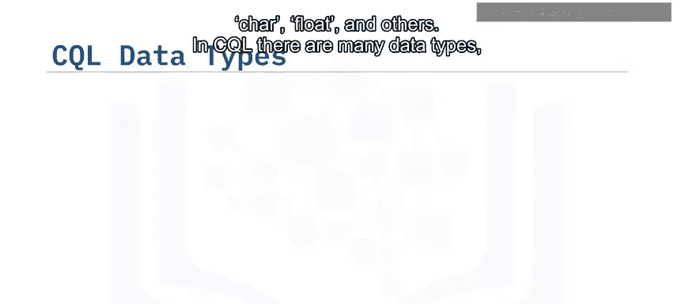

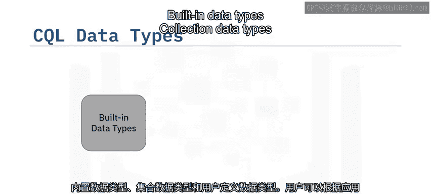

接下来，我们将逐一讨论这些类别，以理解它们的含义。

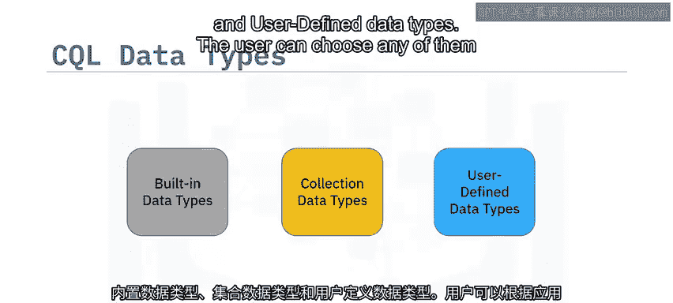

## 🏗️ 内置数据类型

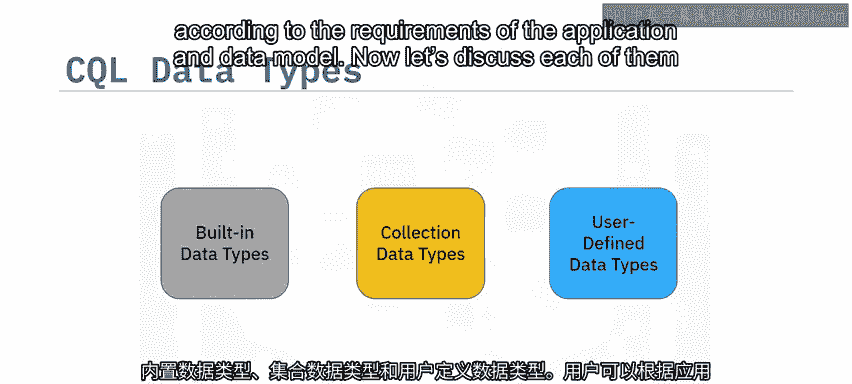

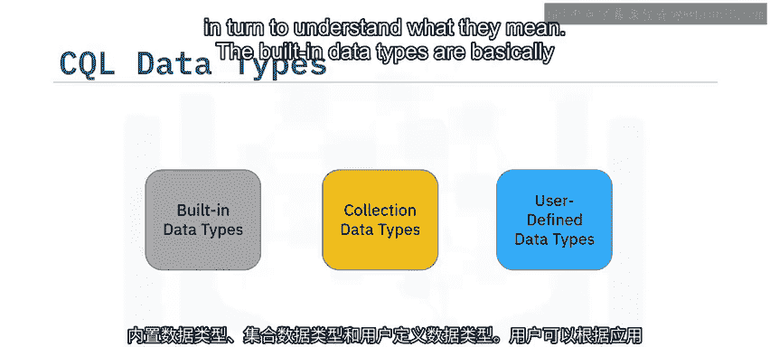

内置数据类型是Cassandra中预定义的。用户可以将变量声明为这些类型中的任何一种。

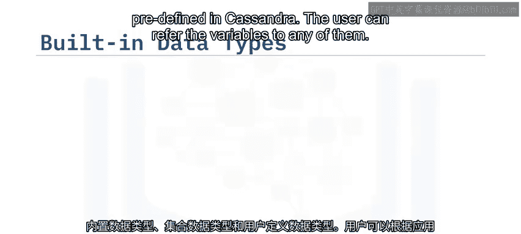

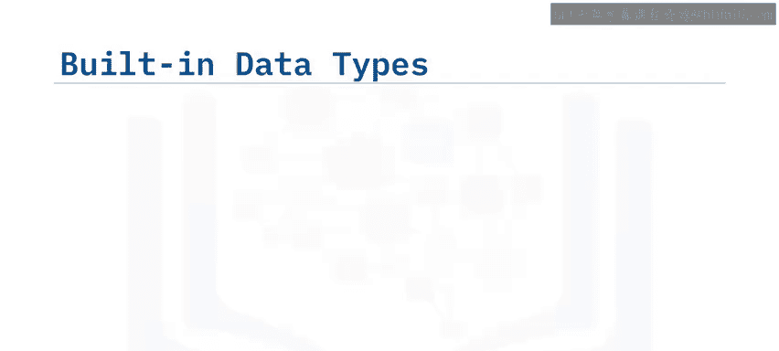

除了像`ASCII`、`BOOLEAN`、`DECIMAL`、`DOUBLE`、`FLOAT`、`INT`和`TEXT`这样比较直观的常规数据类型外，还有一些其他类型可能需要稍作解释。

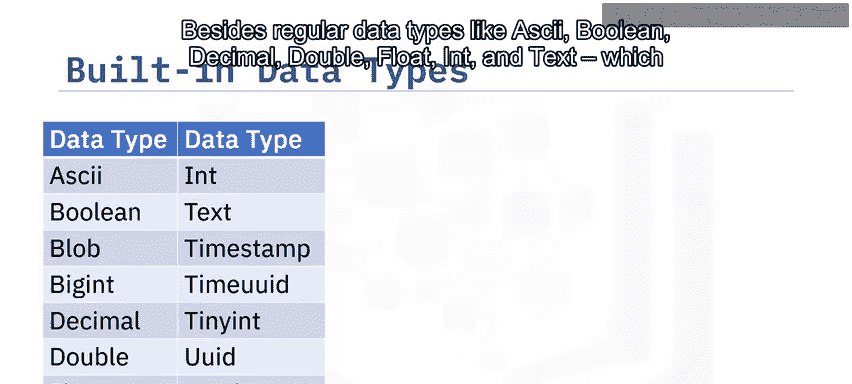

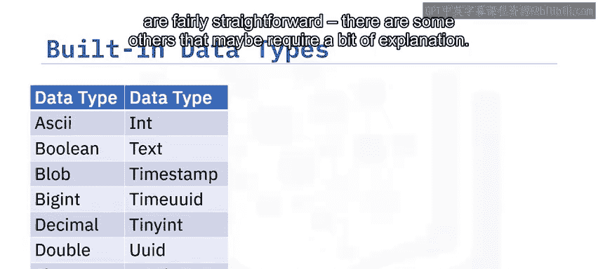

例如，`BLOB`数据类型。虽然Cassandra主要存储基于文本的信息，但它也可以存储BLOB，即二进制大对象。BLOB通常用于存储图像、音频或其他多媒体对象。在Cassandra中，BLOB代表作为单个实体存储的二进制数据集合，建议其大小不要超过1兆字节。

因此，您可以使用BLOB存储一个小图像或字符串。

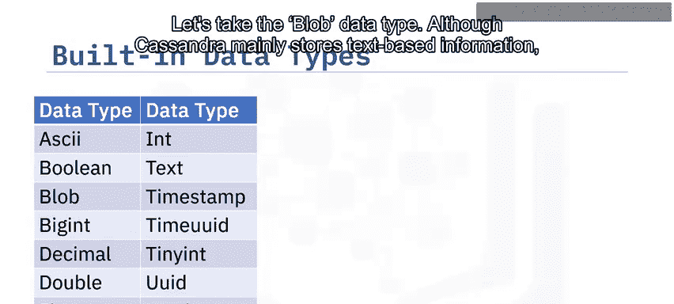

`BIGINT`数据类型可用于64位有符号长整数。与`INT`数据类型相比，此数据类型存储的整数范围更大。

众所周知的`VARCHAR`在Cassandra中也可作为数据类型使用，它代表UTF-8编码的字符串。

## 🧺 集合数据类型

接下来是更复杂的数据类型。Cassandra提供集合类型，作为一种将数据分组并存储在单个列中的方式。

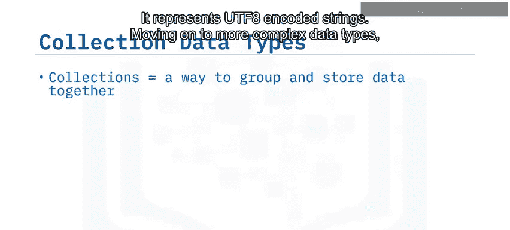

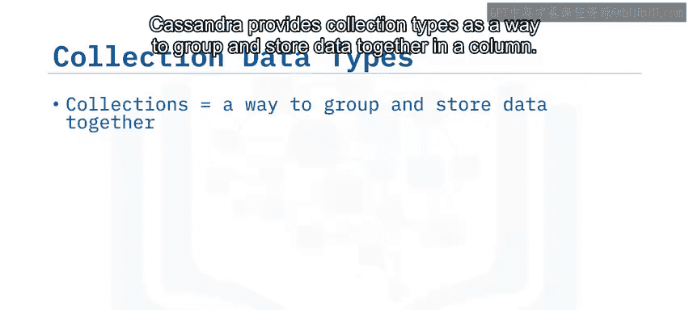

例如，在关系型数据库中，像用户的多个电子邮件地址这样的分组，是通过用户表和电子邮件表之间的多对一连接关系来关联的。Cassandra通过在用户表中将用户的电子邮件地址存储在集合列中，来避免两个表之间的连接。每个集合都指定了所持有数据的数据类型。

集合适用于存储数据量有限的情况。如果数据具有无限增长潜力（例如每秒发送的消息或记录的传感器事件），则不应使用集合数据类型。相反，应使用具有复合主键的表，并将数据存储在聚类列中。

在集合数据类型类别中，有三种数据类型：

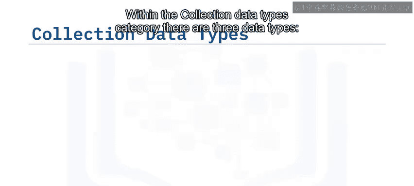

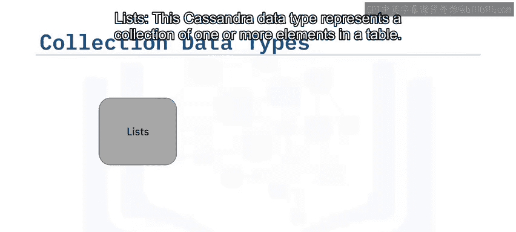

以下是集合数据类型的三种具体形式：

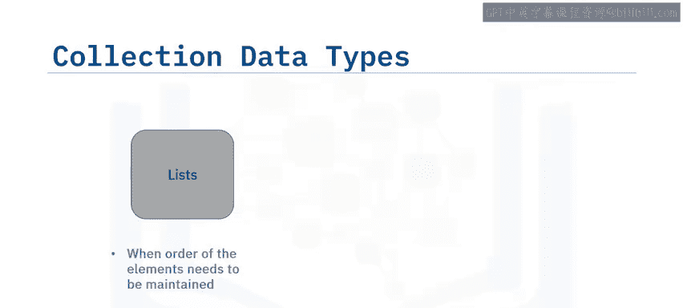

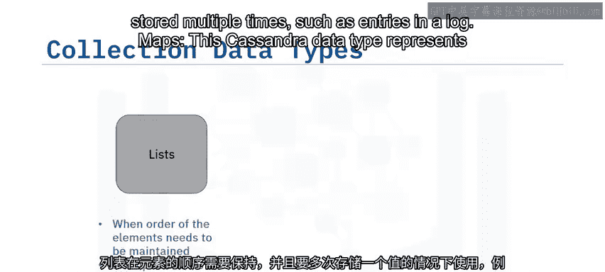

*   **列表**：此Cassandra数据类型表示表中一个或多个元素的集合。在需要维护元素顺序且值可以存储多次（例如日志条目）的情况下使用列表。
*   **映射**：此Cassandra数据类型表示键值对的集合。映射是一种用于存储元素键值对的数据类型，例如使用日期然后文本输入的日记条目。
*   **集合**：此Cassandra数据类型表示表中一个或多个已排序元素的集合。集合是一种用于存储一组元素的数据类型。集合的元素将按排序顺序返回，例如电子邮件地址列表。

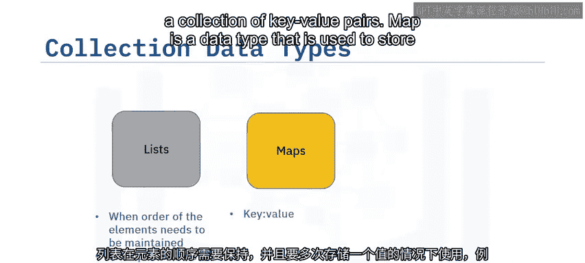

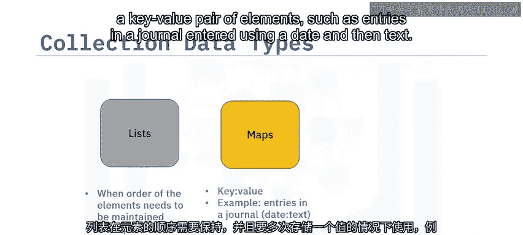

## 🔧 集合数据类型应用示例

让我们回到用户表，并向表中添加一个名为`jobs`的新列，它基本上就是一个工作列表。

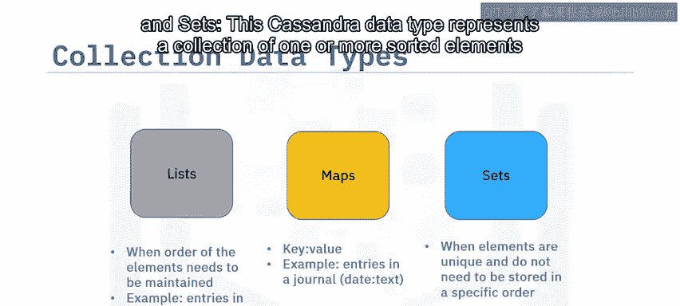

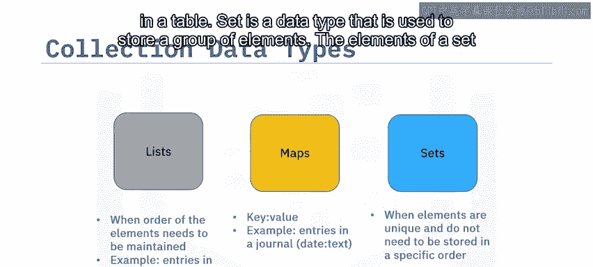

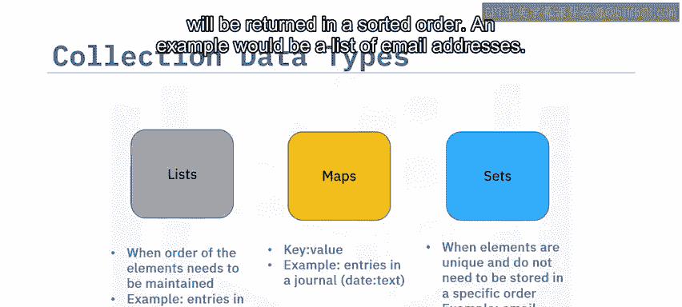

我们希望按照工作发生的顺序来存储它们。请记住，用户表是一个静态表，其主键由`user_id`列组成。

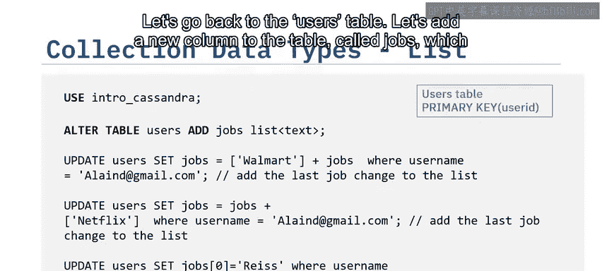

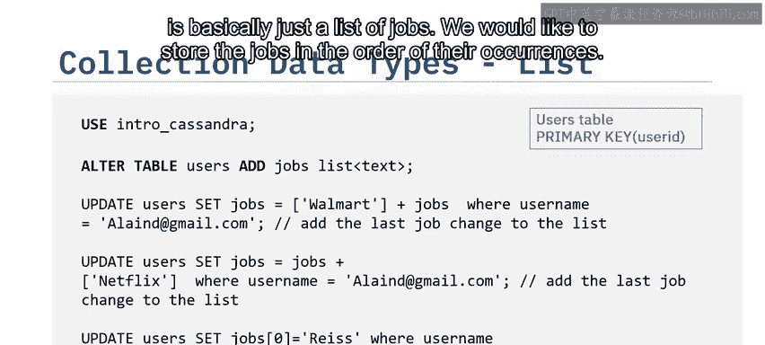

在Cassandra中，我们将把所有用户的工作存储在一个列中，因为我们无法在这种情况下执行连接。我们将使用集合数据类型中的**列表**类型，因为我们希望保留工作的顺序。另一个原因是，一个人可以在特定公司工作不止一次，因此不需要唯一性。

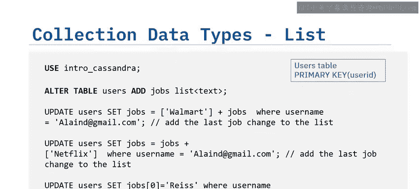

我们可以在列表的开头、结尾或特定位置添加一个工作。列表中的条目可以是重复的，因为它们不是唯一的。

在CQLSH中对我们的表进行`SELECT`查询显示，当前为我们的用户记录了两份工作。

我们也可以从列表中删除一个条目。现在对我们的表进行`SELECT`查询显示，我们的用户只列出了一份工作。

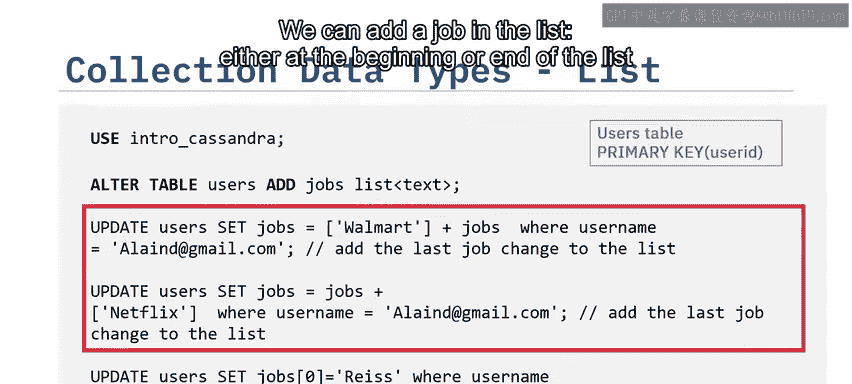

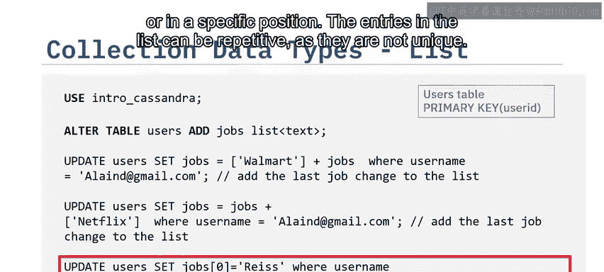

## 🧩 用户定义数据类型

我们已经看到，集合数据类型可以用来模拟一对多的连接关系。然而，对于一对一的关系，我们可以使用Cassandra的用户定义类型。

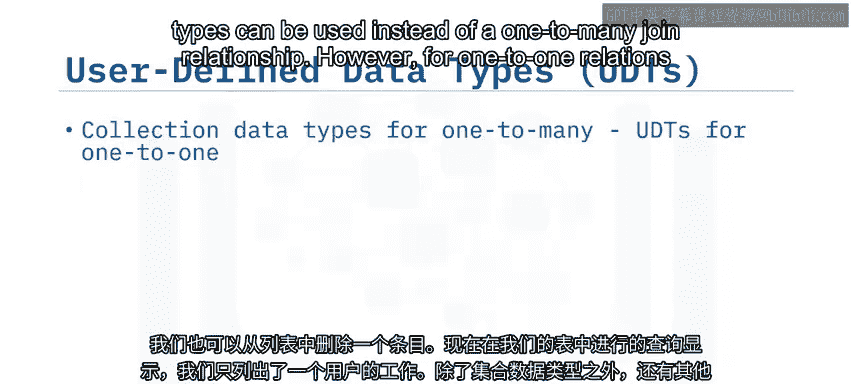

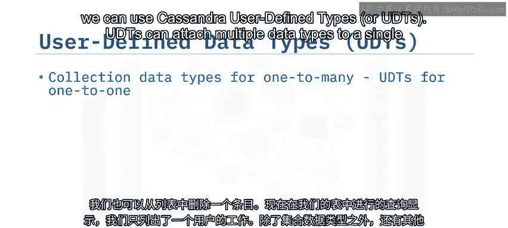

UDT可以将多个数据类型附加到单个列。可以想象一个地址是由公寓号、楼栋、街道等组合而成的。

CQL允许用户创建自己的数据类型。创建的UDT中使用的字段可以是任何有效的数据类型，包括集合和其他现有的UDT。创建数据类型及其字段后，用户可以修改、验证甚至删除一个字段或整个数据类型。一旦创建，UDT就可以用来定义表中的列。

在这个例子中，我们创建一个名为`address`的新数据类型。创建后，我们可以用它来定义新表`location`中的列。

我们可以使用新的地址数据类型插入数据，也可以删除该数据类型。

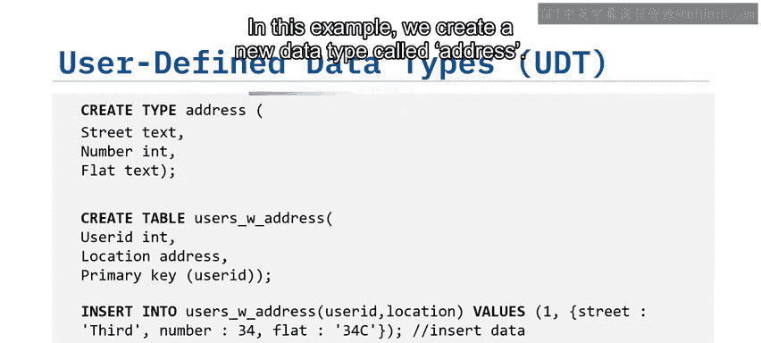

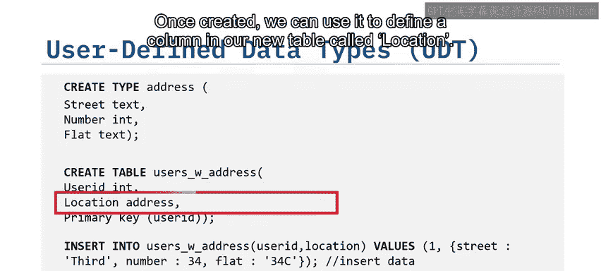

## 📝 课程总结

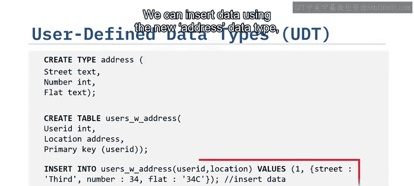

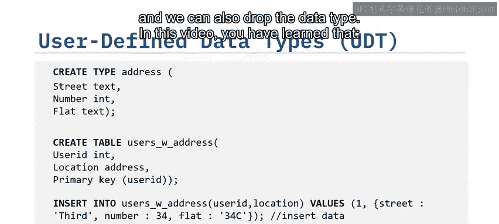

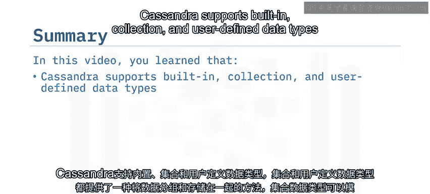

在本节课中，我们一起学习了Cassandra支持内置、集合和用户定义数据类型。

集合和用户定义数据类型都提供了一种将数据分组和存储在一起的方式。集合数据类型可以模拟一对多关系。集合数据类型有三种：列表、映射和集合。

用户定义数据类型可以模拟一对一关系，并且可以将多个数据字段附加到一个列上。