# 025：键空间操作 🔑


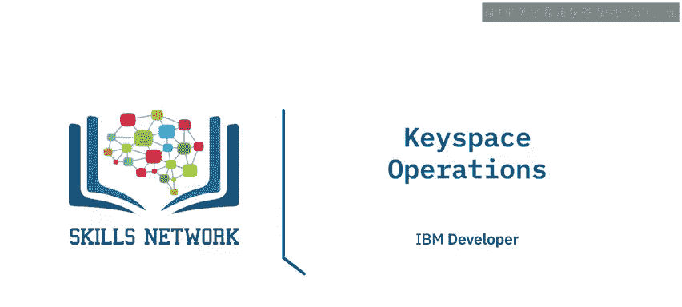

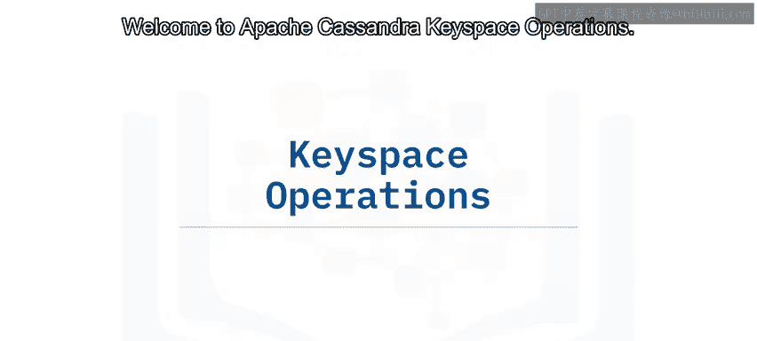

在本节课中，我们将学习Apache Cassandra中的键空间操作。我们将了解键空间的作用、复制因子与复制策略的概念，并掌握如何创建、修改和删除键空间。

## 概述

上一节我们介绍了Cassandra中的表和键空间这两个逻辑实体。本节中，我们将深入探讨键空间及其相关操作。键空间必须在创建表之前定义，因为它没有默认值。一个键空间可以包含任意数量的表，而一个表只能属于一个键空间。复制是在键空间级别指定的。

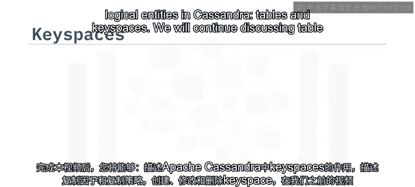

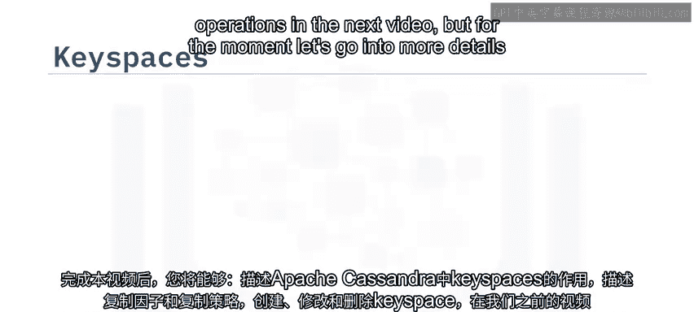

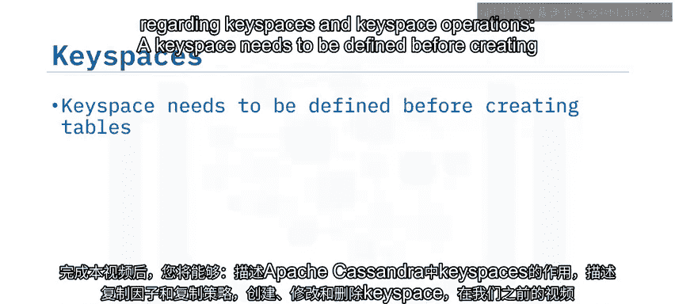

## 键空间的作用与创建

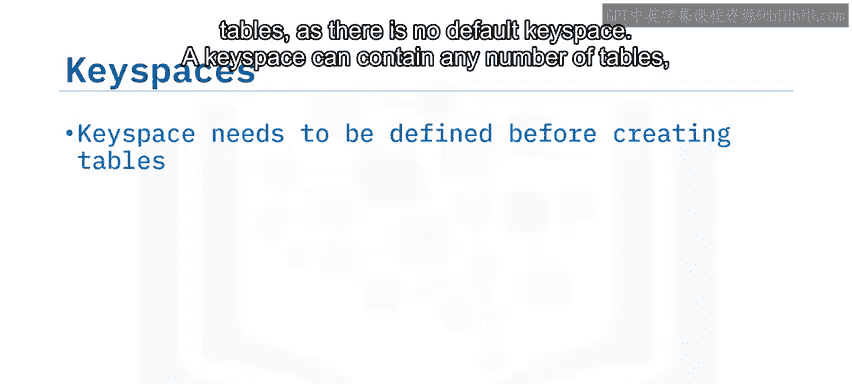

键空间是Cassandra中数据的顶层容器。在创建表之前，必须先定义一个键空间。复制因子在创建键空间时指定，但之后可以修改。

以下是创建键空间的CQL示例：

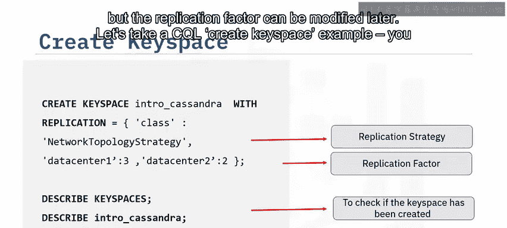

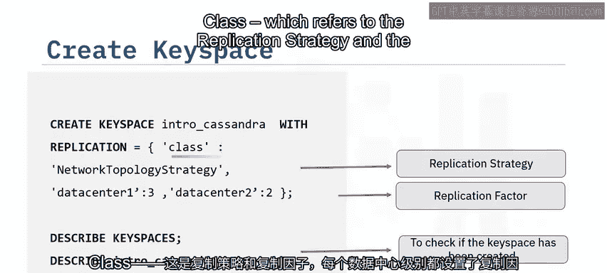

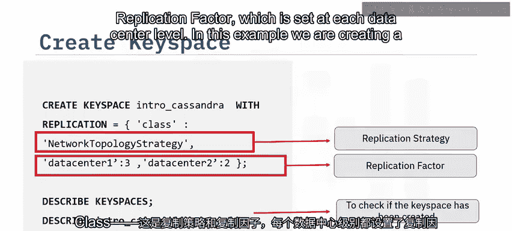

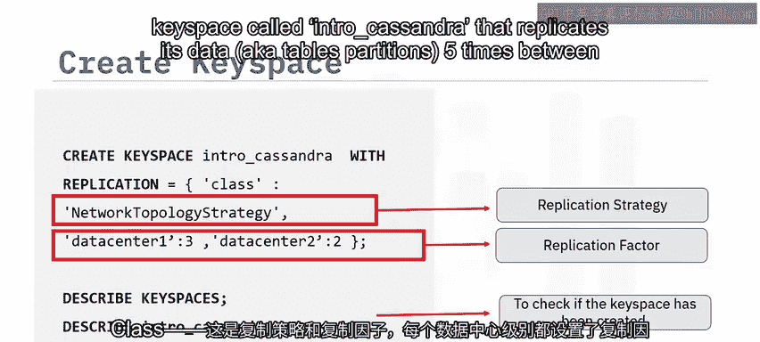

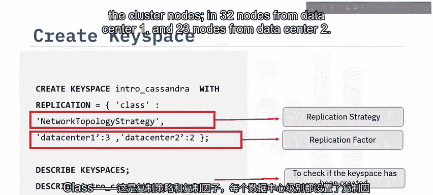

```sql
CREATE KEYSPACE Intro_Cassandra
WITH replication = {
    'class': 'NetworkTopologyStrategy',
    'datacenter1': 3,
    'datacenter2': 2
};
```

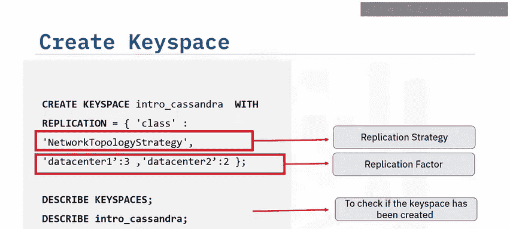

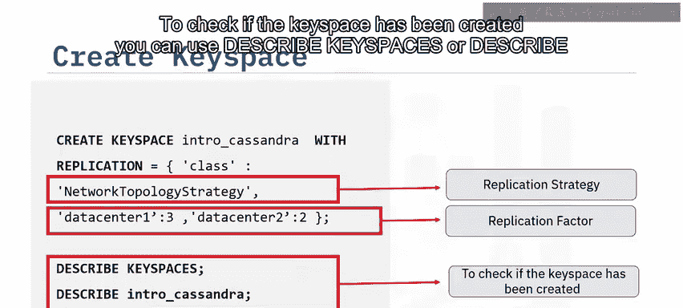

在这个例子中，我们创建了一个名为 `Intro_Cassandra` 的键空间。它使用 `NetworkTopologyStrategy` 复制策略，将数据（即表的分区）在集群节点间复制5次：数据中心1的3个节点和数据中心2的2个节点。

要检查键空间是否创建成功，可以使用以下命令：

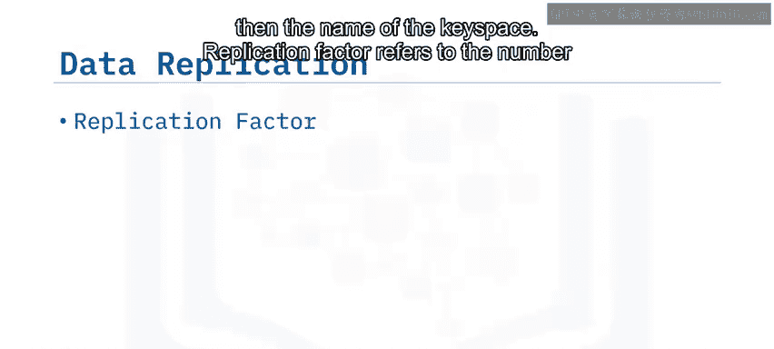

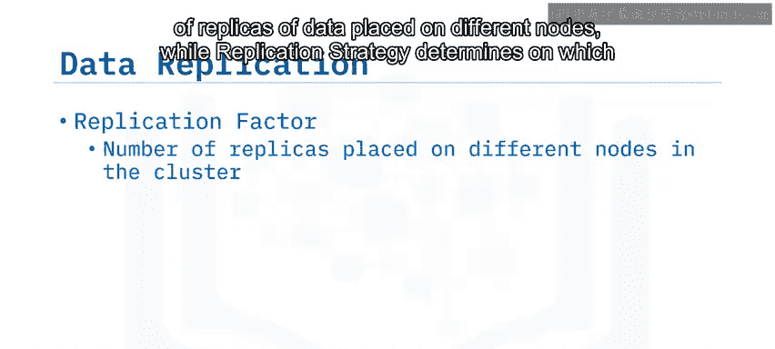

```sql
DESCRIBE KEYSPACES;
```
或
```sql
DESCRIBE Intro_Cassandra;
```

## 复制因子与复制策略

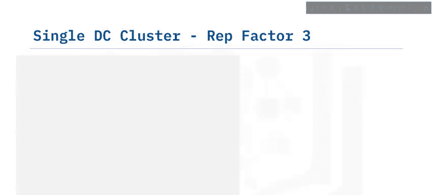

复制因子指的是数据在不同节点上放置的副本数量。复制策略则决定了在根据分区键哈希和令牌预分配完成初始数据分布后，这些副本将位于集群的哪些节点上。数据复制依赖于这两个信息：复制因子和复制策略。

关于Apache Cassandra中的副本，有两个重要的注意事项：
*   所有副本同等重要，没有主副本或从副本之分。
*   通常，复制因子不应超过集群中的节点数量。

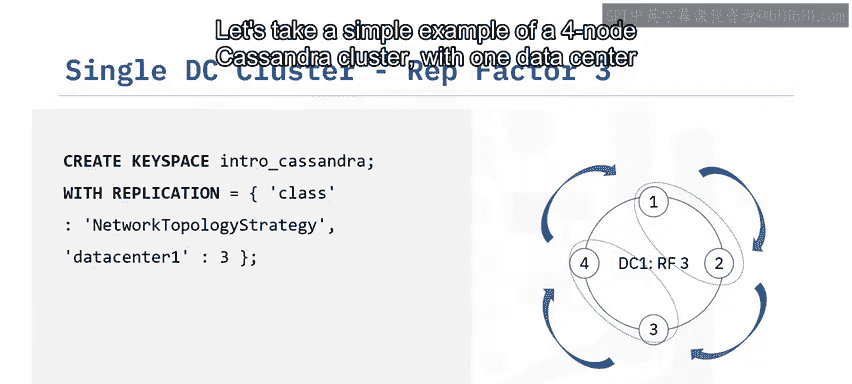

## 复制示例分析

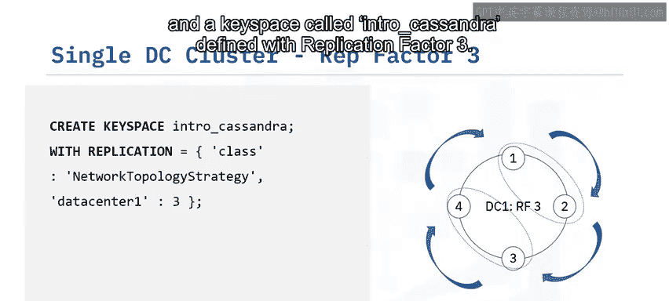

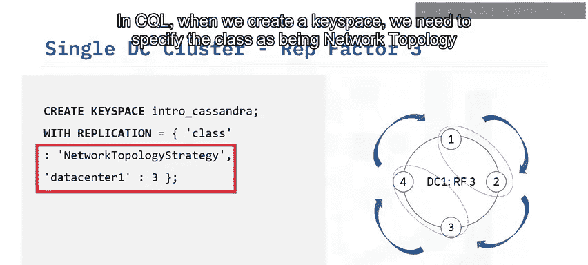

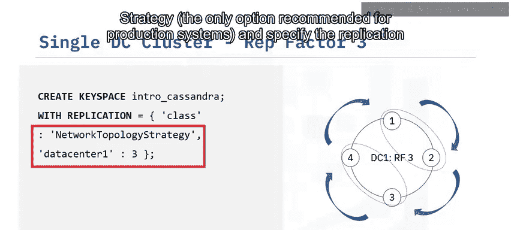

让我们看一个简单的例子。假设有一个包含4个节点的Cassandra集群，只有一个数据中心。我们定义一个名为 `Intro_Cassandra` 的键空间，复制因子为3。

在CQL中创建键空间时，我们需要指定 `class` 为 `NetworkTopologyStrategy`（这是生产系统推荐的唯一选项），并在数据中心级别指定复制因子。

假设集群拓扑中，节点1和节点2在同一个机架，节点3和节点4在另一个机架。我们假设图中名为 `P` 的分区最初被分配到节点1。

复制因子为3意味着我们需要将数据复制到另外两个节点上。数据复制在集群中顺时针进行，同时考虑服务器的机架分配。

由于节点1和节点2在同一个机架，Cassandra会尝试将下一个副本放在不同机架的节点上，即节点3。最后一个副本将放在节点4上。因为有两个副本放置在不同的机架，所以节点3和节点4在同一个机架不会成为问题。

现在，我们来看一个多数据中心环境的例子。这里有两个数据中心，我们的键空间复制因子为5。

与上一个例子类似，我们需要使用CQL创建键空间，再次指定 `class` 为 `NetworkTopologyStrategy`，并在数据中心级别指定复制因子：数据中心1为3，数据中心2为2。

我们假设图中名为 `P` 的分区最初被分配到数据中心1的节点1和数据中心2的节点5。

与上一个例子类似，在数据中心1，根据服务器的机架位置顺时针放置另外两个副本，因此节点3和节点4将获得分区 `P` 的副本。在我们的例子中，有两个数据中心，所以在完成第一个数据中心的副本放置后，Cassandra会转到下一个数据中心放置另外两个副本。由于分区 `P` 已经最初分配到数据中心2的节点5，我们现在只需要在数据中心2再放置一个副本。考虑到节点的机架位置，节点7被选为存放我们数据的第五个副本。这就是我们的五个副本最终分布在Cassandra集群节点上的方式。

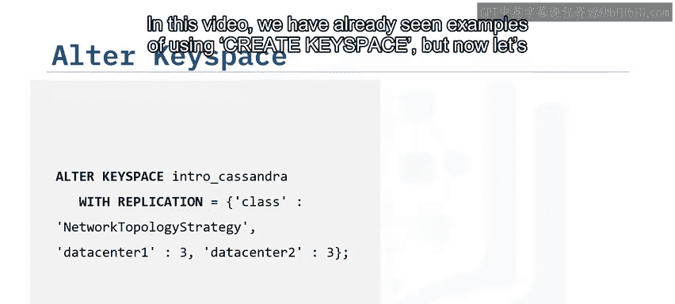

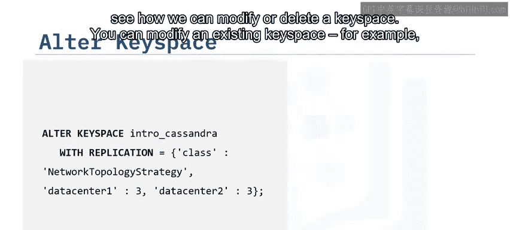

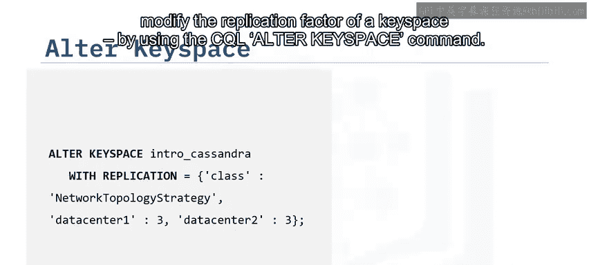

## 修改与删除键空间

我们已经在本视频中看到了使用 `CREATE KEYSPACE` 的例子，现在让我们看看如何修改或删除一个键空间。

你可以使用CQL的 `ALTER KEYSPACE` 命令来修改现有的键空间，例如修改键空间的复制因子。

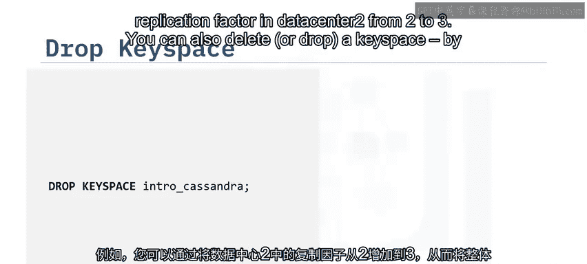

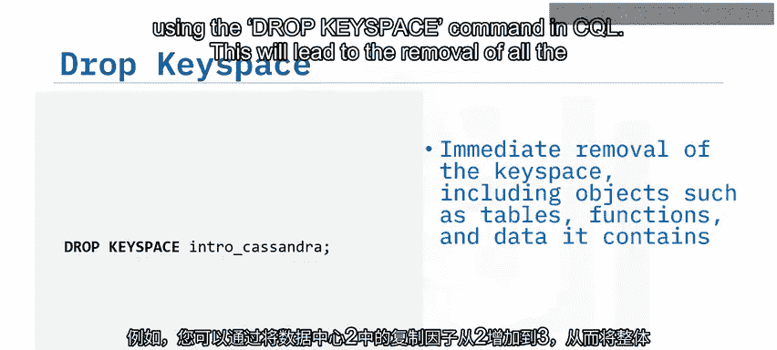

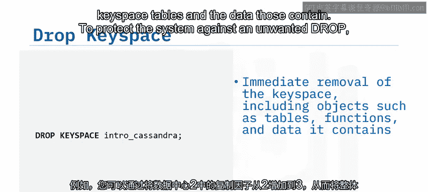

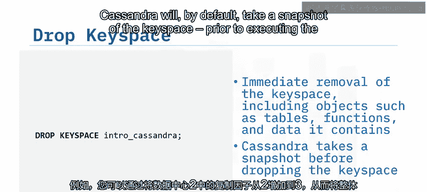

一个例子是，你可以通过将数据中心2的复制因子从2增加到3，从而将整体键空间复制因子从5增加到6。

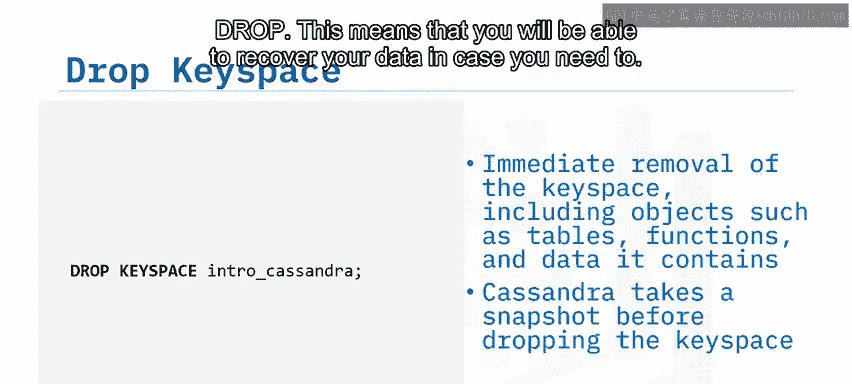

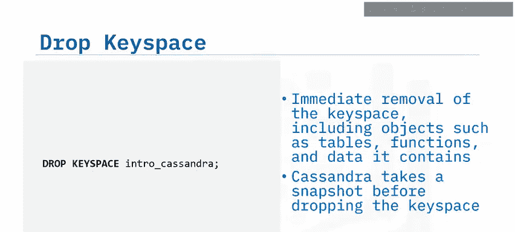

你也可以使用CQL中的 `DROP KEYSPACE` 命令来删除或丢弃一个键空间，这将导致删除该键空间的所有表及其包含的数据。为了保护系统免受意外删除的影响，Cassandra默认会在执行删除操作之前对键空间进行快照。这意味着在需要时，你将能够恢复你的数据。

## 总结

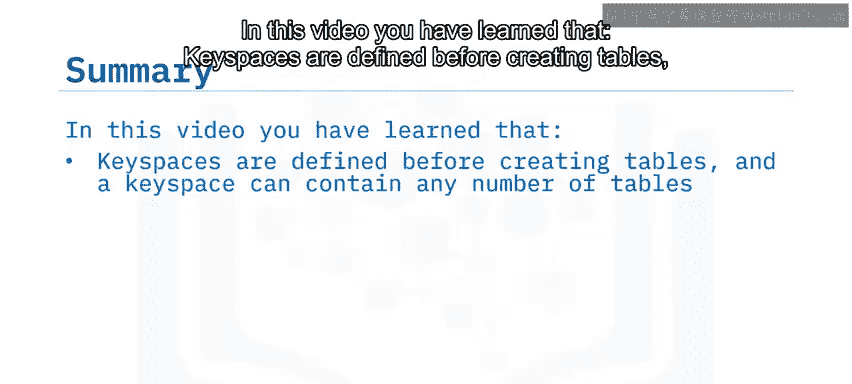

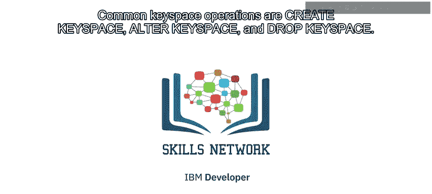

本节课中我们一起学习了以下内容：
*   键空间在创建表之前定义，一个键空间可以包含任意数量的表。
*   复制在键空间级别指定。
*   数据复制依赖于复制因子和复制策略，两者均在键空间级别设置。
*   复制因子设置副本的数量。
*   复制策略决定副本将位于集群的哪些节点上。
*   常见的键空间操作是：创建键空间、修改键空间和删除键空间。