# 026：Apache Cassandra表操作


在本节课中，我们将学习Apache Cassandra中表的核心概念与操作方法。我们将了解表的角色、关键属性，并掌握如何创建、修改和删除表。

上一节我们介绍了键空间及其操作，本节中我们来看看Cassandra中数据存储的核心单元——表。


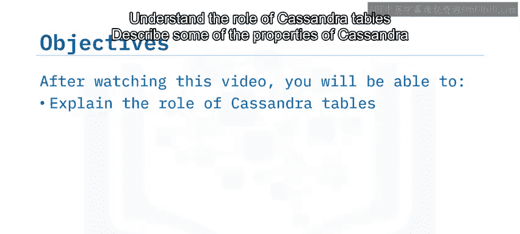

## 🗂️ Cassandra表的作用

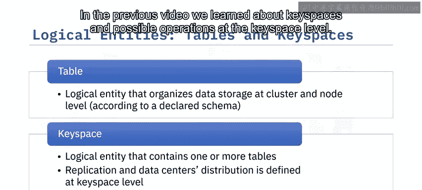

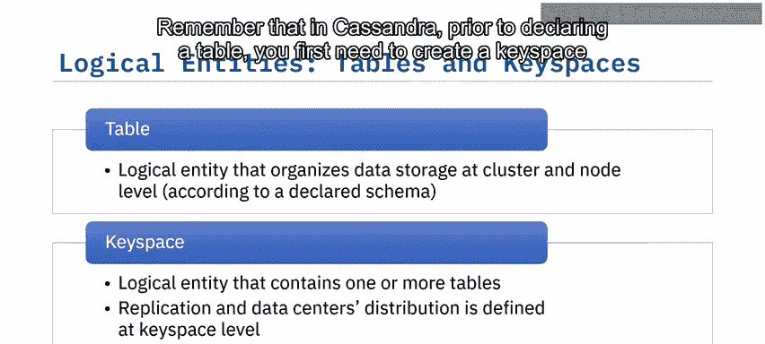

Cassandra将数据存储在表中，表的模式定义了数据在集群和节点级别的存储方式。

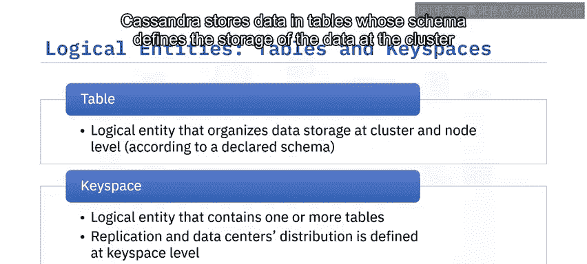

## 🛠️ 创建表

创建表的通用语法如下：

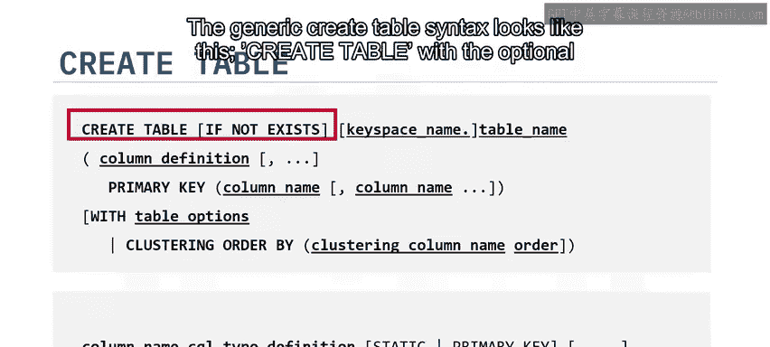

```sql
CREATE TABLE [IF NOT EXISTS] keyspace_name.table_name (
    column_name data_type [PRIMARY KEY],
    ...
) [WITH options];
```

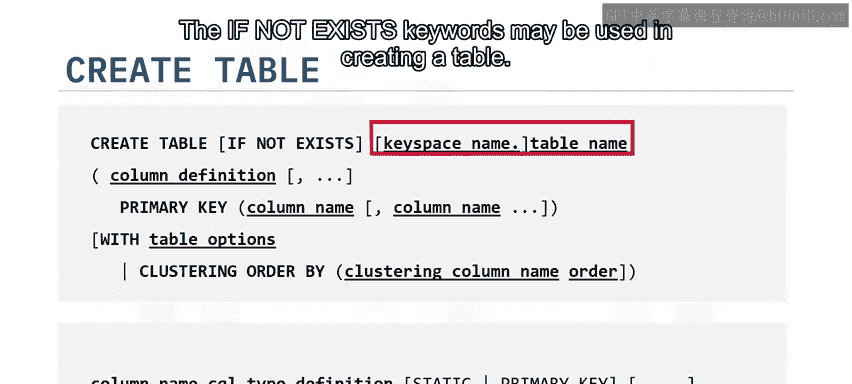

以下是创建表时需要注意的几个关键点：

*   `IF NOT EXISTS` 参数是可选的。如果尝试创建已存在的表，除非使用此选项，否则会返回错误。
*   表名之前可以指定键空间名。如果未通过 `USE keyspace` 语句指定当前键空间，则必须在此处指明。
*   列定义在表名后的括号内，多个列使用逗号分隔。
*   可以在列定义中通过 `PRIMARY KEY` 参数指定该列为表的唯一主键。

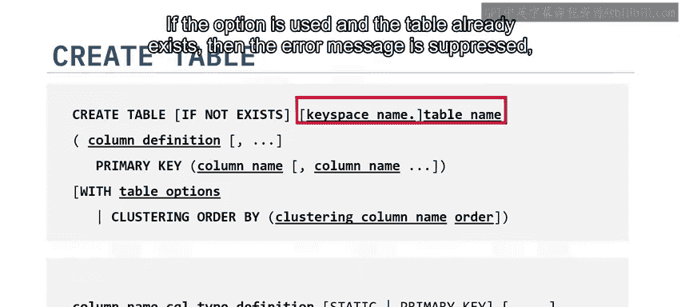

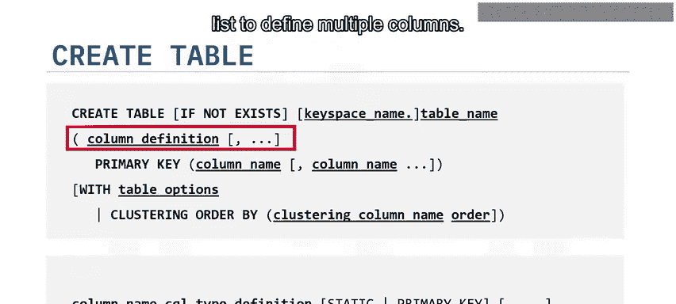

如果主键由多个列组成，则需要在表定义的末尾声明。

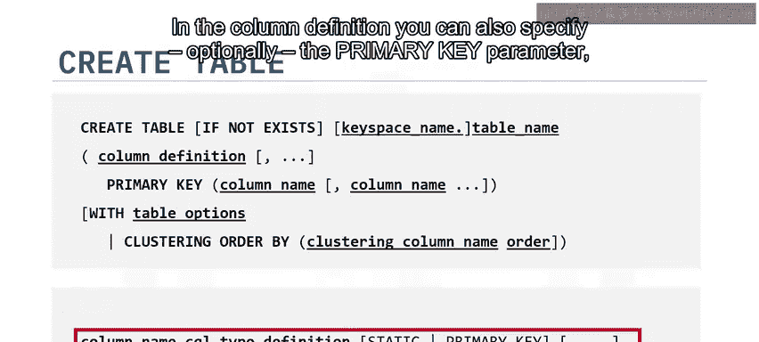

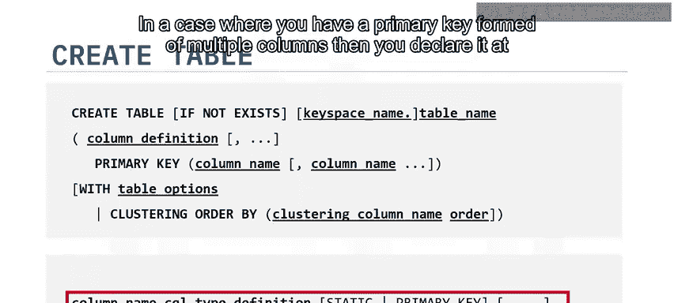

### 静态表示例

我们来看一个课程中提过的 `users` 表的例子。这是一个静态表，意味着主键仅包含一个分区键列 `username`。

在这种情况下，有两种方式指定主键：

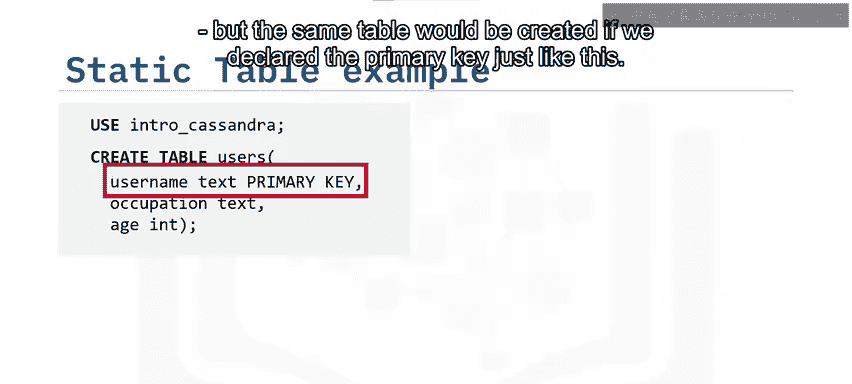

**方式一：** 在列定义中直接添加
```sql
CREATE TABLE users (
    username text PRIMARY KEY,
    email text
);
```

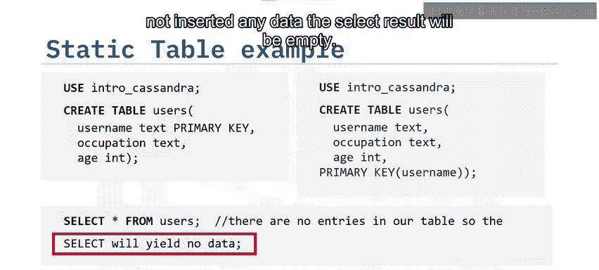

**方式二：** 在表定义末尾声明
```sql
CREATE TABLE users (
    username text,
    email text,
    PRIMARY KEY (username)
);
```

两种方式创建的表是相同的。创建表后，可以使用 `SELECT` 语句查询，但由于尚未插入数据，查询结果将为空。

### 动态表示例

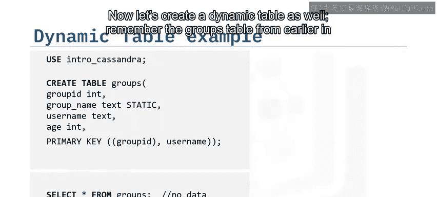

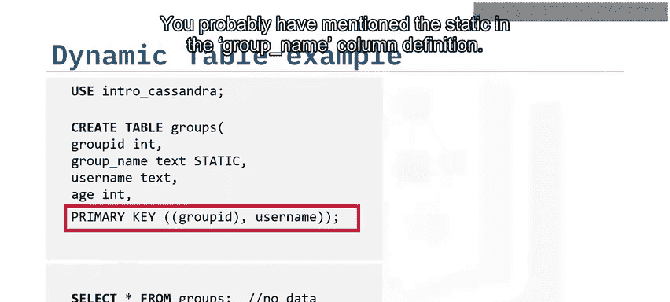

现在，让我们创建一个动态表。回顾课程中提过的 `groups` 表，动态表意味着主键由分区键和聚类键共同组成。

在这个例子中，分区键是 `group_id`，聚类键是 `username`。

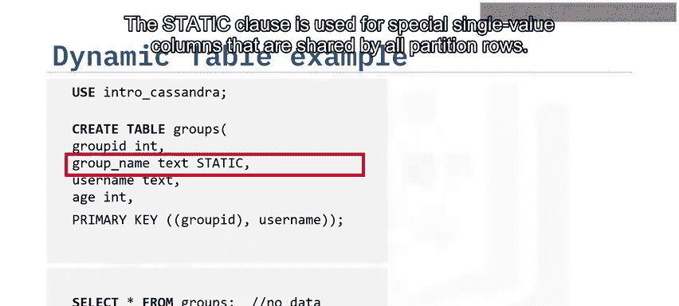

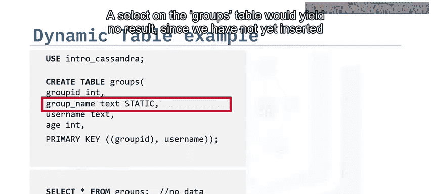

```sql
CREATE TABLE groups (
    group_id int,
    username text,
    group_name text STATIC,
    PRIMARY KEY (group_id, username)
);
```

你可能注意到了 `group_name` 列定义中的 `STATIC` 子句。`STATIC` 用于定义分区内所有行共享的特殊单值列，也称为分区键的描述性列。静态列不能用作主键。

同样，对 `groups` 表使用 `SELECT` 语句也会得到空结果，因为我们尚未插入任何数据。

## ⚙️ 表的属性与描述

如果我们使用 `DESCRIBE TABLE` 命令，可以看到表的定义和属性。

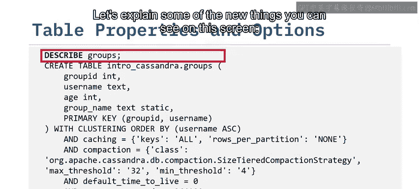

以下是一些需要解释的新属性：

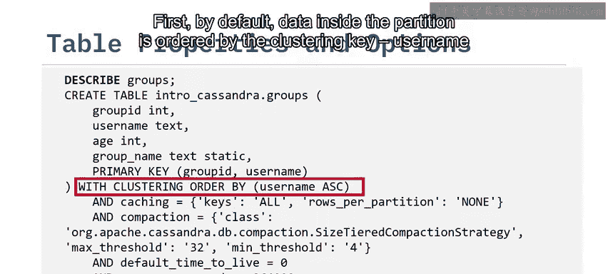

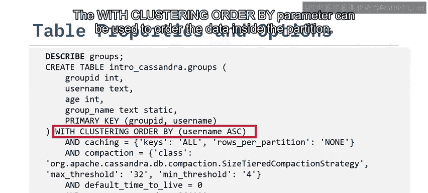

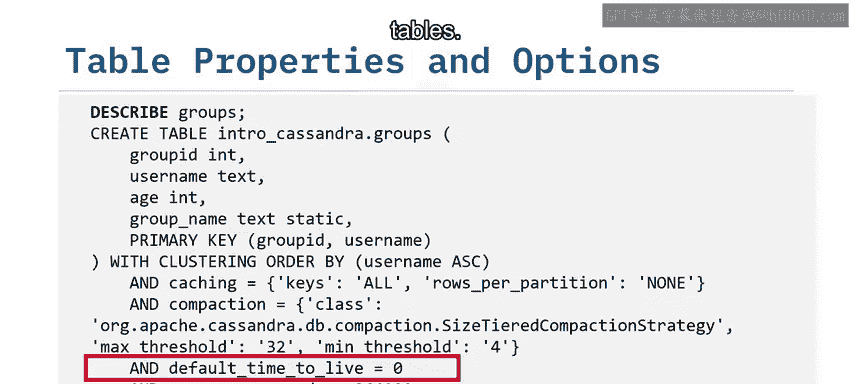

*   **数据排序**：默认情况下，分区内的数据按聚类键 `username` 升序排列。可以使用 `WITH CLUSTERING ORDER BY` 参数来指定分区内数据的排序方式。
*   **生存时间**：`default_time_to_live` 意味着可以为表中的数据设置过期时间。例如，一个仅有效期五分钟的优惠。TTL也可以在操作级别设置，例如在 `INSERT` 语句中，这意味着只有该行数据会在TTL后过期。
*   **数据刷盘**：写入数据（如插入、更新、删除）会先从内存刷入磁盘，在三种情况下触发：
    1.  内存表已满时。
    2.  提交日志已满时。
    3.  达到特定时间间隔时。`memtable_flush_period_in_ms` 这个设置指的就是按表设置的、定期将数据刷入磁盘的时间间隔，默认为0，表示未激活。

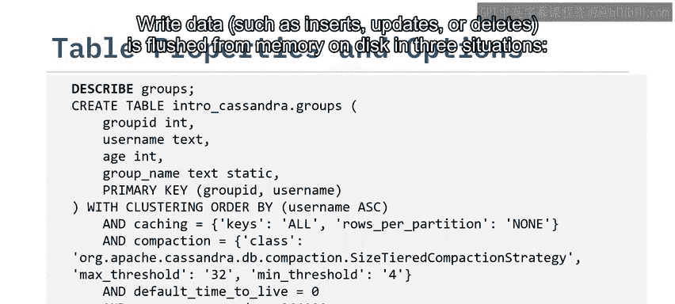

本幻灯片展示的仅是Cassandra表属性和选项的一部分。其他如 `gc_grace_seconds` 和 `compaction` 等属性，我们将在下一节讨论数据如何持久化到磁盘以及Cassandra中删除操作的实现方式时再详细讲解。

## 🔄 修改表

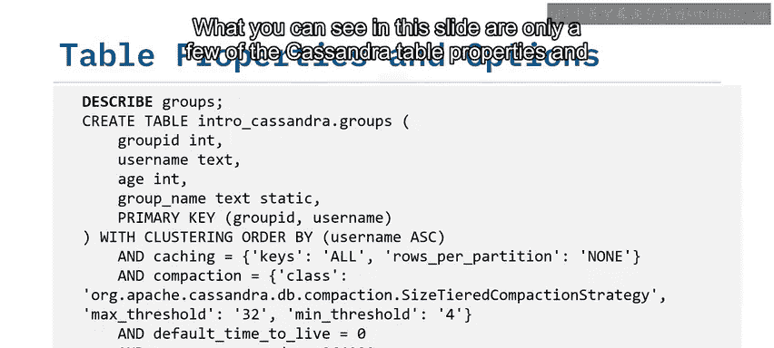

与之前介绍的键空间类似，表也可以被修改。

你可以对表模式执行以下操作：

*   添加新列。
*   删除列。
*   重命名列（注意：此操作适用于常规列和聚类键，但不支持分区键）。
*   更改表属性。

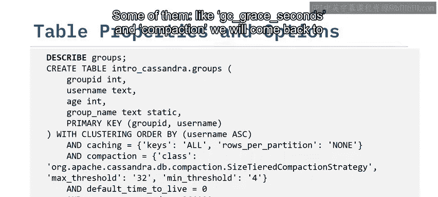

请注意，虽然我们提到添加和删除列，但这些操作仅适用于常规列，不适用于主键列。

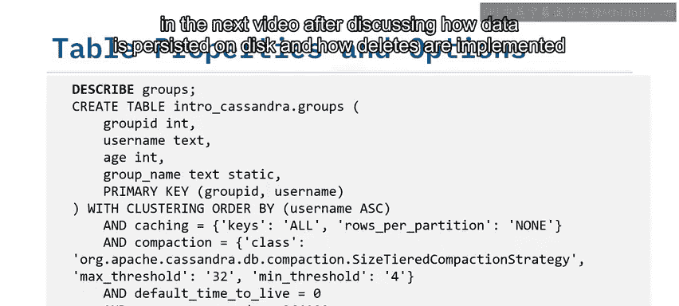

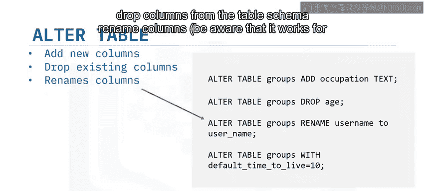

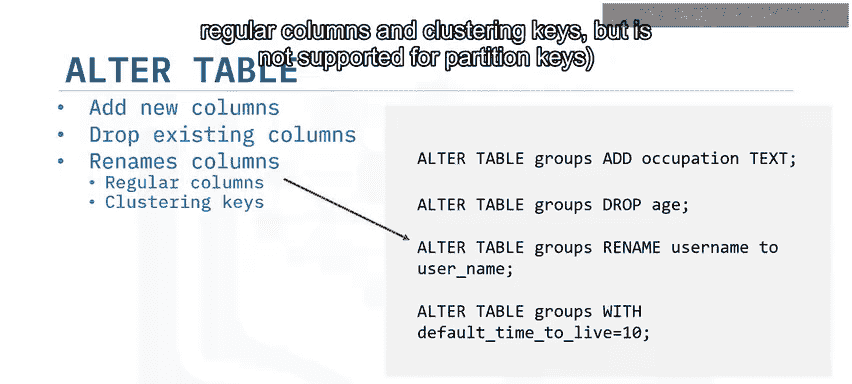

在Cassandra中，主键一旦定义就无法更改，因为它决定了数据在集群和节点级别的存储方式。如果想要更改，需要创建新表并重新导入数据。

不支持更改现有列的数据类型。

## 🗑️ 删除表

可以使用 `TRUNCATE` 或 `DROP` 命令删除表。

*   `TRUNCATE`：移除指定表中的所有数据，但保留表的定义模式。需要注意，`TRUNCATE` 命令要求 `ALL` 一致性级别，即所有副本都必须可用。
*   `DROP`：移除所有数据以及表的定义模式。

在执行截断或删除操作之前，Cassandra会为数据创建快照作为备份。

## 📝 总结

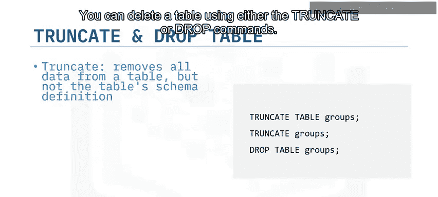

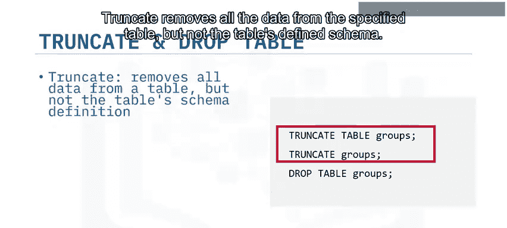

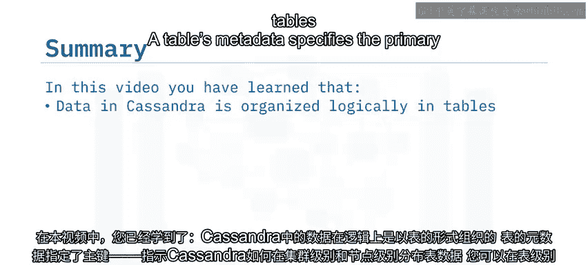

本节课中我们一起学习了以下内容：


*   Cassandra中的数据在逻辑上组织在表中。
*   表的元数据指定了主键，指示Cassandra如何在集群级别和节点级别分布表数据。
*   可以在表级别添加生存时间参数，这意味着可以令超过TTL的所有数据过期或删除。
*   可以修改列和列名，但仅限常规列。在创建表时定义的主键一旦确定就无法修改。
*   可以通过 `DROP` 命令删除表，或使用 `TRUNCATE` 命令清空其数据。