# 027：CRUD操作 第1部分


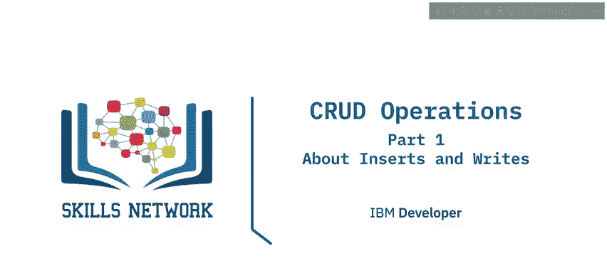

在本节课中，我们将学习Apache Cassandra数据库中的写入操作，具体聚焦于如何插入和更新数据。CRUD是创建、读取、更新和删除的缩写，本节课将涵盖前两个核心操作。

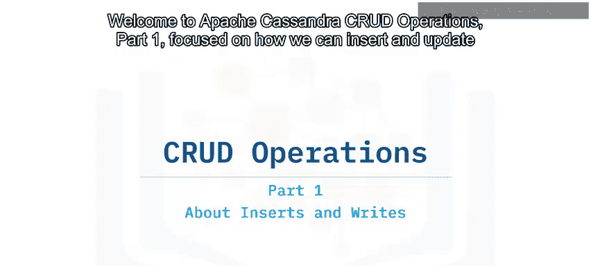

---


## 🖥️ 集群与节点级别的写入过程

在深入了解Cassandra的写入语法之前，我们先来看看在集群和节点级别，一次写入是如何完成的。

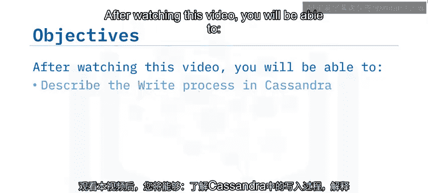

### 集群级别的写入


在集群级别，当发生写入时，接收写入请求的节点将成为该操作的协调器。这意味着它将确保操作完成，并将写入结果返回给用户。

写入操作会定向到它们要写入的分区的所有副本。但为了使操作成功，至少需要从满足一致性级别要求的最少节点数那里收到确认。


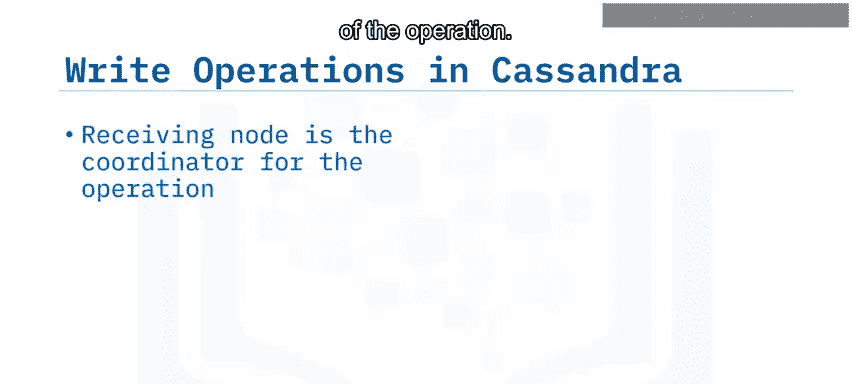

让我们以一个键空间复制因子为3，写入操作一致性级别设置为2的例子来说明。假设我们的分区位于节点1、2和3。在这种情况下，写入操作到达节点4，节点4根据复制因子将写入发送到节点1、2和3。然而，节点2不可用，因此只有节点1和3发送了写入确认。

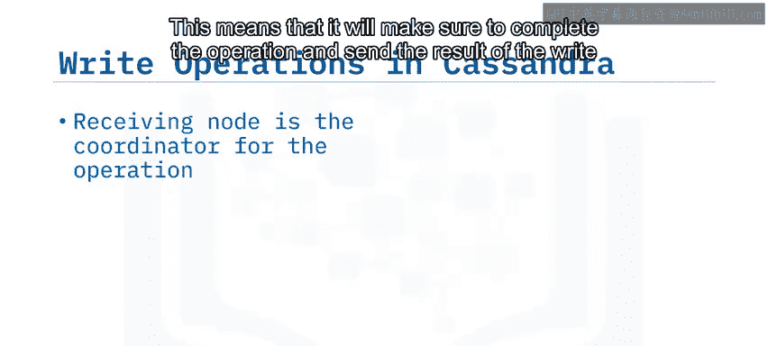

协调器节点4检查确认响应的数量，并将其与预期的一致性值进行比较，然后返回操作成功的信号。

### 节点级别的写入

在节点级别，有几个重要的事实需要记住。

关于Cassandra写入的一个重要提醒是：默认情况下，在执行写入操作之前不会进行读取。

在节点级别，写入首先存储在内存中，然后刷新到磁盘上称为SSTable的文件中。我们执行的写入越多，内存表填充得越快，数据也就越快被刷新到磁盘。每次刷新操作都会创建一个新的SSTable文件。

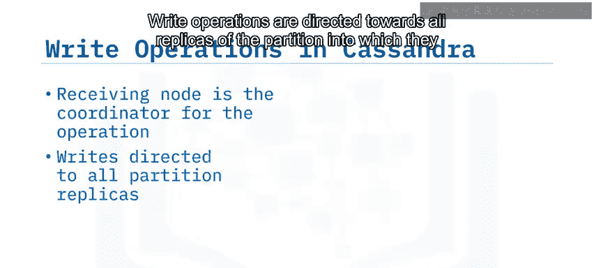

在磁盘上，数据被追加到后续的SSTable中。之后，数据会通过一个称为“压缩”的过程在磁盘上进行优化。Cassandra为每个写入操作附加一个时间戳。时间戳用于数据协调，最新的数据胜出。

---

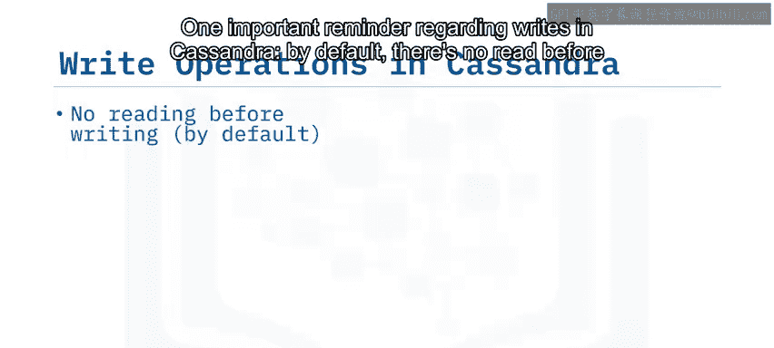

## ✍️ 插入操作详解

以下是关于Cassandra插入操作的一些基本事实：

*   **完整主键**：插入操作要求指定完整的主键。这意味着插入只能逐条记录进行。
*   **插入即更新**：由于Cassandra默认在写入前不执行读取，插入操作同时具有插入和更新的行为。如果我们向已存在的条目插入数据，那么数据将被更新。
*   **列值要求**：插入操作要求为所有主键列提供值，但对于表定义中指定的其他常规列则不是必须的。只有指定的列会被填充数据。
*   **生存时间**：你可以为插入的数据指定一个特定的生存时间，就像我们在表级别所做的那样。现在我们可以在记录级别这样做，这意味着数据只在定义的时间内可见。

让我们基于示例数据看几个例子。在粗体字中，你可以看到主键的列。

我们可以向表中插入新数据。在这个例子中，我们指定了表的所有列。我们向第12组（烘焙组）插入了两个用户。

```sql
INSERT INTO users_by_group (group_id, user_id, group_name, user_age) VALUES (12, 101, 'Baking', 30);
INSERT INTO users_by_group (group_id, user_id, group_name, user_age) VALUES (12, 102, 'Baking', 28);
```

插入数据时，主键是强制性的，你不能在不完全指定主键的情况下插入数据。如本例所示，我们向第45组插入一个新用户，只添加了必需的信息。既没有添加组名，也没有添加用户的年龄。

```sql
INSERT INTO users_by_group (group_id, user_id) VALUES (45, 201);
```

我们还可以插入带有生存时间的数据。在这种情况下，我们向第25组（纯素烹饪组）添加了一个新用户，TTL为10秒。这意味着从插入起10秒后，该数据将不再可供查询。


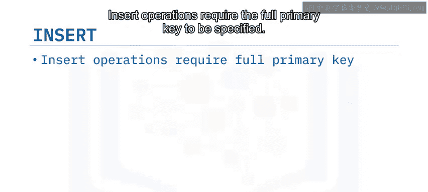

```sql
INSERT INTO users_by_group (group_id, user_id, group_name, user_age) VALUES (25, 301, 'Vegan Cooking', 35) USING TTL 10;
```

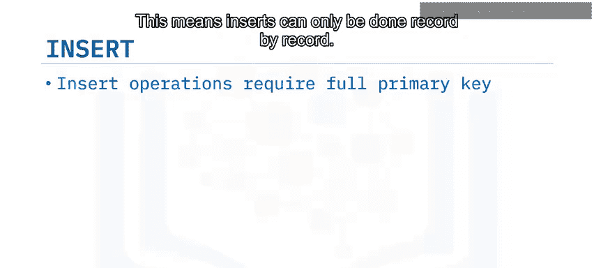

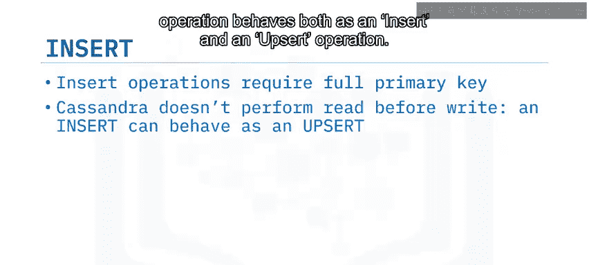

当对现有数据进行插入时，我们可以将插入用作更新。在这种情况下，第12组中用户的年龄将被更新为45。

```sql
INSERT INTO users_by_group (group_id, user_id, user_age) VALUES (12, 101, 45);
```

如果对我们的表执行查询，在所有插入操作之后，结果将如下所示。这是一个CQLSH的数据视图，所以不要被空值误导。在这种情况下，它意味着这些单元格没有数据。

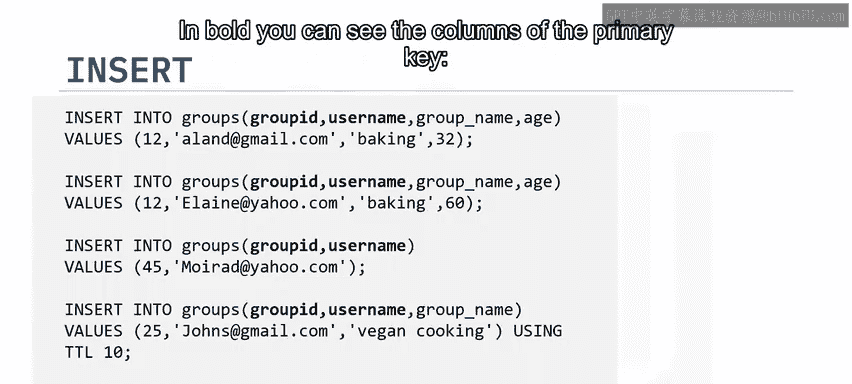

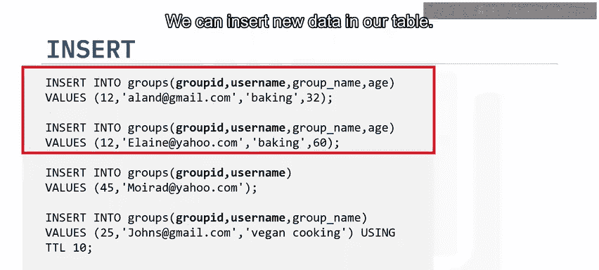

---

## 🔄 更新操作详解

现在让我们对数据进行两次更新。

我们可以更新第45组的名称，因为它是一个静态列。我们可以仅使用分区键来更新它。这是更新命令不需要提及完整主键的唯一情况。

```sql
UPDATE users_by_group SET group_name = 'New Group Name' WHERE group_id = 45;
```

我们也可以更新现有记录。在这种情况下，我们将更新第12组中一个用户的年龄。

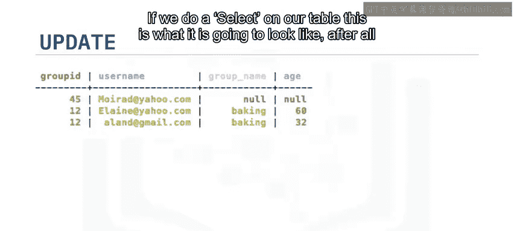

```sql
UPDATE users_by_group SET user_age = 50 WHERE group_id = 12 AND user_id = 101;
```

我们可以在一个不存在的条目上调用更新命令，在这种情况下，更新将表现为插入操作。

```sql
UPDATE users_by_group SET group_name = 'Hiking', user_age = 40 WHERE group_id = 99 AND user_id = 401;
```

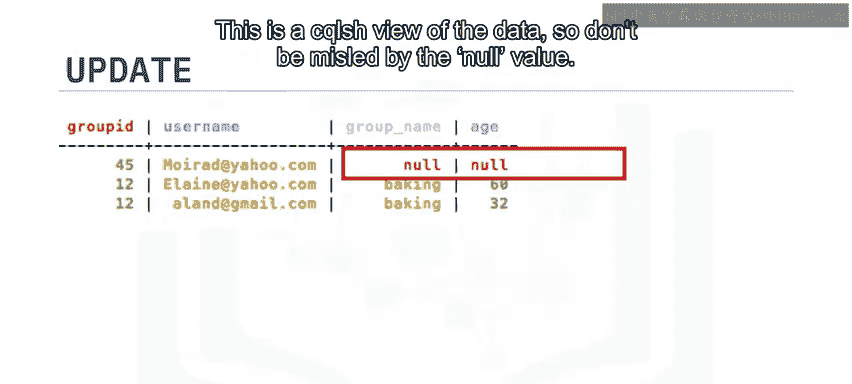

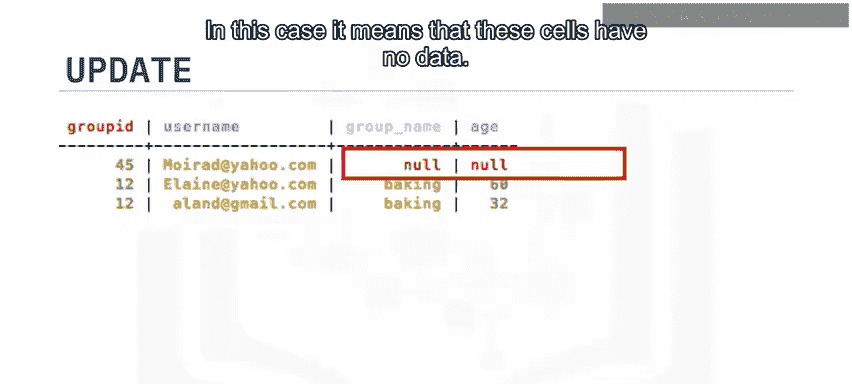

此时，让我们看看对表进行查询会得到什么结果。

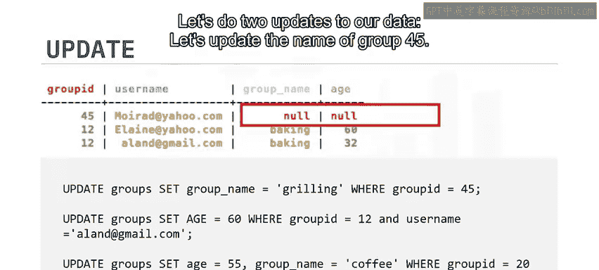

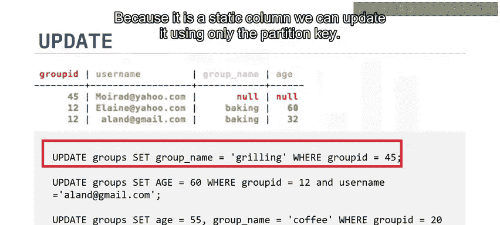

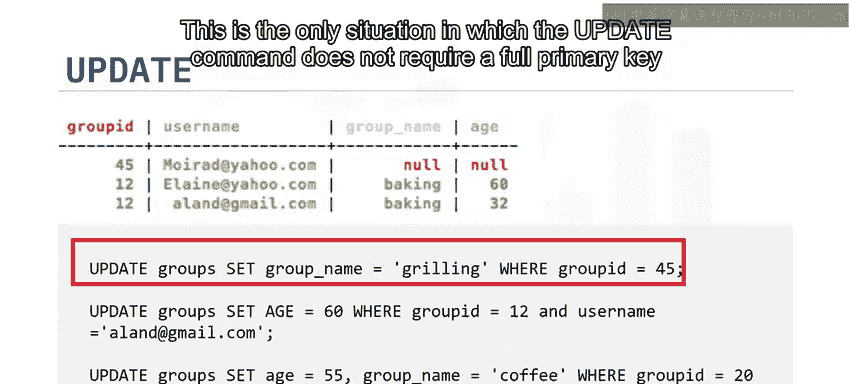

---

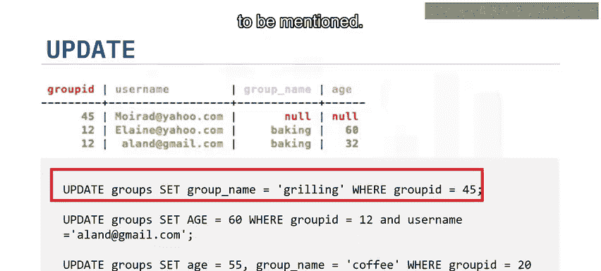

## ⚖️ 轻量级事务

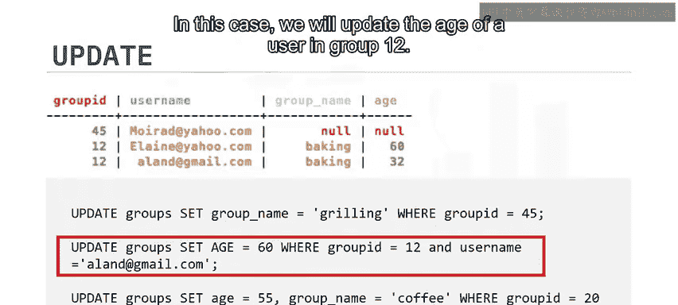

正如你所见，插入和更新的行为可能非常相似，因为默认情况下，Cassandra在执行写入之前不会定位和读取数据。然而，可以指示Cassandra查找数据、读取它，然后才执行给定的操作，这是通过轻量级事务实现的。

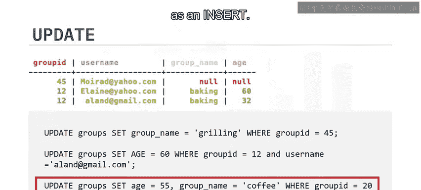

语法上，轻量级事务通过在`INSERT`和`UPDATE`语句中引入`IF`条件来支持。


让我们看一些例子。

我们可以仅在记录存在的情况下更新组中用户的年龄。

```sql
UPDATE users_by_group SET user_age = 55 WHERE group_id = 12 AND user_id = 101 IF EXISTS;
```

我们可以仅在记录存在且年龄为某个特定值的情况下更新组中用户的年龄。

```sql
UPDATE users_by_group SET user_age = 60 WHERE group_id = 12 AND user_id = 102 IF user_age = 28;
```

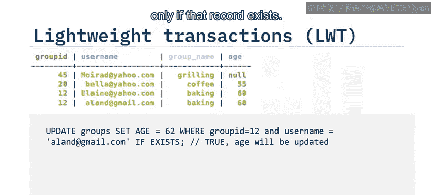

我们可以仅在数据不存在的情况下向Cassandra表插入数据。在我们的例子中，记录已存在，因此不会执行插入。

```sql
INSERT INTO users_by_group (group_id, user_id, group_name, user_age) VALUES (12, 101, 'Baking', 30) IF NOT EXISTS;
```


轻量级事务比Cassandra中的普通插入和更新至少慢四倍，你需要在应用程序中谨慎使用它们。

---

## 📝 课程总结

在本节课中，我们一起学习了以下核心内容：


*   默认情况下，Cassandra在写入前不执行读取，因此插入和更新操作行为相似。
*   轻量级事务可用于强制执行“先读后写”，但由于会导致性能下降，应谨慎使用。
*   在集群级别，写入被发送到所有分区副本，与一致性因子无关。为了使操作成功，至少需要从满足一致性级别要求的最少节点数那里收到确认。