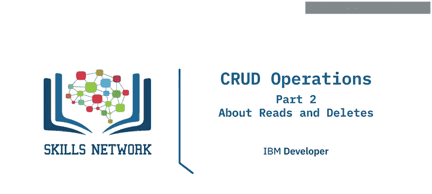
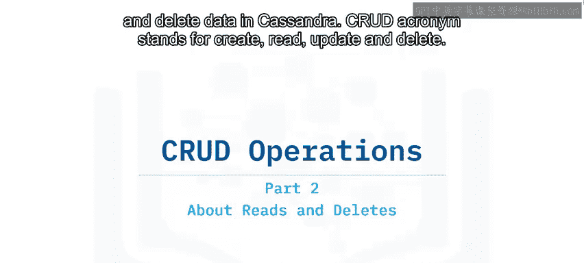
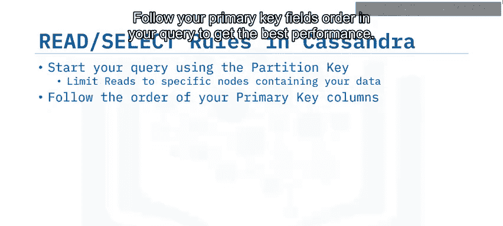
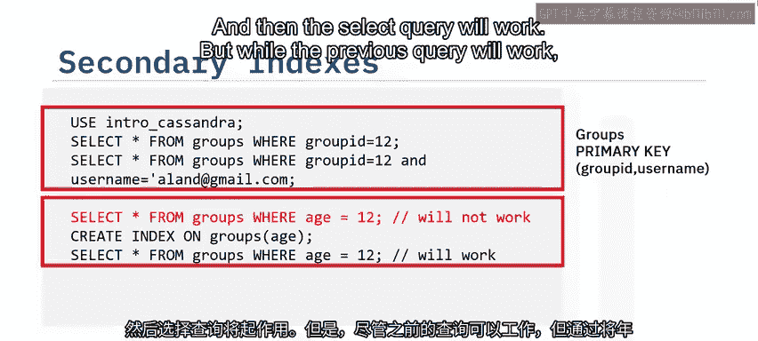
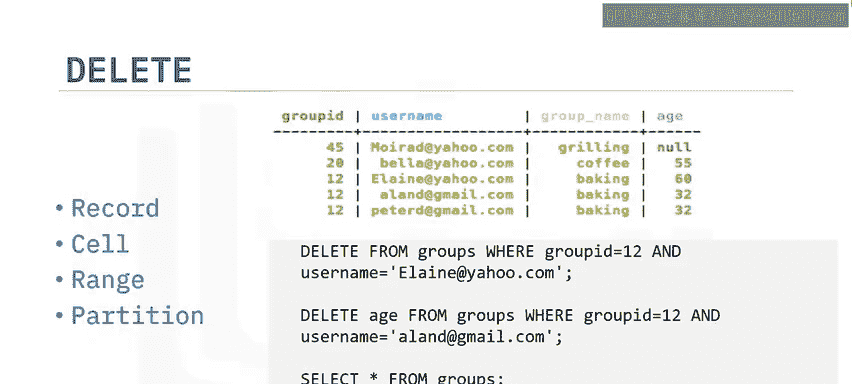
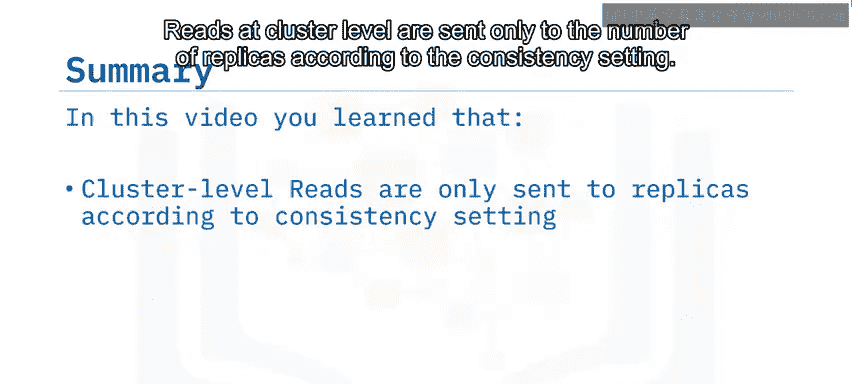

# 028：CRUD操作第二部分

在本节课中，我们将学习如何在Apache Cassandra中进行数据的读取和删除操作。CRUD是创建、读取、更新和删除的缩写，本节课将重点讲解后两部分。

---

## 🔍 Cassandra中的读取操作

上一节我们介绍了如何向Cassandra插入数据，本节中我们来看看如何读取数据。

当读取操作被发送到集群中的一个节点时，该节点会成为此次读取操作的协调器，并负责完成该操作。在我们的示例中，节点4是此次读取的协调器。

读取请求只会被发送到由一致性级别设置所指定数量的副本节点。例如，一致性级别为2意味着三个副本节点中只有两个会被联系。

协调器会协调从被联系节点收到的响应。如果存在任何不一致，将根据操作的时间戳来解决。然后，结果将被返回。

在语法上，Cassandra和许多数据库一样，使用`SELECT`操作来执行读取。

以下是关于Cassandra中`SELECT`操作的一些重要规则：

*   **始终以分区键开始查询**：这可以将读取范围限制在仅包含你所需分区的副本节点上。
*   **遵循主键字段的顺序**：在查询中遵循主键字段的顺序可以获得最佳性能。

例如，如果你的主键由一个分区键和两个聚类键组成：
*   筛选分区键的特定值是可行的。
*   筛选分区键的可能值列表也是可行的。
*   筛选分区键和第一个聚类键是可行的。
*   筛选分区键以及第一和第二个聚类键将只读取一条记录，这也是可行的。

然而，在生产系统中，从表中选取所有数据是不可取的，因为这会将请求发送到集群中的所有节点。想象一下，一个拥有1000个节点的集群，你的查询性能会令人满意吗？查询虽然能执行，但性能会非常差，即使没有发生超时。

筛选常规列是不可行的，并且不会生效。

最后，在没有分区键的情况下筛选聚类键也是不可行的，并且不会生效。

让我们看一些基于`groups`表的例子，该表的主键由`group_id`和`username`列组成：
*   筛选`group_id`或`group_id`和`username`将生效，并且性能非常好。
*   筛选常规列`age`将不会生效。Cassandra会返回一个错误。在这种情况下，你可以选择重新设计表结构，或者在`age`列上创建索引，这样`SELECT`查询就能生效了。

但是，虽然之前的查询会生效，但最佳性能是通过将`age`列与特定的分区键`group_id`一起筛选来获得的。这样做可以将查询限制在仅托管该分区键的节点上，这再次引出了Cassandra这条非常重要的规则：**始终以分区键开始你的查询**。

---

## 🗑️ Cassandra中的删除操作

我们接下来演示一些删除操作。在Cassandra中，你可以删除由完整主键标识的条目，也可以删除由完整主键标识的条目中的某个单元格。

如果我们执行一个`SELECT`查询，可以看到名为`Elaine`的用户已经不存在了，并且名为`Allen`的用户的`age`单元格已被删除。

删除也可以在分区级别进行。如果你的分区键是`sensor_id`，并且数据是按记录时间聚类的，你可以删除一个分区内某个连续范围的数据。例如，你可以删除某个传感器在下午1点到3点之间的所有记录，或者删除由分区键标识的整个分区。

我们已经看到了删除数据的语法，但在Cassandra中，你应该谨慎使用删除操作，因为它们的使用会极大地影响系统性能。

从像Apache Cassandra这样的分布式和复制系统中删除数据，比在关系型数据库中要复杂得多。特别是要记住，Cassandra是一种对等架构，读写操作可以定向到集群中的任何节点，因此没有专门用于写入或读取的主节点。

在这样的系统中，为了记录删除发生的事实，需要写入一个称为**墓碑**的特殊值，作为指示先前值应被视为已删除的标记。

从某个条目被标记为墓碑的那一刻起，它的数据对查询就不再可见。然而，实际数据仍会在磁盘上保留一段时间。

**什么是墓碑？**

在Cassandra中，删除操作就是一种写入操作，它附加了一个特殊值，用于指示数据已被删除以及删除的时间。这个值就叫做墓碑。

如图所示，我们的删除操作被节点1和节点3确认。现在我们有了一个墓碑，指示我们特定的主键数据在时间T1被删除。节点2的数据是初始的，在时间T0插入的数据。由于删除操作在节点2上没有成功。

现在，当一个读取操作到达时，数据将由节点1和节点2返回。节点1将返回时间为T1的“无数据”，节点2将返回时间为T0的请求数据。由于T1比T0更新，协调器节点（节点1）将决定最新的数据来自节点1，并作为读取结果返回“无数据”。

另一件需要记住的事情是，墓碑只有在经过一个可配置的时间段后才会被删除。这个时间段称为**GC宽限期秒数**，默认设置为10天，并在表级别进行设置。

---

## 📝 课程总结

本节课中我们一起学习了：
*   在集群级别，读取操作只会根据一致性设置发送给指定数量的副本节点。
*   为了获得最佳性能，读取操作应遵循主键列的顺序。
*   删除操作可以在记录、单元格、范围和分区级别进行。

通过理解这些核心的读写和删除机制，你将能更有效地在Cassandra中管理和操作数据。